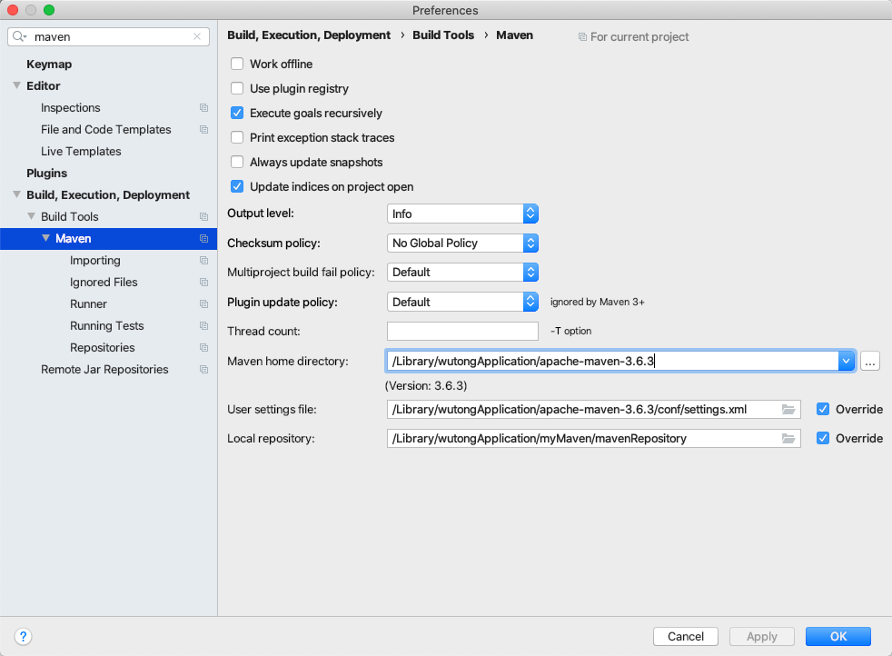

# 目录

1. [概念](#mvn01)
    1. [概念](#mvn0101)
    2. [优势](#mvn0102)
    3. [作用-依赖管理](#mvn013)
    4. [作用-一键构建](#mvn0104)
2. [Maven使用](#mvn02)
    1. [2.1 下载安装-见外面文件](#mvn0201)
    2. [2.2 Maven仓库](#mvn0202)
    3. [2.3 Maven 工程认识](#mvn0203)
3. [Maven 常用命令](#mvn03)
    1. [3.1 常用命令](#mvn0301)
    2. [3.2 idea 开发 maven 项目](#mvn0302)
4. [Maven 工程运行调试](#mvn04)
    1. [端口占用处理](#mvn0401)
    2. [断点调试](#mvn0402)
5. [总结](#mvn05)
    1. [maven 仓库](#mvn0501)
    2. [常用的 maven 命令](#mvn0502)
    3. [坐标定义](#mvn0503)
    4. [pom 基本配置](#mvn0504)


/Users/codew/.m2/


# mvn01
# 1. 概念


## mvn0101
## 1.1 概念

不只是`iOS`里的`cocoapods`

```c

Maven是一个项目管理工具
包含一个项目对象模型(POM:Project Object Model)
一组标准集合
一个项目生命周期(Project Lifecycle)
一个依赖管理系统(Dependency Management System)
最后一个用来运行定义在生命周期阶段(phase)中插件(plugin)目标(goal)的逻辑

```


## mvn0102
## 1.2 优势

1. 对 jar包冲突,版本冲突 说再见, 减少工程大小
2. 总之就是好,哈哈哈哈

## mvn0103
## 1.3 作用-依赖管理

之前我们都是将jar复制粘贴到项目中去, 用它就和`pod` 一样`pod install`

1. `pod`是在`Podfile`, `Maven`是在`pom.xml`文件配置


## mvn0104
## 1.4 作用-一键构建

`一条命令搞定`

1. `编译`, `测试`, `运行`, `打包`, `安装`,都交给`Maven`做, 这一套叫构建


# mvn02
# 2. Maven使用

## mvn0201
## 2.1 下载安装-见外面文件

## mvn0202
## 2.2 Maven仓库

### 2.2.1 仓库的分类

1. 本地仓库
2. 远程仓库
3. 中央仓库: *   maven 软件中内置一个远程仓库地址 http://repo1.maven.org/maven2


4. 可以修改本地仓库指向`localRepository`
`/Users/codew/Library/wtApplication/apache-maven-3.6.3/conf/settings.xml`

> maven 仓库地址、私服等配置信息需要在 setting.xml 文件中配置，分为全局配置和用户配置。

> 在 maven 安装目录下的有 conf/setting.xml 文件，此 setting.xml 文件用于 maven 的所有 project 项目，它作为 maven 的全局配置。

> 如需要个性配置则需要在用户配置中设置，用户配置的 setting.xml 文件默认的位置在:${user.dir} /.m2/settings.xml目录中,${user.dir} 指windows 中的用户目录。

> maven 会先找用户配置，如果找到则以用户配置文件为准，否则使用全局配置文件。

## mvn0203
## 2.3 Maven 工程认识

1. `/src/main/java`:  核心代码部分
2. `/src/main/resources`: 配置文件部分
3. `/src/main/webapp`: 页面资源
4. `/src/test/java`: 测试代码部分
5. `/src/test/resources`: 测试配置文件


# mvn03
# 3. Maven 常用命令

## mvn0301
## 3.1 常用命令

1. `mvn clean`是`maven`工程的 **清理命令**, 它会删除`target`目录及内容
2. `mvn compile` 是`maven`工程的编译命令 
3. `mvn test`是`maven`工程的 **测试命令**
4. `mvn package`是`maven`工程的 **打包命令**, java工程大包成`jar`包, web工程大包成`war`包
5. `mvn install`是`maven`工程的 **安装命令**, 执行会将工程打包成jar或war发布到本地仓库

6. `mvn deploy`发布


### 3.1.2 maven指令 的生命周期

maven对项目构建过程分为三套相互独立的生命周期, 是`三套`. 相互独立的`三套`

`Clean Lifecycle` 在进行真正的构建之前进行一些清理工作。
`DefaultLifecycle` 构建的核心部分，编译，测试，打包，部署等等。 
`Site Lifecycle` 生成项目报告，站点，发布站点。


### 3.1.3 maven的概念模型
```c

Maven是一个项目管理工具
包含一个项目对象模型(POM:Project Object Model)
一组标准集合
一个项目生命周期(Project Lifecycle)
一个依赖管理系统(Dependency Management System)
最后一个用来运行定义在生命周期阶段(phase)中插件(plugin)目标(goal)的逻辑

```


1. 项目对象模型(Project Object Model)

一个`maven`工程都有一个`pom.xml` 文件.
通过`pom.xml` 文件定义`项目的坐标`, `项目依赖`,`项目信息`,`插件目标`

2. 依赖管理系统(Dependency Management System)


3. 项目生命周期(Project Lifecycle)


4. 一组标准集合

5. 插件(plugin)目标(goal)
`maven`管理项目生命周期过程都是基于插件完成的

## mvn0302
## 3.2 idea 开发 maven 项目




```

-DarchetypeCatalog=internal

-DarchetypeCatalog=local
```


### 3.2.1 使用骨架创建maven的java工程


[INFO] Generating project in Batch mode

```

https://repo.maven.apache.org/maven2/archetype-catalog.xml

https://repo.maven.apache.org/maven2/org/apache/maven/archetypes/maven-archetype-bundles/2/maven-archetype-bundles-2.pom


/Users/codew/.m2/repository/org/apache/maven/archetype/maven-archetype/3.1.2


```


# mvn04
# 4 .Maven 工程运行调试

## mvn0401
## 4.1 端口占用处理

## mvn0402
## 4.2 断点调试


# mvn05
# 5. 总结

## mvn0501
## 5.1 maven 仓库

## mvn0502
## 5.2 常用的 maven 命令

## mvn0503
## 5.3 坐标定义

## mvn0504
## 5.4 pom 基本配置

