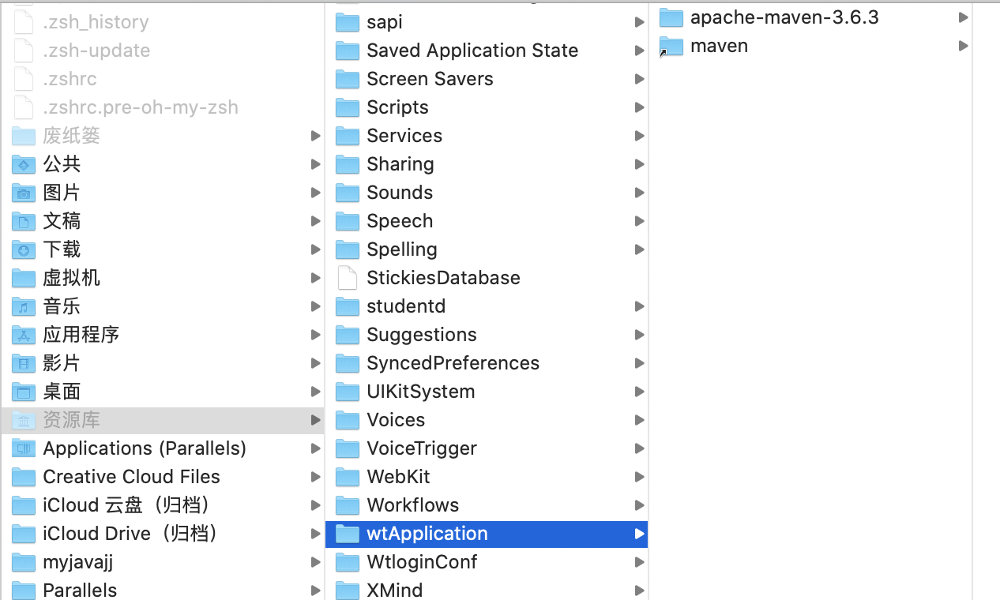

# 下载地址
https://maven.apache.org/download.cgi

# 下载内容


# 解压apache-maven-3.6.3-bin.tar.gz

# 将解压文件放入下面文件夹




# 做个软连接
```
ln -s /Users/xxx/Library/wtApplication/apache-maven-3.6.3 /Users/xxx/Library/wtApplication/maven

```


# 修改~/.bash_profile, 最后追加如下 重新加载bin


```c


echo  'export JAVA_HOME=/Library/Java/JavaVirtualMachines/jdk1.8.0_231.jdk/Contents/Home/'>>~/.bash_profile && \
echo  'export PATH=$PATH:$JAVA_HOME/bin'>>~/.bash_profile && \
echo  'export CLASSPATH=.:$JAVA_HOME/lib/dt.jar:$JAVA_HOME/lib/tools.jar'>>~/.bash_profile & \
tail -1 ~/.bash_profile && \
source ~/.bash_profile && \
echo $PATH && \
echo  'export CATALINA_HOME=/Library/tomcat/'>>~/.bash_profile && \
echo  'export PATH=$PATH:/CATALINA_HOME/bin'>>~/.bash_profile && \
tail -1 ~/.bash_profile && \
source ~/.bash_profile && \
echo $PATH && \
echo  'MAVEN_HOME=/Users/codew/Library/wtApplication/maven'>>~/.bash_profile && \
echo  'export MAVEN_HOME'>>~/.bash_profile && \
echo  'export PATH=$MAVEN_HOME/bin:$PATH'>>~/.bash_profile && \
tail -1 ~/.bash_profile && \
source ~/.bash_profile && \
echo $PATH


echo  'source ~/.bash_profile'>>~/.zshrc


```


# 验证

```

mvn -v

```
