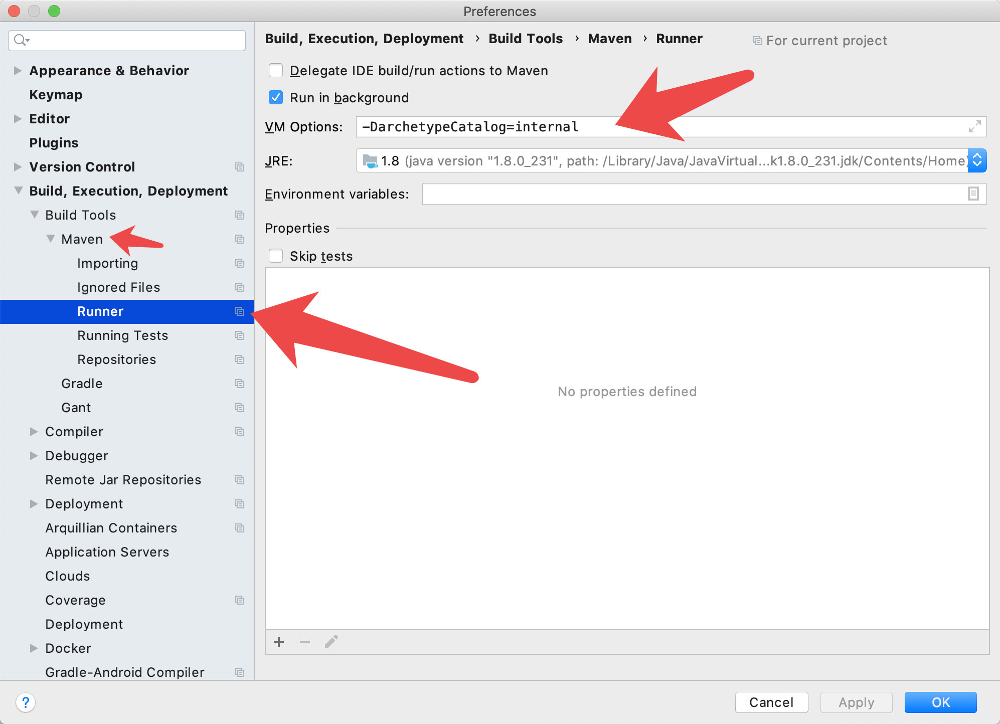

# 1. Maven 乱码解决

Idea控制台中文乱码解决：-Dfile.encoding=gb2312




# 2. 暴力放射

```java


Method method = this.getClass().getDeclaredMethod(methodName, HttpServletRequest.class, HttpServletResponse.class);
method.setAccessible(true);
method.invoke(this, req, resp);


```


# 3. 么的 不能再values里面加值, 我靠!!!

值必须他么的要写在`template.update(`里面艹
```

System.out.println("save 注册用户:" + user);
String sql = "INSERT INTO tab_user(uid,username, password, name, birthday, sex, telephone, email, status, code) VALUES(?,?,?,?,?,?,?,?,?,?)";

template.update(sql,
        null,
        user.getUsername(),
        user.getPassword(),
        user.getName(),
        user.getBirthday(),
        user.getSex(),
        user.getTelephone(),
        user.getEmail(),
        user.getStatus(),
        user.getCode()
        );

```


# ajax 带上斜杠请求就不会有虚拟目录

```js

// 带虚拟目录 $.post("user/login",

// 不带虚拟目录, 被理解为 $.post("/user/login",
```
