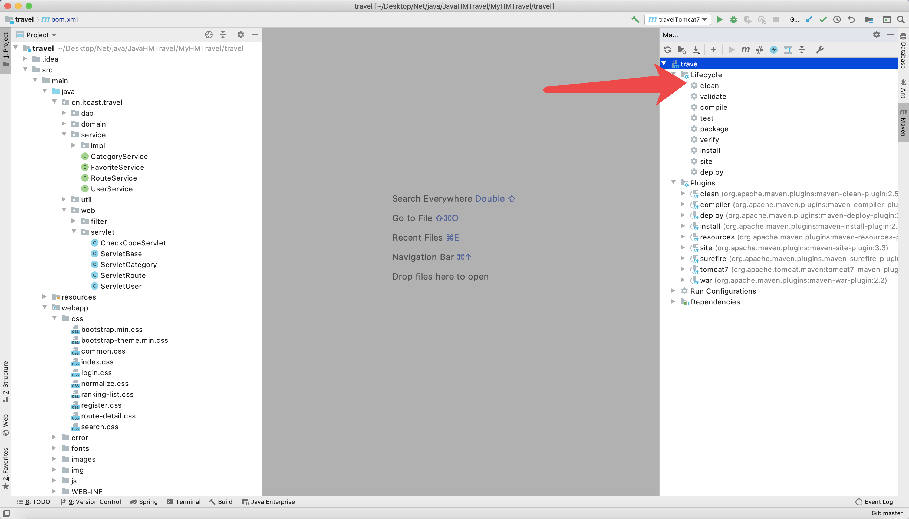
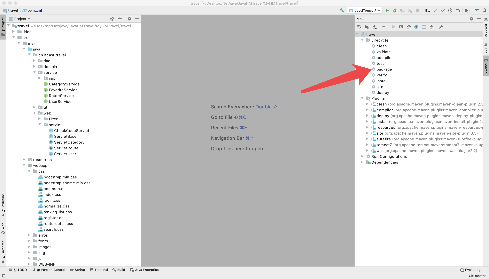
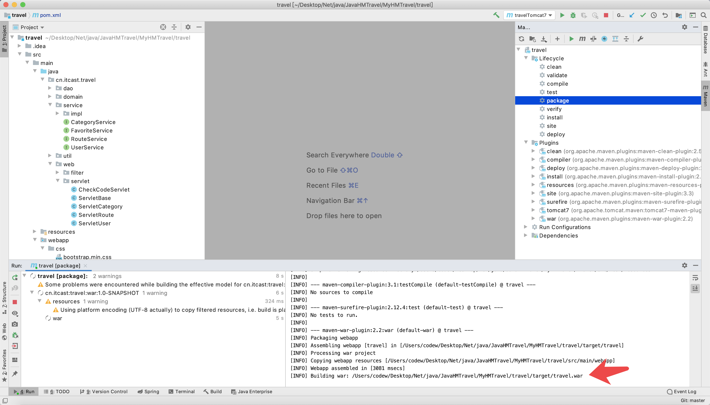
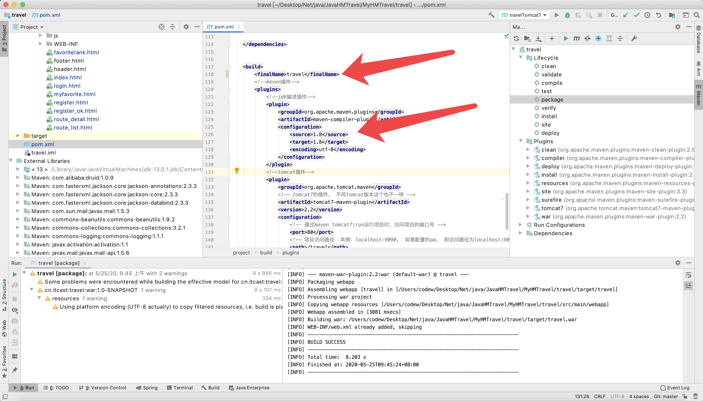

# Linux部署案例







# tomcat 启动和关闭

```

cd /application/tomcat8555/apache-tomcat-8.5.55/bin

./startup.sh
./shutdown.sh

```


# tomcat 日子文件夹 tail -f catalina.out

```

/application/tomcat8555/apache-tomcat-8.5.55/logs/catalina.out


```
