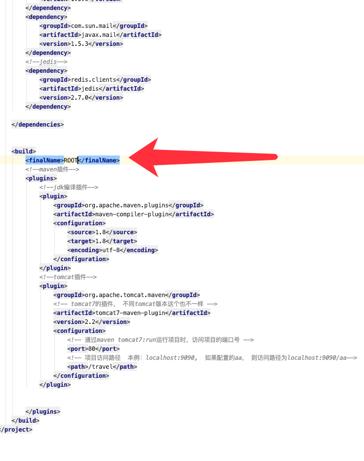

# upstream 和 proxy_pass


# 先打一个root 包


# 简单反向代理

```
upstream server_list {

    server 167.172.42.53:8080;
    server www.domanshow.com:8080;
    server 167.172.42.53:8080;

}


location / {

 root  html;
 proxy_pass http://server_list;
 index  index.html  index.htm;

}

```


# 入门级负载均衡


```

location / {
    root   html;
    index  index.html index.htm;
}

worker_processes  1;

events {
    worker_connections  1024;
}


http {
    include       mime.types;
    default_type  application/octet-stream;

    sendfile        on;
    
    keepalive_timeout  65;

    #gzip  on
    upstream xyServerList {

        server 167.172.42.53:8080;
        server 159.89.122.215:8080;
        server 165.22.110.96:8080;
        server www.domanshow.com:8080;

    }
    server {
        listen       80;
        server_name  www.domanshow.com;

        
        location / {
            #root   html;
            proxy_pass http://xyServerList;
            index  index.html index.htm;
        }

        
        error_page   500 502 503 504  /50x.html;
        location = /50x.html {
            root   html;
        }
        
    }
    
}

```


# 释放掉其中一台应用服务器后会卡很久

