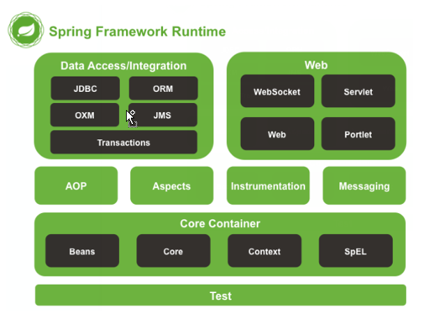
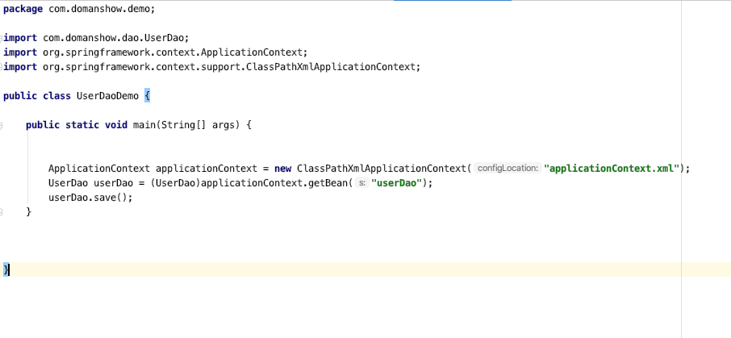

# 目录

1. [Spring简介](#spring001)
2. [Spring 快速入门](#spring002)
3. [Spring 配置文件](#spring003)
4. [Spring 相关API](#spring004)


# spring001
# 1. Spring简介

## 1.1 基本概念

关键词: `分层的`, `full-stack`, `轻量级`, `IoC`,`AOP`

Spring是`分层的` `Java SE/EE` 应用 `full-stack` `轻量级`开源`框架`,  以`IoC` (Inverse Of Control：反转控制) 和 `AOP`(Aspect Oriented Programming: 面向切面编程)为内核.

1. Spring是个框架
2. Spring是个开源的框架
3. Spring是个分层的开源的框架
4. Spring是个分层的, `Java SE/EE` 应用 开源的框架
5. Spring是个分层的, `Java SE/EE` 应用的, `full-stack`的  开源的框架
6. Spring是个分层的, `Java SE/EE` 应用的, `full-stack`的, `轻量级的`,  `开源的`框架

Spring提供了`展现层 SpringMVC` 和 `持久层 Spring JDBCTemplate` 以及`业务层事务管理`等众多的企业级应用技术. 
那它还能整合开源世界众多著名的第三方框架和类库, 逐渐成为使用最多的JavaEE 企业应用开源框架

等于说`SpringMVC`, `Spring JDBCTemplate`这些是`Spring`的一部分


## 1.2 Spring的优势--7个?

1. 方便解耦, 简化开发
2. AOP 编程的支持
3. 声明式事务的支持
4. 方便查询的测试
5. 方便集成各种优秀框架
6. 降低JAVEE API 的使用难度
7. Java 源码经典学习范例

## 1.3 体系结构



# spring002
# 2. Spring 快速入门


## 2.1 Spring 程序开发步骤

1. 导入Spring开发的基本包坐标
2. 编写Dao接口的实现类
3. 创建Spring核心配置文件
4. 在Spring配置文件中配置 DAO的实现类
5. 使用Spring的API 获得Bean实例

PS: 读下来我想到了iOS OC的代理有点那个意思.....(2020年05月27日16:25:42)


## 2.2 开发步骤实操

1. 导入Spring开发的基本包坐标

2. 第二步创建接口和实现

3. 创建配置文件, 这个文件名字可以随便取, 约定俗成的叫`applicationContext`


4. 配置实现

5. 获取实例调用


# spring003
# 3. Spring 配置文件

## 3.1 Bean标签基本配置

这个标签是用来配置`对象`交给`Spring`来构建. 默认情况它将调用`无参构造`函数, 没得的话就创建不成功!

### 3.1.1 基本属性

- `id`: `Bean`实例在`Spring`容器中的唯一标识
- `class`: Bean 的全限定名称

像这样
```xml

<bean id="userDao" class="com.domanshow.dao.impl.UserDaoImpl"></bean>

```

- `singleton`: 指定对象的作用范围
  - `singleton`:单列对象, 创建容器时对象就创建了. 容器在它在. 应用卸载销毁容器时它死
  - `prototype`:普通对象. 调用`getBean`是创建对象. java垃圾回收时死

像这样
```xml

<bean id="userDao" class="com.domanshow.dao.impl.UserDaoImpl" scope="prototype"></bean>

```


## 3.2 Bean标签依赖注

`依赖注入`(`Dependency Injection`): 它是`Spring`框架核心 `IOC`的具体体现.
IOC只是降低耦合性, 它不能解除.
坐等框架把`持久层`对象传入`业务层`.不用我们自己取.

### 3.2.1 Bean标签依赖注方式

- 构造方法
- set方法

**set**


**构造方法**


## 3.3 Bean标签依赖注入的数据类型

## 3.3.1 普通数据类型

## 3.3.2 引用数据类型
## 3.3.3 集合数据类型


```java

package com.domanshow.dao.impl;

import com.domanshow.dao.UserDao;
import com.domanshow.domain.User;

import java.util.List;
import java.util.Map;
import java.util.Properties;

public class UserDaoImpl implements UserDao {

    private List<String> stringList;
    private List<User> userList;

    private Map<String, User> userMap;
    private Properties properties;
    private String userName;
    private int age;

    public void setUserList(List<User> userList) {
        this.userList = userList;
    }

    public void setStringList(List<String> stringList) {
        this.stringList = stringList;
    }

    public void setUserMap(Map<String, User> userMap) {
        this.userMap = userMap;
    }

    public void setProperties(Properties properties) {
        this.properties = properties;
    }

    public void setUserName(String userName) {
        this.userName = userName;
    }

    public void setAge(int age) {
        this.age = age;
    }

    @Override
  public void save() {

        System.out.println("save hello........");
        System.out.println(this.toString());
    }

    @Override
  public String toString() {
        return "UserDaoImpl{" +
                " \n stringList=" + stringList +
                ", \n userList=" + userList +
                ", \n userMap=" + userMap +
                ", \n properties=" + properties +
                ", \n userName='" + userName + '\'' +
                ", \n age=" + age +
                '}';
    }

    // 初始化
  public void init(){
        System.out.println("UserDaoImpl init");
    }

    public void deallocWT(){

        System.out.println("UserDaoImpl dealloc");
    }

}

```


```xml

<?xml version="1.0" encoding="UTF-8"?> <beans xmlns="http://www.springframework.org/schema/beans"
  xmlns:xsi="http://www.w3.org/2001/XMLSchema-instance"
  xsi:schemaLocation="http://www.springframework.org/schema/beans http://www.springframework.org/schema/beans/spring-beans.xsd">

    <bean id="u1" class="com.domanshow.domain.User"></bean>
    <bean id="u2" class="com.domanshow.domain.User"></bean>

    <bean id="userDao" class="com.domanshow.dao.impl.UserDaoImpl" scope="prototype" init-method="init" destroy-method="deallocWT">

        <property name="age" value="20"></property>
        <property name="userName" value="多面兽"></property>
        <property name="stringList">
            <list>
                <value>aaa</value>
                <value>aaa好好</value>
                <value>aaa</value>
            </list>
        </property>
        <property name="userList">
            <list>
                <ref bean="u1"></ref>
                <ref bean="u2"></ref>
                <bean class="com.domanshow.domain.User"></bean>
                <bean class="com.domanshow.domain.User"></bean>
            </list>
        </property>

        <property name="userMap">
            <map>
                <entry key="user1" value-ref="u1"></entry>
                <entry key="user2" value-ref="u2"></entry>
            </map>
        </property>

        <property name="properties">
            <props>
                <prop key="p1">ni</prop>
                <prop key="p2">hao</prop>
                <prop key="p3">chile</prop>
                <prop key="p4">mei</prop>
            </props>
        </property>
    </bean>

<!--    set方法--> 
<!--    <bean id="userService" class="com.domanshow.service.impl.UserServiceImpl">--> <!--        <property name="myUserDao" ref="userDao"></property>--> <!--    </bean>-->   
<!--    构造方法-->
  <bean id="userService" class="com.domanshow.service.impl.UserServiceImpl">
        <constructor-arg name="myUserDaoHeiHei" ref="userDao" ></constructor-arg>
    </bean>

</beans>

```


## 3.4 引入其他配置文件

```xml

<import resource="applicationContext-User.xml"></import>

```


# spring004

# 4. Spring 相关API

## 4.1 ApplicationContext的继承体系


## 4.2 ApplicationContext的实现类

1. `ApplicationContext`:它是从类的根路径下加载配置文件 推荐使用这种
2. `AnnotationConfigApplicationContext`: 当使用注解配置容器对象时，需要使用此类来创建 spring 容器。它用来读取注解。
3. 


## 4.3 相关方法

- getBean

其中，当参数的数据类型是字符串时，表示根据Bean的id从容器中获得Bean实例，返回是Object，需要强转。
当参数的数据类型是Class类型时，表示根据类型从容器中匹配Bean实例，当容器中相同类型的Bean有多个时，则此方法会报错。


