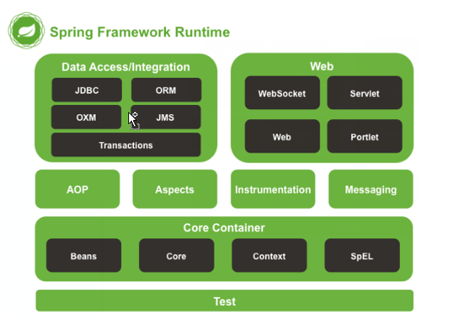

# 目录

1. [Spring简介](#spring001)
2. [Spring 快速入门](#spring002)
3. [Spring 配置文件](#spring003)
4. [Spring 相关API](#spring004)

# spring001
# 1. Spring简介

## 1.1 基本概念

关键词: `分层的`, `full-stack`, `轻量级`, `IoC`,`AOP`

Spring是`分层的` `Java SE/EE` 应用 `full-stack` `轻量级`开源`框架`,  以`IoC` (Inverse Of Control：反转控制) 和 `AOP`(Aspect Oriented Programming: 面向切面编程)为内核.

1. Spring是个框架
2. Spring是个开源的框架
3. Spring是个分层的开源的框架
4. Spring是个分层的, `Java SE/EE` 应用 开源的框架
5. Spring是个分层的, `Java SE/EE` 应用的, `full-stack`的  开源的框架
6. Spring是个分层的, `Java SE/EE` 应用的, `full-stack`的, `轻量级的`,  `开源的`框架

Spring提供了`展现层 SpringMVC` 和 `持久层 Spring JDBCTemplate` 以及`业务层事务管理`等众多的企业级应用技术. 
那它还能整合开源世界众多著名的第三方框架和类库, 逐渐成为使用最多的JavaEE 企业应用开源框架

等于说`SpringMVC`, `Spring JDBCTemplate`这些是`Spring`的一部分

## 1.2 Spring的优势--7个?

1. 方便解耦, 简化开发
2. AOP 编程的支持
3. 声明式事务的支持
4. 方便查询的测试
5. 方便集成各种优秀框架
6. 降低JAVEE API 的使用难度
7. Java 源码经典学习范例

## 1.3 体系结构

# spring002
# 2. Spring 快速入门

## 2.1 Spring 程序开发步骤

1. 导入Spring开发的基本包坐标
2. 编写Dao接口的实现类
3. 创建Spring核心配置文件
4. 在Spring配置文件中配置 DAO的实现类
5. 使用Spring的API 获得Bean实例

PS: 读下来我想到了iOS OC的代理有点那个意思.....(2020年05月27日16:25:42)

# spring003
# 3. Spring 配置文件

# spring004
Spring 相关API# 4. Spring 相关API