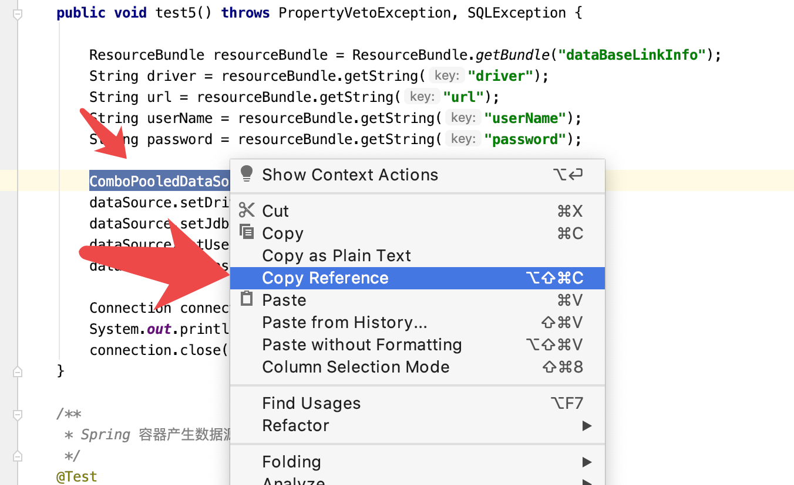
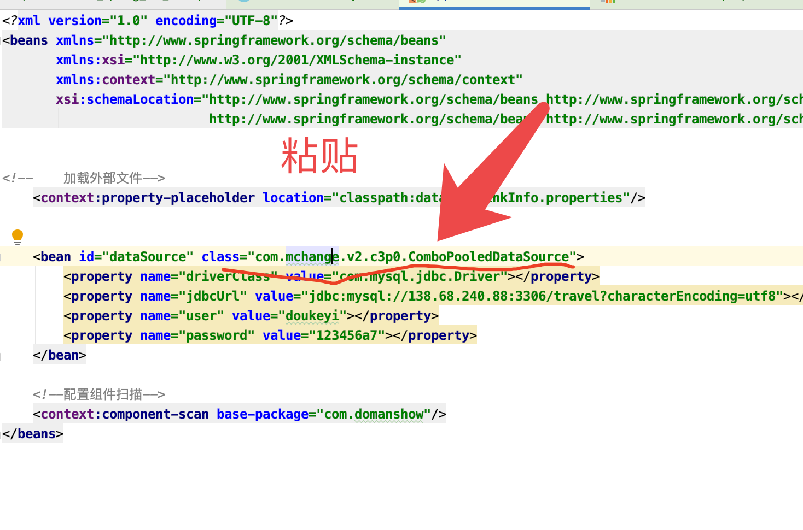
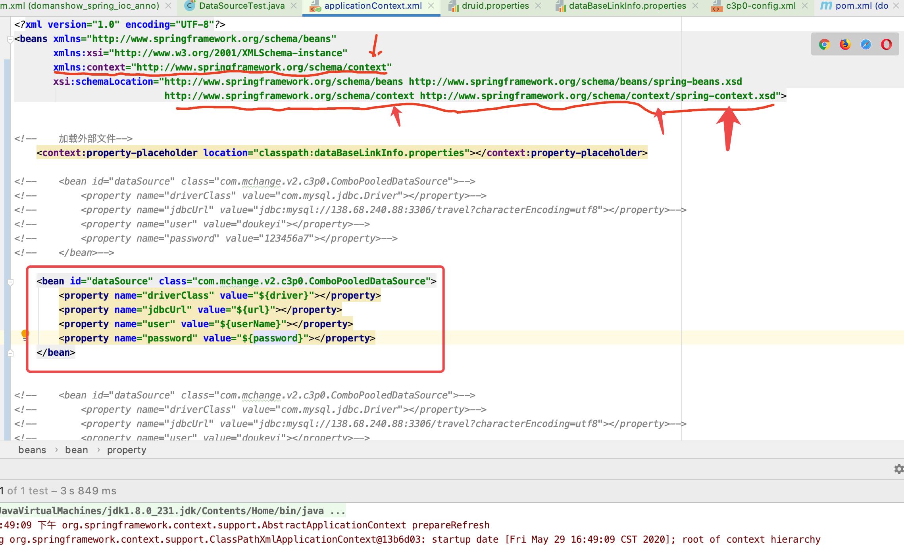
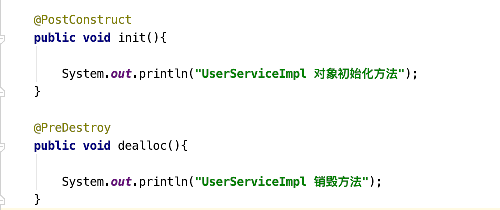
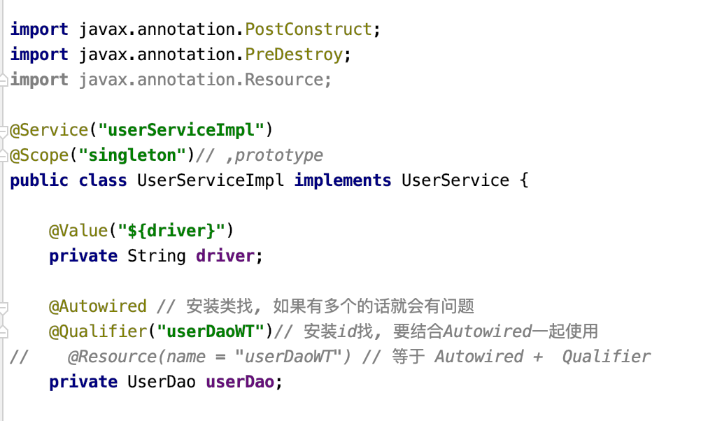
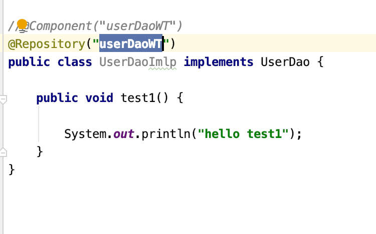
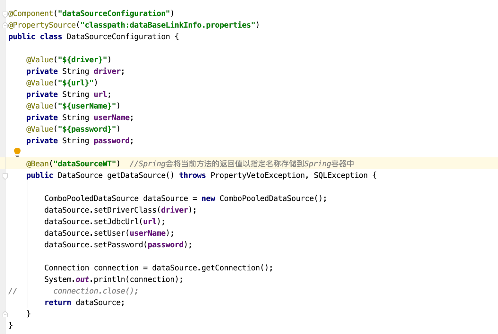
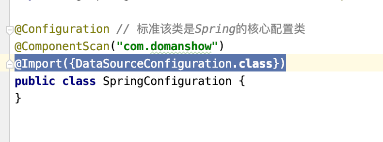
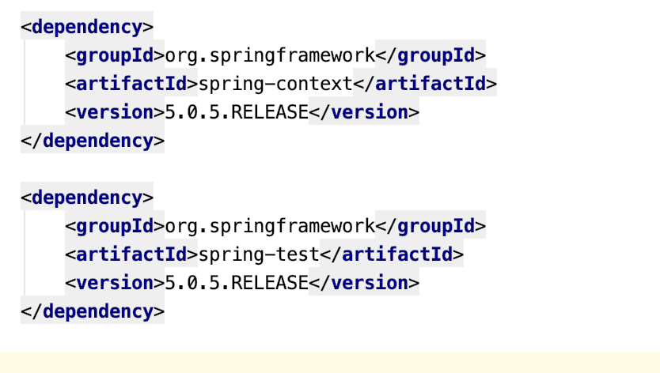

# 目录

1. [Spring配置数据源](#spring001)
2. [Spring 注解开发](#spring001)
3. [Spring 集成Junit](#spring001)


### spring001
# 1. Spring配置数据源

## 1.2 开发步骤

1. 导入数据源的坐标和数据驱动坐标
2. 创建数据源对象
3. 设置数据源的基本连接数据
4. 使用完毕后将连接资源归还


1. 导入坐标
```xml

<?xml version="1.0" encoding="UTF-8"?> <project xmlns="http://maven.apache.org/POM/4.0.0"
  xmlns:xsi="http://www.w3.org/2001/XMLSchema-instance"
  xsi:schemaLocation="http://maven.apache.org/POM/4.0.0 http://maven.apache.org/xsd/maven-4.0.0.xsd">
    <modelVersion>4.0.0</modelVersion>

    <groupId>com.domanshow</groupId>
    <artifactId>domanshow_spring_ioc_anno</artifactId>
    <version>1.0-SNAPSHOT</version>

    <dependencies>

        <dependency>
            <groupId>org.springframework</groupId>
            <artifactId>spring-context</artifactId>
            <version>5.0.5.RELEASE</version>
        </dependency>

        <dependency>
            <groupId>org.springframework</groupId>
            <artifactId>spring-test</artifactId>
            <version>5.0.5.RELEASE</version>
        </dependency>

        <dependency>
            <groupId>junit</groupId>
            <artifactId>junit</artifactId>
            <version>4.12</version>
            <scope>test</scope>
        </dependency>

<!--        mysql驱动-->
  <dependency>
            <groupId>mysql</groupId>
            <artifactId>mysql-connector-java</artifactId>
            <version>5.1.39</version>
        </dependency>

        <dependency>
            <groupId>c3p0</groupId>
            <artifactId>c3p0</artifactId>
            <version>0.9.1.2</version>
        </dependency>

        <dependency>
            <groupId>com.alibaba</groupId>
            <artifactId>druid</artifactId>
            <version>1.1.10</version>
        </dependency>

    </dependencies>
</project>

```

2. 创建数据源对象
3. 设置数据源的基本连接数据
4. 使用完毕后将连接资源归还

```java

package com.domanshow.test;

import com.alibaba.druid.pool.DruidDataSource;
import com.alibaba.druid.pool.DruidDataSourceFactory;
import com.alibaba.druid.pool.DruidPooledConnection;
import com.mchange.v2.c3p0.ComboPooledDataSource;
import org.junit.Test;
import org.springframework.context.ApplicationContext;
import org.springframework.context.support.ClassPathXmlApplicationContext;

import javax.sql.DataSource;
import java.beans.PropertyVetoException;
import java.io.IOException;
import java.io.InputStream;
import java.sql.Connection;
import java.sql.SQLException;
import java.util.Properties;
import java.util.ResourceBundle;

public class DataSourceTest {

    /**
 * c3p0-通过配置文件 * @throws PropertyVetoException
 * @throws SQLException
 */  @Test
  public void test1() throws PropertyVetoException, SQLException {

        DataSource dataSource = new ComboPooledDataSource("wtc3p0");
        Connection connection = dataSource.getConnection();
        System.out.println("connection ok ok" + connection);
        connection.close();

    }

    /**
 * c3p0-直接写代码 * @throws SQLException
 * @throws PropertyVetoException
 */  @Test
  public void test2() throws SQLException, PropertyVetoException {

        ComboPooledDataSource dataSource = new ComboPooledDataSource();
        dataSource.setDriverClass("com.mysql.jdbc.Driver");
        dataSource.setJdbcUrl("jdbc:mysql://138.68.240.88:3306/travel?characterEncoding=utf8");
        dataSource.setUser("doukeyi");
        dataSource.setPassword("123456a7");
        Connection connection = dataSource.getConnection();
        System.out.println(connection);
        connection.close();
    }

    /**
 * druid-通过配置文件 */  @Test
  public void test3(){

        // 1.  声明静态数据源成员变量
  DataSource ds;
        System.out.println("开始连接数据库......");

        // 加载配置文件中的数据
  InputStream is = DataSourceTest.class.getClassLoader().getResourceAsStream("druid.properties");
        Properties pp = new Properties();
        try {
            pp.load(is);
            // 创建连接池，使用配置文件中的参数
  ds = DruidDataSourceFactory.createDataSource(pp);

            System.out.println("数据库连接成功......OKOK");
            System.out.println(ds);

        } catch (IOException e) {
            e.printStackTrace();
        } catch (Exception e) {
            e.printStackTrace();
        }

    }

    /**
 * druid-代码 */  @Test
  public void test4() throws SQLException {

        DruidDataSource dataSource = new DruidDataSource();
        dataSource.setDriverClassName("com.mysql.jdbc.Driver");
        dataSource.setUrl("jdbc:mysql://138.68.240.88:3306/travel?characterEncoding=utf8");
        dataSource.setUsername("doukeyi");
        dataSource.setPassword("123456a7");
        DruidPooledConnection connection = dataSource.getConnection();
        System.out.println(connection);
        connection.close();
    }

    /**
 * 加配置文件取配置文件里的值 */  @Test
  public void test5() throws PropertyVetoException, SQLException {

        ResourceBundle resourceBundle = ResourceBundle.getBundle("dataBaseLinkInfo");
        String driver = resourceBundle.getString("driver");
        String url = resourceBundle.getString("url");
        String userName = resourceBundle.getString("userName");
        String password = resourceBundle.getString("password");

        ComboPooledDataSource dataSource = new ComboPooledDataSource();
        dataSource.setDriverClass(driver);
        dataSource.setJdbcUrl(url);
        dataSource.setUser(userName);
        dataSource.setPassword(password);

        Connection connection = dataSource.getConnection();
        System.out.println(connection);
        connection.close();
    }

    /**
 * Spring 容器产生数据源对象 */  @Test
  public void test6() throws SQLException {

        ApplicationContext applicationContext = new ClassPathXmlApplicationContext("applicationContext.xml");
        DataSource dataSource = (DataSource) applicationContext.getBean(DataSource.class);
        Connection connection = dataSource.getConnection();

        System.out.println(connection);
        connection.close();

    }
}

```

## 1.2 spring 配置

1. 坐标什么的还是一样的哈, 然后修改xml文件



2. 代码diaoyong

```java

    @Test
    public void test6() throws SQLException {

        ApplicationContext applicationContext = new ClassPathXmlApplicationContext("applicationContext.xml");
        DataSource dataSource = (DataSource) applicationContext.getBean(DataSource.class);
        Connection connection = dataSource.getConnection();

        System.out.println(connection);
        connection.close();

    }


```

3. xml

```xml

<?xml version="1.0" encoding="UTF-8"?>
<beans xmlns="http://www.springframework.org/schema/beans"
       xmlns:xsi="http://www.w3.org/2001/XMLSchema-instance"
       xmlns:context="http://www.springframework.org/schema/context"
       xsi:schemaLocation="http://www.springframework.org/schema/beans http://www.springframework.org/schema/beans/spring-beans.xsd
                           http://www.springframework.org/schema/context http://www.springframework.org/schema/context/spring-context.xsd">


<!--    加载外部文件-->
    <context:property-placeholder location="classpath:dataBaseLinkInfo.properties"></context:property-placeholder>

<!--    <bean id="dataSource" class="com.mchange.v2.c3p0.ComboPooledDataSource">-->
<!--        <property name="driverClass" value="com.mysql.jdbc.Driver"></property>-->
<!--        <property name="jdbcUrl" value="jdbc:mysql://138.68.240.88:3306/travel?characterEncoding=utf8"></property>-->
<!--        <property name="user" value="doukeyi"></property>-->
<!--        <property name="password" value="123456a7"></property>-->
<!--    </bean>-->

    <bean id="dataSource" class="com.mchange.v2.c3p0.ComboPooledDataSource">
        <property name="driverClass" value="${driver}"></property>
        <property name="jdbcUrl" value="${url}"></property>
        <property name="user" value="${userName}"></property>
        <property name="password" value="${password}"></property>
    </bean>


<!--    <bean id="dataSource" class="com.mchange.v2.c3p0.ComboPooledDataSource">-->
<!--        <property name="driverClass" value="com.mysql.jdbc.Driver"></property>-->
<!--        <property name="jdbcUrl" value="jdbc:mysql://138.68.240.88:3306/travel?characterEncoding=utf8"></property>-->
<!--        <property name="user" value="doukeyi"></property>-->
<!--        <property name="password" value="123456a7"></property>-->
<!--    </bean>-->

<!--    &lt;!&ndash;配置组件扫描&ndash;&gt;-->
<!--    <context:component-scan base-package="com.domanshow"/>-->


</beans>

```


### spring002
# 2. Spring 注解开发

Spring 是轻代码而重配置的框架, 配置笔记繁重, 影响开发效率. 所以就有了注解开发, 以提供开发效率

使用注解开发时, 需要在`applicationContext.xml`里配置组件扫描. 作用是指定哪个包以及它的子包下的Bean需要进行扫描, 以便识别使用的`注解配置类, 字段, 和方法`
```xml

<!--配置组件扫描--> <context:component-scan base-package="com.domanshow"/>

```


Spring注解开发分为 原始注解和新注解.


## 2.1 原始注解

| 注解           | 说明                                           |
| -------------- | ---------------------------------------------- |
| @Component     | 使用在类上用于实例化Bean                       |
| @Controller    | 使用在web层类上用于实例化Bean                  |
| @Service       | 使用在service层类上用于实例化Bean              |
| @Repository    | 使用在dao层类上用于实例化Bean                  |
| @Autowired     | 使用在字段上用于根据类型依赖注入               |
| @Qualifier     | 结合@Autowired一起使用用于根据名称进行依赖注入 |
| @Resource      | 相当于@Autowired+@Qualifier，按照名称进行注入  |
| @Value         | 注入普通属性                                   |
| @Scope         | 标注Bean的作用范围                             |
| @PostConstruct | 使用在方法上标注该方法是Bean的初始化方法       |
| @PreDestroy    | 使用在方法上标注该方法是Bean的销毁方法         |


### 2.1.1 用于实例化的
下面四个功能是一样的
1. `@Component`: 普通类
2. `@Controller` : web层类
3. `@Service` : service层
4. `@Repository` : dao层


### 2.1.6 用来赋值基本数据类型, 从properties取值

```java

@Value("${driver}")
private String driver;
@Value("${url}")
private String url;
@Value("${userName}")
private String userName;
@Value("${password}")
private String password;

```


### 2.1.7 @Scope("singleton")// ,prototype

### 2.1.8 用来赋值引用数据类型
@Autowired // 安装类找, 如果有多个的话就会有问题 
@Qualifier("userDaoWT")// 安装id找, 要结合Autowired一起使用

@Resource(name = "userDaoWT") // 等于 Autowired +  Qualifier

```java

   @Autowired // 安装类找, 如果有多个的话就会有问题
  @Qualifier("userDaoWT")// 安装id找, 要结合Autowired一起使用 
  //    @Resource(name = "userDaoWT") // 等于 Autowired +  Qualifier
  private UserDao userDao;


```

### 2.1.9 初始化, 和dealloc

```java

@PostConstruct 
public void init(){

    System.out.println("UserServiceImpl 对象初始化方法");
}

@PreDestroy 
public void dealloc(){

    System.out.println("UserServiceImpl 销毁方法");
}

```

### 2.1.10 使用

```java

public static void main(String[] args) throws PropertyVetoException, SQLException {

    ApplicationContext applicationContext = new AnnotationConfigApplicationContext(SpringConfiguration.class);

    UserService service = applicationContext.getBean(UserService.class);
    service.save();

    DataSourceConfiguration dataSourceConfiguration = (DataSourceConfiguration) applicationContext.getBean("dataSourceConfiguration");
    DataSource dataSource = dataSourceConfiguration.getDataSource();

    DataSource dataSource2 = (DataSource) applicationContext.getBean("dataSourceWT");
    System.out.println("dataSource2 Connection(); : " + dataSource2.getConnection());
    System.out.println("dataSource3 Connection(); : " + dataSource2.getConnection());
}

```








## 2.2 Spring 新注解

使用上面的注解, 还不能全部代替`xml`配置文件, 还需要使用注解替代的配置如下:
### 2.2.1 @Bean("dataSource")  //Spring会将当前方法的返回值以指定名称存储到Spring容器中
### 2.2.2 @Configuration // 标准该类是Spring的核心配置类
### 2.2.3 @ComponentScan("com.domanshow") 用来扫描
### 2.2.4 @Import({DataSourceConfiguration.class}) 用来包含配置
### 2.2.5 @PropertySource("classpath:dataBaseLinkInfo.properties") 用来加载properties文件


### spring003
# 3. Spring 整合Junit

在测试类中, 每个测试方法, 都有类似的以下两行代码

```java

ApplicationContext applicationContext = new AnnotationConfigApplicationContext(SpringConfiguration.class);

UserService service = applicationContext.getBean(UserService.class);

```


## 3.1 解决思路

让SpringJunit负责创建 Spring容器, 但是需要将配置文件的名称告诉它
将需要进行测试 Bean直接在测试类中进行注入


## 3.2 Spring 集成Junit步骤

1. 导入spring集成Junit的坐标
2. 使用 @Runwith 注解替换原来的运行期`原先我们是Junit进行测试, 现在我们找Spring, Spring找Junit`
3. 使用 @ContextConfiguration 指定配置文件或配置类
4. 使用@Autowired注入需要测试的对象
5. 创建测试方法进行测试


1. 导入坐标

2. 创建类和替换运行期@RunWith(SpringJUnit4ClassRunner.class)
3. @ContextConfiguration(classes = {SpringConfiguration.class})
4. Autowired

```java


    @Autowired
  private UserService userService;

```


```java

package com.domanshow.test;

import com.domanshow.cofig.SpringConfiguration;
import com.domanshow.service.UserService;
import org.junit.Test;
import org.junit.runner.RunWith;
import org.springframework.beans.factory.annotation.Autowired;
import org.springframework.test.context.ContextConfiguration;
import org.springframework.test.context.junit4.SpringJUnit4ClassRunner;

import javax.sql.DataSource;
import java.sql.SQLException;

@RunWith(SpringJUnit4ClassRunner.class)
//@ContextConfiguration("classpath:applicationContext.xml") @ContextConfiguration(classes = {SpringConfiguration.class})
public class SpringJunitTest {

    @Autowired
  private UserService userService;

    @Autowired
  private DataSource dataSource;

    @Test
  public void test1(){
        userService.save();
    }

    @Test
  public void test2() throws SQLException {
        System.out.println(dataSource.getConnection());
    }
}


```
