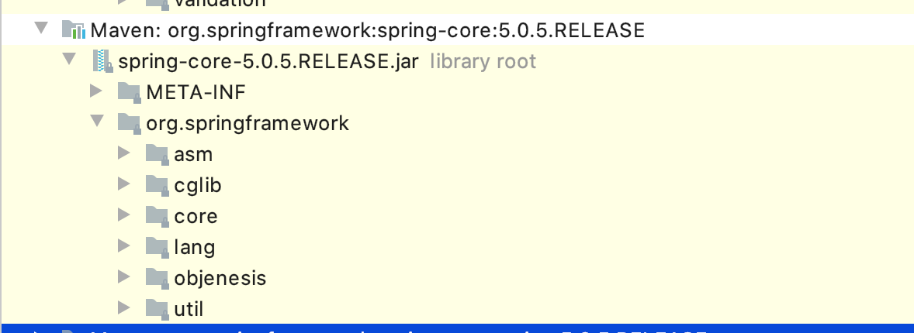
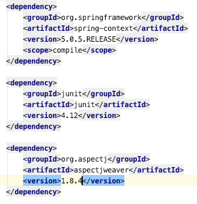
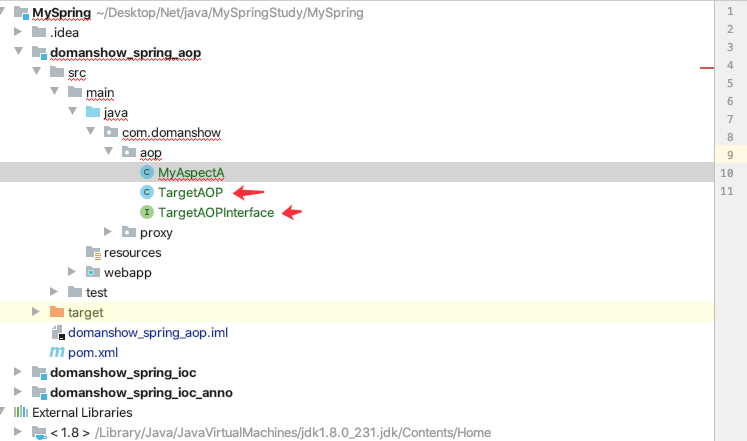
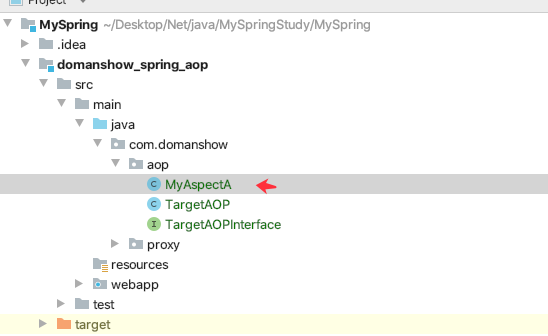
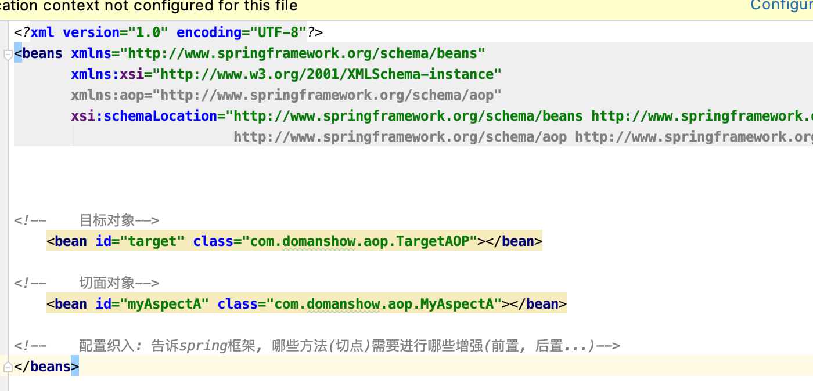
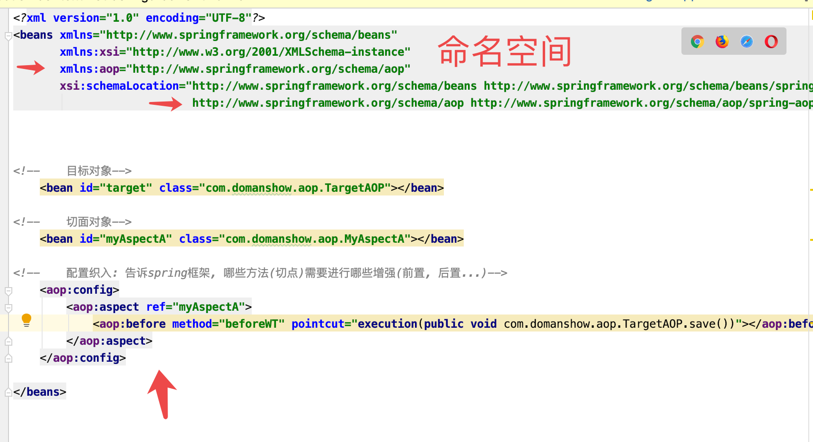

# 目录

1. [Spring 的AOP简介](#spring001)
    1. [什么是AOP](#spring001a) 
    2. [AOP的作用及其优势](#spring001b) 
    3. [AOP的底层实现](#spring001c) 
    4. [AOP的动态代码技术](#spring001d) 
    5. [AOP JDK的动态代理](#spring001e) 
    6. [cglib 的动态代理](#spring001f) 
    7. [AOP 相关概念](#spring001g) 
    8. [AOP 开发明确事项](#spring001h) 
    9. [知识要点](#spring001i) 
2. [基于xml的AOP开发](#spring002)
    1. [快速入门](#spring0021) 
    2. [xml 配置AOP详解](#spring0022) 
    3. [知识要点](#spring0023) 
3. [基于注解的 AOP 开发](#spring003)
    1. [快速入门](#spring0031) 
    2. [注解配置 AOP 详解](#spring0032) 
    3. [知识要点](#spring0033) 


### spring001
# 1.Spring 的AOP简介

### spring001a
## 1.1 什么是AOP

目标方法加目标增强, 结合就叫切面

这玩意就好像OC的分类勒~嗯嗯是分类

### spring001b
## 1.2 AOP的作用及其优势

作用 : 在程序运行期间, 在不修改源码的情况下对方法进行功能增强
优势: 减少重复代码, 提高开发效率

### spring001c
## 1.3 AOP的底层实现

动态代理技术. 代理....

实际上，AOP 的底层是通过 Spring 提供的的动态代理技术实现的。在运行期间，Spring通过动态代理技术动态的生成代理对象，代理对象方法执行时进行增强功能的介入，在去调用目标对象的方法，从而完成功能的增强。

### spring001d
## 1.4 AOP的动态代码技术

常用的动态代理技术

JDK 代理: 基于接口的动态代理技术
cglib 代理: 基于父类的动态代理技术

### spring001e
## 1.5 AOP JDK的动态代理

```java

package com.domanshow.proxy.jdk;

import java.lang.reflect.InvocationHandler;
import java.lang.reflect.Method;
import java.lang.reflect.Proxy;

public class ProxyTest {

    public static void main(String[] args) {

        // 目标对象
  final Target target = new Target();
        // 增强对象
  final Advice advice = new Advice();

        TargetInterface proxy = (TargetInterface)Proxy.newProxyInstance(
                target.getClass().getClassLoader(),
                target.getClass().getInterfaces(),
                new InvocationHandler() {
                    public Object invoke(Object proxy, Method method, Object[] args) throws Throwable {

                        advice.before();
                        Object invoke = method.invoke(target,args);
                        advice.afterRuning();
                        return invoke;
                    }
                }
        );

        proxy.save();

    }
}

```


### spring001f
## 1.6 cglib 的动态代理



```java

package com.domanshow.proxy.cglib;

import com.domanshow.proxy.cglib.Advice;
import com.domanshow.proxy.cglib.Target;
import org.springframework.cglib.proxy.Enhancer;
import org.springframework.cglib.proxy.MethodInterceptor;
import org.springframework.cglib.proxy.MethodProxy;

import java.lang.reflect.Method;

public class ProxyTest {

    public static void main(String[] args) {

        // 目标对象
  final Target target = new Target();
        // 增强对象
  final Advice advice = new Advice();

        // 返回值 就是动态生成的代理对象 基于cglib
 // 1. 创建增强器  Enhancer enhancer = new Enhancer();
        // 2. 设置父类 目标
  enhancer.setSuperclass(Target.class);

        enhancer.setCallback(new MethodInterceptor() {
            public Object intercept(Object o, Method method, Object[] objects, MethodProxy methodProxy) throws Throwable {
                advice.before();
                Object invoke = method.invoke(target, objects);
                advice.afterRuning();
                return invoke;
            }
        });

        Target proxy = (Target) enhancer.create();

        proxy.save();;

    }
}

```

### spring001g
## 1.7 AOP 相关概念

Spring 的AOP实现底层就是对上面的动态代理的代码进行了封装, 封装后我们只需要对需要关注的部分进行代码编写, 并通过配置的方式完成指定目标的方法增强.

### 1.7.1 相关术语

- `Target`(目标对象): 代理的目标对象
- `Proxy`(代理): 一个类被AOP植入增强后, 就产生一个结果代理类.
- `Joinpoint` (连接点) : 被拦截的点. 在Spring中指的是方法, 就是被拦截的方法. Spring只支持方法类型的连接点.
- `Pointcut`(切入点): 就是我们要对那些 `Joinpoint`进行拦截的定义
- `Advice` (通知/增强) : 所谓通知是指拦截到`Joinpoint`之后所要做的事情. 这就是通知.
- `Aspect`  (切面): 是切入点和通知(引介)的结合
- `Weaving` (植入):  是指把增强应用到目标对象来创建新的代理对象的过程. spring采用动态代理织入，而AspectJ采用编译期织入和类装载期织入


1. **通知就是增强方法**
2. **连接点就是目标方法**
3. 


### spring001h
## 1.8 AOP 开发明确事项

### 1.8.1 需要编写的内容

- 1. 目标类的目标方法
- 2. 编写切面类, 切面类中有通知(增强功能方法)
- 3. 在配置文件中, 配置植入关系, 将哪些通知与哪些连接点进行结合

### 1.8.2 AOP 技术实现的内容

Spring 框架监控切入点方法执行, 一旦监控到`切入点`方法被运行, 使用`代理机制`, `动态创建`目标对象的代理对象, 根据`通知`类别, 在`代理对象`的对应位置, 将`通知`对应的功能植入, 完成完整的代码逻辑运行.

### 1.8.3 AOP 底层使用哪种代理方式

在Spring中, 框架会根据目标类是否实现了接口来决定采用哪种动态代理的方式.

### spring001i
## 1.9 知识要点

- aop: 面向切面编程
- aop底层实现: 基于JDK和cglib的动态代理
- aop重点概念
    - `Pointcut`切入点: 被增强的方法
    - `Advice`(通知/增强): 就是增强方法
    - `Aspect` (切面): 切点+通知
    - `Weaving`(植入): 将切点与通知结合的过程

- 开发明确事项:
1. 谁是切点
2. 谁是通知
3. 切点和通知进行配置

### spring002
# 2. 基于xml的AOP开发


### spring0021
## 2.1 快速入门

1. 导入AOP相关坐标
2. 创建目标接口和目标类
3. 创建切面类
4. 将目标类和切面类的对象创建权交给spring
5. 在ApplicationContext.xml中配置植入关系
6. 测试


1. 导坐标

```xml

<dependencies>
    <dependency>
        <groupId>org.springframework</groupId>
        <artifactId>spring-context</artifactId>
        <version>5.0.5.RELEASE</version>
        <scope>compile</scope>
    </dependency>

    <dependency>
        <groupId>junit</groupId>
        <artifactId>junit</artifactId>
        <version>4.12</version>
    </dependency>

    <dependency>
        <groupId>org.aspectj</groupId>
        <artifactId>aspectjweaver</artifactId>
        <version>1.8.4</version>
    </dependency>

</dependencies>

```

2. 目标类目标接口

3. 切面类

4. 将目标类和切面类的对象创建权交给spring

5. 配置植入
   1. 配置织入: 告诉spring框架, 哪些方法(切点)需要进行哪些增强(前置, 后置...)
   2. 引入命名空间
     


6. 测试
7. xml
```xml

<?xml version="1.0" encoding="UTF-8"?>
<beans xmlns="http://www.springframework.org/schema/beans"
       xmlns:xsi="http://www.w3.org/2001/XMLSchema-instance"
       xmlns:aop="http://www.springframework.org/schema/aop"
       xsi:schemaLocation="http://www.springframework.org/schema/beans http://www.springframework.org/schema/beans/spring-beans.xsd
                           http://www.springframework.org/schema/aop http://www.springframework.org/schema/aop/spring-aop.xsd">


<!--    目标对象-->
    <bean id="target" class="com.domanshow.aop.TargetAOP"></bean>

<!--    切面对象-->
    <bean id="myAspectA" class="com.domanshow.aop.MyAspectA"></bean>

<!--    配置织入: 告诉spring框架, 哪些方法(切点)需要进行哪些增强(前置, 后置...)-->
    <aop:config>
<!--        声明切面-->
        <aop:aspect ref="myAspectA">
<!--            切面: 切点+通知-->
            <aop:before method="beforeWT" pointcut="execution(public void com.domanshow.aop.TargetAOP.save())"></aop:before>
        </aop:aspect>
    </aop:config>

</beans>

```

### spring0022
## 2.2 xml 配置AOP详解

### 2.2.1 切点表达式写法

```java
execution([修饰符] 返回值类型 包名.类名.方法名(参数))
```


- 1. 访问修饰符可以省略
- 2. 返回类型,包名, 类名, 方法名 可以使用星号`*` 代表任意
- 3. 包名与类名之间一个点`.` 代表当前包下的类,  两个点`..`代表当前包以及其子包下的类
- 4. 参数列表可以使用两个点`..` 表示任意个数, 任意类型的参数列表
```xml


<aop:before method="beforeWT" pointcut="execution(public void com.domanshow.aop.TargetAOP.save())"></aop:before>
1. 访问修饰符可以省略 public
<aop:before method="beforeWT" pointcut="execution(void com.domanshow.aop.TargetAOP.save())"></aop:before>

```


### 2.2.2 通知的类型
### 2.2.3 切点

### spring0023
## 2.3 知识要点


### spring003
# 3. 基于注解的 AOP 开发


### spring0031
## 3.1 快速入门


### spring0032
## 3.2 注解配置 AOP 详解

### spring0033
## 3.3 知识要点
