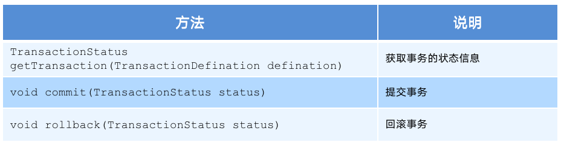
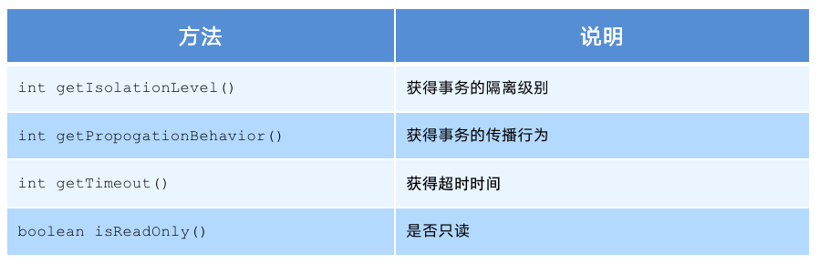
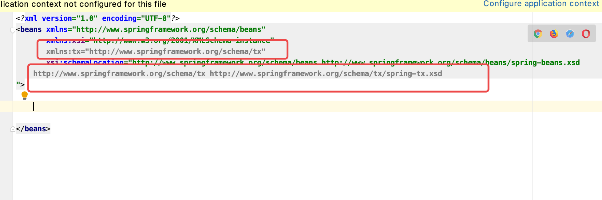

# 目录

1. [](#spring001)
2. [](#spring002)
3. [](#spring003)
4. [](#spring004)



### spring001
# 1. Spring JdbcTemplate基本使用

## 1.1 JdbcTemplate概述

- 它是spring提供的一个对象
- 它是对原始繁琐的jdbc API对象的简单封装

## 1.2 JdbcTemplate开发步骤

1. 导入spring-jdbc 和spring-tx坐标
2. 创建数据库表和实体
3. 创建JdbcTemplate对象
4. 执行数据库操作

1. 导入坐标
```xml

<?xml version="1.0" encoding="UTF-8"?>
<project xmlns="http://maven.apache.org/POM/4.0.0"
         xmlns:xsi="http://www.w3.org/2001/XMLSchema-instance"
         xsi:schemaLocation="http://maven.apache.org/POM/4.0.0 http://maven.apache.org/xsd/maven-4.0.0.xsd">
    <modelVersion>4.0.0</modelVersion>

    <groupId>com.domanshow</groupId>
    <artifactId>domanshow_spring_jdbc</artifactId>
    <version>1.0-SNAPSHOT</version>



    <dependencies>

        <dependency>
            <groupId>org.springframework</groupId>
            <artifactId>spring-context</artifactId>
            <version>5.0.5.RELEASE</version>
        </dependency>

        <dependency>
            <groupId>org.springframework</groupId>
            <artifactId>spring-test</artifactId>
            <version>5.0.5.RELEASE</version>
        </dependency>

        <dependency>
            <groupId>org.springframework</groupId>
            <artifactId>spring-jdbc</artifactId>
            <version>5.0.5.RELEASE</version>
        </dependency>

        <dependency>
            <groupId>org.springframework</groupId>
            <artifactId>spring-tx</artifactId>
            <version>5.0.5.RELEASE</version>
        </dependency>


        <dependency>
            <groupId>junit</groupId>
            <artifactId>junit</artifactId>
            <version>4.12</version>
            <scope>test</scope>
        </dependency>

        <!--        mysql驱动-->
        <dependency>
            <groupId>mysql</groupId>
            <artifactId>mysql-connector-java</artifactId>
            <version>5.1.39</version>
        </dependency>

        <dependency>
            <groupId>c3p0</groupId>
            <artifactId>c3p0</artifactId>
            <version>0.9.1.2</version>
        </dependency>

        <dependency>
            <groupId>com.alibaba</groupId>
            <artifactId>druid</artifactId>
            <version>1.1.10</version>
        </dependency>

    </dependencies>

    <build>

        <plugins>
            <!--jdk编译插件-->
            <plugin>
                <groupId>org.apache.maven.plugins</groupId>
                <artifactId>maven-compiler-plugin</artifactId>
                <configuration>
                    <source>1.8</source>
                    <target>1.8</target>
                    <encoding>utf-8</encoding>
                </configuration>
            </plugin>
            <!--tomcat插件-->
            <plugin>
                <groupId>org.apache.tomcat.maven</groupId>
                <!-- tomcat7的插件， 不同tomcat版本这个也不一样 -->
                <artifactId>tomcat7-maven-plugin</artifactId>
                <version>2.2</version>
                <configuration>
                    <!-- 通过maven tomcat7:run运行项目时，访问项目的端口号 -->
                    <port>80</port>
                    <!-- 项目访问路径  本例：localhost:9090,  如果配置的aa， 则访问路径为localhost:9090/aa-->
                    <path>/travel</path>
                </configuration>
            </plugin>
        </plugins>
    </build>
</project>

```

2. 创建数据库表

3. 创建实体类
```java

package com.domanshow.domain;

public class Account {

    private String name;
    private double money;

    public String getName() {
        return name;
    }

    public void setName(String name) {
        this.name = name;
    }

    public double getMoney() {
        return money;
    }

    public void setMoney(double money) {
        this.money = money;
    }

    @Override
  public String toString() {
        return "Account{" +
                "name='" + name + '\'' +
                ", money=" + money +
                '}';
    }
}

```

4. 创建JdbcTemplate对象, 执行
```java


package com.domanshow.test;

import com.mchange.v2.c3p0.ComboPooledDataSource;
import org.junit.Test;
import org.junit.runner.RunWith;
import org.springframework.context.ApplicationContext;
import org.springframework.context.support.ClassPathXmlApplicationContext;
import org.springframework.jdbc.core.JdbcTemplate;
import org.springframework.test.context.junit4.SpringJUnit4ClassRunner;

import java.beans.PropertyVetoException;
import java.sql.Connection;
import java.sql.SQLException;

//@RunWith(SpringJUnit4ClassRunner.class) public class JdbcTemplateTest {

    @Test
  public void test1() throws PropertyVetoException, SQLException {

        ComboPooledDataSource dataSource = new ComboPooledDataSource();
        dataSource.setDriverClass("com.mysql.jdbc.Driver");
        dataSource.setJdbcUrl("jdbc:mysql://138.68.240.88:3306/jdbctest?characterEncoding=utf8");
        dataSource.setUser("doukeyi");
        dataSource.setPassword("123456a7");

        JdbcTemplate jdbcTemplate = new JdbcTemplate();
        jdbcTemplate.setDataSource(dataSource);

        int row = jdbcTemplate.update("INSERT INTO t_account VALUES(?,?,?);", null,"zhaoliu", 300);

        System.out.println(row);
    }

    @Test
  public void test2(){

        ApplicationContext applicationContext = new ClassPathXmlApplicationContext("applicationContext.xml");
        JdbcTemplate jdbcTemplate = applicationContext.getBean(JdbcTemplate.class);
        int row = jdbcTemplate.update("INSERT INTO t_account VALUES(?,?,?);", null,"zhoujielun", 3000);

        System.out.println(row);
    }
}

```

```xml

<?xml version="1.0" encoding="UTF-8"?> <beans xmlns="http://www.springframework.org/schema/beans"
  xmlns:xsi="http://www.w3.org/2001/XMLSchema-instance"
  xmlns:context="http://www.springframework.org/schema/context"
  xsi:schemaLocation="http://www.springframework.org/schema/beans http://www.springframework.org/schema/beans/spring-beans.xsd http://www.springframework.org/schema/context http://www.springframework.org/schema/context/spring-context.xsd">

    <context:property-placeholder location="classpath:jdbcLinkInfo.properties"></context:property-placeholder>

    <bean id="dataSourece" class="com.mchange.v2.c3p0.ComboPooledDataSource">
        <property name="driverClass" value="${driver}"></property>
        <property name="jdbcUrl" value="${url}"></property>
        <property name="user" value="${userName}"></property>
        <property name="password" value="${password}"></property>
    </bean>

    <bean id="jdbcTemplate" class="org.springframework.jdbc.core.JdbcTemplate">
        <property name="dataSource" ref="dataSourece"></property>
    </bean>

</beans>

```



```java

package com.domanshow.test;

import com.domanshow.domain.Account;
import com.mchange.v2.c3p0.ComboPooledDataSource;
import org.junit.Test;
import org.junit.runner.RunWith;
import org.springframework.beans.factory.annotation.Autowired;
import org.springframework.context.ApplicationContext;
import org.springframework.context.support.ClassPathXmlApplicationContext;
import org.springframework.jdbc.core.BeanPropertyRowMapper;
import org.springframework.jdbc.core.JdbcTemplate;
import org.springframework.test.context.ContextConfiguration;
import org.springframework.test.context.junit4.SpringJUnit4ClassRunner;

import java.beans.PropertyVetoException;
import java.sql.Connection;
import java.sql.SQLException;
import java.util.List;

@RunWith(SpringJUnit4ClassRunner.class)
@ContextConfiguration("classpath:applicationContext.xml")
public class JdbcTemplateTest {

    @Autowired
  private JdbcTemplate jdbcTemplate;

    @Test
  public void test1() throws PropertyVetoException, SQLException {

        ComboPooledDataSource dataSource = new ComboPooledDataSource();
        dataSource.setDriverClass("com.mysql.jdbc.Driver");
        dataSource.setJdbcUrl("jdbc:mysql://138.68.240.88:3306/jdbctest?characterEncoding=utf8");
        dataSource.setUser("doukeyi");
        dataSource.setPassword("123456a7");

        JdbcTemplate jdbcTemplate = new JdbcTemplate();
        jdbcTemplate.setDataSource(dataSource);

        int row = jdbcTemplate.update("INSERT INTO t_account VALUES(?,?,?);", null,"zhaoliu", 300);

        System.out.println(row);
    }

    @Test
  public void test2(){

        ApplicationContext applicationContext = new ClassPathXmlApplicationContext("applicationContext.xml");
        JdbcTemplate jdbcTemplate = applicationContext.getBean(JdbcTemplate.class);
        int row = jdbcTemplate.update("INSERT INTO t_account VALUES(?,?,?);", null,"zhoujielun", 3000);

        System.out.println(row);
    }

    @Test
  public void test3(){

        ApplicationContext applicationContext = new ClassPathXmlApplicationContext("applicationContext.xml");
        JdbcTemplate jdbcTemplate = applicationContext.getBean(JdbcTemplate.class);
        int row = jdbcTemplate.update("UPDATE t_account SET money=? WHERE `name`=?;",  3600,"zhoujielun");

        System.out.println(row);
    }

    @Test
  public void test4(){

        ApplicationContext applicationContext = new ClassPathXmlApplicationContext("applicationContext.xml");
        JdbcTemplate jdbcTemplate = applicationContext.getBean(JdbcTemplate.class);
        int row = jdbcTemplate.update("DELETE FROM t_account WHERE name=?;",  "zhoujielun");

        System.out.println(row);
    }

    @Test
  public void test5(){

        List<Account> accounts = jdbcTemplate.query("select * from t_account", new BeanPropertyRowMapper<Account>(Account.class));

        for (Account account : accounts) {

            System.out.println(account.getName());
        }
    }

}

```


### spring002
# 2. 编程式事务控制相关对象

## 2.1 PlatformTransactionManager 

**PlatformTransactionManager** 接口是`spring`的事务管理器, 它里面提供了我们常用的操作事务的方法

**PlatformTransactionManager**是接口, 是规范. 不同的Dao层技术有着不同的实现类


例如：**Dao** 层技术是**jdbc** 或 **mybatis** 时：`org.springframework.jdbc.datasource.DataSourceTransactionManager `
**Dao** 层技术是**hibernate**时：`org.springframework.orm.hibernate5.HibernateTransactionManager`




- `TransactionStatus getTransaction(TransactionDefination defination)`: 获取事务的状态信息
- `void commit(TransactionStatus status)`:  提交事务
- `void rollback(TransactionStatus status)`: 回滚事务

 
## 2.2 TransactionDefinition

**TransactionDefinition** 是事务的定义信息对象, 里面有如下方法


- `int getIsolationLevel()`: 获得事务的隔离级别
- `int getPropogationBehavior()`: 获得事务的传播行为
- `int getTimeout()` 获得超时时间
- `boolean isReadOnly()` 是否只读

### 2.2.1 TransactionDefinition 事务隔离级别

- ISOLATION_DEFAULT
- ISOLATION_READ_UNCOMMITTED
- ISOLATION_READ_COMMITTED
- ISOLATION_REPEATABLE_READ
- ISOLATION_SERIALIZABLE


### 2.2.2 TransactionDefinition 事务传播行为

- `REQUIRED`：**如果当前没有事务，就新建一个事务，如果已经存在一个事务中，加入到这个事务中。一般的选择（默认值）**
- `SUPPORTS`：**支持当前事务，如果当前没有事务，就以非事务方式执行（没有事务）**
- `MANDATORY`：使用当前的事务，如果当前没有事务，就抛出异常
- `REQUERS_NEW`：新建事务，如果当前在事务中，把当前事务挂起。
- `NOT_SUPPORTED`：以非事务方式执行操作，如果当前存在事务，就把当前事务挂起
- `NEVER`：以非事务方式运行，如果当前存在事务，抛出异常
- `NESTED`：如果当前存在事务，则在嵌套事务内执行。如果当前没有事务，则执行 REQUIRED 类似的操作
- 超时时间：默认值是-1，没有超时限制。如果有，以秒为单位进行设置
- 是否只读：建议查询时设置为只读


## 2.3 TransactionStatus

**TransactionStatus** 接口提供的是事务具体的运行状态

- `boolean hasSavepoint()`: 是否存储回滚点
- `boolean isCompleted()`: 事务是否完成
- `boolean isNewTransaction()` :  是否是新事务
- `boolean isRollbackOnly()`: 事务是否回滚


### spring003
# 3. 基于xml的声明式事务控制

`Spring` 的声明式事务就是配置xml来处理

Spring 的声明式事务顾名思义就是`采用声明的方式来处理事务`。这里所说的声明，就是指在配置文件中声明，用在 Spring 配置文件中声明式的处理事务来代替代码式的处理事务。

- 事务管理不侵入开发的组件。具体来说，业务逻辑对象就不会意识到正在事务管理之中，事实上也应该如此，因为事务管理是属于系统层面的服务，而不是业务逻辑的一部分，如果想要改变事务管理策划的话，也只需要在定义文件中重新配置即可

- 在不需要事务管理的时候，只要在设定文件上修改一下，即可移去事务管理服务，无需改变代码重新编译，这样维护起来极其方便


## 3.1 声明式事务控制的实现

- 谁是切点?
- 谁是通知??
- 配置切面???

- 1. 引入tx命名空间
- 2. 配置事务增强
- 3. 配置事务AOP织入
- 4. 测试

1. 导入命名空间

2. 配置事务增强


```xml

<!--    平台事务管理器-->
    <bean id="wtPlatformTransactionManager" class="org.springframework.jdbc.datasource.DataSourceTransactionManager">
        <property name="dataSource" ref="dataSource"></property>
    </bean>



<!--    事务增强配置-->
    <tx:advice id="txAdvice" transaction-manager="wtPlatformTransactionManager">

<!--        设置事务的属性信息-->
        <tx:attributes>
            <tx:method name="*"/>
        </tx:attributes>

    </tx:advice>

```


3. 事务的aop织入

```xml

<aop:config>
    <aop:advisor advice-ref="txAdvice" pointcut="execution(* com.itheima.service.impl.*.*(..))"></aop:advisor>
</aop:config>

```


2020年06月03日01:16:01
妈的少了一个库他妈的也不报错靠


### spring004
# 4. 基于注解的声明式事务控制