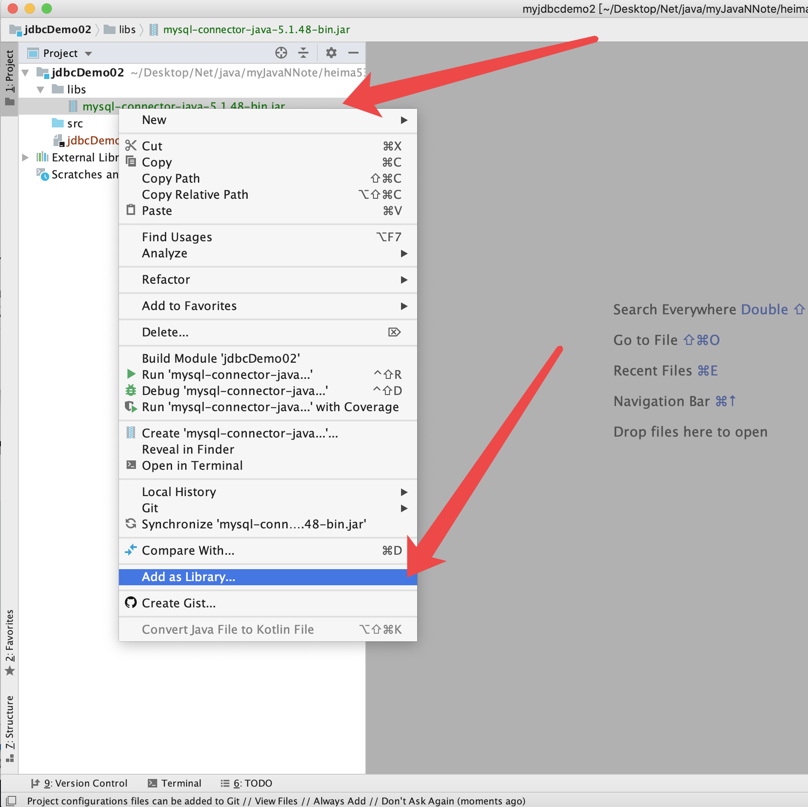
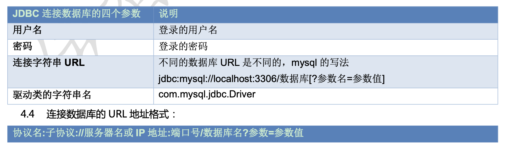
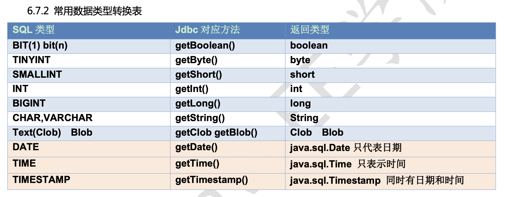
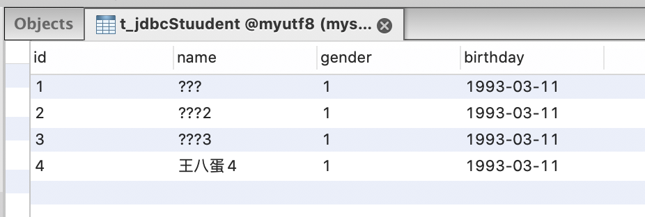
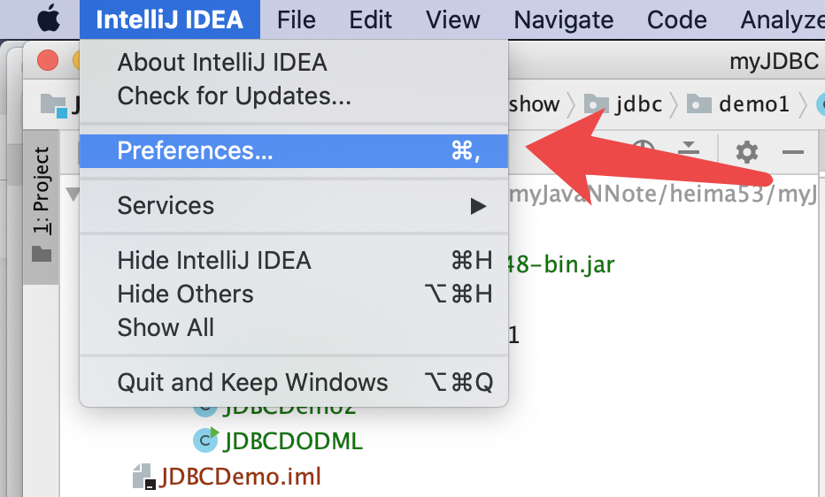
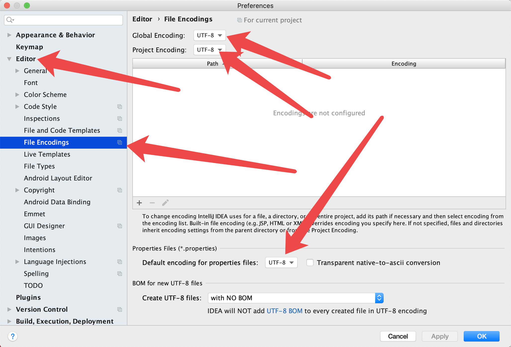

# 目录


1. [](#)
- [数据库驱动](#数据库驱动)
- [数据库驱动加载 ](#数据库驱动加载 )
- [jdbc基本连接](#jdbc基本连接)
- [](#)
- [](#)
- [](#)

2. [JDBC 入门](#JDBC 入门)

- 2.1 [jdbc概念](#jdbc概念)
- 2.2 [核心api](#核心api)
- 2.3 [加载和注册驱动](#加载和注册驱动)

3. [DriverManager 类](#drivermanager类)

- 3.1 [drivermanager作用](#drivermanager作用)
-  3.2 [ 方法参数解析和mysql写法](#方法参数解析和mysql写法)
  

4. [connection接口](#connection接口)

- 4.1 [connection作用和方法](#connection作用和方法)


5. [statement接口](#statement接口)

- 5.1 [jdbc访问数据库的步骤](#jdbc访问数据库的步骤)
- 5.2 [statement的作用和方法](#statement的作用和方法)
- 5.3 [释放资源](#释放资源)
- 5.4 [执行DDL操作](#执行ddl操作)
- 5.5 [执行DML](#执行dml)
- 5.6 [执行DQL](#执行dql)
- 5.7 [resultset接口的注意事项](#resultset接口的注意事项)


6. [数据库工具类jdbcutils](#数据库工具类jdbcutils)
- 6.1 [创建工具类的三个方法](#创建工具类的三个方法)
- 6.1 [登录案例](#登录案例)


7. [PreparedStatement接口](#preparedstatement接口)
- 7.1 [继承结构和作用](#继承结构和作用)
- 7.2 [PreparedStatement的执行原理](#preparedstatement的执行原理)
- 7.3 [Connection创建 PreparedStatement](#connection创建preparedstatement)
- 7.4 [方法和好处](#方法和好处)
- 7.5 [使用步骤](#使用步骤)
- 7.6 [表和类的关系](#表和类的关系)
- 7.7 [PreparedStatement执行DML](#pre执行dml)
- 7.8 [](#)


8. [jdbc处理事务](#jdbc处理事务)
- 8.1 [api介绍](#api介绍)
- 8.2 [开发步骤](#开发步骤)


9. [遇到的问题](#遇到的问题)
- 9.1 [中文乱码](#中文乱码)
- 9.2 [idea字符集集设置](#idea字符集集设置)


```
- 2.0.1 [ ](#)
    - 2.0.1.1 [](#)
    - 2.0.1.2 [](#)


```
      
    


### 数据库驱动

```

mysql-connector-java

https://dev.mysql.com/downloads/connector/j/5.1.html

```

### 数据库驱动加载 




### 从 JDBC3 开始，目前已经普遍使用的版本。可以不用注册驱动而直接使用。Class.forName 这句话可以省略。

```

Class.forName("com.mysql.jdbc.Driver");


```


### JDBC 基本连接
### jdbc基本连接
```

package com.domanshow.jdbc.demo1;

import java.sql.Connection;
import java.sql.DriverManager;
import java.sql.SQLException;
import java.util.Properties;

public class JDBCDemo1Main {

    public static void main(String[] args) throws ClassNotFoundException, SQLException {

        Class.forName("com.mysql.jdbc.Driver");

        System.out.println("hello JDBC");

        jdbcCollection2();

    }

    // 1) 使用用户名、密码、URL得到连接对象
  public static void jdbcCollection1() throws SQLException {

        String url = "jdbc:mysql://65.42.40.36:3306/myutf8"; //1) 使用用户名、密码、URL 得到连接对象
  Connection connection = DriverManager.getConnection(url, "doukeyi", "123456a"); //com.mysql.jdbc.JDBC4Connection@68de145
  System.out.println(connection);
    }

    // 2) 使用属性文件和url得到连接对象
  public static void jdbcCollection2() throws SQLException {

        String url = "jdbc:mysql://65.42.40.36:3306/myutf8";
        // 属性对象
  Properties info = new Properties();
        info.setProperty("user", "doukeyi");
        info.setProperty("password", "123456a");

        Connection connection = DriverManager.getConnection(url, info);

        System.out.println(connection);
    }
}


```


## JDBC 入门

### jdbc概念

3.1.1 什么是 JDBC

JDBC 规范定义接口，具体的实现由各大数据库厂商来实现。

JDBC 是 Java 访问数据库的`标准规范`，真正怎么操作数据库还需要具体的实现类，也就是数据库驱动。每个数据库厂商根据自家数据库的通信格式编写好自己数据库的驱动。所以我们只需要会调用 JDBC 接口中的方法即 可，数据库驱动由数据库厂商提供。

 使用 JDBC 的好处:

1.  1)  程序员如果要开发访问数据库的程序，只需要会调用 JDBC 接口中的方法即可，不用关注类是如何实现的。

2.  2)  使用同一套 Java 代码，进行少量的修改就可以访问其他 JDBC 支持的数据库
###  核心api

DriverManager类
Connection 接口
Statement接口
PreparedStatement 接口
ResultSet 接口

DriverManager类: 
1. 管理和注册数据库驱动
2. 得到数据库连接对象
Connection 接口
1. 一个连接对象, 可用于创建Statement和PreparedStatement对象
Statement接口
1. 一个SQL对象语句, 用于将SQL语句发送给数据服务器
PreparedStatement 接口
1. 一个SQL语句对象, 是Statement的子接口
ResultSet 接口
用于封装数据库查询的结果集, 返回给客户端java程序


### 加载和注册驱动
```

Class.forName("com.mysql.jdbc.Driver");


```


## drivermanager类

DriverManager 类

### drivermanager作用
1. 管理和注册驱动的
2. 创建数据库连接的

### 方法参数解析和mysql写法

通过连接字符串，用户名，密码来得到数据 库的连接对象
**public static Connection getConnection(String url, String user, String password)**
通过连接字符串，属性对象来得到连接对象
**public static Connection getConnection(String url, java.util.Properties info)**


```

public static Connection getConnection(String url,
    java.util.Properties info) throws SQLException {

    return (getConnection(url, info, Reflection.getCallerClass()));
}


public static Connection getConnection(String url,
    String user, String password) throws SQLException {
    java.util.Properties info = new java.util.Properties();

    if (user != null) {
        info.put("user", user);
    }
    if (password != null) {
        info.put("password", password);
    }

    return (getConnection(url, info, Reflection.getCallerClass()));
}

```


**使用 JDBC 连接数据库的四个参数**




```

用户名
密码


连接字符串 URL 
不同的数据库 URL 是不同的，mysql 的写法 jdbc:mysql://localhost:3306/数据库[?参数名=参数值]


驱动类的字符串名
com.mysql.jdbc.Driver

```

1.  连接数据库的 URL 地址格式:

**协议名:子协议://服务器名或 IP 地址:端口号/数据库名?参数=参数值**
```

String url = "jdbc:mysql://65.42.40.36:3306/myutf8";

```

**乱码的处理**
如果数据库出现乱码，可以指定参数: ?characterEncoding=utf8，表示让数据库以 UTF-8 编码来处理数据

**jdbc:mysql://localhost:3306/数据库?characterEncoding=utf8**

## connection接口

Connection 接口，具体的实现类由数据库的厂商实现，代表一个连接对象。
### connection作用和方法

**Statement createStatement() 创建一条 SQL 语句对象**

## statement接口

###   jdbc访问数据库的步骤

1. 注册和加载驱动(可省略)
2. 获取连接
3. Connection获取Statement对象
4. 使用Statement对象执行SQL语句
5. 返回结果集
6. 释放资源

### statement的作用和方法

代表一条语句对象, 用于发送SQL语句给服务器, 用于执行静态SQL语句并返回它所生成结果的对象.

**int executeUpdate(String sql)**
用于发送DML语句, 增删改的操作, insert, update , delete,  参数: SQL语句
返回值: 返回对数据库影响的行数

**ResultSet executeQuery(String sql)**

用于发送DQL语句, 执行查询的操作. select
参数: SQL语句
返回值: 查询的结果集


### 释放资源

1. 需要释放的对象: `Result 结果集`,  `Statement语句`, `Connection 连接`
2. 释放原则: 先开的后关, 后开的先关, `ResultSet`->`Statement` ->`Connection`
3. 放在哪个代码块中:  `finally块`


### 执行ddl操作

```

package com.domanshow.jdbc.demo1;

import java.sql.Connection;
import java.sql.DriverManager;
import java.sql.SQLException;
import java.sql.Statement;

public class JDBCDemo2 {

    public static void main(String[] args) {

        Connection conn = null;
        Statement statement = null;

        try {

            String url = "jdbc:mysql://165.22.240.36:3306/myutf8";
            conn = DriverManager.getConnection(url, "doukeyi", "123456a");

            statement = conn.createStatement();

            statement.executeUpdate("create table if  not exists t_jdbcStuudent(" +
                    "id int primary key auto_increment,"+
                    "name varchar(100) not NULL,"+
                    "gender boolean,"+
                    "birthday date)"
  );

            System.out.println("创建表成功");
        } catch (SQLException e) {
            e.printStackTrace();

        }finally {

            // 关闭之前需要判断    if (statement !=  null){

                try{
                    statement.close();
                } catch (SQLException e) {
                    e.printStackTrace();
                }

            }

            if (conn !=  null)
            {
                try{

                    conn.close();
                } catch (SQLException e) {
                    e.printStackTrace();
                }
            }
        }

    }
}


```


###  执行dml

```

package com.domanshow.jdbc.demo1;

import java.sql.Connection;
import java.sql.DriverManager;
import java.sql.SQLException;
import java.sql.Statement;

public class JDBCDODML {

    public static void main(String[] args) {

        Connection conn = null;
        Statement statement = null;

        try{

            String url = "jdbc:mysql://165.22.240.36:3306/myutf8?characterEncoding=utf8";
            conn = DriverManager.getConnection(url, "doukeyi", "123456a");
            statement = conn.createStatement();
            statement.executeUpdate("insert into t_jdbcStuudent3 values(null, '王八蛋4', 1, '1993-03-11');");

            int count = 0;

            count += statement.executeUpdate("insert into t_jdbcStuudent3 values(null, '孙悟空', 1, '1993-03-24')");
            count += statement.executeUpdate("insert into t_jdbcStuudent3 values(null, '白骨精', 0, '1995-03-24')");
            count += statement.executeUpdate("insert into t_jdbcStuudent3 values(null, '猪八戒', 1, '1903-03-24')");
            count += statement.executeUpdate("insert into t_jdbcStuudent3 values(null, '嫦娥', 0, '1993-03-11')");

            System.out.println("插入了" + count + "条记录");
            System.out.println("数据插入成功!");

        } catch (SQLException e) {
            e.printStackTrace();
        }finally {

            if (statement != null){

                try {
                    statement.close();
                } catch (SQLException e) {
                    e.printStackTrace();
                }
            }

            if (conn  != null){

                try {
                    conn.close();
                } catch (SQLException e) {
                    e.printStackTrace();
                }
            }
        }
    }
}


```


### 执行dql

```

package com.domanshow.jdbc.demo1;

import java.sql.*;

public class JDBCDQL {

    public static void main(String[] args) {

        Connection connection = null;
        Statement statement = null;
        ResultSet  resultSet = null;
        try {

            String url = "jdbc:mysql://165.22.240.36:3306/myutf8?characterEncoding=utf8";
            connection = DriverManager.getConnection(url, "doukeyi", "123456a");

            statement = connection.createStatement();

            resultSet = statement.executeQuery("select * from t_jdbcStuudent;");

            while (resultSet.next()){

                int itemId = resultSet.getInt("id");
                String name = resultSet.getString("name");
                boolean gender =  resultSet.getBoolean("gender");
                Date birthday = resultSet.getDate("birthday");

                System.out.println("编号 :" + itemId + "姓名" + name + "性别" + gender  + "生日" + birthday);

            }

        } catch (SQLException e) {
            e.printStackTrace();
        }finally {

            if (resultSet != null){

                try {
                    resultSet.close();;
                } catch (SQLException e) {
                    e.printStackTrace();
                }
            }

            if (statement != null){

                try {
                    statement.close();
                } catch (SQLException e) {
                    e.printStackTrace();
                }
            }

            if(connection != null){

                try {
                    connection.close();
                } catch (SQLException e) {
                    e.printStackTrace();
                }
            }
        }

    }
}


```




### resultset接口的注意事项


6.7.4 关于 ResultSet 接口中的注意事项:

1.  1)  如果光标在第一行之前，使用 rs.getXX()获取列值，报错:Before start of result set

2.  2)  如果光标在最后一行之后，使用 rs.getXX()获取列值，报错:After end of result set

3.  3)  使用完毕以后要关闭结果集 ResultSet，再关闭 Statement，再关闭 Connection


ResultSet


## 数据库工具类jdbcutils

### 创建工具类的三个方法

### 登录案例

```

package com.domanshow.jdbc.demo1;

import java.sql.Connection;
import java.sql.ResultSet;
import java.sql.SQLException;
import java.sql.Statement;
import java.util.Scanner;

public class JDBCLoginTest {

    public static void main(String[] args) {

//        login("","");    Scanner scanner = new Scanner(System.in);
        System.out.println("请输入用户名");
        String name = scanner.nextLine();
        System.out.println("请输入密码");
        String password = scanner.nextLine();

        login(name,password);
    }

    /**
 * 登录方法 * */    public static void login(String name, String password){

        Connection connection = null;
        Statement statement = null;
        ResultSet resultSet = null;

        try {
            connection = JDBCToolObjTest.getConnection();

            statement = connection.createStatement();

//            statement.executeUpdate( //                    "create table if  not exists t_user(" + //                            "id int primary key auto_increment,"+ //                            "name varchar(100) not NULL,"+ //                            "password varchar(100));" //            ); // // //            statement.executeUpdate("insert into t_user values (null,'jack','123'),(null,'rose','456');");     //            System.out.println("创建表成功");    String loginSQL = "select * from t_user where name='" + name +"'" + " "+ "and"+ " "+ "password='" + password + "' ;";
            System.out.println(loginSQL);

            resultSet = statement.executeQuery(loginSQL);

            if (resultSet.next()){

                System.out.println("登录成功,欢迎:" + name);
            }else {

                System.out.println("登录失败");
            }

        } catch (SQLException e) {
            e.printStackTrace();
        }finally {

            JDBCToolObjTest.close(connection,statement,resultSet);
        }
    }
}

```

## preparedstatement接口
PreparedStatement


### 继承结构和作用

### preparedstatement的执行原理

**预编译**

1) 因为有预先编译的功能，提高 SQL 的执行效率。
2) 可以有效的防止 SQL 注入的问题，安全性更高。

### connection创建preparedstatement

```

Connection connection = JDBCToolObjTest.getConnection();

PreparedStatement ps = connection.prepareStatement("insert into t_jdbcStuudent3 values(null, ?, ?, ?)");


```

### 方法和好处

```

1.  PreparedStatement 接口中的方法
int executeUpdate() 执行 DML，增删改的操作，返回影响的行数。


ResultSet executeQuery() 执行 DQL，查询的操作，返回结果集

```


PreparedSatement 的好处

1. prepareStatement()会先将 SQL 语句发送给数据库预编译。PreparedStatement 会引用着预编译后的结果。 
2. 可以多次传入不同的参数给 PreparedStatement 对象并执行。减少 SQL 编译次数，提高效率。 安全性更高，没有 SQL 注入的隐患。
3. 提高了程序的可读性

### 使用步骤

使用 PreparedStatement 的步骤:

1. 编写 SQL 语句，未知内容使用?占位:"SELECT * FROM user WHERE name=? AND password=?";
2.  获得 PreparedStatement 对象
3. 设置实际参数:setXxx(占位符的位置, 真实的值) 
4. 执行参数化 SQL 语句
5. 关闭资源

### 表和类的关系

### pre执行dml

```

package com.domanshow.jdbc.demo1;

import java.sql.Connection;
import java.sql.PreparedStatement;
import java.sql.SQLException;

public class JDBCPreparedStatementDML {

    public static void main(String[] args) throws SQLException {

//        insert();
  delete();
    }

    private static void insert() throws SQLException {

        Connection connection = JDBCToolObjTest.getConnection();

        PreparedStatement ps = connection.prepareStatement("insert into t_jdbcStuudent3 values(null, ?, ?, ?)");

        ps.setString(1,"白龙马");
        ps.setBoolean(2, true);
        ps.setDate(3, java.sql.Date.valueOf("1990-11-11"));

        int row = ps.executeUpdate();

        System.out.println("插入了" + row + "条记录");
        JDBCToolObjTest.close(connection,ps);

    }

    /**
 * 删除记录 * */  private static void delete() throws SQLException {

        Connection connection = JDBCToolObjTest.getConnection();

        PreparedStatement ps = connection.prepareStatement("delete from t_jdbcStuudent3 where id=?");

        ps.setInt(1,5);

        int row = ps.executeUpdate();

        System.out.println("删除了" + row + "条记录");

        JDBCToolObjTest.close(connection,ps);

    }
}


```


## jdbc处理事务

### api介绍

**void setAutoCommit(boolean autoCommit)**
```

参数是 true 或 false 如果设置为 false，表示关闭自动提交，相当于开启事务


```

**void commit()**

```
提交事务

```


**void rollback()**

```

回滚事务

```

### 开发步骤

开发步骤

1.  1)  获取连接

2.  2)  开启事务

3.  3)  获取到 PreparedStatement

4.  4)  使用 PreparedStatement 执行两次更新操作

5.  5)  正常情况下提交事务

6.  6)  出现异常回滚事务

7.  7)  最后关闭资源


```

package com.domanshow.jdbc.demo1;

import java.sql.Connection;
import java.sql.PreparedStatement;
import java.sql.SQLException;

public class JDBCPreparedStatementAutoCommit {

    public static void main(String[] args) {

        Connection connection = null;
        PreparedStatement ps = null;

        try{

            // 2. 获取连接
  connection = JDBCToolObjTest.getConnection();
            // 3.开启事务
  connection.setAutoCommit(false);

            int addOrValue = 500;

            ps = connection.prepareStatement("update account set balance = balance - ? where name=?");

            ps.setInt(1, addOrValue);
            ps.setString(2,"李四");

            ps.executeUpdate();

            // 做个异常 //            System.out.println(100/0);       // 给张三价钱    ps = connection.prepareStatement("update account set balance= balance + ? where name=?");
            ps.setInt(1, addOrValue);
            ps.setString(2,"张三");
            ps.executeUpdate();

            // 提交事务    connection.commit();

            System.out.println("转账成功");

        } catch (SQLException e) {
            e.printStackTrace();

            try {
                // 事务回滚
  connection.rollback();
            } catch (SQLException ex) {
                ex.printStackTrace();
            }
        }finally {

            JDBCToolObjTest.close(connection,ps);
        }

    }
}

```


## 遇到的问题


### 中文乱码

```

statement.executeUpdate("insert into t_jdbcStuudent values(null, '王八蛋4', 1, '1993-03-11');");


```


2019年12月19日20:36:46
刚开始我以为是IDEA 的字符集设置的问题

其实是连接的时候没设置字符集如下

```

String url = "jdbc:mysql://15.22.40.36:3306/myutf8?characterEncoding=utf8";


```


### idea字符集集设置


IDEA 



