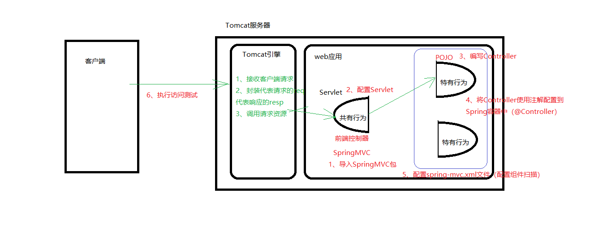
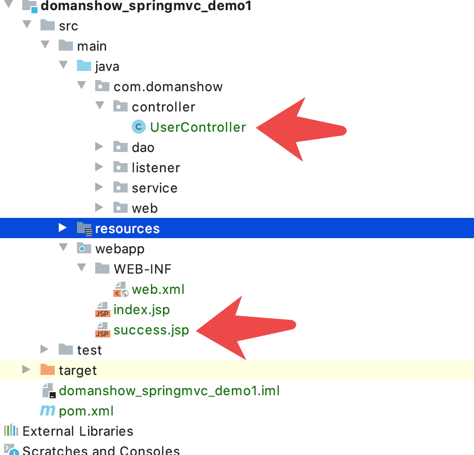
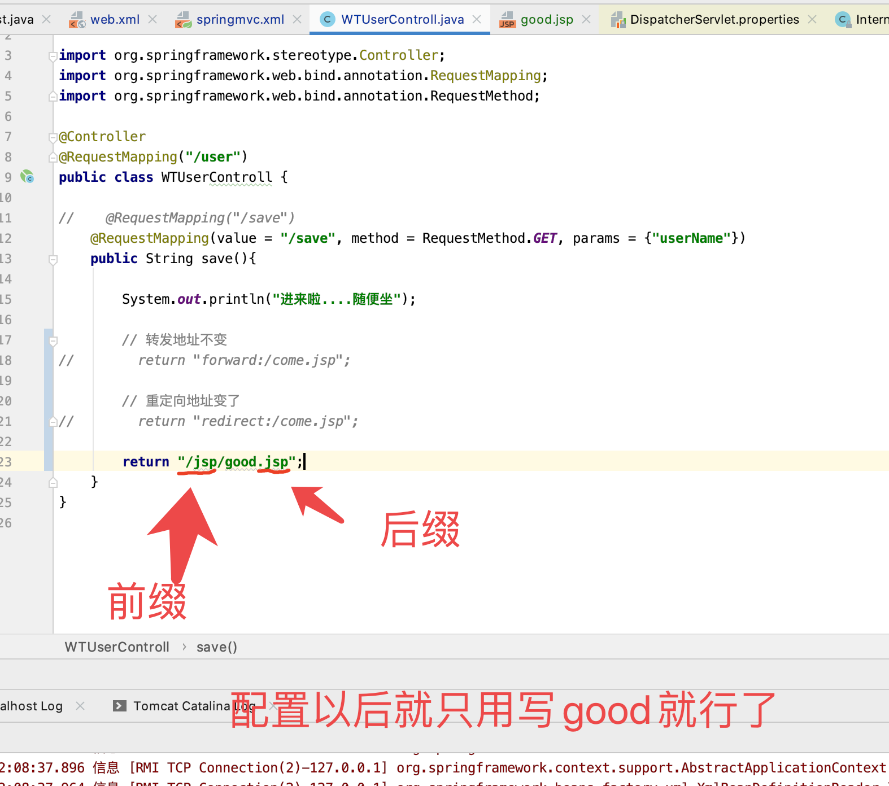
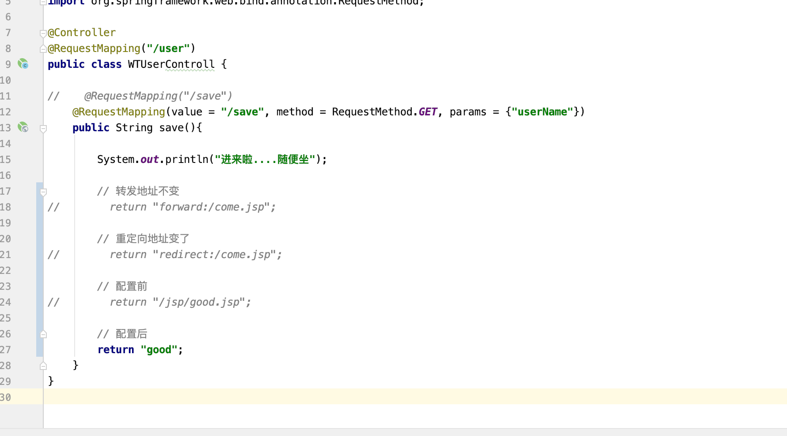

# 目录

1. [1. Spring 与Web环境集成](#spring001)
2. [2. SpringMVC 简介](#spring002)
3. [3. SpringMVC 的组件解析](#spring003)


### spring001
# 1. Spring 与Web环境集成

## 1.1 ApplicationContext获取

- 之前
```java

ApplicationContext app = new ClassPathXmlApplicationContext("applicationContext.xml");
AccountService service = app.getBean(AccountService.class);

```

- 分析
每个地方都这样搞不合适

- 解决方法
**将其存储到最大的域servletContext域**


应用上下文对象是通过`new ClasspathXmlApplicationContext`(spring配置文件) 方式获取的，但是每次从容器中获得`Bean`时都要编写`new ClasspathXmlApplicationContext`(spring配置文件) ，这样的弊端是配置文件加载多次，应用上下文对象创建多次。

在`Web`项目中，可以使用`ServletContextListener`监听Web应用的启动，我们可以在Web应用启动时，就加载`Spring`的配置文件，创建应用上下文对象`ApplicationContext`，在将其存储到最大的域`servletContext`域中，这样就可以在任意位置从域中获得应用上下文`ApplicationContext`对象了。


## 1.2 spring提供获取应用上下文的工具-ContextLoaderListener

**将其存储到最大的域servletContext域**还是low了些, `spring`有`ContextLoaderListener`


上面的分析不用手动实现，`Spring`提供了一个监听器`ContextLoaderListener`就是对上述功能的封装，该监听器内部加载`Spring`配置文件，创建应用上下文对象，并存储到ServletContext域中，提供了一个客户端工具`WebApplicationContextUtils`供使用者获得应用上下文对象。

所以我们需要做的只有两件事：

①在`web.xml`中配置`ContextLoaderListener`监听器（导入`spring-web`**坐标**）

②使用`WebApplicationContextUtils`获得应用上下文对象`ApplicationContext`

## 1.3 导入 spring 集成web的坐标

```xml

<dependency>
    <groupId>org.springframework</groupId>
    <artifactId>spring-web</artifactId>
    <version>5.0.5.RELEASE</version>
</dependency>

<dependency>
    <groupId>javax.servlet</groupId>
    <artifactId>javax.servlet-api</artifactId>
    <version>3.0.1</version>
    <scope>provided</scope>
</dependency>
<dependency>
    <groupId>javax.servlet.jsp</groupId>
    <artifactId>javax.servlet.jsp-api</artifactId>
    <version>2.2.1</version>
    <scope>provided</scope>
</dependency>

```

整体
```xml

<?xml version="1.0" encoding="UTF-8"?>
<project xmlns="http://maven.apache.org/POM/4.0.0"
         xmlns:xsi="http://www.w3.org/2001/XMLSchema-instance"
         xsi:schemaLocation="http://maven.apache.org/POM/4.0.0 http://maven.apache.org/xsd/maven-4.0.0.xsd">
    <modelVersion>4.0.0</modelVersion>

    <groupId>com.domanshow</groupId>
    <artifactId>domanshow_springmvc_demo1</artifactId>
    <version>1.0-SNAPSHOT</version>


    <dependencies>

        <dependency>
            <groupId>org.springframework</groupId>
            <artifactId>spring-web</artifactId>
            <version>5.0.5.RELEASE</version>
        </dependency>

        <dependency>
            <groupId>javax.servlet</groupId>
            <artifactId>javax.servlet-api</artifactId>
            <version>3.0.1</version>
            <scope>provided</scope>
        </dependency>
        <dependency>
            <groupId>javax.servlet.jsp</groupId>
            <artifactId>javax.servlet.jsp-api</artifactId>
            <version>2.2.1</version>
            <scope>provided</scope>
        </dependency>

        <dependency>
            <groupId>org.springframework</groupId>
            <artifactId>spring-context</artifactId>
            <version>5.0.5.RELEASE</version>
        </dependency>

        <dependency>
            <groupId>org.springframework</groupId>
            <artifactId>spring-test</artifactId>
            <version>5.0.5.RELEASE</version>
        </dependency>

        <dependency>
            <groupId>org.springframework</groupId>
            <artifactId>spring-jdbc</artifactId>
            <version>5.0.5.RELEASE</version>
        </dependency>

        <dependency>
            <groupId>org.springframework</groupId>
            <artifactId>spring-tx</artifactId>
            <version>5.0.5.RELEASE</version>
        </dependency>

        <dependency>
            <groupId>org.aspectj</groupId>
            <artifactId>aspectjweaver</artifactId>
            <version>1.8.4</version>
        </dependency>

        <dependency>
            <groupId>junit</groupId>
            <artifactId>junit</artifactId>
            <version>4.12</version>
            <scope>test</scope>
        </dependency>

        <!--        mysql驱动-->
        <dependency>
            <groupId>mysql</groupId>
            <artifactId>mysql-connector-java</artifactId>
            <version>5.1.39</version>
        </dependency>

        <dependency>
            <groupId>c3p0</groupId>
            <artifactId>c3p0</artifactId>
            <version>0.9.1.2</version>
        </dependency>

        <dependency>
            <groupId>com.alibaba</groupId>
            <artifactId>druid</artifactId>
            <version>1.1.10</version>
        </dependency>

    </dependencies>

    <build>

        <plugins>
            <!--jdk编译插件-->
            <plugin>
                <groupId>org.apache.maven.plugins</groupId>
                <artifactId>maven-compiler-plugin</artifactId>
                <configuration>
                    <source>1.8</source>
                    <target>1.8</target>
                    <encoding>utf-8</encoding>
                </configuration>
            </plugin>
            <!--tomcat插件-->
            <plugin>
                <groupId>org.apache.tomcat.maven</groupId>
                <!-- tomcat7的插件， 不同tomcat版本这个也不一样 -->
                <artifactId>tomcat7-maven-plugin</artifactId>
                <version>2.2</version>
                <configuration>
                    <!-- 通过maven tomcat7:run运行项目时，访问项目的端口号 -->
                    <port>80</port>
                    <!-- 项目访问路径  本例：localhost:9090,  如果配置的aa， 则访问路径为localhost:9090/aa-->
                    <path>/travel</path>
                </configuration>
            </plugin>
        </plugins>
    </build>
</project>

```


## 1.4 配置ContextLoaderListener监听器


```xml

<?xml version="1.0" encoding="UTF-8"?>
<web-app xmlns="http://xmlns.jcp.org/xml/ns/javaee"
         xmlns:xsi="http://www.w3.org/2001/XMLSchema-instance"
         xsi:schemaLocation="http://xmlns.jcp.org/xml/ns/javaee http://xmlns.jcp.org/xml/ns/javaee/web-app_4_0.xsd"
         version="4.0">

    
    <listener>
        <listener-class>com.domanshow.listener.MyContextLoaderListener</listener-class>
    </listener>

    <context-param>
        <param-name>contextConfigLocation</param-name>
        <param-value>classpath:applicationContext.xml</param-value>
    </context-param>

</web-app>

```

监听器对象


```java

package com.domanshow.listener;

import org.springframework.context.ApplicationContext;
import org.springframework.context.support.ClassPathXmlApplicationContext;

import javax.servlet.ServletContext;
import javax.servlet.ServletContextEvent;
import javax.servlet.ServletContextListener;
import javax.servlet.annotation.WebListener;

@WebListener
public class MyContextLoaderListener implements ServletContextListener {

    @Override
    public void contextInitialized(ServletContextEvent servletContextEvent) {


//
        ServletContext servletContext = servletContextEvent.getServletContext();
        String contextConfigLocation = servletContext.getInitParameter("contextConfigLocation");

        ApplicationContext context = new ClassPathXmlApplicationContext(contextConfigLocation);
        servletContext.setAttribute("appcontext", context);
        System.out.println("MyContextLoaderListener contextInitialized -执行完毕----okok");
    }

    @Override
    public void contextDestroyed(ServletContextEvent servletContextEvent) {

    }

}

```

## 1.5 通过工具获取上下文


```java

package com.domanshow.web;

import com.domanshow.service.UserService;
import org.springframework.context.ApplicationContext;
import org.springframework.context.support.ClassPathXmlApplicationContext;

import javax.servlet.ServletContext;
import javax.servlet.ServletException;
import javax.servlet.annotation.WebServlet;
import javax.servlet.http.HttpServlet;
import javax.servlet.http.HttpServletRequest;
import javax.servlet.http.HttpServletResponse;
import java.io.IOException;

@WebServlet("/servletUser")
public class ServletUser extends HttpServlet {


    protected void doPost(HttpServletRequest request, HttpServletResponse response) throws ServletException, IOException {

//        ApplicationContext context = new ClassPathXmlApplicationContext("applicationContext.xml");
//        UserService service = context.getBean(UserService.class);
//        service.save();

        ServletContext servletContext = this.getServletContext();
        ApplicationContext context = (ApplicationContext)servletContext.getAttribute("appcontext");
        UserService service = context.getBean(UserService.class);
        service.save();

    }

    protected void doGet(HttpServletRequest request, HttpServletResponse response) throws ServletException, IOException {
        this.doPost(request, response);
    }
}


```


## spring提供的工具


### spring002
# 2. SpringMVC 简介

`SpringMVC` 是一种基于 `Java` 的实现 `MVC` 设计模型的请求驱动类型的`轻量级` `Web 框架`，属于SpringFrameWork 的后续产品，已经融合在 Spring Web Flow 中。

`SpringMVC` 已经成为目前最主流的`MVC`框架之一，并且随着Spring3.0 的发布，全面超越 Struts2，成为最优秀的 MVC 框架。它通过一套注解，让一个简单的 Java 类成为`处理请求`的`控制器`，而无须实现任何接口。同时它还支持 `RESTful` 编程风格的请求。

- SpringMVC 是基于java实现MVC设计模式的轻量级web框架.
- SpringMVC是请求驱动型的
- SpringMVC通过注解就可以让普通java类成为处理请求的控制器.
- SpringMVC支持RESTful编程风格的请求


## 2.1 开发步骤

1. 导入SpringMVC相关坐标
2. 配置SpringMVC核心控制器DispathcerServlet
3. 创建Controller类和视图页面
4. 使用注解配置Controller类中业务方法的映射地址
5. 配置SpringMVC核心文件 `spring-mvc.xml`
6. 客户端发起请求测试



1. 导入坐标


```xml

<dependency>
    <groupId>org.springframework</groupId>
    <artifactId>spring-webmvc</artifactId>
    <version>5.0.5.RELEASE</version>
</dependency>

<dependency>
    <groupId>org.springframework</groupId>
    <artifactId>spring-web</artifactId>
    <version>5.0.5.RELEASE</version>
</dependency>

<dependency>
    <groupId>javax.servlet</groupId>
    <artifactId>javax.servlet-api</artifactId>
    <version>3.0.1</version>
    <scope>provided</scope>
</dependency>
<dependency>
    <groupId>javax.servlet.jsp</groupId>
    <artifactId>javax.servlet.jsp-api</artifactId>
    <version>2.2.1</version>
    <scope>provided</scope>
</dependency>

```


2. 在**web.xml**中配置SpringMVC的核心控制类, 前端控制器

```xml

<servlet>
    <servlet-name>DispatcherServlet</servlet-name>
    <servlet-class>org.springframework.web.servlet.DispatcherServlet</servlet-class>
    <load-on-startup></load-on-startup>
</servlet>
<servlet-mapping>
    <servlet-name>DispatcherServlet</servlet-name>
    <url-pattern>/</url-pattern>
</servlet-mapping>

```


3. 创建Controller类和视图页面



4. 使用注解配置Controller类中业务方法的映射地址


5. 配置SpringMVC核心文件 `spring-mvc.xml`, 配置扫描


### spring003
# 3. SpringMVC 的组件解析


## 3.1 SpringMVC 的执行流程


1. 用户发送请求至前端控制器DispatcherServlet。
2. DispatcherServlet收到请求调用HandlerMapping处理器映射器。
3. 处理器映射器找到具体的处理器(可以根据xml配置、注解进行查找)，生成处理器对象及处理器拦截器(如果有则生成)一并返回给DispatcherServlet。
4. DispatcherServlet调用HandlerAdapter处理器适配器。
5. HandlerAdapter经过适配调用具体的处理器(Controller，也叫后端控制器)。
6. Controller执行完成返回ModelAndView。
7. HandlerAdapter将controller执行结果ModelAndView返回给DispatcherServlet。
8. DispatcherServlet将ModelAndView传给ViewReslover视图解析器。
9. ViewReslover解析后返回具体View。
10. DispatcherServlet根据View进行渲染视图（即将模型数据填充至视图中）。DispatcherServlet响应用户。
fdsfsd


## 3.2 SpringMVC 组件解析

1. 前端控制器: **DispatcherServlet**
 用户请求到达前端控制器，它就相当于 MVC 模式中的 C，DispatcherServlet 是整个流程控制的中心，由
它调用其它组件处理用户的请求，DispatcherServlet 的存在降低了组件之间的耦合性。
 
2. 处理器映射器: **HandlerMapping**
HandlerMapping 负责根据用户请求找到 Handler 即处理器，SpringMVC 提供了不同的映射器实现不同的
映射方式，例如：配置文件方式，实现接口方式，注解方式等。

3. 处理器适配器: **HandlerAdapter** 
通过 HandlerAdapter 对处理器进行执行，这是适配器模式的应用，通过扩展适配器可以对更多类型的处理
器进行执行。

4. 处理器: **Handler** 
它就是我们开发中要编写的具体业务控制器。由 DispatcherServlet 把用户请求转发到 Handler。由
Handler 对具体的用户请求进行处理。

5. 视图解析器: **View Resolver**
View Resolver 负责将处理结果生成 View 视图，View Resolver 首先根据逻辑视图名解析成物理视图名，即具体的页面地址，再生成 View 视图对象，最后对 View 进行渲染将处理结果通过页面展示给用户。

6. 视图: **View**
SpringMVC 框架提供了很多的 View 视图类型的支持，包括：jstlView、freemarkerView、pdfView等。最常用的视图就是 jsp。一般情况下需要通过页面标签或页面模版技术将模型数据通过页面展示给用户，需要由程序员根据业务需求开发具体的页面


## 3.3 SpringMVC 注解解析


@RequestMapping
- `value`: 用于指定请求的URL。它和path属性的作用是一样的
- `method`:用于指定请求的方式
- `params`: 用于指定限制请求参数的条件。它支持简单的表达式。要求请求参数的key和value必须和配置的一模一样

params = {"accountName"}，表示请求参数必须有accountName
params = {"moeny!100"}，表示请求参数中money不能是100


## 3.4 SpringMVC 的xml 配置解析

1. 视图解析器




