# 目录

1. [1. springMVC 的数据响应](#spring001)
2. [2. springMVC 获得请求数据](#spring002)


### spring001
# 1. springMVC 的数据响应


## 1.1 数据响应方式-看看就行

1. 页面跳转

    - 直接返回字符串
    - 通过ModelAndView对象返回


2. 回写数据 
    - 直接返回字符串
    - 返回对象或集合 


## 1.2 页面跳转

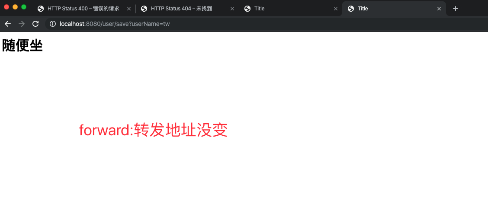
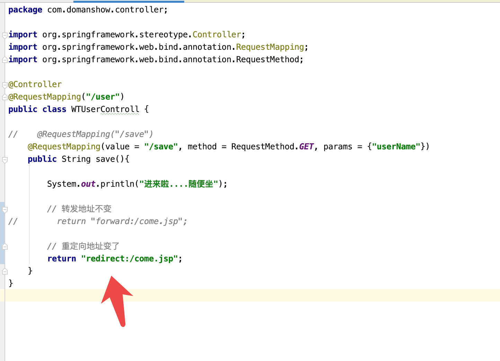
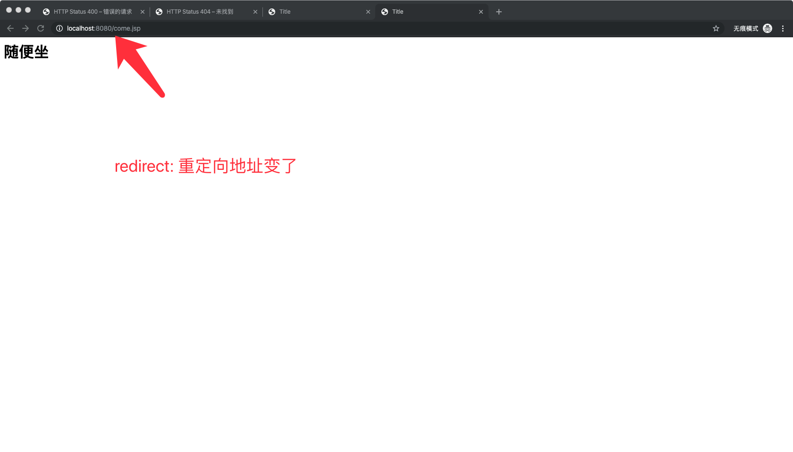
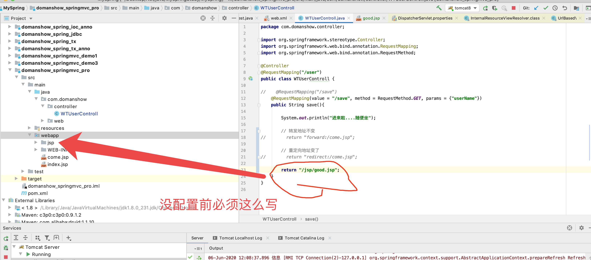
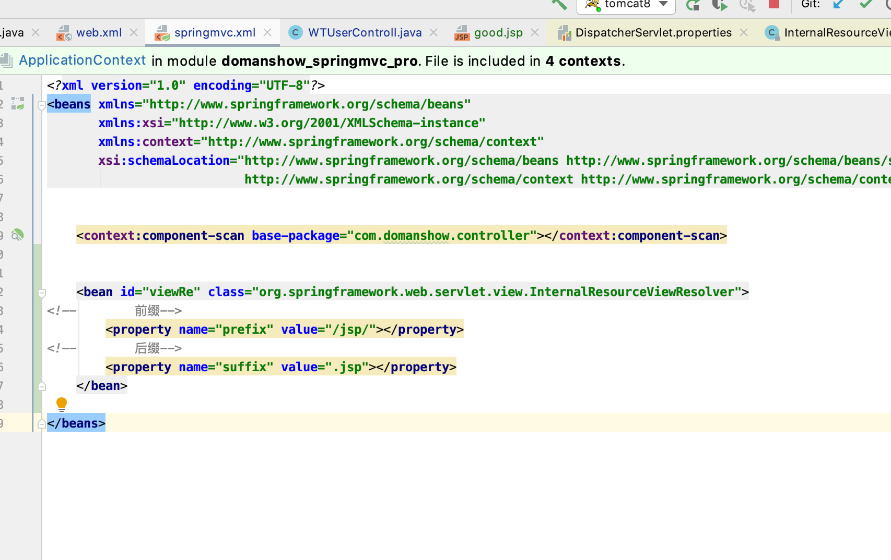
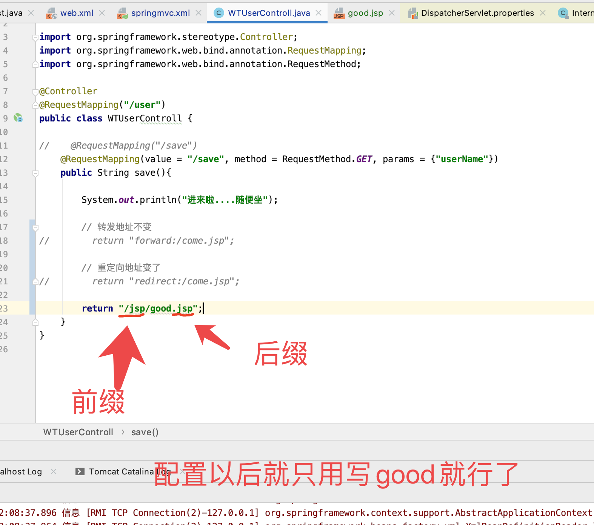
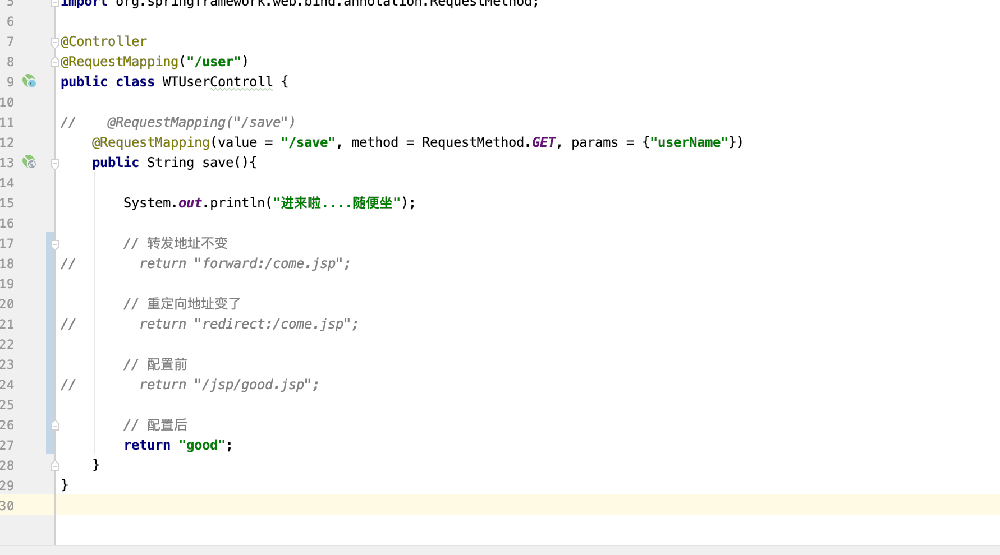


## 1.3 返回 ModelAndView 01


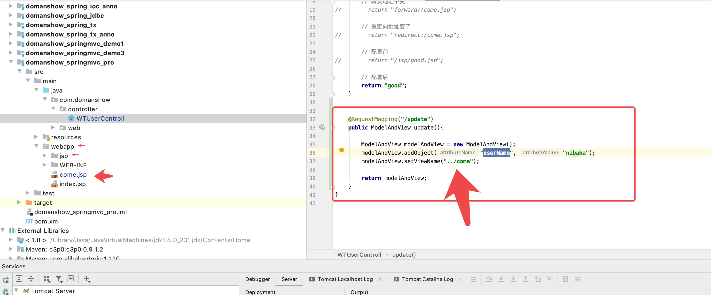
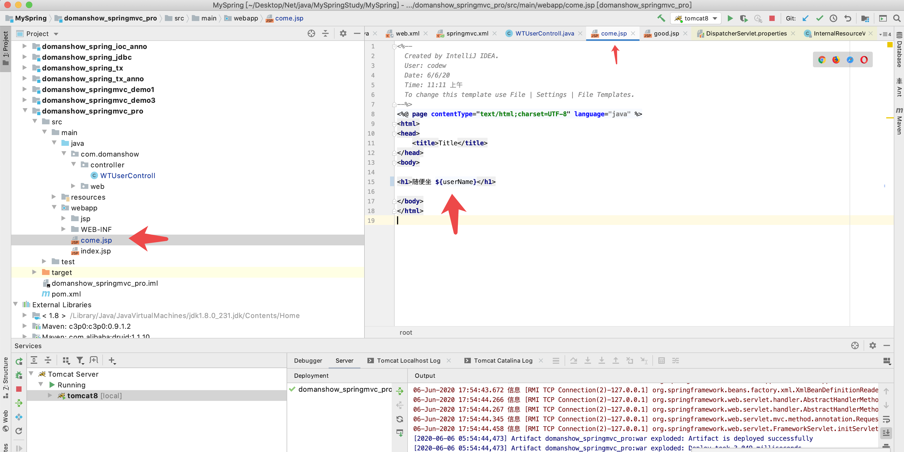
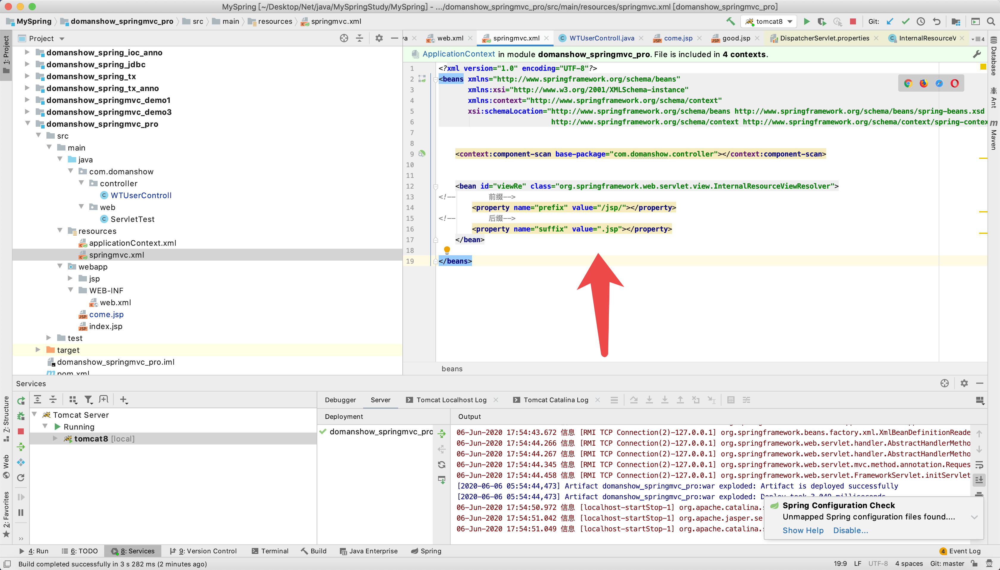


```java

@RequestMapping("/update")
public ModelAndView update(){

    ModelAndView modelAndView = new ModelAndView();
    // 设置模型数据 Model
  modelAndView.addObject("userName", "nibaba");
    // 设置视图名称 view
  modelAndView.setViewName("../come");

    return modelAndView;
}

```

## 1.4 返回 ModelAndView 02

这个是直接在方法形参中声明..

**Model**: `import org.springframework.ui.Model;`

```java

@RequestMapping("/delete")
public String delete(Model model){

    // 设置模型数据 Model
  model.addAttribute("userName", "周杰伦");

    return "../come";
}

```


## 1.5 返回 ModelAndView 03 - 原始HttpServletRequest

```java

@RequestMapping("/put")
public String put(HttpServletRequest request){

    // 设置模型数据 Model
  request.setAttribute("userName", "王力宏");

    return "../come";
}

```


## 1.6 回写数据---直接回写字符串

```java

    @RequestMapping("/post")
    @ResponseBody // 告诉springmvc 框架 不进行视图跳转, 直接响应数据
    public String post(){

        return "gun cu";
    }

    @RequestMapping(value="/quick6")
    public void save6(HttpServletResponse response) throws IOException {
        response.getWriter().print("hello domanshow");
    }


```


## 1.7 回写数据---返回json

```java

// 返回json----
    @RequestMapping("/jsonString")
    @ResponseBody // 告诉springmvc 框架 不进行视图跳转, 直接响应数据
    public String jsonError(){

        return "{\"username\":\"zhangsan\",\"age\":18}";
    }

// 返回json----
    @RequestMapping("/json")
    @ResponseBody // 告诉springmvc 框架 不进行视图跳转, 直接响应数据
    public String json() throws JsonProcessingException {

        User user = new User();

        user.setUserName("lisi");
        user.setAge(28);

        //

        ObjectMapper objectMapper = new ObjectMapper();
        String json = objectMapper.writeValueAsString(user);

        return json;
    }


```

## 1.8 回写数据---返回对象或者集合


通过 `springMVC`帮助我们对 对象 或者集合进行 json 字符串的转换并且回写, 为`处理器 ``适配器` 配置消息转换参数, 指定使用 jackson 进行 对象 或者集合的转换,  因此需要在`springmvc.xml` 中进行配置

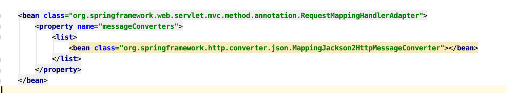

```xml

<bean class="org.springframework.web.servlet.mvc.method.annotation.RequestMappingHandlerAdapter">
    <property name="messageConverters">
        <list>
            <bean class="org.springframework.http.converter.json.MappingJackson2HttpMessageConverter"></bean>
        </list>
    </property>
</bean>

```


```java

    // 自动转换成json了就
    @RequestMapping("/autoJson")
    @ResponseBody // 告诉springmvc 框架 不进行视图跳转, 直接响应数据
    public ArrayList<User> autoJson() throws JsonProcessingException {


        User user = new User();
        user.setUserName("lisi");
        user.setAge(28);

        User user2 = new User();
        user2.setUserName("王五");
        user2.setAge(33);

        ArrayList list = new ArrayList();
        list.add(user);
        list.add(user2);

        return list;
    }

```
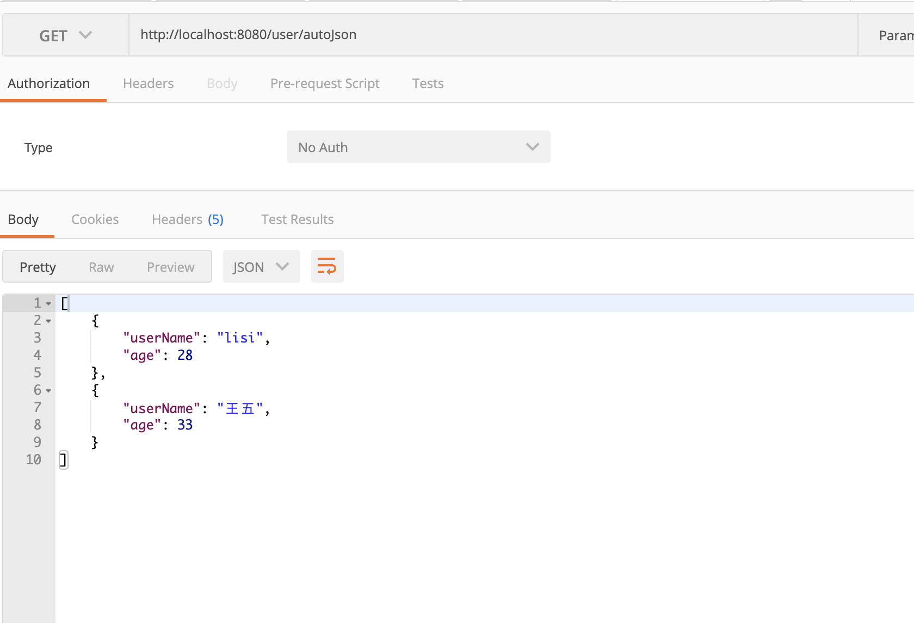


## 1.9 


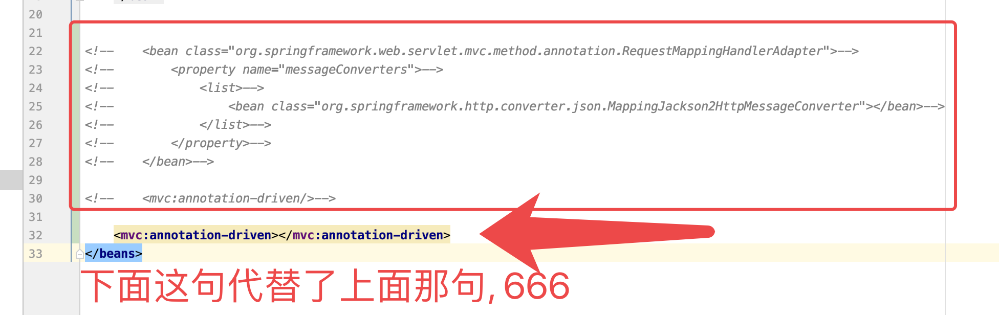


在方法上添加@ResponseBody就可以返回json格式的字符串，但是这样配置比较麻烦，配置的代码比较多，因此，我们可以使用mvc的注解驱动代替上述配置

```xml
<mvc:annotation-driven/>
```

在 SpringMVC 的各个组件中，处理器映射器、处理器适配器、视图解析器称为 SpringMVC 的三大组件。

使用`<mvc:annotation-driven />`自动加载 RequestMappingHandlerMapping（处理映射器）和

RequestMappingHandlerAdapter（ 处 理 适 配 器 ），可用在Spring-xml.xml配置文件中使用

`<mvc:annotation-driven />`替代注解处理器和适配器的配置。

同时使用`<mvc:annotation-driven />`

默认底层就会集成jackson进行对象或集合的json格式字符串的转换


### spring002
# 2. springMVC 获得请求数据


## 2.1 获得请求参数-请求参数类型(理解)

- 客户端请求参数的格式是：name=value&name=value……

- 服务器端要获得请求的参数，有时还需要进行数据的封装，SpringMVC可以接收如下类型的参数

- 基本类型参数

- POJO类型参数

- 数组类型参数

- 集合类型参数


## 1. 基本类型参数

localhost:8080/user/request1?userName=张三&age=10

```java

@RequestMapping("/request1")
@ResponseBody 
public void request1(String userName, int age){

    System.out.println(userName);
    System.out.println(age);
}


```


## 2. 获得请求参数-获得POJO类型参数(应用)

localhost:8080/user/request2?userName=张三&age=10
```java


@RequestMapping("/request2")
@ResponseBody 
public void request2(User user){

    System.out.println(user.getUserName());
    System.out.println(user.getAge());
}

```


## 3. 获得请求参数-获得数组类型参数(应用)

http://localhost:8080/user/request3?strs=事实上&strs=add

```java

    @RequestMapping("/request3")
    @ResponseBody
    public void request3(String[] strs){

        System.out.println(Arrays.asList(strs));
    }

```


## 4. 获得请求参数-获得集合类型参数--表单提交(应用)

```java

@RequestMapping("/request4")
@ResponseBody 
public void request4(MyVO vo){

    System.out.println(vo);

    for (User user : vo.getUserList()) {
        System.out.println(user);
    }

}

```


```html

<html>
<head>
    <title>Title</title>
</head>
<body>


<form action="${pageContext.request.contextPath}/user/request4" method="post">
    <%--表明是第一个User对象的username age--%>
    <input type="text" name="userList[0].userName"><br/>
    <input type="text" name="userList[0].age"><br/>
    <input type="text" name="userList[1].userName"><br/>
    <input type="text" name="userList[1].age"><br/>
    <input type="submit" value="提交">
</form>

</body>
</html>


```

```java

package com.domanshow.domain;

import java.util.List;

public class MyVO {

    private List<User> userList;

    public List<User> getUserList() {
        return userList;
    }

    public void setUserList(List<User> userList) {
        this.userList = userList;
    }

    @Override
    public String toString() {
        return "MyVO{" +
                "userList=" + userList +
                '}';
    }
}

```


## 4. 获得请求参数-获得集合类型参数--ajax请求(应用)

```html

<%--
  Created by IntelliJ IDEA.
  User: codew
  Date: 6/7/20
  Time: 9:24 上午
  To change this template use File | Settings | File Templates.
--%>
<%@ page contentType="text/html;charset=UTF-8" language="java" %>
<html>
<head>
    <title>Title</title>
    <script src="${pageContext.request.contextPath}/js/jquery-3.3.1.js"></script>
    <script>

        var userList = new Array();
        userList.push({userName:"zhangsna", age:10});
        userList.push({userName:"lisi", age:18});

        $.ajax({
            type:"POST",
            url:"${pageContext.request.contextPath}/user/request5",
            data:JSON.stringify(userList),
            contentType:"application/json;charset=utf-8"
        });
    </script>
</head>
<body>

</body>
</html>

```

```java


@RequestMapping("/request5")
    @ResponseBody
    public void request5(@RequestBody List<User> userList){

        System.out.println("进来了");
        System.out.println(userList);
    }

    @RequestMapping("/request6")
    @ResponseBody
    public void request6(@RequestBody User user){

        System.out.println("进来了---okok");
        System.out.println(user);
    }

```


上来就是一个404
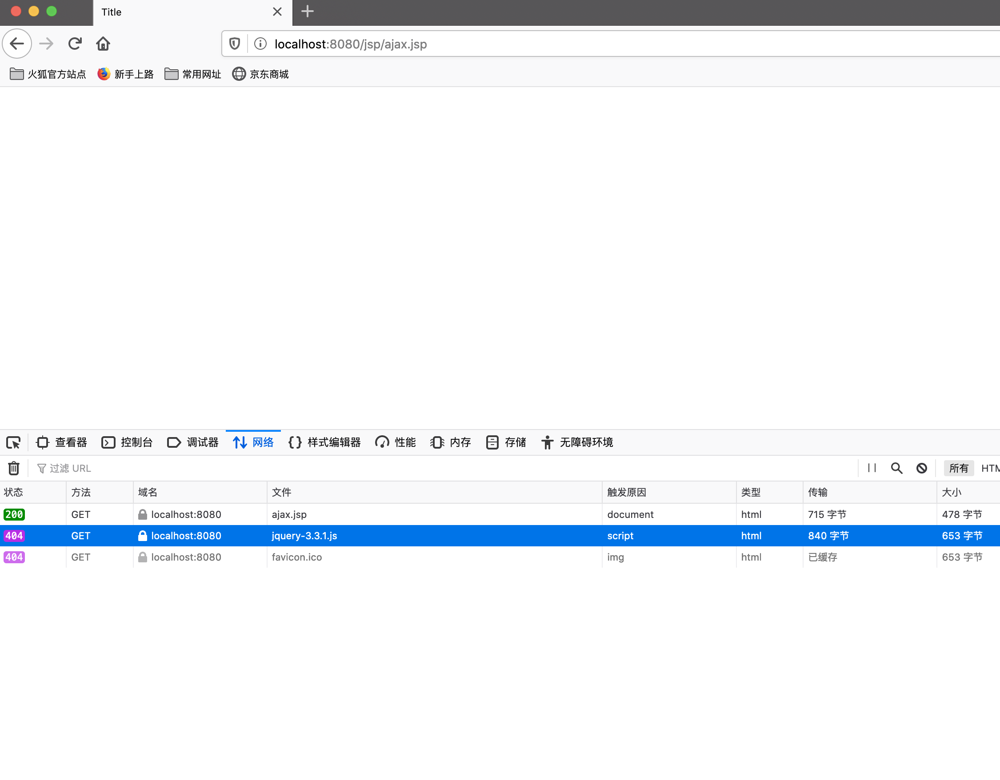
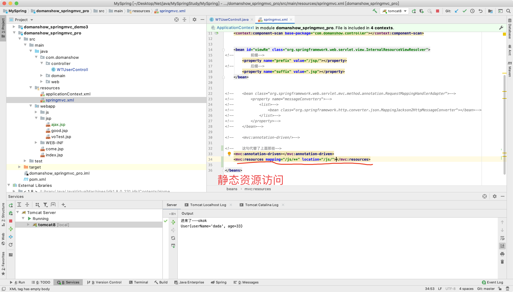


经过测试, 这个接口能应对iOS的网络请求


## 5. 静态资源访问开启


当有静态资源需要加载时，比如`jquery`文件，通过谷歌开发者工具抓包发现，没有加载到jquery文件，原因是`SpringMVC`的前端控制器`DispatcherServlet`的`url-pattern`配置的是`/`,代表对所有的资源都进行过滤操作，我们可以通过以下两种方式指定放行静态资源：


1. 在`spring-mvc.xml`配置文件中指定放行的资源

```xml

<mvc:resources mapping="/js/**" location="/js/"></mvc:resources>

```


2. `spring-mvc.xml`使用这个标签


```xml

<mvc:default-servlet-handler></mvc:default-servlet-handler>

```


## 6. 配置全局乱码过滤器

当post 请求时, 数据会出现乱码, 我们可以设置 一个过滤器, 来进行编码 的过滤

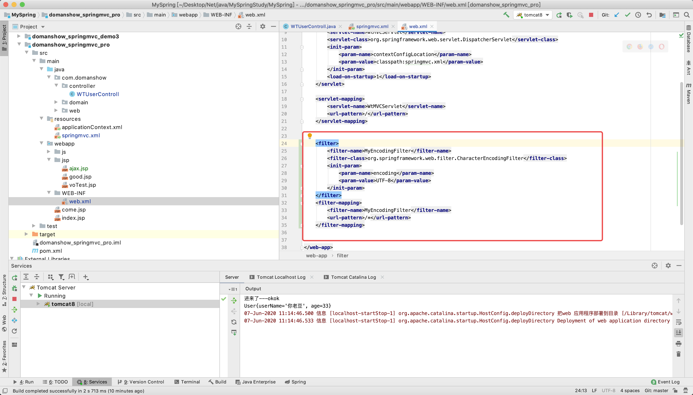
```xml

<filter>
    <filter-name>MyEncodingFilter</filter-name>
    <filter-class>org.springframework.web.filter.CharacterEncodingFilter</filter-class>
    <init-param>
        <param-name>encoding</param-name>
        <param-value>UTF-8</param-value>
    </init-param>
</filter>
<filter-mapping>
    <filter-name>MyEncodingFilter</filter-name>
    <url-pattern>/*</url-pattern>
</filter-mapping>


```


## 7. 获得请求参数-参数绑定注解@RequestParam(应用)

当请求的参数名称与`Controller` 的业务方法参数名称不一致是, 就需要通过`@RequestParam`注解显示的绑定


- value: 与请求参数名称
- required: 此在指定的请求参数是否必须包括，默认是true，提交时如果没有此参数则报错
- defaultValue: 默认值**它设置了值的话 required无效, 意思是传不传都不报错**

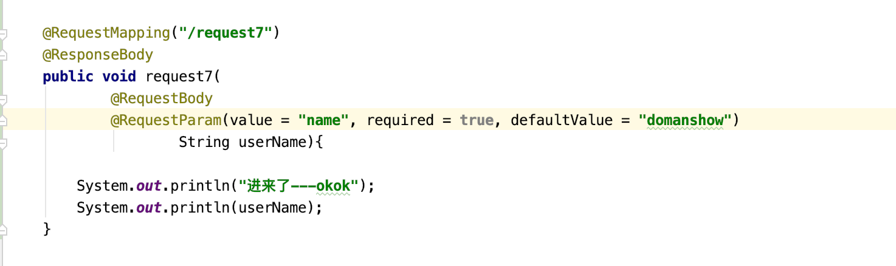
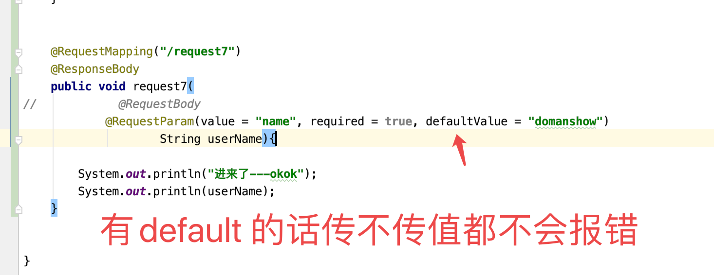

```java

    @RequestMapping("/request7")
    @ResponseBody
    public void request7(
            @RequestBody
            @RequestParam(value = "name", required = true, defaultValue = "domanshow")
                    String userName){

        System.out.println("进来了---okok");
        System.out.println(userName);
    }

```


```html

<%--
  Created by IntelliJ IDEA.
  User: codew
  Date: 6/7/20
  Time: 11:30 上午
  To change this template use File | Settings | File Templates.
--%>
<%@ page contentType="text/html;charset=UTF-8" language="java" %>
<html>
<head>
    <title>Title</title>
</head>
<body>

<form action="/user/request7" method="post">
    <input type="text" name="name"><br>
    <input type="submit" value="提交"><br>
</form>

</body>
</html>

```


## 8. Restful风格的参数的获取(应用)

`Restful` 是一种`软件架构风格`, `设计风格`, 它不是标准. 只是提供了一组设计原则和约束条件. 主要用于客户端和服务器交互类软件, 基于这个风格设计的软件可以更简洁，更有层次，更易于实现缓存机制等。


`Restful`风格的请求是使用`“url+请求方式”`表示一次请求目的的，HTTP 协议里面四个表示操作方式的动词如下：


- GET：用于获取资源

- POST：用于新建资源

- PUT：用于更新资源

- DELETE：用于删除资源  


- `/user/1`    `GET` ：       **得到 id = 1 的 user**

- `/user/1`   `DELETE`：  **删除 id = 1 的 user**

- `/user/1`    `PUT`：       **更新 id = 1 的 user**

- `/user`       `POST`：      **新增 user**


上述url地址`/user/1`中的`1`就是要获得的`请求参数`，在`SpringMVC`中可以使用`占位符`进行`参数绑定`。地址`/user/1`可以写成`/user/{id}`，`占位符{id}`对应的就是1的值。在业务方法中我们可以使用`@PathVariable`注解进行占位符的匹配获取工作。


http://localhost:8080/user/request8/dasdas

这个请求就是把参数拼接到最后, 就好像上面`dasdas`

**参数不是放在请求体里**

```java

@RequestMapping(value = "/request8/{name}")
@ResponseBody 
public void request8(@PathVariable(value = "name") String name){

    System.out.println("Restful 进来了---okok");
    System.out.println(name);
}

```


## 9. 获得请求参数-自定义类型转换器(应用)

org.springframework.core.convert.converter.Converter;

自定义类型转换器的开发步骤：
1. 定义转换器类实现Converter接口
2. 在配置文件中声明转换器
3. 在<annotation-driven>中引用转换器

1. 定义转换器类实现Converter接口
```java

package com.domanshow.converter;

import org.springframework.core.convert.converter.Converter;

import java.text.ParseException;
import java.text.SimpleDateFormat;
import java.util.Date;

public class MyDateConverter implements Converter<String, Date> {


    @Override
    public Date convert(String dateStr) {

        SimpleDateFormat format = new SimpleDateFormat("yyyy-MM-dd");

        Date date = null;

        try {
            date = format.parse(dateStr);
        } catch (ParseException e) {
            e.printStackTrace();
        }

        return date;

    }
}

```


2. springmvc.xml 在配置文件中声明转换器

```xml

<!--    转换器工厂-->
    <bean id="conversionServiceFactoryBean" class="org.springframework.context.support.ConversionServiceFactoryBean">

        <property name="converters">
            <list>
                <bean class="com.domanshow.converter.MyDateConverter"></bean>
            </list>
        </property>
    </bean>

```


3. springmvc.xml 在<annotation-driven>中引用转换器

```xml


<mvc:annotation-driven conversion-service="WTConversionService"></mvc:annotation-driven>

```


4. 接口

```java

    @RequestMapping(value = "/request8")
    @ResponseBody
    public void request9(Date date){

        System.out.println("转换器 进来了---okok");
        System.out.println(date);
    }

```


5. 请求
http://localhost:8080/user/request8?date=2020-06-07

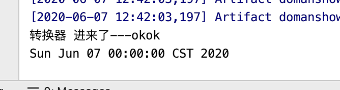


## 10. -获得请求参数-获得Servlet相关API(应用)

SpringMVC 支持使用 原始ServletAPI对象, 作为控制器方法的参数进行注入

```java

    @RequestMapping(value = "/request10")
    @ResponseBody
    public void request10(HttpServletRequest request, HttpServletResponse response, HttpSession session){

        System.out.println(request);
        System.out.println(response);
        System.out.println(session);
    }

```


## 11. 获得请求参数-获得请求头信息(应用)


使用`@RequestHeader`可以获得请求头信息，相当于web阶段学习的`request.getHeader(name)`

`@RequestHeader`注解的属性如下：

- `value`：请求头的名称

- `required`：是否必须携带此请求头

```java

    @RequestMapping(value = "/request11")
    @ResponseBody //
    public void request11(@RequestHeader(value = "chifan", required = false) String userA,
                          @RequestHeader(value = "ha",required = false) String afa,
                          int age){

        System.out.println(userA);
        System.out.println(afa);
        System.out.println(age);

    }

```

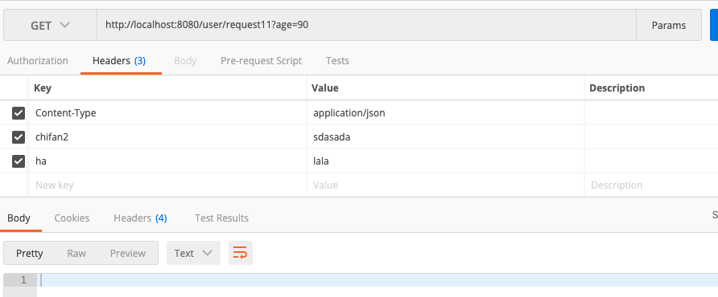


## 12. 获得请求参数-获得Cookie信息(应用)


@CookieValue注解的属性如下：

- value：指定cookie的名称

- required：是否必须携带此cookie

```java

    @RequestMapping(value = "/request12")
    @ResponseBody
    public void request12(@CookieValue(value = "JSESSIONID") String idStr){

        System.out.println(idStr);
    }

```
