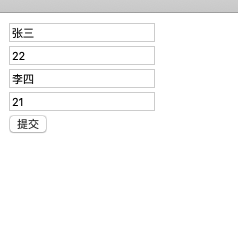

# 目录

1. [1. springMVC 的数据响应](#spring001)
2. [2. springMVC 获得请求数据](#spring002)


### spring001
# 1. springMVC 的数据响应


## 1.1 数据响应方式-看看就行

1. 页面跳转

    - 直接返回字符串
    - 通过ModelAndView对象返回


2. 回写数据 
    - 直接返回字符串
    - 返回对象或集合 


## 1.2 页面跳转


## 1.3 返回 ModelAndView 01


```java

@RequestMapping("/update")
public ModelAndView update(){

    ModelAndView modelAndView = new ModelAndView();
    // 设置模型数据 Model
  modelAndView.addObject("userName", "nibaba");
    // 设置视图名称 view
  modelAndView.setViewName("../come");

    return modelAndView;
}

```

## 1.4 返回 ModelAndView 02

这个是直接在方法形参中声明..

**Model**: `import org.springframework.ui.Model;`

```java

@RequestMapping("/delete")
public String delete(Model model){

    // 设置模型数据 Model
  model.addAttribute("userName", "周杰伦");

    return "../come";
}

```


## 1.5 返回 ModelAndView 03 - 原始HttpServletRequest

```java

@RequestMapping("/put")
public String put(HttpServletRequest request){

    // 设置模型数据 Model
  request.setAttribute("userName", "王力宏");

    return "../come";
}

```


## 1.6 回写数据---直接回写字符串

```java

    @RequestMapping("/post")
    @ResponseBody // 告诉springmvc 框架 不进行视图跳转, 直接响应数据
    public String post(){

        return "gun cu";
    }

    @RequestMapping(value="/quick6")
    public void save6(HttpServletResponse response) throws IOException {
        response.getWriter().print("hello domanshow");
    }


```


## 1.7 回写数据---返回json

```java

// 返回json----
    @RequestMapping("/jsonString")
    @ResponseBody // 告诉springmvc 框架 不进行视图跳转, 直接响应数据
    public String jsonError(){

        return "{\"username\":\"zhangsan\",\"age\":18}";
    }

// 返回json----
    @RequestMapping("/json")
    @ResponseBody // 告诉springmvc 框架 不进行视图跳转, 直接响应数据
    public String json() throws JsonProcessingException {

        User user = new User();

        user.setUserName("lisi");
        user.setAge(28);

        //

        ObjectMapper objectMapper = new ObjectMapper();
        String json = objectMapper.writeValueAsString(user);

        return json;
    }


```

## 1.8 回写数据---返回对象或者集合


通过 `springMVC`帮助我们对 对象 或者集合进行 json 字符串的转换并且回写, 为`处理器 ``适配器` 配置消息转换参数, 指定使用 jackson 进行 对象 或者集合的转换,  因此需要在`springmvc.xml` 中进行配置


```xml

<bean class="org.springframework.web.servlet.mvc.method.annotation.RequestMappingHandlerAdapter">
    <property name="messageConverters">
        <list>
            <bean class="org.springframework.http.converter.json.MappingJackson2HttpMessageConverter"></bean>
        </list>
    </property>
</bean>

```


```java

    // 自动转换成json了就
    @RequestMapping("/autoJson")
    @ResponseBody // 告诉springmvc 框架 不进行视图跳转, 直接响应数据
    public ArrayList<User> autoJson() throws JsonProcessingException {


        User user = new User();
        user.setUserName("lisi");
        user.setAge(28);

        User user2 = new User();
        user2.setUserName("王五");
        user2.setAge(33);

        ArrayList list = new ArrayList();
        list.add(user);
        list.add(user2);

        return list;
    }

```


## 1.9 


在方法上添加@ResponseBody就可以返回json格式的字符串，但是这样配置比较麻烦，配置的代码比较多，因此，我们可以使用mvc的注解驱动代替上述配置

```xml
<mvc:annotation-driven/>
```

在 SpringMVC 的各个组件中，处理器映射器、处理器适配器、视图解析器称为 SpringMVC 的三大组件。

使用`<mvc:annotation-driven />`自动加载 RequestMappingHandlerMapping（处理映射器）和

RequestMappingHandlerAdapter（ 处 理 适 配 器 ），可用在Spring-xml.xml配置文件中使用

`<mvc:annotation-driven />`替代注解处理器和适配器的配置。

同时使用`<mvc:annotation-driven />`

默认底层就会集成jackson进行对象或集合的json格式字符串的转换


### spring002
# 2. springMVC 获得请求数据


## 2.1 获得请求参数-请求参数类型(理解)

- 客户端请求参数的格式是：name=value&name=value……

- 服务器端要获得请求的参数，有时还需要进行数据的封装，SpringMVC可以接收如下类型的参数

- 基本类型参数

- POJO类型参数

- 数组类型参数

- 集合类型参数


## 1. 基本类型参数

localhost:8080/user/request1?userName=张三&age=10

```java

@RequestMapping("/request1")
@ResponseBody 
public void request1(String userName, int age){

    System.out.println(userName);
    System.out.println(age);
}


```


## 2. 获得请求参数-获得POJO类型参数(应用)

localhost:8080/user/request2?userName=张三&age=10
```java


@RequestMapping("/request2")
@ResponseBody 
public void request2(User user){

    System.out.println(user.getUserName());
    System.out.println(user.getAge());
}

```


## 3. 获得请求参数-获得数组类型参数(应用)

http://localhost:8080/user/request3?strs=事实上&strs=add

```java

    @RequestMapping("/request3")
    @ResponseBody
    public void request3(String[] strs){

        System.out.println(Arrays.asList(strs));
    }

```


## 4. 获得请求参数-获得集合类型参数1(应用)

```java

@RequestMapping("/request4")
@ResponseBody 
public void request4(MyVO vo){

    System.out.println(vo);

    for (User user : vo.getUserList()) {
        System.out.println(user);
    }

}

```



```html

<html>
<head>
    <title>Title</title>
</head>
<body>


<form action="${pageContext.request.contextPath}/user/request4" method="post">
    <%--表明是第一个User对象的username age--%>
    <input type="text" name="userList[0].userName"><br/>
    <input type="text" name="userList[0].age"><br/>
    <input type="text" name="userList[1].userName"><br/>
    <input type="text" name="userList[1].age"><br/>
    <input type="submit" value="提交">
</form>

</body>
</html>


```

```java

package com.domanshow.domain;

import java.util.List;

public class MyVO {

    private List<User> userList;

    public List<User> getUserList() {
        return userList;
    }

    public void setUserList(List<User> userList) {
        this.userList = userList;
    }

    @Override
    public String toString() {
        return "MyVO{" +
                "userList=" + userList +
                '}';
    }
}

```
