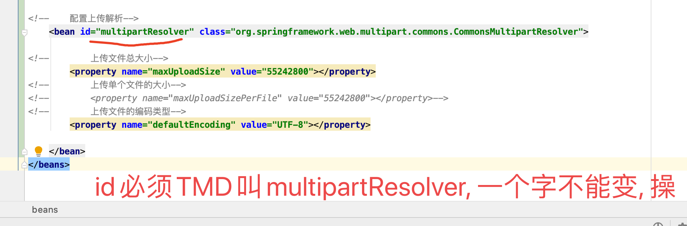
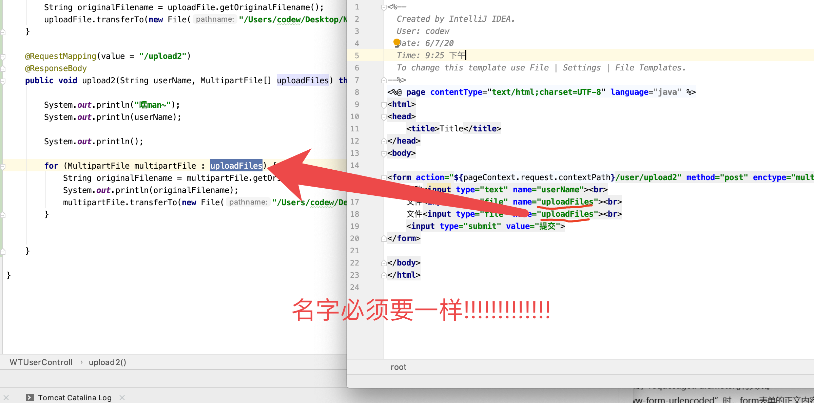
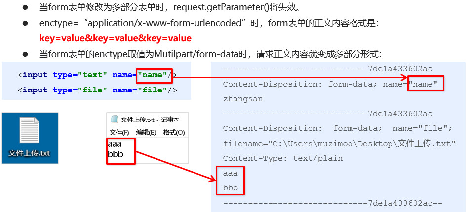

# 目录

1. [文件上传](#spring001)
2. [拦截器](#spring002)
3. [异常处理](#spring003)


## spring001
# 1. 文件上传


## 1.2 单文件上传步骤

1. 导入fileupload和IO坐标
2. 配置文件上传解析
3. 编写文件上传编码


1. 导入坐标
```xml


<dependency>
    <groupId>commons-fileupload</groupId>
    <artifactId>commons-fileupload</artifactId>
    <version>1.2.2</version>
</dependency>

<dependency>
    <groupId>commons-io</groupId>
    <artifactId>commons-io</artifactId>
    <version>2.4</version>
</dependency>

```

2. 配置解析springmvc.xml

```xml

<!--    配置上传解析 id 必须叫 "multipartResolver"-->
    <bean id="multipartResolver" class="org.springframework.web.multipart.commons.CommonsMultipartResolver">

<!--        上传文件总大小-->
        <property name="maxUploadSize" value="55242800"></property>
<!--        上传单个文件的大小-->
<!--        <property name="maxUploadSizePerFile" value="55242800"></property>-->
<!--        上传文件的编码类型-->
        <property name="defaultEncoding" value="UTF-8"></property>

    </bean>
    
```


3. 编写文件上传编码

服务器
```java
@RequestMapping(value = "/upload1")
@ResponseBody 
public void upload1(String userName, MultipartFile uploadFile) throws IOException {

    System.out.println("嘿man~");
    System.out.println(userName);

    System.out.println();

    String originalFilename = uploadFile.getOriginalFilename();
    uploadFile.transferTo(new File("/Users/codew/Desktop/Net/java/upload/" + originalFilename));
}

```

客户端

```html

<%--
  Created by IntelliJ IDEA.
  User: codew
  Date: 6/7/20
  Time: 9:25 下午
  To change this template use File | Settings | File Templates.
--%>
<%@ page contentType="text/html;charset=UTF-8" language="java" %>
<html>
<head>
    <title>Title</title>
</head>
<body>

<form action="${pageContext.request.contextPath}/user/upload1" method="post" enctype="multipart/form-data">
    名称<input type="text" name="userName"><br>
    文件<input type="file" name="uploadFile"><br>
    <input type="submit" value="提交">
</form>

</body>
</html>

```


## 1.2 多文件上传


1. 同~
2. 同~
3. 写代码

客户端

```html

<%--
  Created by IntelliJ IDEA.
  User: codew
  Date: 6/7/20
  Time: 9:25 下午
  To change this template use File | Settings | File Templates.
--%>
<%@ page contentType="text/html;charset=UTF-8" language="java" %>
<html>
<head>
    <title>Title</title>
</head>
<body>

<form action="${pageContext.request.contextPath}/user/upload2" method="post" enctype="multipart/form-data">
    名称<input type="text" name="userName"><br>
    文件<input type="file" name="uploadFiles"><br>
    文件<input type="file" name="uploadFiles"><br>
    <input type="submit" value="提交">
</form>

</body>
</html>

```


服务端

```java

    @RequestMapping(value = "/upload2")
    @ResponseBody
    public void upload2(String userName, MultipartFile[] uploadFiles) throws IOException {

        System.out.println("嘿man~");
        System.out.println(userName);

        System.out.println();

        for (MultipartFile multipartFile : uploadFiles) {
            String originalFilename = multipartFile.getOriginalFilename();
            System.out.println(originalFilename);
            multipartFile.transferTo(new File("/Users/codew/Desktop/Net/java/upload/" + originalFilename));
        }


    }

```


## 1.3 原理



## spring002
# 2. 拦截器


## spring003
# 3. 异常处理