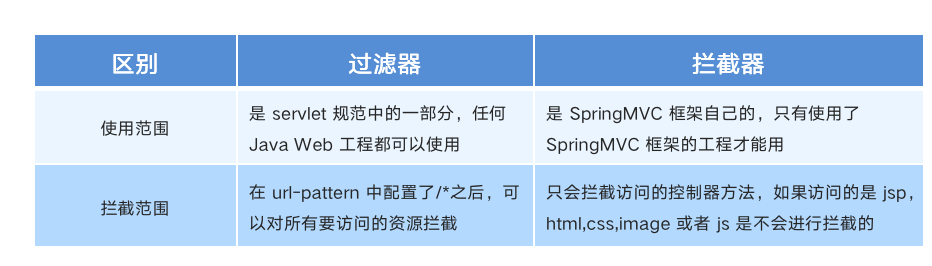
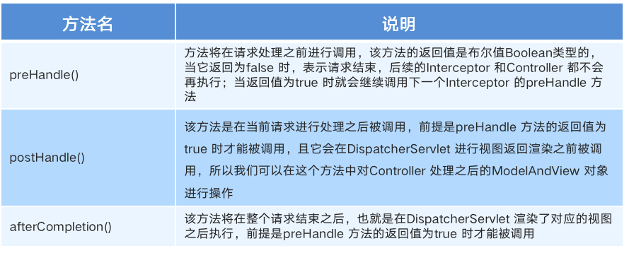
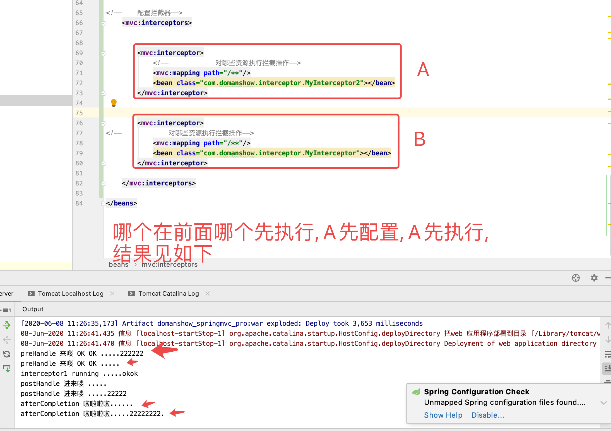
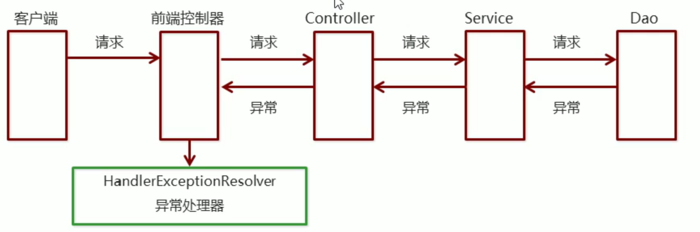
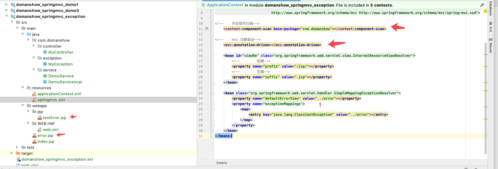
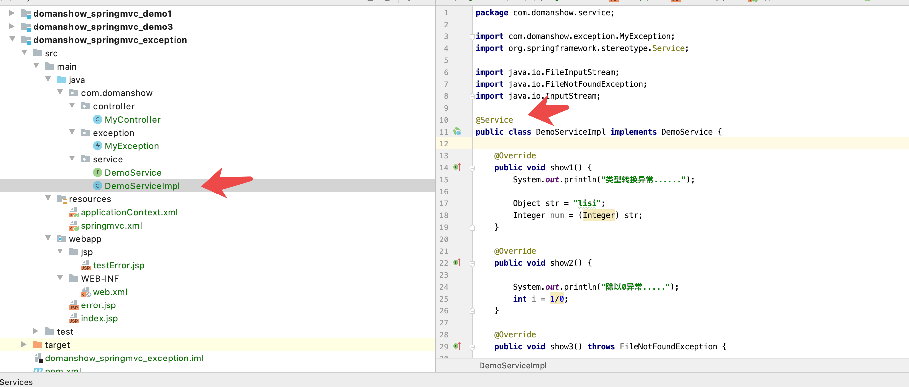
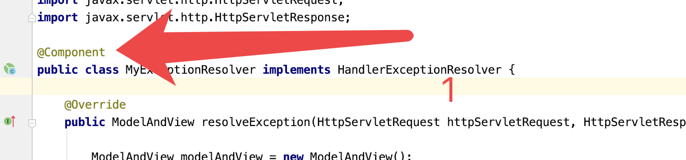

# 目录

1. [ 拦截器](#spring001)
2. [异常处理](#spring002)


## spring001
# 1. 拦截器


## 1.1 拦截器 (interceptor) 的作用

`SpringMVC`的`拦截器` 类似 过滤器 `Filter`, 用于对`处理器`进行`预处理`和`后处理`

将拦截器按一定的顺序连接成一条链, 这条链称为`拦截器链（Interceptor Chain）`. 在访问被拦截的方法或字段时, 拦截器链中的拦截器就会按其之前定义的顺序被调用. 拦截器也是AOP思想的具体实现.

## 1.2 拦截器和过滤器的区别




## 1.3 拦截器快速入门

1. 创建拦截器实现`HandlerInterceptor`接口
2. 配置拦截器
3. 测试

1. 创建拦截对象

```java

package com.domanshow.interceptor;

import org.springframework.lang.Nullable;
import org.springframework.web.servlet.HandlerInterceptor;
import org.springframework.web.servlet.ModelAndView;

import javax.servlet.http.HttpServletRequest;
import javax.servlet.http.HttpServletResponse;

public class MyInterceptor implements HandlerInterceptor {


    public boolean preHandle(HttpServletRequest request, HttpServletResponse response, Object handler) throws Exception {

        System.out.println("preHandle 来喽 OK OK .....");

        return true;
    }

    public void postHandle(HttpServletRequest request, HttpServletResponse response, Object handler, @Nullable ModelAndView modelAndView) throws Exception {

        System.out.println("postHandle 进来喽 .....");
    }

    public void afterCompletion(HttpServletRequest request, HttpServletResponse response, Object handler, @Nullable Exception ex) throws Exception {

        System.out.println("afterCompletion 啦啦啦啦......");
    }
}

```

2. 配置拦截器
```xml

<!--    配置拦截器-->
    <mvc:interceptors>
        
        <mvc:interceptor>
<!--            对哪些资源执行拦截操作-->
            <mvc:mapping path="/**"/>
            <bean class="com.domanshow.interceptor.MyInterceptor"></bean>
        </mvc:interceptor>
        
    </mvc:interceptors>
    

```


3. 测试

```xml

preHandle 来喽 OK OK .....
interceptor1 running .....okok
postHandle 进来喽 .....
afterCompletion 啦啦啦啦......

```


## 1.4 拦截器方法说明




## 1.5 拦截器详解

拦截器在预处理后什么情况下会执行目标资源, 什么情况不执行...以及有多个拦截器他们的执行顺序是什么样的.


```xml

<!--    配置拦截器-->
    <mvc:interceptors>


        <mvc:interceptor>
            <!--            对哪些资源执行拦截操作-->
            <mvc:mapping path="/**"/>
            <bean class="com.domanshow.interceptor.MyInterceptor2"></bean>
        </mvc:interceptor>

        
        <mvc:interceptor>
<!--            对哪些资源执行拦截操作-->
            <mvc:mapping path="/**"/>
            <bean class="com.domanshow.interceptor.MyInterceptor"></bean>
        </mvc:interceptor>

    </mvc:interceptors>

```


```java

package com.domanshow.interceptor;

import org.springframework.lang.Nullable;
import org.springframework.web.servlet.HandlerInterceptor;
import org.springframework.web.servlet.ModelAndView;

import javax.servlet.http.HttpServletRequest;
import javax.servlet.http.HttpServletResponse;

public class MyInterceptor2 implements HandlerInterceptor {


    public boolean preHandle(HttpServletRequest request, HttpServletResponse response, Object handler) throws Exception {

        System.out.println("preHandle 来喽 OK OK .....222222");

        return true;
    }

    public void postHandle(HttpServletRequest request, HttpServletResponse response, Object handler, @Nullable ModelAndView modelAndView) throws Exception {

        System.out.println("postHandle 进来喽 .....22222");
    }

    public void afterCompletion(HttpServletRequest request, HttpServletResponse response, Object handler, @Nullable Exception ex) throws Exception {

        System.out.println("afterCompletion 啦啦啦啦.....22222222.");
    }
}

```




结论:

- 当拦截器的`preHandle`方法返回`true`则会执行目标资源，如果返回`false`则不执行目标资源
- 多个拦截器情况下，配置在前的先执行，配置在后的后执行
- 拦截器中的方法执行顺序是：`preHandler`-------`目标资源`----`postHandle`---- `afterCompletion`


## spring002
# 2. 异常处理


## 2.1 异常处理的思路

系统中异常包括两类：**预期异常**和**运行时异常RuntimeException**，前者通过**捕获异常**从而获取异常信息，后者主要通过**规范代码开发**、**测试**等手段减少运行时异常的发生。

系统的`Dao`、`Service`、`Controller`出现都通过`throws Exception`向上抛出，最后由`SpringMVC前端控制器`交由异常处理器进行异常处理，如下图：



## 2.2 异常处理两种方式

1. 使用Spring MVC提供的简单异常处理器`SimpleMappingExceptionResolver`

2. 实现Spring的异常处理**接口**`HandlerExceptionResolver` **自定义**自己的异常处理器

## 2.3 简单异常处理器SimpleMappingExceptionResolver

SpringMVC已经定义好了该类型转换器, 在使用是可以根据项目情况进行配置

1. 在`SpringMVC.xml`中进行配置


2. 写service


3. 写 Controller

```java

package com.domanshow.controller;

import com.domanshow.service.DemoService;
import org.springframework.beans.factory.annotation.Autowired;
import org.springframework.stereotype.Controller;
import org.springframework.web.bind.annotation.RequestMapping;
import org.springframework.web.bind.annotation.ResponseBody;

@Controller
public class MyController {


    @Autowired
    private DemoService demoService;

    @RequestMapping("/test1")
    @ResponseBody
    public void test1(){

        System.out.println("hello MyController test1");

        demoService.show1();

    }
}

```


## 2.4 自定义异常处理器 HandlerExceptionResolver

1. 创建异常类,然后实现HandlerExceptionResolver
2. 配置异常处理器
3. 编写异常页面
4. 测试


1. 创建类
```java

package com.domanshow.resolver;

import com.domanshow.exception.MyException;
import org.springframework.web.servlet.HandlerExceptionResolver;
import org.springframework.web.servlet.ModelAndView;

import javax.servlet.http.HttpServletRequest;
import javax.servlet.http.HttpServletResponse;

public class MyExceptionResolver implements HandlerExceptionResolver {

    @Override
    public ModelAndView resolveException(HttpServletRequest httpServletRequest, HttpServletResponse httpServletResponse, Object o, Exception e) {

        ModelAndView modelAndView = new ModelAndView();
        if (e instanceof MyException){

            modelAndView.addObject("info", "自定义异常");
        }else if (e instanceof ClassCastException){

            modelAndView.addObject("info", "类转换异常异常");
        }


        modelAndView.setViewName("objError");


        return modelAndView;
    }
}

```


2. 配置异常处理器, 也就是将对象交给spring, 两种都可以

springmvc.xml

```xml

<!--    实现接口 的异常处理器-->
  <bean id="exceptionResolver" class="com.domanshow.resolver.MyExceptionResolver"></bean>

```




3. 编写测试页

```html

<%@ page contentType="text/html;charset=UTF-8" language="java" %>
<html>
<head>
    <title>Title</title>
</head>
<body>

<h1>吃了没你 ${info}</h1>

</body>
</html>

```


