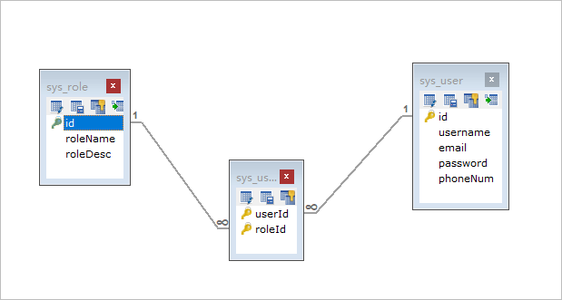
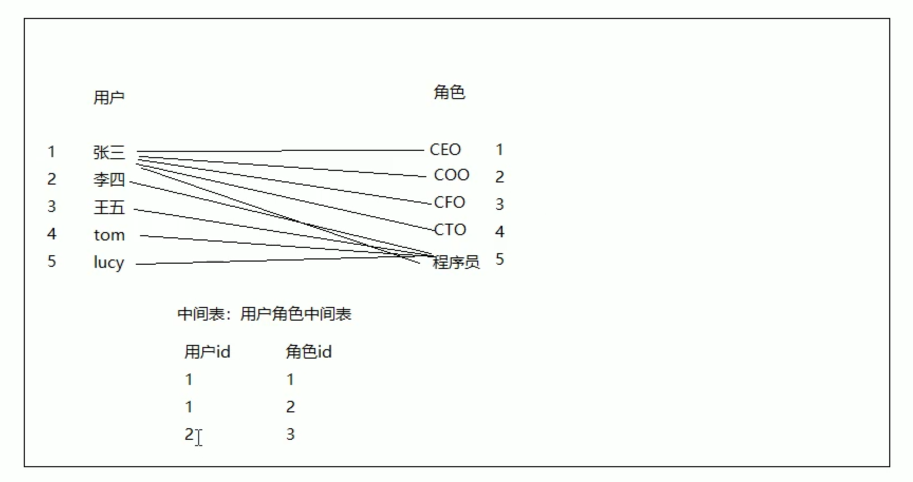
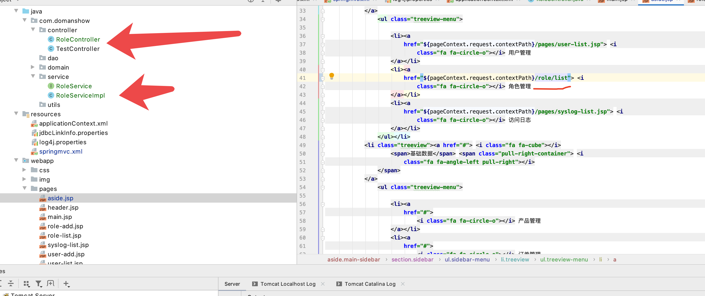
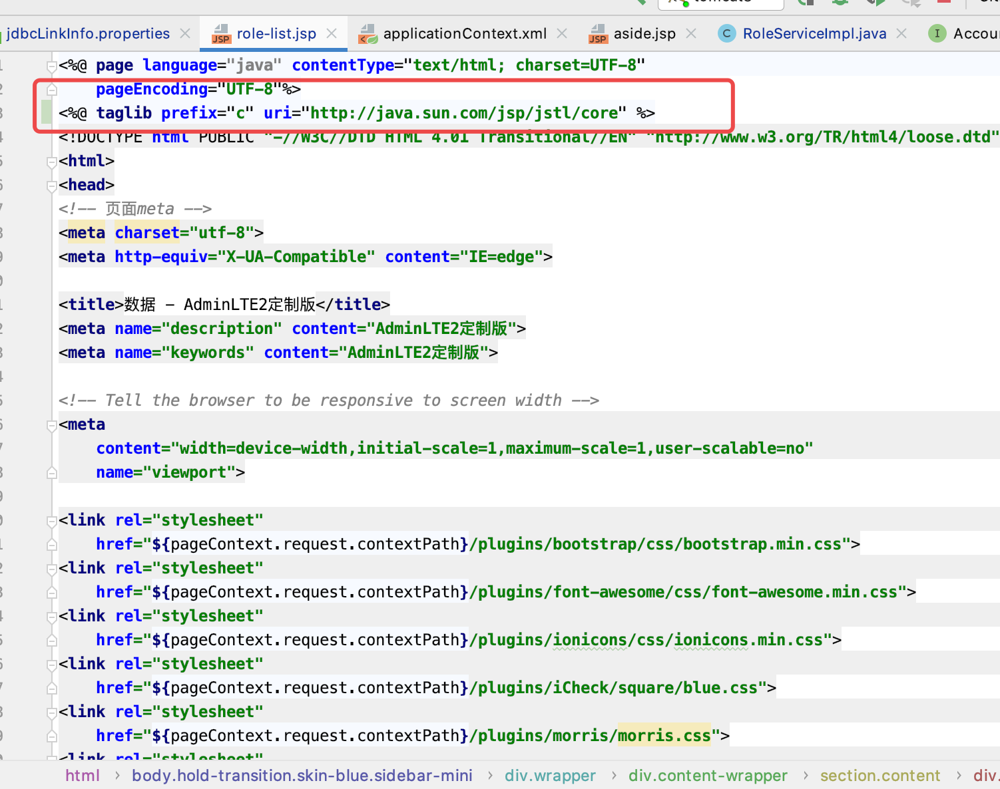
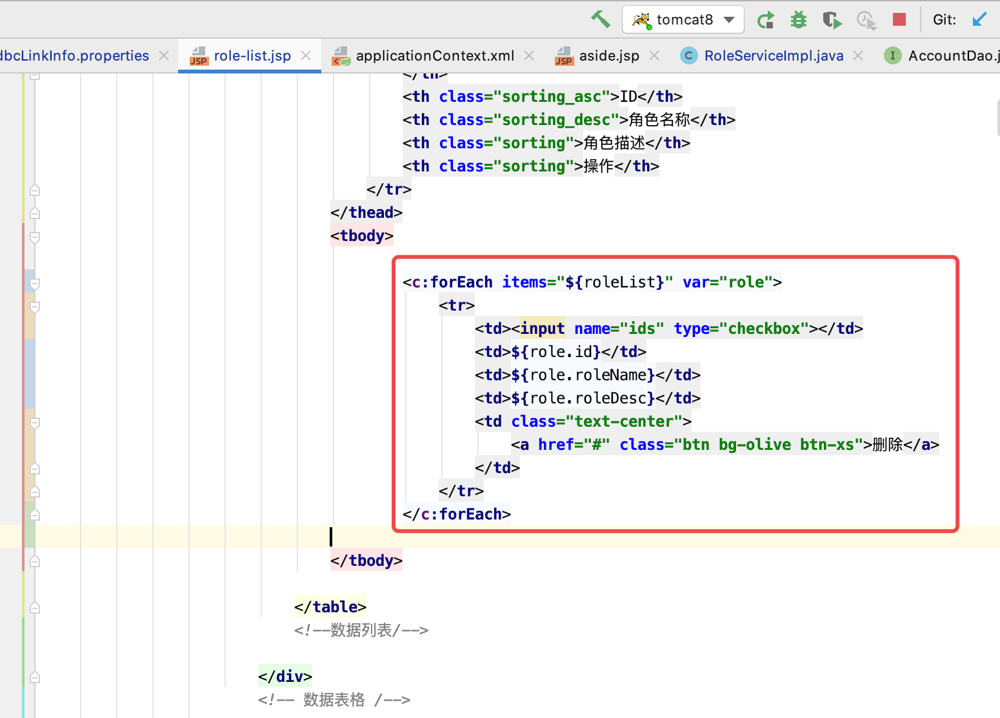
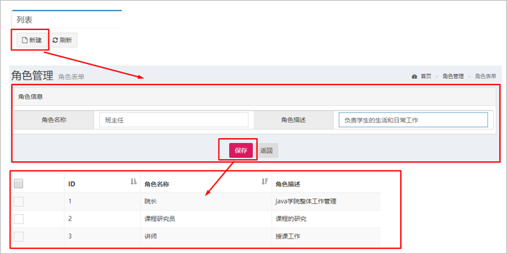
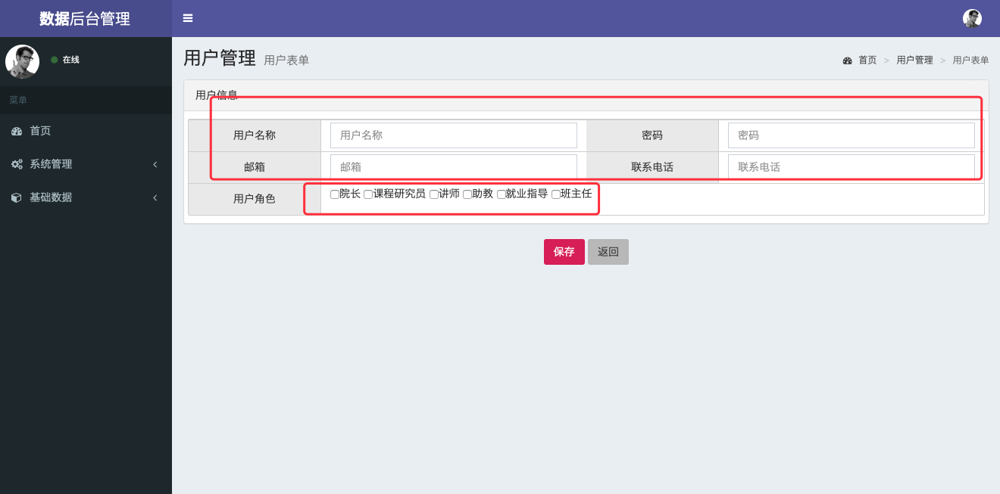

# 目录

1. [环境搭建步骤分析](#spring001)
2. [环境搭建 ](#spring002)
3. [用户表和角色表的分析](#spring003)
4. [角色列表展示分析](#spring004)
5. [角色列表](#spring005)
6. [角色的添加操作](#spring006)
7. [用户列表展示](#spring007)
8. [用户添加操作](#spring008)
9. [删除用户操作](#spring009)
10. [](#spring010)
11. [](#spring011)
12. [](#spring012)
13. [](#spring013)
14. [](#spring014)
15. [](#spring015)
16. [](#spring016)
17. [](#spring017)
18. [](#spring018)


### spring001
# 1. 环境搭建步骤分析

1. 创建工程（Project&Module）
2. 导入静态页面
3. 导入需要坐标
4. 创建包结构（controller、service、dao、domain、utils）
5. 导入数据库脚本
6. 创建POJO类


### spring002
# 2. 环境搭建 

1. 创建工程,导入jsp，添加项目依赖

2. 创建包结构，导入数据库脚本，导入POJO

3. 创建Spring的核心配置文件applicationContext.xml

4. 创建SpringMVC核心配置文件spring-mvc.xml

5. 创建数据库配置文件jdbc.properties

6. 拷贝日志配置文件log4j.properties

6. 配置web.xml如下：


```xml

<?xml version="1.0" encoding="UTF-8"?>
<web-app xmlns="http://xmlns.jcp.org/xml/ns/javaee"
         xmlns:xsi="http://www.w3.org/2001/XMLSchema-instance"
         xsi:schemaLocation="http://xmlns.jcp.org/xml/ns/javaee http://xmlns.jcp.org/xml/ns/javaee/web-app_3_1.xsd"
         version="3.1">


<!--    全局的初始化参数-->
    <context-param>
        <param-name>contextConfigLocation</param-name>
        <param-value>classpath:applicationContext.xml</param-value>
    </context-param>
    
<!--    spring监听器-->
    <listener>
        <listener-class>org.springframework.web.context.ContextLoaderListener</listener-class>
    </listener>
    
<!--    前端控制器-->
    <servlet>
        <servlet-name>WTDispatcherServlet</servlet-name>
        <servlet-class>org.springframework.web.servlet.DispatcherServlet</servlet-class>
        <init-param>
            <param-name>contextConfigLocation</param-name>
            <param-value>classpath:springmvc.xml</param-value>
        </init-param>
        <load-on-startup>2</load-on-startup>
    </servlet>

    <servlet-mapping>
        <servlet-name>WTDispatcherServlet</servlet-name>
        <url-pattern>/</url-pattern>
    </servlet-mapping>


</web-app>

```

7. 配置`springmvc.xml`：注解驱动，视图解析器，静态资源的开放


```xml

<?xml version="1.0" encoding="UTF-8"?>
<beans xmlns="http://www.springframework.org/schema/beans"
       xmlns:xsi="http://www.w3.org/2001/XMLSchema-instance"
       xmlns:context="http://www.springframework.org/schema/context"
       xmlns:mvc="http://www.springframework.org/schema/mvc"
       xsi:schemaLocation="http://www.springframework.org/schema/beans http://www.springframework.org/schema/beans/spring-beans.xsd
                           http://www.springframework.org/schema/context http://www.springframework.org/schema/context/spring-context.xsd
                           http://www.springframework.org/schema/mvc http://www.springframework.org/schema/mvc/spring-mvc.xsd">


    <context:component-scan base-package="com.domanshow.controller"></context:component-scan>


<!--    mvc 注解驱动-->
    <mvc:annotation-driven></mvc:annotation-driven>

<!--    配置视图解析器-->
    <bean class="org.springframework.web.servlet.view.InternalResourceViewResolver">
<!--        前缀-->
        <property name="prefix" value="/pages/"></property>
<!--        后缀-->
        <property name="suffix" value=".jsp"></property>
    </bean>

<!--    静态资源权限开放-->
    <mvc:default-servlet-handler></mvc:default-servlet-handler>

</beans>

```


8. 配置`applicationContext.xml`：`加载propertiest`,`配置数据源对象`，`配置JdbcTemplate对象`

```xml

<?xml version="1.0" encoding="UTF-8"?>
<beans xmlns="http://www.springframework.org/schema/beans"
       xmlns:xsi="http://www.w3.org/2001/XMLSchema-instance"
       xmlns:context="http://www.springframework.org/schema/context"
       xsi:schemaLocation="http://www.springframework.org/schema/beans http://www.springframework.org/schema/beans/spring-beans.xsd
                           http://www.springframework.org/schema/context http://www.springframework.org/schema/context/spring-context.xsd">


<!--    1. 加载jdbc-->
    <context:property-placeholder location="classpath:jdbcLinkInfo.properties"></context:property-placeholder>

<!--    2. 配置数据源对象-->
    <bean id="dataSoure" class="com.mchange.v2.c3p0.ComboPooledDataSource">
        <property name="driverClass" value="${driver}"></property>
        <property name="jdbcUrl" value="${url}"></property>
        <property name="user" value="${userName}"></property>
        <property name="password" value="${password}"></property>
    </bean>

<!--    3. 配置JdbcTemplate对象-->
    <bean id="jdbcTemplate" class="org.springframework.jdbc.core.JdbcTemplate">
        <property name="dataSource" ref="dataSoure"></property>
    </bean>


</beans>

```

### spring003
# 3. 用户表和角色表的分析

分析用户和角色在数据库设计中的表关系: `多对多`




角色表: sys_role
用户表: sys_user
用户和角色的中间表: sys_user_role

### spring004
# 4.  角色列表展示分析

完成该功能的思路和步骤为：

1. 点击角色管理菜单发送请求到服务器端（修改角色管理菜单的url地址）

2. 创建RoleController和list()方法

3. 创建RoleService和list()方法

4. 创建RoleDao和findAll()方法

5. 使用JdbcTemplate完成查询操作

6. 将查询数据存储到modelAndView中

7. 转发到role-list.jsp页面进行展示


### spring005
# 5. 角色列表


## 5.1 controller层实现

```java

package com.domanshow.controller;

import com.domanshow.domain.Role;
import com.domanshow.service.RoleService;
import org.springframework.beans.factory.annotation.Autowired;
import org.springframework.stereotype.Controller;
import org.springframework.web.bind.annotation.RequestMapping;
import org.springframework.web.servlet.ModelAndView;

import java.util.List;

@Controller
@RequestMapping("/role")
public class RoleController {

    @Autowired
    private RoleService service;
    public void setService(RoleService service) {
        this.service = service;
    }


    @RequestMapping("/list")
    public ModelAndView roleList(){

        System.out.println("RoleController roleList come in -------");

        ModelAndView modelAndView = new ModelAndView();

        List<Role> list = service.list();
        modelAndView.addObject("roleList", list);

        modelAndView.setViewName("role-list");
        return modelAndView;
    }
}

```


## 5.2 service和dao层实现


```java

package com.domanshow.service.impl;

import com.domanshow.dao.RoleDao;
import com.domanshow.domain.Role;
import com.domanshow.service.RoleService;
import org.springframework.beans.factory.annotation.Autowired;
import org.springframework.stereotype.Service;

import java.util.List;

@Service
public class RoleServiceImpl implements RoleService {

    @Autowired
    private RoleDao roleDao;

    @Override
    public List<Role> list() {

        System.out.println("RoleServiceImpl list come in -------");

        List<Role> list = roleDao.findAllRoleList();
        return list;
    }
}

```


```java

package com.domanshow.dao.impl;

import com.domanshow.dao.RoleDao;
import com.domanshow.domain.Role;
import org.springframework.beans.factory.annotation.Autowired;
import org.springframework.beans.factory.annotation.Qualifier;
import org.springframework.jdbc.core.BeanPropertyRowMapper;
import org.springframework.jdbc.core.JdbcTemplate;
import org.springframework.stereotype.Repository;

import java.util.List;


@Repository
public class RoleDaoImpl implements RoleDao {

    @Autowired
    @Qualifier("jdbcTemplate")
    private JdbcTemplate template;

    @Override
    public List<Role> findAllRoleList() {

        System.out.println("RoleDaoImpl findAllRoleList come in -------");

        List<Role> list = template.query("SELECT * FROM sys_role", new BeanPropertyRowMapper<Role>(Role.class));

        return list;
    }
}

```


## 5.3 配置实现

略

## 5.4 页面展示





### spring006
# 6. 角色的添加操作



## 6.1 操作步骤

1. 点击列表页面新建按钮跳转到角色添加页面
2. 输入角色信息，点击保存按钮，表单数据提交服务器
3. 编写RoleController的save()方法
4. 编写RoleService的save()方法
5. 编写RoleDao的save()方法
6. 使用JdbcTemplate保存Role数据到sys_role
7. 跳转回角色列表页面


为了解决post提交中文乱码问题，需要在web.xml中配置全局乱码过滤器

web.xml
```xml

<!--    解决乱码的过滤器-->
    <filter>
        <filter-name>CharacterEncodingFilter</filter-name>
        <filter-class>org.springframework.web.filter.CharacterEncodingFilter</filter-class>
        <init-param>
            <param-name>encoding</param-name>
            <param-value>UTF-8</param-value>
        </init-param>
    </filter>
    <filter-mapping>
        <filter-name>CharacterEncodingFilter</filter-name>
        <url-pattern>/*</url-pattern>
    </filter-mapping>

```


### spring007
# 7. 用户列表展示

## 7.1 完成该功能的操作步骤：

1. 点击用户管理菜单发送请求到服务器端（修改用户管理菜单的url地址）

2. 创建UserController和list()方法

3. 创建UserService和list()方法

4. 创建UserDao和findAll()方法

5. 使用JdbcTemplate完成查询操作

6. 将查询数据存储到modelAndView中

7. 转发到user-list.jsp页面进行展示

其他见代码

### spring008
# 8. 用户添加操作



1. 点击列表页面新建按钮跳转到角色添加页面
2. 输入角色信息，点击保存按钮，表单数据提交服务器
3. 编写RoleController的save()方法
4. 编写RoleService的save()方法
5. 编写RoleDao的save()方法
6. 使用JdbcTemplate保存Role数据到sys_role
7. 跳转回角色列表页面

## 8.1 添加页面展示

## 8.2 添加数据到数据库


### spring009
# 9. 删除用户操作

删除用户也要删除两个表

### spring010
# 10.  拦截器用户登录


### spring011
# 1. 


### spring012
# 1. 


### spring013
# 1. 


### spring014
# 1. 


### spring015
# 1. 


### spring016
# 1. 


### spring017
# 1. 


### spring018
# 1. 
