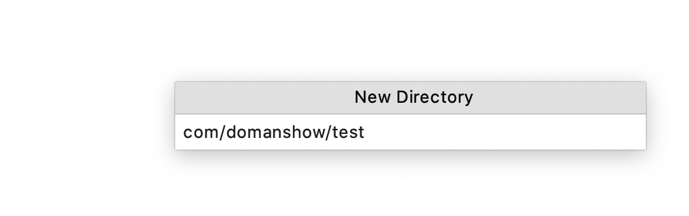

# 目录

1. [第1节 Mybatis快速入门](#mybatis001)
    1. [1.1 Mybatis 简介](#mybatis001a) 
    2. [1.2 Mybatis 快速入门](#mybatis001b) 
    3. [1.3 Mybatis 映射文件概述](#mybatis001c) 
    4. [1.4 Mybatis 增删改查操作](#mybatis001d) 
    5. [1.5 Mybatis 核心配置文件概述](#mybatis001e) 
    6. [1.6 Mybatis 相应API](#mybatis001f) 
2. [第2节 Mybatis的dao层实现原理](#mybatis002)
3. [第3节 Mybatis的多表操作](#mybatis003)


### mybatis001
# 第1节 Mybatis快速入门

### mybatis001a
## 1.1 Mybatis 简介

### 1.1.1 原始jdbc操作

大概介绍了下**原始jdbc操作**的相关弊端


弊端
- 数据库`连接创建`、`释放`**频繁**造成**系统资源浪费**从而影响系统性能
- `sql 语句`在代码中`硬编码`，造成代码**不易维护**，实际应用 sql 变化的可能较大，sql 变动需要改变java代码。
- 查询操作时，需要**手动**将**结果集**中的数据手动封装到实体中。插入操作时，需要**手动**将实体的数据设置到**sql语句的占位符位置**


**应对上述问题给出的解决方案：**
- 使用**数据库连接池**初始化连接资源
- 将`sql语句`**抽取**到**xml配置文件**中
- 使用`反射`、`内省`等底层技术，自动将**实体**与**表**进行属性与字段的自动映射


### 1.1.2 什么是Mybatis

- `mybatis 是`一个优秀的基于java的`持久层框架`，它内部`封装了jdbc`，使开发者`只需要关注sql`语句本身，而不需要花费精力去处理加载驱动、创建连接、创建statement等繁杂的过程。

- mybatis通过`xml`或`注解`的方式将要执行的各种 statement`配置`起来，并通过java对象和statement中sql的动态参数进行映射生成最终执行的sql语句。

- 最后mybatis框架执行sql并将结果映射为java对象并返回。采用`ORM`思想解决了**实体**和**数据库****映射**的问题，对**jdbc **进行了**封装**，**屏蔽**了**jdbc api** `底层访问细节`，使我们不用与jdbc api 打交道，就可以完成对数据库的持久化操作。


### mybatis001b
## 1.2 Mybatis 快速入门

MyBatis官网地址：http://www.mybatis.org/mybatis-3/ 

Mybatis开发步骤

1. 添加MyBatis 的坐标
2. 创建User数据表
3. 编写User实体类
4. 编写映射文件 xxxx.xml
5. 编写核心文件 SqlMapConfig.xml
6. 编写测试类

### 1.2.1 准备1- 创建resources文件夹



### 1.2.2 准备2- mybatis约束头

```xml

<?xml version="1.0" encoding="UTF-8" ?>
<!DOCTYPE mapper PUBLIC "-//mybatis.org//DTD Mapper 3.0//EN" "http://mybatis.org/dtd/mybatis-3-mapper.dtd">

```

### 1.2.3 准备3- 核心文件约束头


```xml

<?xml version="1.0" encoding="UTF-8" ?>

<!DOCTYPE configuration PUBLIC "-//mybatis.org//DTD Config 3.0//EN"  "http://mybatis.org/dtd/mybatis-3-config.dtd">

```


### 1.2.4 准备4- 核心文件加载配置文件复制路径


### 1.2.5 添加坐标

```xml

<dependencies>
    <!--mybatis坐标-->
  <dependency>
        <groupId>org.mybatis</groupId>
        <artifactId>mybatis</artifactId>
        <version>3.4.5</version>
    </dependency>
    <!--mysql驱动坐标-->
  <dependency>
        <groupId>mysql</groupId>
        <artifactId>mysql-connector-java</artifactId>
        <version>5.1.32</version>
    </dependency>
    <!--单元测试坐标-->
  <dependency>
        <groupId>junit</groupId>
        <artifactId>junit</artifactId>
        <version>4.12</version>
        <scope>test</scope>
    </dependency>
    <!--日志坐标-->
  <dependency>
        <groupId>org.slf4j</groupId>
        <artifactId>slf4j-log4j12</artifactId>
        <version>1.7.7</version>
    </dependency>
    <dependency>
        <groupId>log4j</groupId>
        <artifactId>log4j</artifactId>
        <version>1.2.17</version>
    </dependency>

</dependencies>

```


### 1.2.6 创建User数据表

略


### 1.2.7 User实体类

```java

package com.domanshow.domain;

public class User {

    private int id;
    private String userName;
    private String password;

    public int getId() {
        return id;
    }

    public void setId(int id) {
        this.id = id;
    }

    public String getUserName() {
        return userName;
    }

    public void setUserName(String userName) {
        this.userName = userName;
    }

    public String getPassword() {
        return password;
    }

    public void setPassword(String password) {
        this.password = password;
    }

    @Override
  public String toString() {
        return "User{" +
                "id=" + id +
                ", userName='" + userName + '\'' +
                ", password='" + password + '\'' +
                '}';
    }
}

```

### 1.2.8 映射文件UserMapper.xml

```xml

<?xml version="1.0" encoding="UTF-8" ?>
<!DOCTYPE mapper PUBLIC "-//mybatis.org//DTD Mapper 3.0//EN" "http://mybatis.org/dtd/mybatis-3-mapper.dtd">


<mapper namespace="userMapper">
    <select id="findAll" resultType="com.domanshow.domain.User">
        select * from t_mybatis1
    </select>
</mapper>

```


### 1.2.9 核心文件 SqlMapConfig.xml

```xml

<?xml version="1.0" encoding="UTF-8" ?>
<!DOCTYPE configuration PUBLIC "-//mybatis.org//DTD Config 3.0//EN" "http://mybatis.org/dtd/mybatis-3-config.dtd">

<configuration>

<!--    配数据源环境-->
    <environments default="development">
        <environment id="development">
            <transactionManager type="JDBC"></transactionManager>
            <dataSource type="POOLED">

                <property name="driver" value="com.mysql.jdbc.Driver"/>
                <property name="url" value="jdbc:mysql://138.68.220.88:3306/mybatis001?characterEncoding=utf8"/>
                <property name="username" value="keyi"/>
                <property name="password" value="a23456a7"/>


            </dataSource>
        </environment>
    </environments>


<!--    加载映射文件-->
    <mappers>
        <mapper resource="com/domanshow/mapper/UserMapper.xml"></mapper>
    </mappers>

</configuration>

```


### 1.2.10 编写测试类

```java

package com.domanshow.test;

import com.domanshow.domain.User;
import org.apache.ibatis.io.Resources;
import org.apache.ibatis.session.SqlSession;
import org.apache.ibatis.session.SqlSessionFactory;
import org.apache.ibatis.session.SqlSessionFactoryBuilder;
import org.junit.Test;

import java.io.IOException;
import java.io.InputStream;
import java.util.List;

public class MybatisTest {


    @Test
    public void test1() throws IOException {

        // 获得核心配置文件
        InputStream inputStream = Resources.getResourceAsStream("sqlMapConfig.xml");

        // 获得Session工厂对象
        SqlSessionFactory sqlSessionFactory = new SqlSessionFactoryBuilder().build(inputStream);

        // 获得Session会话对象
        SqlSession sqlSession = sqlSessionFactory.openSession();

        // 执行操作  参数userMapper+id
        List<User> userList = sqlSession.selectList("userMapper.findAll");

        // 打印数据
        System.out.println(userList);

        sqlSession.close();

    }
}

```


### mybatis001c
## 1.3 Mybatis 映射文件概述


### mybatis001d
## 1.4 Mybatis 增删改查操作


### 1.4.1 插入操作注意问题

1. 插入语句使用insert标签
2. 在映射文件中使用`parameterType`属性指定要插入的数据类型
3. Sql语句中使用`#{实体属性名}`方式引用实体中的属性值
4. 插入操作使用的API是sqlSession.insert(“命名空间.id”,实体对象);
5. 插入操作涉及数据库数据变化，所以要使用sqlSession对象显示的**提交事务**，即`sqlSession.commit()`

### 1.4.2 修改操作注意问题

1. 修改语句使用`update`标签
2. 修改操作使用的API是`sqlSession.update`(“命名空间.id”,实体对象);

### 1.4.3 删除操作注意问题

1. 删除语句使用delete标签
2. Sql语句中使用#{任意字符串}方式引用传递的单个参数
3. 删除操作使用的API是sqlSession.delete(“命名空间.id”,Object);
4. 

### 映射文件
```xml

<!--    删除操作-->
    <delete id="delete" parameterType="int">
        delete from t_mybatis1 where id=#{id}
    </delete>
    
<!--    修改-->
    <update id="update" parameterType="user">
        update t_mybatis1 set userName=#{userName}, password=#{password} where id=#{id}
    </update>
<!--    插入-->
    <insert id="insert" parameterType="user">
        insert into t_mybatis1 values(#{id},#{userName},#{password})
    </insert>

```


java测试代码

```java

/**
     * 删除----某个对象
     * @throws IOException
     */
    @Test
    public void test5() throws IOException {

        User user = new User();
        user.setId(5);
        user.setUserName("phm666");
        user.setPassword("abc");

        // 获得核心配置文件
        InputStream inputStream = Resources.getResourceAsStream("sqlMapConfig.xml");

        // 获得Session工厂对象
        SqlSessionFactory sqlSessionFactory = new SqlSessionFactoryBuilder().build(inputStream);

        // 获得Session会话对象
        SqlSession sqlSession = sqlSessionFactory.openSession();

        // 执行操作  参数userMapper+id
        int insert = sqlSession.delete("userMapper.delete", user.getId());

        sqlSession.commit();
        // 打印数据
        System.out.println(insert);

        sqlSession.close();

    }


    /**
     * 更改----某个对象
     * @throws IOException
     */
    @Test
    public void test4() throws IOException {

        User user = new User();
        user.setId(5);
        user.setUserName("phm666");
        user.setPassword("abc");

        // 获得核心配置文件
        InputStream inputStream = Resources.getResourceAsStream("sqlMapConfig.xml");

        // 获得Session工厂对象
        SqlSessionFactory sqlSessionFactory = new SqlSessionFactoryBuilder().build(inputStream);

        // 获得Session会话对象
        SqlSession sqlSession = sqlSessionFactory.openSession();

        // 执行操作  参数userMapper+id
        int insert = sqlSession.update("userMapper.update", user);

        sqlSession.commit();
        // 打印数据
        System.out.println(insert);

        sqlSession.close();

    }

    /**
     * 插入----某个对象
     * @throws IOException
     */
    @Test
    public void test3() throws IOException {

        User user = new User();
        user.setId(0);
        user.setUserName("phm");
        user.setPassword("123");

        // 获得核心配置文件
        InputStream inputStream = Resources.getResourceAsStream("sqlMapConfig.xml");

        // 获得Session工厂对象
        SqlSessionFactory sqlSessionFactory = new SqlSessionFactoryBuilder().build(inputStream);

        // 获得Session会话对象
        SqlSession sqlSession = sqlSessionFactory.openSession();

        // 执行操作  参数userMapper+id
        int insert = sqlSession.insert("userMapper.insert", user);

        sqlSession.commit();
        // 打印数据
        System.out.println(insert);

        sqlSession.close();

    }

```


### mybatis001e
## 1.5 Mybatis 核心配置文件概述


### 1.5.1 MyBatis核心配置文件层级关系


### 1.5.2 MyBatis常用配置解析


#### 1.5.2.1 environments标签

数据库环境配置的配置, 支持多环境配置


- 事务管理器（`transactionManager`）类型有**两种**：
    - •**JDBC**：这个配置就是直接使用了JDBC 的提交和回滚设置，它依赖于从数据源得到的连接来管理事务作用域。
    - •MANAGED：这个配置几乎没做什么。它从来不提交或回滚一个连接，而是让容器来管理事务的整个生命周期（比如 JEE 应用服务器的上下文）。 默认情况下它会关闭连接，然而一些容器并不希望这样，因此需要将 closeConnection 属性设置为 false 来阻止它默认的关闭行为。


- 数据源（`dataSource`）类型有`三种`：

    - •UNPOOLED：这个数据源的实现只是每次被请求时打开和关闭连接。

    - •**POOLED**：这种数据源的实现利用“池”的概念将 JDBC 连接对象组织起来。

    - •JNDI：这个数据源的实现是为了能在如 EJB 或应用服务器这类容器中使用，容器可以集中或在外部配置数据源，然后放置一个 JNDI 上下文的引用。


#### 1.5.2.2 mapper标签


该标签的作用是**加载映射**的，加载方式有如下几种：


1. 使用**相对于类路径**的资源引用，例如：

```xml

<mapper resource="org/mybatis/builder/AuthorMapper.xml"/>

```


2. 使用**完全限定资源定位符**（`URL`），例如：

```xml

<mapper url="file:///var/mappers/AuthorMapper.xml"/>

```


3. 使用**映射器接口实现类**的完全限定类名，例如：

注解的时候可能用到

```xml

<mapper class="org.mybatis.builder.AuthorMapper"/>

```


4. 将包内的映射器接口实现全部注册为映射器，例如：


```xml

<package name="org.mybatis.builder"/>

```


#### 1.5.2.3 Properties标签

实际开发中，习惯将数据源的配置信息`单独`**抽取**成一个**properties文件**，该标签可以加载额外配置的properties文件


#### 1.5.2.4 typeAliases标签

- 类型别名是为Java 类型设置一个短的名字。原来的类型名称配置如下


- 配置typeAliases，为com.itheima.domain.User定义别名为user


- 上面我们是自定义的别名，mybatis框架已经为我们设置好的一些常用的类型的别名


### mybatis001f
## 1.6 Mybatis 相应API

### 1.6.1 SqlSession工厂构建器SqlSessionFactoryBuilder

常用API：`SqlSessionFactory  build(InputStream inputStream)`

通过加载`mybatis`的**核心文件**的输入流的形式构建一个**SqlSessionFactory**对象

```java

        // 获得核心配置文件
        InputStream inputStream = Resources.getResourceAsStream("sqlMapConfig.xml");
        // 获得Session工厂对象
        SqlSessionFactory sqlSessionFactory = new SqlSessionFactoryBuilder().build(inputStream);

```


其中， `Resources` 工具类，这个类在 `org.apache.ibatis.io` 包中。`Resources` 类帮助你从类路径下、文件系统或一个 web URL 中加载资源文件。


### 1.6.2 SqlSession工厂对象SqlSessionFactory

`SqlSessionFactory` 有多个个方法创建`SqlSession` 实例。常用的有如下两个：


```java

// 获得Session会话对象 
SqlSession sqlSession = sqlSessionFactory.openSession();

```


### 1.6.3  SqlSession会话对象

`SqlSession` 实例在 `MyBatis` 中是非常强大的一个类。在这里你会看到所有`执行语句`、`提交`或`回滚事务`和`获取映射器`实例的方法。

执行语句的方法主要有：

```java

<T> T selectOne(String statement, Object parameter) 
<E> List<E> selectList(String statement, Object parameter) 
int insert(String statement, Object parameter) 
int update(String statement, Object parameter) 
int delete(String statement, Object parameter)

```

操作事务的方法主要有：

```java

void commit()  
void rollback() 

```


### mybatis002
# 第2节 Mybatis的dao层实现原理

### mybatis003
# 第3节 Mybatis的多表操作