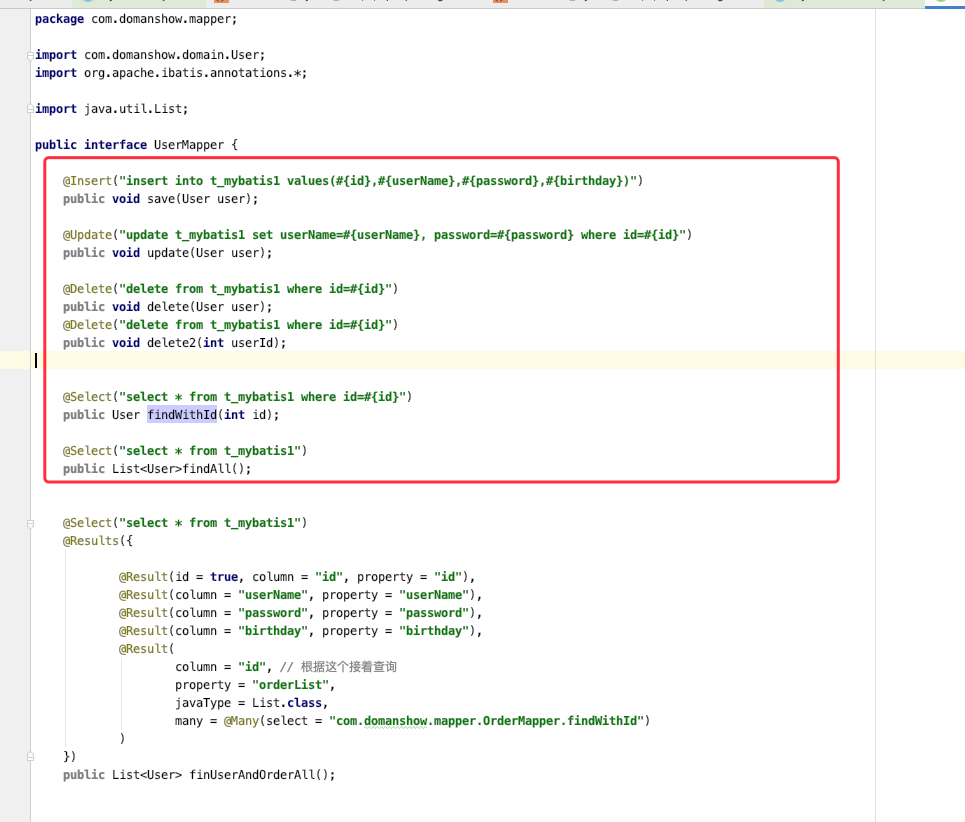
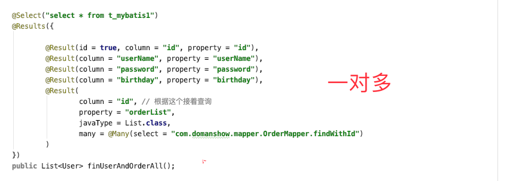
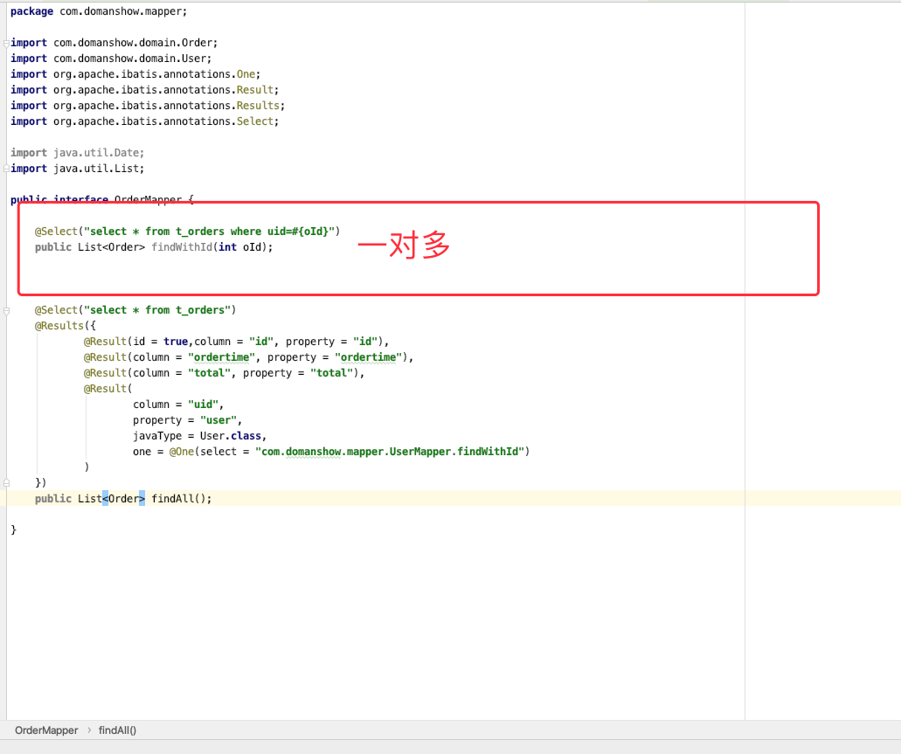
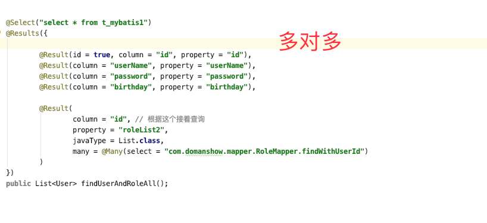
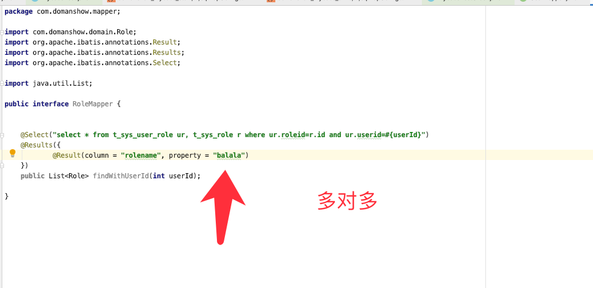
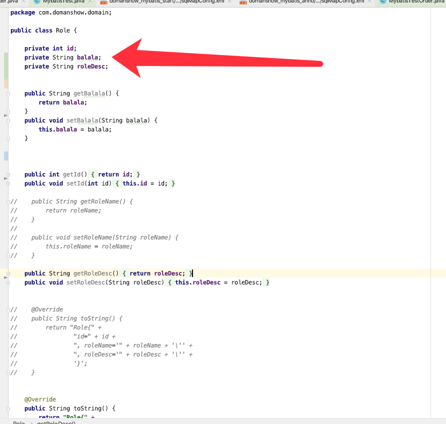
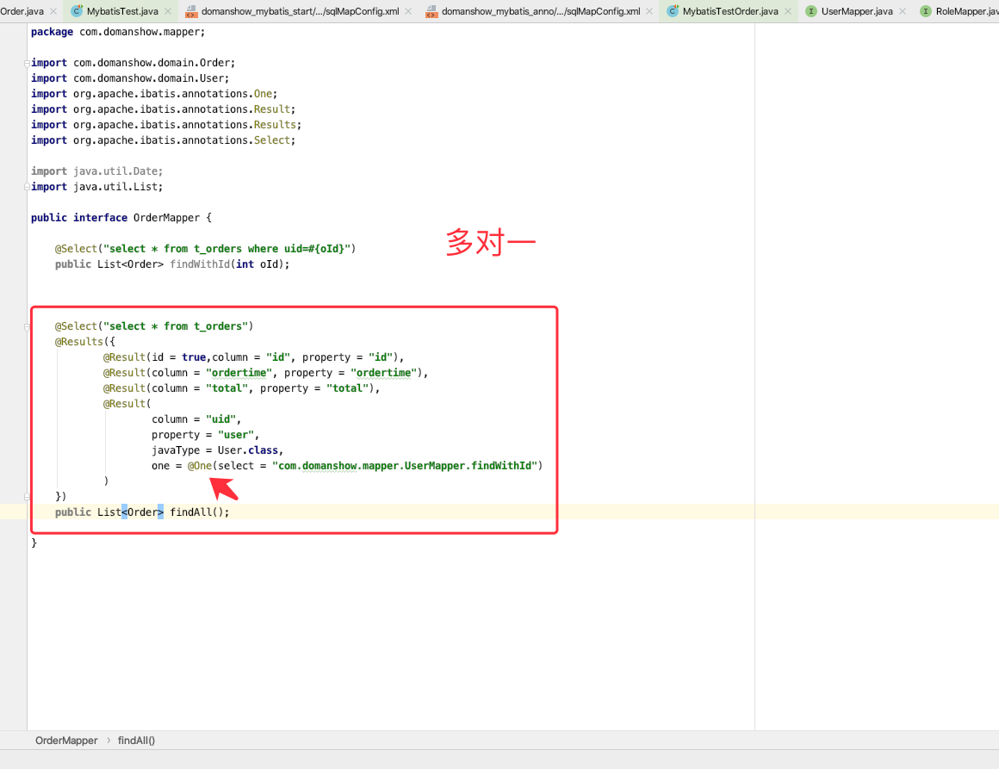

# mybatis 注解开发


## 1 mybatis常用注解


1. `@Insert`：实现新增

2. `@Update`：实现更新

3. `@Delete`：实现删除

4. `@Select`：实现查询

5. `@Result`：实现结果集封装

6. `@Results`：可以与@Result 一起使用，封装多个结果集

7. `@One`：实现一对一结果集封装

8. `@Many`：实现一对多结果集封装


## 2 扫描注解类sqlMapConfig.xml

```xml

<!--    加载映射关系-->
  <mappers>
<!--        <mapper class="com.domanshow.mapper.UserMapper"></mapper>--> <!--        <package name="com.domanshow.mapper"></package>-->
     <package name="com.domanshow.mapper"/>
  </mappers>

```


## 3. 简单查询




## 4. 一对多





## 5. 多对多





## 6. 多对一




## 7. Test


```java


package com.domanshow.test;

import com.domanshow.domain.User;
import com.domanshow.mapper.UserMapper;
import org.apache.ibatis.io.Resources;
import org.apache.ibatis.session.SqlSession;
import org.apache.ibatis.session.SqlSessionFactory;
import org.apache.ibatis.session.SqlSessionFactoryBuilder;
import org.junit.Before;
import org.junit.Test;

import java.io.IOException;
import java.io.InputStream;
import java.util.Date;
import java.util.List;

public class MybatisTest {

    private UserMapper mapper;

    @Before
    public void before() throws IOException {

        InputStream inputStream = Resources.getResourceAsStream("sqlMapConfig.xml");
        SqlSessionFactory sqlSessionFactory = new SqlSessionFactoryBuilder().build(inputStream);
        SqlSession sqlSession = sqlSessionFactory.openSession(true);
        mapper = sqlSession.getMapper(UserMapper.class);
    }

    @Test
    public void testSave(){

        User user = new User();
        user.setId(0);
        user.setUserName("tom004");
        user.setPassword("acg13");
        user.setBirthday(new Date());
        mapper.save(user);
    }

    @Test
    public void testUpdate(){

        User user = new User();
        user.setId(30);
        user.setUserName("周星驰");
        user.setPassword("acg1asdasdasdasd3");
//        user.setBirthday(new Date());
        mapper.update(user);
    }

    @Test
    public void testDelete(){

        User user = new User();
        user.setId(29);
        mapper.delete(user);
    }

    @Test
    public void testDelete2(){

        mapper.delete2(15);
    }


    @Test
    public void testFindWithId(){

        User user = mapper.findWithId(24);
        System.out.println(user);
    }

    @Test
    public void testFindAll(){

        List<User> userList = mapper.findAll();

        for (User user : userList) {

            System.out.println(user);
        }
    }

    @Test
    public void testFinUserAndOrderAll(){

        List<User> userList = mapper.finUserAndOrderAll();

        for (User user : userList) {

            System.out.println(user);
        }
    }

    @Test
    public void testFinUserAndRoleAll(){

        List<User> userList = mapper.findUserAndRoleAll();

        for (User user : userList) {

            System.out.println(user);
        }
    }

}

```


```java

package com.domanshow.test;

import com.domanshow.domain.Order;
import com.domanshow.mapper.OrderMapper;
import com.domanshow.mapper.UserMapper;
import org.apache.ibatis.io.Resources;
import org.apache.ibatis.session.SqlSession;
import org.apache.ibatis.session.SqlSessionFactory;
import org.apache.ibatis.session.SqlSessionFactoryBuilder;
import org.junit.Before;
import org.junit.Test;

import java.io.IOException;
import java.io.InputStream;
import java.util.List;

public class MybatisTestOrder {

    private OrderMapper mapper;

    @Before
  public void before() throws IOException {
        InputStream inputStream = Resources.getResourceAsStream("sqlMapConfig.xml");
        SqlSessionFactory sqlSessionFactory = new SqlSessionFactoryBuilder().build(inputStream);
        SqlSession sqlSession = sqlSessionFactory.openSession(true);
        mapper = sqlSession.getMapper(OrderMapper.class);
    }

    @Test
  public void testFindAll(){

        List<Order> orderList = mapper.findAll();

        for (Order order : orderList) {

            System.out.println(order);
        }
    }

}

```


Order
```java

package com.domanshow.domain;

import java.util.Date;

public class Order {

    private int id;
    private Date ordertime;
    private double total;

    //代表当前订单从属于哪一个客户
  private User user;

    public int getId() {
        return id;
    }

    public void setId(int id) {
        this.id = id;
    }

    public Date getOrdertime() {
        return ordertime;
    }

    public void setOrdertime(Date ordertime) {
        this.ordertime = ordertime;
    }

    public double getTotal() {
        return total;
    }

    public void setTotal(double total) {
        this.total = total;
    }

    public User getUser() {
        return user;
    }

    public void setUser(User user) {
        this.user = user;
    }

    @Override
  public String toString() {
        return "Order{" +
                "id=" + id +
                ", ordertime=" + ordertime +
                ", total=" + total +
                ", user=" + user +
                '}';
    }
}

```


Role

```java

package com.domanshow.domain;

public class Role {

    private int id;
    private String balala;
    private String roleDesc;

    public String getBalala() {
        return balala;
    }
    public void setBalala(String balala) {
        this.balala = balala;
    }

    public int getId() {
        return id;
    }
    public void setId(int id) {
        this.id = id;
    }

//    public String getRoleName() { //        return roleName; //    } // //    public void setRoleName(String roleName) { //        this.roleName = roleName; //    }    public String getRoleDesc() {
        return roleDesc;
    }
    public void setRoleDesc(String roleDesc) {
        this.roleDesc = roleDesc;
    }

//    @Override //    public String toString() { //        return "Role{" + //                "id=" + id + //                ", roleName='" + roleName + '\'' + //                ", roleDesc='" + roleDesc + '\'' + //                '}'; //    }      @Override
  public String toString() {
        return "Role{" +
                "id=" + id +
                ", balala='" + balala + '\'' +
                ", roleDesc='" + roleDesc + '\'' +
                '}';
    }
}

```


user
```java

package com.domanshow.domain;

import java.util.Date;
import java.util.List;

public class User {

    private int id;
    private String userName;
    private String password;
    private Date birthday;
    private List<Order> orderList;

    private List<Role> roleList2;

    public List<Order> getOrderList() {
        return orderList;
    }
    public void setOrderList(List<Order> orderList) {
        this.orderList = orderList;
    }

    public Date getBirthday() {
        return birthday;
    }
    public void setBirthday(Date birthday) {
        this.birthday = birthday;
    }

    public int getId() {
        return id;
    }
    public void setId(int id) {
        this.id = id;
    }

    public String getUserName() {
        return userName;
    }
    public void setUserName(String userName) {
        this.userName = userName;
    }

    public String getPassword() {
        return password;
    }
    public void setPassword(String password) {
        this.password = password;
    }

    public List<Role> getRoleList2() {
        return roleList2;
    }
    public void setRoleList2(List<Role> roleList2) {
        this.roleList2 = roleList2;
    }

    @Override
  public String toString() {
        return "User{" +
                "id=" + id +
                ", userName='" + userName + '\'' +
                ", password='" + password + '\'' +
                ", birthday=" + birthday +
                ", orderList=" + orderList +
                ", roleList2=" + roleList2 +
                '}';
    }
}

```


OrderMapper

```java

package com.domanshow.mapper;

import com.domanshow.domain.Order;
import com.domanshow.domain.User;
import org.apache.ibatis.annotations.One;
import org.apache.ibatis.annotations.Result;
import org.apache.ibatis.annotations.Results;
import org.apache.ibatis.annotations.Select;

import java.util.Date;
import java.util.List;

public interface OrderMapper {

    @Select("select * from t_orders where uid=#{oId}")
    public List<Order> findWithId(int oId);

    @Select("select * from t_orders")
    @Results({
            @Result(id = true,column = "id", property = "id"),
            @Result(column = "ordertime", property = "ordertime"),
            @Result(column = "total", property = "total"),
            @Result(
                    column = "uid",
                    property = "user",
                    javaType = User.class,
                    one = @One(select = "com.domanshow.mapper.UserMapper.findWithId")
            )
    })
    public List<Order> findAll();

}


```


RoleMapper
```java
package com.domanshow.mapper;

import com.domanshow.domain.Role;
import org.apache.ibatis.annotations.Result;
import org.apache.ibatis.annotations.Results;
import org.apache.ibatis.annotations.Select;

import java.util.List;

public interface RoleMapper {

    @Select("select * from t_sys_user_role ur, t_sys_role r where ur.roleid=r.id and ur.userid=#{userId}")
    @Results({
            @Result(column = "rolename", property = "balala")
    })
    public List<Role> findWithUserId(int userId);

}


```


UserMapper

```java


package com.domanshow.mapper;

import com.domanshow.domain.User;
import org.apache.ibatis.annotations.*;

import java.util.List;

public interface UserMapper {

    @Insert("insert into t_mybatis1 values(#{id},#{userName},#{password},#{birthday})")
    public void save(User user);

    @Update("update t_mybatis1 set userName=#{userName}, password=#{password} where id=#{id}")
    public void update(User user);

    @Delete("delete from t_mybatis1 where id=#{id}")
    public void delete(User user);
    @Delete("delete from t_mybatis1 where id=#{id}")
    public void delete2(int userId);

    @Select("select * from t_mybatis1 where id=#{id}")
    public User findWithId(int id);

    @Select("select * from t_mybatis1")
    public List<User>findAll();

    @Select("select * from t_mybatis1")
    @Results({

            @Result(id = true, column = "id", property = "id"),
            @Result(column = "userName", property = "userName"),
            @Result(column = "password", property = "password"),
            @Result(column = "birthday", property = "birthday"),
            @Result(
                    column = "id", // 根据这个接着查询
  property = "orderList",
                    javaType = List.class,
                    many = @Many(select = "com.domanshow.mapper.OrderMapper.findWithId")
            )
    })
    public List<User> finUserAndOrderAll();

    @Select("select * from t_mybatis1")
    @Results({

            @Result(id = true, column = "id", property = "id"),
            @Result(column = "userName", property = "userName"),
            @Result(column = "password", property = "password"),
            @Result(column = "birthday", property = "birthday"),

            @Result(
                    column = "id", // 根据这个接着查询
  property = "roleList2",
                    javaType = List.class,
                    many = @Many(select = "com.domanshow.mapper.RoleMapper.findWithUserId")
            )
    })
    public List<User> findUserAndRoleAll();
}

```
