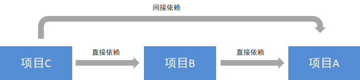
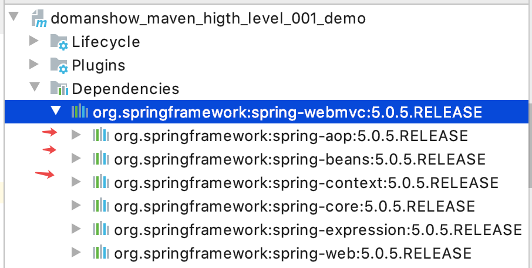
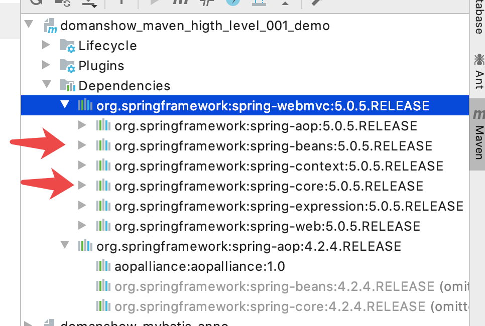
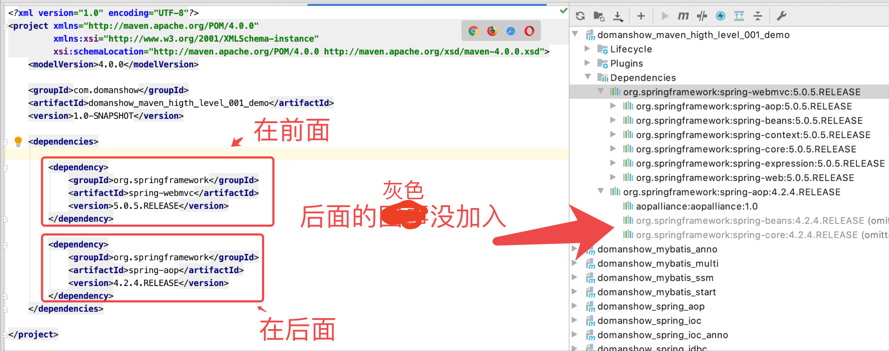
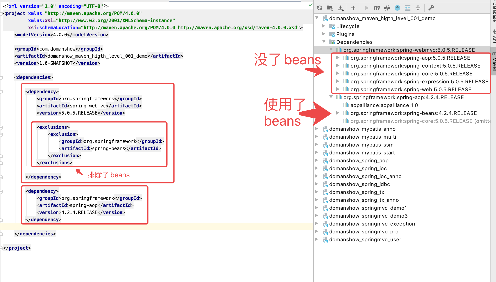
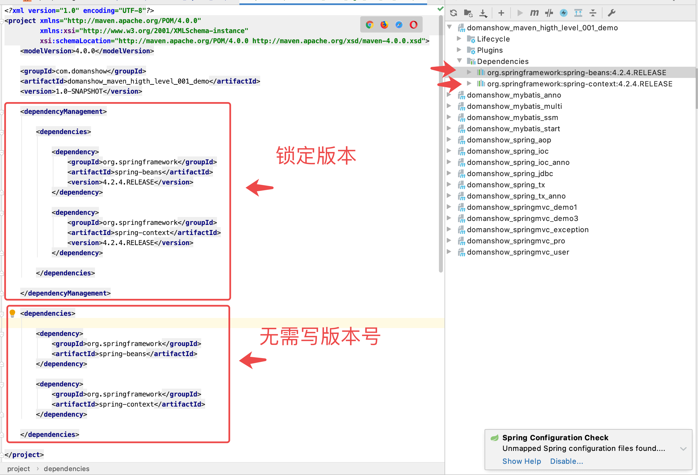

# 目录

1. [maven基础知识回顾](#maven001)
    1. [maven 介绍](#maven001a) 
    2. [maven的仓库类型](#maven001b)
    3. [maven的常用命令](#maven001c)
    4. [maven坐标书写规范](#maven001d)
    5. [maven 的依赖范围](#maven001e)
2. [maven的依赖传递](#maven002)
    1. [依赖传递](#maven002a) 
    2. [依赖冲突](#maven002b)
    3. [解决依赖冲突](#maven002c)
    4. [第一声明者优先原则](#maven002d)
    5. [排除依赖](#maven002e)
    6. [版本锁定](#maven002f)
3. [基于maven构建SSM工程案例](#maven003)
    1. [需求描述](#maven003a)
    2. [构建maven工程](#maven003b)
4. [分模块构建maven工程](#maven004)
    1. [分模块构建maven工程分析](#maven004a)
    2. [maven工程的继承](#maven004b)
    3. [maven工程的聚合](#maven004c)
    4. [分模块构建maven工程具体实现](#maven004d)
5. [maven私服](#maven005)
    1. [私服说明](#maven005a)
    2. [搭建maven私服](#maven005b)
    3. [将项目发布到maven私服](#maven005c)
    4. [从私服下载jar到本地仓库](#maven005d)
     
6. [将第三方jar安装到本地仓库和maven私服](#maven006)
    1. [将第三方jar安装到本地仓库](#maven006a)
    2. [将第三方jar安装到maven私服](#maven006b)
     


### maven001
# 1. maven基础知识回顾

### maven001a
## 1.1 maven 介绍

- maven 是一个项目管理工具，主要作用是在项目开发阶段对Java项目进行依赖管理和项目构建。

- 依赖管理：就是对jar包的管理。通过导入maven坐标，就相当于将仓库中的jar包导入了当前项目中。

- 项目构建：通过maven的一个命令就可以完成项目从`清理`、`编译`、`测试`、`报告`、`打包`，`部署`整个过程。

### maven001b
## 1.2 maven的仓库类型

1. 本地仓库 

2. 远程仓库

- ①maven中央仓库（地址：http://repo2.maven.org/maven2/）

- ②maven私服（公司局域网内的仓库，需要自己搭建）

- ③其他公共远程仓库（例如apache提供的远程仓库，地址：http://repo.maven.apache.org/maven2/）


### maven001c
## 1.3 maven的常用命令

- `clean`：     清理

- `compile`：编译

- `test`：        测试

- `package`：打包

- `install`：    安装


### maven001d
## 1.4 maven坐标书写规范

略

### maven001e
## 1.5 maven 的依赖范围


| 依赖范围 | 对于编译classpath有效 | 对于测试classpath有效 | 对于运行时classpath有效 | 例子                        |
| -------- | --------------------- | --------------------- | ----------------------- | --------------------------- |
| compile  | Y                     | Y                     | Y                       | spring-core                 |
| test     | -                     | Y                     | -                       | Junit                       |
| provided | Y                     | Y                     | -                       | servlet-api                 |
| runtime  | -                     | Y                     | Y                       | JDBC驱动                    |
| system   | Y                     | Y                     | -                       | 本地的，maven仓库之外的类库 |


1. 默认的依赖范围是`compile`

```xml

<dependency>
    <groupId>jstl</groupId>
    <artifactId>jstl</artifactId>
    <version>1.2</version>
    <scope>compile</scope>
</dependency>


<dependency>
    <groupId>jstl</groupId>
    <artifactId>jstl</artifactId>
    <version>1.2</version>
    <scope>test</scope>
</dependency>

```


### maven002
# 2. maven的依赖传递

### maven002a
## 2.1 依赖传递

在maven中，依赖是可以传递的，假设存在三个项目，分别是项目A，项目B以及项目C。假设C依赖B，B依赖A，那么我们可以根据maven项目依赖的特征不难推出项目C也依赖A。





通过上面的图可以看到，我们的web项目直接依赖了`spring-webmvc`，而**spring-webmvc**依赖了`sping-aop`、`spring-beans`等。最终的结果就是在我们的web项目中间接依赖了`spring-aop`、`spring-beans`等。

### maven002b
## 2.2 依赖冲突

由于依赖传递现象的存在， spring-webmvc 依赖 `spirng-beans-5.0.5`，spring-aop 依赖 `spring-beans-4.2.4`，但是发现 `spirng-beans-5.0.5` 加入到了工程中，而我们希望 `spring-beans-4.2.4` 加入工程。这就造成了依赖冲突。



上图中灰色的就没有加入工程

### maven002c
## 2.3 解决依赖冲突

1. 使用maven提供的依赖调解原则 
    - 第一声明者优先原则
    - 路径近者优先原则
2. 排除依赖
3. 锁定版本 

### maven002d
## 2.4 第一声明者优先原则(晓得有这么回事就行, 一般不用这个去做)

在 pom 文件中定义依赖，以先声明的依赖为准。其实就是根据坐标导入的顺序来确定最终使用哪个传递过来的依赖



### maven002e
## 2.5 排除依赖

可以使用`exclusions`标签将传递过来的依赖排除出去。



通过上图可以看到`spirng-beans-5.0.5`被排除了依赖传递, 真正使用的是`spring-beans-4.2.4`

### maven002f
## 2.6 版本锁定

采用直接锁定版本的方法确定依赖jar包的版本，版本锁定后则不考虑依赖的声明顺序或依赖的路径，以锁定的版本为准添加到工程中，此方法在企业开发中经常使用。

版本锁定的使用方式：

- 第一步：在`dependencyManagement`标签中锁定依赖的版本

- 第二步：在`dependencies`标签中声明需要导入的`maven`坐标





```xml

<?xml version="1.0" encoding="UTF-8"?>
<project xmlns="http://maven.apache.org/POM/4.0.0"
         xmlns:xsi="http://www.w3.org/2001/XMLSchema-instance"
         xsi:schemaLocation="http://maven.apache.org/POM/4.0.0 http://maven.apache.org/xsd/maven-4.0.0.xsd">
    <modelVersion>4.0.0</modelVersion>

    <groupId>com.domanshow</groupId>
    <artifactId>domanshow_maven_higth_level_001_demo</artifactId>
    <version>1.0-SNAPSHOT</version>

    <dependencyManagement>

        <dependencies>

            <dependency>
                <groupId>org.springframework</groupId>
                <artifactId>spring-beans</artifactId>
                <version>4.2.4.RELEASE</version>
            </dependency>

            <dependency>
                <groupId>org.springframework</groupId>
                <artifactId>spring-context</artifactId>
                <version>4.2.4.RELEASE</version>
            </dependency>

        </dependencies>

    </dependencyManagement>

    <dependencies>

        <dependency>
            <groupId>org.springframework</groupId>
            <artifactId>spring-beans</artifactId>
        </dependency>

        <dependency>
            <groupId>org.springframework</groupId>
            <artifactId>spring-context</artifactId>
        </dependency>

    </dependencies>

</project>


<!--依赖排除实例-->

<!--<dependencies>-->

<!--<dependency>-->
<!--    <groupId>org.springframework</groupId>-->
<!--    <artifactId>spring-webmvc</artifactId>-->
<!--    <version>5.0.5.RELEASE</version>-->

<!--    <exclusions>-->
<!--        <exclusion>-->
<!--            <groupId>org.springframework</groupId>-->
<!--            <artifactId>spring-beans</artifactId>-->
<!--        </exclusion>-->
<!--    </exclusions>-->

<!--</dependency>-->

<!--<dependency>-->
<!--    <groupId>org.springframework</groupId>-->
<!--    <artifactId>spring-aop</artifactId>-->
<!--    <version>4.2.4.RELEASE</version>-->
<!--</dependency>-->

<!--</dependencies>-->

```


### maven003
# 3. 基于maven构建SSM工程案例

### maven003a
## 3.1 需求描述

### maven003b
## 3.2 构建maven工程


### maven004
# 4. 分模块构建maven工程

### maven004a
## 4.1 分模块构建maven工程分析


### maven004b
## 4.2 maven工程的继承

### maven004c
## 4.3 maven工程的聚合

### maven004d
## 4.4 分模块构建maven工程具体实现


### maven005
# 5. maven私服


### maven005a
## 5.1 私服说明

### maven005b
## 5.2 搭建maven私服

### maven005c
## 5.3 将项目发布到maven私服

### maven005d
## 5.4 从私服下载jar到本地仓库


### maven006
# 6. 将第三方jar安装到本地仓库和maven私服


### maven006a
## 6.1 将第三方jar安装到本地仓库

### maven006b
## 6.2 将第三方jar安装到maven私服

