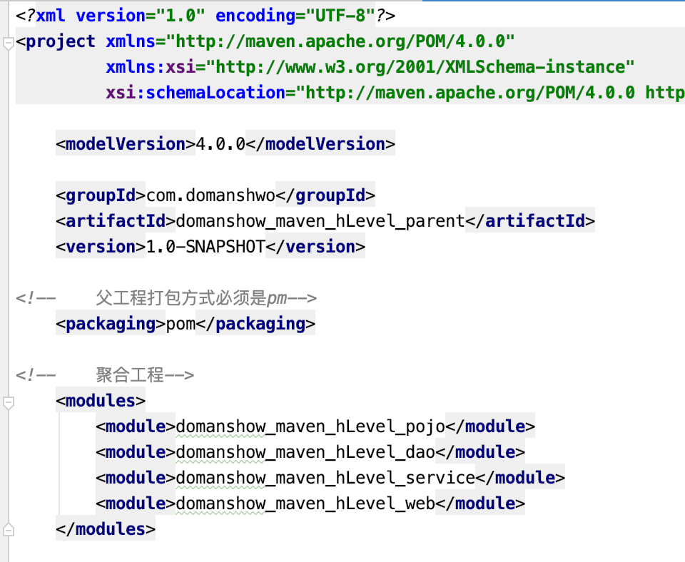
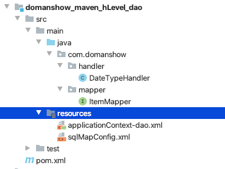
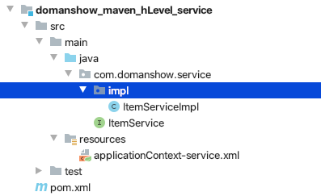
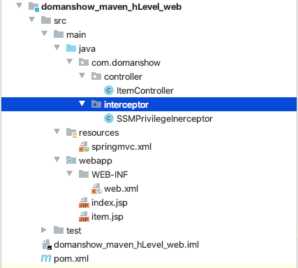

# 目录

1. [maven基础知识回顾](#maven001)
    1. [maven 介绍](#maven001a) 
    2. [maven的仓库类型](#maven001b)
    3. [maven的常用命令](#maven001c)
    4. [maven坐标书写规范](#maven001d)
    5. [maven 的依赖范围](#maven001e)
2. [maven的依赖传递](#maven002)
    1. [依赖传递](#maven002a) 
    2. [依赖冲突](#maven002b)
    3. [解决依赖冲突](#maven002c)
    4. [第一声明者优先原则](#maven002d)
    5. [排除依赖](#maven002e)
    6. [版本锁定](#maven002f)
3. [基于maven构建SSM工程案例](#maven003)
    1. [需求描述](#maven003a)
    2. [构建maven工程](#maven003b)
4. [分模块构建maven工程](#maven004)
    1. [分模块构建maven工程分析](#maven004a)
    2. [maven工程的继承](#maven004b)
    3. [maven工程的聚合](#maven004c)
    4. [分模块构建maven工程具体实现](#maven004d)
5. [maven私服](#maven005)
    1. [私服说明](#maven005a)
    2. [搭建maven私服](#maven005b)
    3. [将项目发布到maven私服](#maven005c)
    4. [从私服下载jar到本地仓库](#maven005d)
     
6. [将第三方jar安装到本地仓库和maven私服](#maven006)
    1. [将第三方jar安装到本地仓库](#maven006a)
    2. [将第三方jar安装到maven私服](#maven006b)
     


### maven001
# 1. maven基础知识回顾

### maven001a
## 1.1 maven 介绍

- maven 是一个项目管理工具，主要作用是在项目开发阶段对Java项目进行依赖管理和项目构建。

- 依赖管理：就是对jar包的管理。通过导入maven坐标，就相当于将仓库中的jar包导入了当前项目中。

- 项目构建：通过maven的一个命令就可以完成项目从`清理`、`编译`、`测试`、`报告`、`打包`，`部署`整个过程。

### maven001b
## 1.2 maven的仓库类型

1. 本地仓库 

2. 远程仓库

- ①maven中央仓库（地址：http://repo2.maven.org/maven2/）

- ②maven私服（公司局域网内的仓库，需要自己搭建）

- ③其他公共远程仓库（例如apache提供的远程仓库，地址：http://repo.maven.apache.org/maven2/）


### maven001c
## 1.3 maven的常用命令

- `clean`：     清理

- `compile`：编译

- `test`：        测试

- `package`：打包

- `install`：    安装


### maven001d
## 1.4 maven坐标书写规范

略

### maven001e
## 1.5 maven 的依赖范围


| 依赖范围 | 对于编译classpath有效 | 对于测试classpath有效 | 对于运行时classpath有效 | 例子                        |
| -------- | --------------------- | --------------------- | ----------------------- | --------------------------- |
| compile  | Y                     | Y                     | Y                       | spring-core                 |
| test     | -                     | Y                     | -                       | Junit                       |
| provided | Y                     | Y                     | -                       | servlet-api                 |
| runtime  | -                     | Y                     | Y                       | JDBC驱动                    |
| system   | Y                     | Y                     | -                       | 本地的，maven仓库之外的类库 |


1. 默认的依赖范围是`compile`

```xml

<dependency>
    <groupId>jstl</groupId>
    <artifactId>jstl</artifactId>
    <version>1.2</version>
    <scope>compile</scope>
</dependency>


<dependency>
    <groupId>jstl</groupId>
    <artifactId>jstl</artifactId>
    <version>1.2</version>
    <scope>test</scope>
</dependency>

```


### maven002
# 2. maven的依赖传递

### maven002a
## 2.1 依赖传递

在maven中，依赖是可以传递的，假设存在三个项目，分别是项目A，项目B以及项目C。假设C依赖B，B依赖A，那么我们可以根据maven项目依赖的特征不难推出项目C也依赖A。


通过上面的图可以看到，我们的web项目直接依赖了`spring-webmvc`，而**spring-webmvc**依赖了`sping-aop`、`spring-beans`等。最终的结果就是在我们的web项目中间接依赖了`spring-aop`、`spring-beans`等。

### maven002b
## 2.2 依赖冲突

由于依赖传递现象的存在， spring-webmvc 依赖 `spirng-beans-5.0.5`，spring-aop 依赖 `spring-beans-4.2.4`，但是发现 `spirng-beans-5.0.5` 加入到了工程中，而我们希望 `spring-beans-4.2.4` 加入工程。这就造成了依赖冲突。


上图中灰色的就没有加入工程

### maven002c
## 2.3 解决依赖冲突

1. 使用maven提供的依赖调解原则 
    - 第一声明者优先原则
    - 路径近者优先原则
2. 排除依赖
3. 锁定版本 

### maven002d
## 2.4 第一声明者优先原则(晓得有这么回事就行, 一般不用这个去做)

在 pom 文件中定义依赖，以先声明的依赖为准。其实就是根据坐标导入的顺序来确定最终使用哪个传递过来的依赖


### maven002e
## 2.5 排除依赖

可以使用`exclusions`标签将传递过来的依赖排除出去。


通过上图可以看到`spirng-beans-5.0.5`被排除了依赖传递, 真正使用的是`spring-beans-4.2.4`

### maven002f
## 2.6 版本锁定

采用直接锁定版本的方法确定依赖jar包的版本，版本锁定后则不考虑依赖的声明顺序或依赖的路径，以锁定的版本为准添加到工程中，此方法在企业开发中经常使用。

版本锁定的使用方式：

- 第一步：在`dependencyManagement`标签中锁定依赖的版本

- 第二步：在`dependencies`标签中声明需要导入的`maven`坐标


```xml

<?xml version="1.0" encoding="UTF-8"?>
<project xmlns="http://maven.apache.org/POM/4.0.0"
         xmlns:xsi="http://www.w3.org/2001/XMLSchema-instance"
         xsi:schemaLocation="http://maven.apache.org/POM/4.0.0 http://maven.apache.org/xsd/maven-4.0.0.xsd">
    <modelVersion>4.0.0</modelVersion>

    <groupId>com.domanshow</groupId>
    <artifactId>domanshow_maven_higth_level_001_demo</artifactId>
    <version>1.0-SNAPSHOT</version>

    <dependencyManagement>

        <dependencies>

            <dependency>
                <groupId>org.springframework</groupId>
                <artifactId>spring-beans</artifactId>
                <version>4.2.4.RELEASE</version>
            </dependency>

            <dependency>
                <groupId>org.springframework</groupId>
                <artifactId>spring-context</artifactId>
                <version>4.2.4.RELEASE</version>
            </dependency>

        </dependencies>

    </dependencyManagement>

    <dependencies>

        <dependency>
            <groupId>org.springframework</groupId>
            <artifactId>spring-beans</artifactId>
        </dependency>

        <dependency>
            <groupId>org.springframework</groupId>
            <artifactId>spring-context</artifactId>
        </dependency>

    </dependencies>

</project>


<!--依赖排除实例-->

<!--<dependencies>-->

<!--<dependency>-->
<!--    <groupId>org.springframework</groupId>-->
<!--    <artifactId>spring-webmvc</artifactId>-->
<!--    <version>5.0.5.RELEASE</version>-->

<!--    <exclusions>-->
<!--        <exclusion>-->
<!--            <groupId>org.springframework</groupId>-->
<!--            <artifactId>spring-beans</artifactId>-->
<!--        </exclusion>-->
<!--    </exclusions>-->

<!--</dependency>-->

<!--<dependency>-->
<!--    <groupId>org.springframework</groupId>-->
<!--    <artifactId>spring-aop</artifactId>-->
<!--    <version>4.2.4.RELEASE</version>-->
<!--</dependency>-->

<!--</dependencies>-->

```


### maven003
# 3. 基于maven构建SSM工程案例

### maven003a
## 3.1 需求描述


本案例基于maven构建 SSM（Spring+SpringMVC+Mybatis）工程，通过maven坐标进行依赖管理。最终实现根据 id 查询商品信息的功能。

### maven003b
## 3.2 构建maven工程

### 3.2.1 建表

```sql

create database if not exists mavenHLevel character set utf8;

CREATE TABLE `t_item` (
  `id` int(11) NOT NULL auto_increment,
  `name` varchar(255) default NULL,
  `price` float default NULL,
  `createtime` datetime default NULL,
  `detail` varchar(255) default NULL,
  PRIMARY KEY  (`id`)
) ENGINE=InnoDB DEFAULT CHARSET=utf8

```

### 3.2.2 maven项目创建

详见ssm

### maven004
# 4. 分模块构建maven工程

### maven004a
## 4.1 分模块构建maven工程分析


### maven004b
## 4.2 maven工程的继承

在Java语言中，类之间是可以继承的，通过继承，子类就可以引用父类中非private的属性和方法。同样，在maven工程之间也可以继承，子工程继承父工程后，就可以使用在父工程中引入的依赖。继承的目的是为了消除重复代码。


### maven004c
## 4.3 maven工程的聚合

在maven工程的pom.xml文件中可以使用`<modules>`标签将其他maven工程聚合到一起，聚合的目的是为了进行统一操作。

例如拆分后的maven工程有多个，如果要进行打包，就需要针对每个工程分别执行打包命令，操作起来非常繁琐。这时就可以使用`<modules>`标签将这些工程统一聚合到maven工程中，需要打包的时候，只需要在此工程中执行一次打包命令，其下被聚合的工程就都会被打包了。



### maven004d
## 4.4 分模块构建maven工程具体实现

1. 父工程pom.xml

```xml

<?xml version="1.0" encoding="UTF-8"?>
<project xmlns="http://maven.apache.org/POM/4.0.0"
         xmlns:xsi="http://www.w3.org/2001/XMLSchema-instance"
         xsi:schemaLocation="http://maven.apache.org/POM/4.0.0 http://maven.apache.org/xsd/maven-4.0.0.xsd">

    <modelVersion>4.0.0</modelVersion>

    <groupId>com.domanshwo</groupId>
    <artifactId>domanshow_maven_hLevel_parent</artifactId>
    <version>1.0-SNAPSHOT</version>

<!--    父工程打包方式必须是pm-->
    <packaging>pom</packaging>

<!--    聚合工程-->
    <modules>
        <module>domanshow_maven_hLevel_pojo</module>
        <module>domanshow_maven_hLevel_dao</module>
        <module>domanshow_maven_hLevel_service</module>
        <module>domanshow_maven_hLevel_web</module>
    </modules>

<!--    jar包版本锁定-->
    <properties>
        <spring.version>5.0.5.RELEASE</spring.version>
        <springmvc.version>5.0.5.RELEASE</springmvc.version>
        <mybatis.version>3.4.5</mybatis.version>
    </properties>
    <!--锁定jar版本 父工程只进行jar包版本的锁定 -->
    <dependencyManagement>
        <dependencies>
            <!-- Mybatis -->
            <dependency>
                <groupId>org.mybatis</groupId>
                <artifactId>mybatis</artifactId>
                <version>${mybatis.version}</version>
            </dependency>


            <!-- springMVC -->
            <dependency>
                <groupId>org.springframework</groupId>
                <artifactId>spring-webmvc</artifactId>
                <version>${springmvc.version}</version>
            </dependency>
            <!-- spring -->
            <dependency>
                <groupId>org.springframework</groupId>
                <artifactId>spring-context</artifactId>
                <version>${spring.version}</version>
            </dependency>
            <dependency>
                <groupId>org.springframework</groupId>
                <artifactId>spring-core</artifactId>
                <version>${spring.version}</version>
            </dependency>
            <dependency>
                <groupId>org.springframework</groupId>
                <artifactId>spring-aop</artifactId>
                <version>${spring.version}</version>
            </dependency>
            <dependency>
                <groupId>org.springframework</groupId>
                <artifactId>spring-web</artifactId>
                <version>${spring.version}</version>
            </dependency>
            <dependency>
                <groupId>org.springframework</groupId>
                <artifactId>spring-expression</artifactId>
                <version>${spring.version}</version>
            </dependency>
            <dependency>
                <groupId>org.springframework</groupId>
                <artifactId>spring-beans</artifactId>
                <version>${spring.version}</version>
            </dependency>
            <dependency>
                <groupId>org.springframework</groupId>
                <artifactId>spring-aspects</artifactId>
                <version>${spring.version}</version>
            </dependency>
            <dependency>
                <groupId>org.springframework</groupId>
                <artifactId>spring-context-support</artifactId>
                <version>${spring.version}</version>
            </dependency>
            <dependency>
                <groupId>org.springframework</groupId>
                <artifactId>spring-test</artifactId>
                <version>${spring.version}</version>
            </dependency>
            <dependency>
                <groupId>org.springframework</groupId>
                <artifactId>spring-jdbc</artifactId>
                <version>${spring.version}</version>
            </dependency>
            <dependency>
                <groupId>org.springframework</groupId>
                <artifactId>spring-tx</artifactId>
                <version>${spring.version}</version>
            </dependency>
        </dependencies>
    </dependencyManagement>

    <build>
        <finalName>adsds</finalName>
        <plugins>
            <plugin>
                <groupId>org.apache.maven.plugins</groupId>
                <artifactId>maven-compiler-plugin</artifactId>
                <version>3.1</version>
                <configuration>
                    <source>1.8</source>
                    <target>1.8</target>
                    <encoding>UTF-8</encoding>
                </configuration>
            </plugin>
        </plugins>
    </build>
 </project>


```

2. pojo pom.xml


```xml

<?xml version="1.0" encoding="UTF-8"?>
<project xmlns="http://maven.apache.org/POM/4.0.0"
         xmlns:xsi="http://www.w3.org/2001/XMLSchema-instance"
         xsi:schemaLocation="http://maven.apache.org/POM/4.0.0 http://maven.apache.org/xsd/maven-4.0.0.xsd">

<!--    继承了domanshow_maven_hLevel_parent-->
    <parent>
        <artifactId>domanshow_maven_hLevel_parent</artifactId>
        <groupId>com.domanshwo</groupId>
        <version>1.0-SNAPSHOT</version>
    </parent>
    <modelVersion>4.0.0</modelVersion>

    <artifactId>domanshow_maven_hLevel_pojo</artifactId>

    <packaging>jar</packaging>

    <dependencies>

        <dependency>
            <groupId>log4j</groupId>
            <artifactId>log4j</artifactId>
            <version>1.2.12</version>
        </dependency>
        <dependency>
            <groupId>c3p0</groupId>
            <artifactId>c3p0</artifactId>
            <version>0.9.1.2</version>
        </dependency>

    </dependencies>
</project>

```

除了pom.xml 外还有一个那啥就是

```java

package com.domanshow.domain;

import java.util.Date;

public class Item {

    private Integer id;
    private String name;
    private Float price;
    private Date createtime;
    private String detail;

    public Integer getId() {
        return id;
    }

    public void setId(Integer id) {
        this.id = id;
    }

    public String getName() {
        return name;
    }

    public void setName(String name) {
        this.name = name;
    }

    public Float getPrice() {
        return price;
    }

    public void setPrice(Float price) {
        this.price = price;
    }

    public Date getCreatetime() {
        return createtime;
    }

    public void setCreatetime(Date createtime) {
        this.createtime = createtime;
    }

    public String getDetail() {
        return detail;
    }

    public void setDetail(String detail) {
        this.detail = detail;
    }

    @Override
  public String toString() {
        return "Item{" +
                "id=" + id +
                ", name='" + name + '\'' +
                ", price=" + price +
                ", createtime=" + createtime +
                ", detail='" + detail + '\'' +
                '}';
    }
}

```


3. **domanshow_maven_hLevel_dao**


```xml

<?xml version="1.0" encoding="UTF-8"?> <project xmlns="http://maven.apache.org/POM/4.0.0"
  xmlns:xsi="http://www.w3.org/2001/XMLSchema-instance"
  xsi:schemaLocation="http://maven.apache.org/POM/4.0.0 http://maven.apache.org/xsd/maven-4.0.0.xsd">
    <parent>
        <artifactId>domanshow_maven_hLevel_parent</artifactId>
        <groupId>com.domanshwo</groupId>
        <version>1.0-SNAPSHOT</version>
    </parent>
    <modelVersion>4.0.0</modelVersion>

    <artifactId>domanshow_maven_hLevel_dao</artifactId>

    <packaging>jar</packaging>

    <dependencies>
        <dependency>
            <groupId>com.domanshwo</groupId>
            <artifactId>domanshow_maven_hLevel_pojo</artifactId>
            <version>1.0-SNAPSHOT</version>
        </dependency>

        <!-- Mybatis和mybatis与spring的整合 -->
  <dependency>
            <groupId>org.mybatis</groupId>
            <artifactId>mybatis</artifactId>
        </dependency>

        <dependency>
            <groupId>org.mybatis</groupId>
            <artifactId>mybatis-spring</artifactId>
            <version>2.0.5</version>
        </dependency>

        <!-- MySql驱动 -->
  <dependency>
            <groupId>mysql</groupId>
            <artifactId>mysql-connector-java</artifactId>
            <version>5.1.32</version>
        </dependency>
        <!-- druid数据库连接池 -->
  <dependency>
            <groupId>com.alibaba</groupId>
            <artifactId>druid</artifactId>
            <version>1.0.9</version>
        </dependency>
        <!-- spring相关 -->
  <dependency>
            <groupId>org.springframework</groupId>
            <artifactId>spring-context</artifactId>
        </dependency>
        <dependency>
            <groupId>org.springframework</groupId>
            <artifactId>spring-core</artifactId>
        </dependency>
        <dependency>
            <groupId>org.springframework</groupId>
            <artifactId>spring-aop</artifactId>
        </dependency>
        <dependency>
            <groupId>org.springframework</groupId>
            <artifactId>spring-expression</artifactId>
        </dependency>
        <dependency>
            <groupId>org.springframework</groupId>
            <artifactId>spring-beans</artifactId>
        </dependency>
        <dependency>
            <groupId>org.springframework</groupId>
            <artifactId>spring-aspects</artifactId>
        </dependency>
        <dependency>
            <groupId>org.springframework</groupId>
            <artifactId>spring-context-support</artifactId>
        </dependency>
        <dependency>
            <groupId>org.springframework</groupId>
            <artifactId>spring-test</artifactId>
        </dependency>
        <dependency>
            <groupId>org.springframework</groupId>
            <artifactId>spring-jdbc</artifactId>
        </dependency>
        <dependency>
            <groupId>org.springframework</groupId>
            <artifactId>spring-tx</artifactId>
        </dependency>
        <!-- junit测试 -->
  <dependency>
            <groupId>junit</groupId>
            <artifactId>junit</artifactId>
            <version>4.12</version>
        </dependency>
    </dependencies>

</project>

```

applicationContext-dao.xml

```xml

<?xml version="1.0" encoding="UTF-8"?> <beans xmlns="http://www.springframework.org/schema/beans"
  xmlns:xsi="http://www.w3.org/2001/XMLSchema-instance"
  xmlns:context="http://www.springframework.org/schema/context"
  xmlns:tx="http://www.springframework.org/schema/tx"
  xmlns:aop="http://www.springframework.org/schema/aop"
  xsi:schemaLocation="http://www.springframework.org/schema/beans http://www.springframework.org/schema/beans/spring-beans.xsd
 http://www.springframework.org/schema/context http://www.springframework.org/schema/context/spring-context.xsd http://www.springframework.org/schema/tx http://www.springframework.org/schema/tx/spring-tx.xsd http://www.springframework.org/schema/aop http://www.springframework.org/schema/aop/spring-aop.xsd">

    <context:component-scan base-package="com.domanshow.mapper"></context:component-scan>

    <!--配置数据源信息，使用druid连接池-->
  <bean id="dataSource" class="com.alibaba.druid.pool.DruidDataSource">
        <property name="driverClassName" value="com.mysql.jdbc.Driver"/>
        <property name="url" value="jdbc:mysql://138.68.20.88:3306/mavenHLevel?characterEncoding=utf8"/>
        <property name="username" value="doukeyi"/>
        <property name="password" value="123456a7"/>
    </bean>

    <bean id="sqlSessionFactory" class="org.mybatis.spring.SqlSessionFactoryBean">
        <property name="dataSource" ref="dataSource"></property>

        <property name="typeAliasesPackage" value="com.domanshow.service"></property>
    </bean>

    <bean class="org.mybatis.spring.mapper.MapperScannerConfigurer">
        <property name="basePackage" value="com.domanshow.mapper"></property>
    </bean>

    <!--    增加一个自动提交事务
 下面的id 必须要命名为transactionManager, 一个字母都不能少卧槽 org.springframework.jdbc.datasource.DataSourceTransactionManager 2020年06月28日13:46:58 谨记谨记 -->  <bean id="transactionManager" class="org.springframework.jdbc.datasource.DataSourceTransactionManager">
        <property name="dataSource" ref="dataSource"></property>
    </bean>

</beans>

```

sqlMapConfig.xml

```xml

<?xml version="1.0" encoding="UTF-8" ?> <!DOCTYPE  configuration  PUBLIC  "-//mybatis.org//DTD Config 3.0//EN"  "http://mybatis.org/dtd/mybatis-3-config.dtd">   <configuration>

    <!--    注册类型处理器-->
  <typeHandlers>
        <typeHandler handler="com.domanshow.handler.DateTypeHandler"></typeHandler>
    </typeHandlers>

</configuration>

```


ItemMapper


```java

package com.domanshow.mapper;

import com.domanshow.domain.Item;
import org.apache.ibatis.annotations.Select;

public interface ItemMapper {

    @Select("select * from t_item where id=#{id}")
    public Item findWithId(int id);
}


```


DateTypeHandler

```java

package com.domanshow.handler;

import org.apache.ibatis.type.BaseTypeHandler;
import org.apache.ibatis.type.JdbcType;

import java.sql.CallableStatement;
import java.sql.PreparedStatement;
import java.sql.ResultSet;
import java.sql.SQLException;
import java.util.Date;

public class DateTypeHandler  extends BaseTypeHandler<Date> {

    /**
     * 将java类型 转换成 数据库类型
     * @param ps
     * @param i
     * @param date
     * @param jdbcType
     * @throws SQLException
     */
    public void setNonNullParameter(PreparedStatement ps, int i, Date date, JdbcType jdbcType) throws SQLException {

        long time = date.getTime();
        ps.setLong(i,time);
    }


    /**
     * 将数据库中类型 转换成java类型
     * @param rs
     * @param columnName
     * @return
     * @throws SQLException
     */
    public Date getNullableResult(ResultSet rs, String columnName) throws SQLException {

        long aLong = rs.getLong(columnName);
        Date date = new Date(aLong);

        return date;
    }

    /**
     * 将数据库中类型 转换成java类型
     * @param rs
     * @param columnIndex
     * @return
     * @throws SQLException
     */
    public Date getNullableResult(ResultSet rs, int columnIndex) throws SQLException {

        long aLong = rs.getLong(columnIndex);
        Date date = new Date(aLong);

        return date;
    }

    /**
     * 将数据库中类型 转换成java类型
     * @param cs
     * @param columnIndex
     * @return
     * @throws SQLException
     */
    public Date getNullableResult(CallableStatement cs, int columnIndex) throws SQLException {

        long aLong = cs.getLong(columnIndex);
        Date date = new Date(aLong);

        return date;
    }
}

```


4. **domanshow_maven_hLevel_service**


pom.xml
```xml


<?xml version="1.0" encoding="UTF-8"?> <project xmlns="http://maven.apache.org/POM/4.0.0"
  xmlns:xsi="http://www.w3.org/2001/XMLSchema-instance"
  xsi:schemaLocation="http://maven.apache.org/POM/4.0.0 http://maven.apache.org/xsd/maven-4.0.0.xsd">
    <parent>
        <artifactId>domanshow_maven_hLevel_parent</artifactId>
        <groupId>com.domanshwo</groupId>
        <version>1.0-SNAPSHOT</version>
    </parent>
    <modelVersion>4.0.0</modelVersion>

    <artifactId>domanshow_maven_hLevel_service</artifactId>

    <packaging>jar</packaging>

    <dependencies>

        <dependency>
            <groupId>com.domanshwo</groupId>
            <artifactId>domanshow_maven_hLevel_dao</artifactId>
            <version>1.0-SNAPSHOT</version>
        </dependency>

    </dependencies>

</project>

```

applicationContext-service.xml

```xml

<?xml version="1.0" encoding="UTF-8"?> <beans xmlns="http://www.springframework.org/schema/beans"
  xmlns:xsi="http://www.w3.org/2001/XMLSchema-instance"
  xmlns:context="http://www.springframework.org/schema/context"
  xmlns:tx="http://www.springframework.org/schema/tx"
  xmlns:aop="http://www.springframework.org/schema/aop"
  xsi:schemaLocation="http://www.springframework.org/schema/beans http://www.springframework.org/schema/beans/spring-beans.xsd
 http://www.springframework.org/schema/context http://www.springframework.org/schema/context/spring-context.xsd http://www.springframework.org/schema/tx http://www.springframework.org/schema/tx/spring-tx.xsd http://www.springframework.org/schema/aop http://www.springframework.org/schema/aop/spring-aop.xsd">

    <context:component-scan base-package="com.domanshow.service"></context:component-scan>
    <context:component-scan base-package="com.domanshow.mapper"></context:component-scan>

    <bean id="transactionManager" class="org.springframework.jdbc.datasource.DataSourceTransactionManager">
        <property name="dataSource" ref="dataSoure"></property>
    </bean>

    <tx:advice id="txAdvice">
        <tx:attributes>
            <tx:method name="*"/>
        </tx:attributes>
    </tx:advice>

    <aop:config>
        <aop:advisor advice-ref="txAdvice" pointcut="execution(* com.domanshow.service.impl.*.*(..))"></aop:advisor>
    </aop:config>

</beans>

```

5. **domanshow_maven_hLevel_web**



springmvc.xml

```xml

<?xml version="1.0" encoding="UTF-8"?> <beans xmlns="http://www.springframework.org/schema/beans"
  xmlns:xsi="http://www.w3.org/2001/XMLSchema-instance"
  xmlns:context="http://www.springframework.org/schema/context"
  xmlns:mvc="http://www.springframework.org/schema/mvc"
  xsi:schemaLocation="http://www.springframework.org/schema/beans http://www.springframework.org/schema/beans/spring-beans.xsd
 http://www.springframework.org/schema/context http://www.springframework.org/schema/context/spring-context.xsd http://www.springframework.org/schema/mvc http://www.springframework.org/schema/mvc/spring-mvc.xsd">

    <bean id="sqlSessionFactory" class="org.mybatis.spring.SqlSessionFactoryBean">
        <property name="dataSource" ref="dataSource"></property>

        <property name="typeAliasesPackage" value="com.domanshow.service"></property>
    </bean>

    <bean class="org.mybatis.spring.mapper.MapperScannerConfigurer">
        <property name="basePackage" value="com.domanshow.mapper"></property>
    </bean>

    <context:component-scan base-package="com.domanshow.controller"></context:component-scan>
    <context:component-scan base-package="com.domanshow.service"></context:component-scan>
    <context:component-scan base-package="com.domanshow.mapper"></context:component-scan>

    <bean class="org.springframework.web.servlet.view.InternalResourceViewResolver">

        <property name="prefix" value="/pages/"></property>
        <property name="suffix" value=".jsp"></property>
    </bean>

    <mvc:interceptors>

        <mvc:interceptor>

            <mvc:mapping path="/**"/>

            <mvc:exclude-mapping path="/**/fonts/*"/>
            <mvc:exclude-mapping path="/**/*.css"/>
            <mvc:exclude-mapping path="/**/*.js"/>
            <mvc:exclude-mapping path="/**/*.png"/>
            <mvc:exclude-mapping path="/**/*.gif"/>
            <mvc:exclude-mapping path="/**/*.jpg"/>
            <mvc:exclude-mapping path="/**/*.jpeg"/>
            <mvc:exclude-mapping path="/user/login"/>

            <bean class="com.domanshow.interceptor.SSMPrivilegeInerceptor"></bean>

        </mvc:interceptor>

    </mvc:interceptors>

    <mvc:annotation-driven></mvc:annotation-driven>
    <mvc:default-servlet-handler></mvc:default-servlet-handler>

</beans>

```


web.xml

```xml

<?xml version="1.0" encoding="UTF-8"?>
<web-app xmlns="http://xmlns.jcp.org/xml/ns/javaee"
         xmlns:xsi="http://www.w3.org/2001/XMLSchema-instance"
         xsi:schemaLocation="http://xmlns.jcp.org/xml/ns/javaee http://xmlns.jcp.org/xml/ns/javaee/web-app_4_0.xsd"
         version="4.0">

    <!--    解决乱码的过滤器-->
<!--    <filter>-->
<!--        <filter-name>CharacterEncodingFilter</filter-name>-->
<!--        <filter-class>org.springframework.web.filter.CharacterEncodingFilter</filter-class>-->
<!--        <init-param>-->
<!--            <param-name>encoding</param-name>-->
<!--            <param-value>UTF-8</param-value>-->
<!--        </init-param>-->
<!--    </filter>-->
<!--    <filter-mapping>-->
<!--        <filter-name>CharacterEncodingFilter</filter-name>-->
<!--        <url-pattern>/*</url-pattern>-->
<!--    </filter-mapping>-->

    <!--    全局参数初始化-->
    <context-param>
        <param-name>contextConfigLocation</param-name>
        <param-value>classpath*:applicationContext*.xml</param-value>
    </context-param>

    <!--    spring监听器-->
    <listener>
        <listener-class>org.springframework.web.context.ContextLoaderListener</listener-class>
    </listener>

    <servlet>
        <servlet-name>WTDispatcherServlet</servlet-name>
        <servlet-class>org.springframework.web.servlet.DispatcherServlet</servlet-class>
        <init-param>
            <param-name>contextConfigLocation</param-name>
            <param-value>classpath:springmvc.xml</param-value>
        </init-param>
        <load-on-startup>1</load-on-startup>
    </servlet>
    <servlet-mapping>
        <servlet-name>WTDispatcherServlet</servlet-name>
        <url-pattern>/</url-pattern>
    </servlet-mapping>


</web-app>

```


### maven005
# 5. maven私服


### maven005a
## 5.1 私服说明

### maven005b
## 5.2 搭建maven私服

### maven005c
## 5.3 将项目发布到maven私服

### maven005d
## 5.4 从私服下载jar到本地仓库


### maven006
# 6. 将第三方jar安装到本地仓库和maven私服


### maven006a
## 6.1 将第三方jar安装到本地仓库

### maven006b
## 6.2 将第三方jar安装到maven私服

