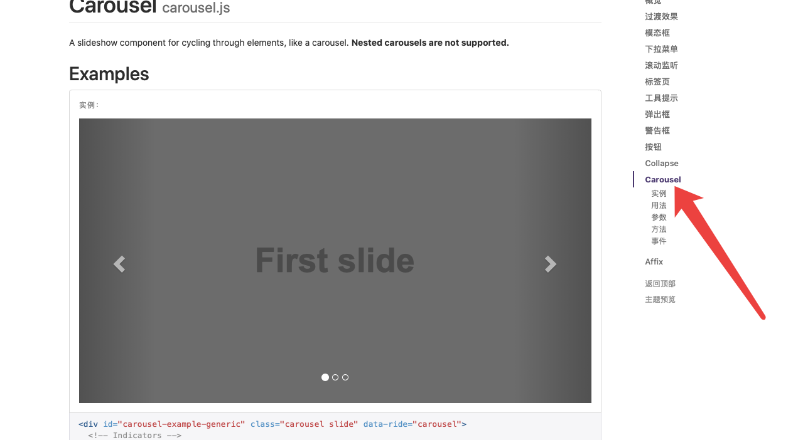

# 1. 快速入门

1. 下载文件
2. 下载jquery
3. 拖入项目
```html

<!DOCTYPE html>
<html lang="zh-CN">
<head>
    <meta charset="UTF-8">
    <meta http-equiv="X-UA-Compatible" content="IE=edge">
    <meta name="viewport" content="width=device-width, initial-scale=1">
<!--    规范,上面这三个mate标签一定要放到最前面, 老师这么说的我只是照办2020年01月01日10:48:18 -->
  <title>哈喽 boot strap </title>

<!--    引入bootstrap -->
  <link href="css/bootstrap.min.css" rel="stylesheet">

<!-- boot strap 的js 都依赖 jquery, 所以这个家伙必须在其他js之前 2020年01月01日10:53:00 -->
  <script src="js/jquery-3.2.1.min.js"></script>
<!--  加载bootstrap的 js  -->
  <script src="js/bootstrap.min.js"></script>
</head>

<body>

</body>
</html>

```


# 响应式布局

1. 定义容器(`container 两边留白` , `html
container-fluid 这个是100%`)
2. 定义行`row`
3. 定义元素

```html


<!DOCTYPE html>
<html lang="zh-CN">
<head>
    <meta charset="UTF-8">
    <meta http-equiv="X-UA-Compatible" content="IE=edge">
    <meta name="viewport" content="width=device-width, initial-scale=1">
    <!--    规范,上面这三个mate标签一定要放到最前面, 老师这么说的我只是照办2020年01月01日10:48:18 -->
  <title>哈喽 boot strap </title>

    <!--    引入bootstrap -->
  <link href="css/bootstrap.min.css" rel="stylesheet">

    <!-- boot strap 的js 都依赖 jquery, 所以这个家伙必须在其他js之前 2020年01月01日10:53:00 -->
  <script src="js/jquery-3.2.1.min.js"></script>
    <!--  加载bootstrap的 js  -->
  <script src="js/bootstrap.min.js"></script>

    <style>

        .inner{
            border: 1px solid red;
        }

        .gunnima{
            border: 1px solid black;
        }

    </style>
</head>

<body>

<!--1.定义容器--> <!--2.定义行--> <!--3.定义元素-->   <div class="container">

    <div class="row">

<!--        <div class="col-md-4">栅格</div>--> <!--        <div class="col-md-4 inner" >栅格</div>--> <!--        <div class="col-md-4 inner" >栅格</div>--> <!--        <div class="col-md-4 inner" >栅格</div>--> <!--        <div class="col-md-4 inner" >栅格</div>-->   <!--        <div class="col-md-4 gunnima" >什么鬼</div>-->      <div class="col-md-1 gunnima">栅格</div>
        <div class="col-md-1 gunnima">栅格</div>
        <div class="col-md-1 gunnima">栅格</div>
        <div class="col-md-1 gunnima">栅格</div>
        <div class="col-md-1 gunnima">栅格</div>
        <div class="col-md-1 gunnima">栅格</div>
        <div class="col-md-1 gunnima">栅格</div>
        <div class="col-md-1 gunnima">栅格</div>
        <div class="col-md-1 gunnima">栅格</div>
        <div class="col-md-1 gunnima">栅格</div>
        <div class="col-md-1 gunnima">栅格</div>
        <div class="col-md-1 gunnima">栅格</div>

    </div>

</div>

</body>
</html>

```


# 轮播图在插件那里




