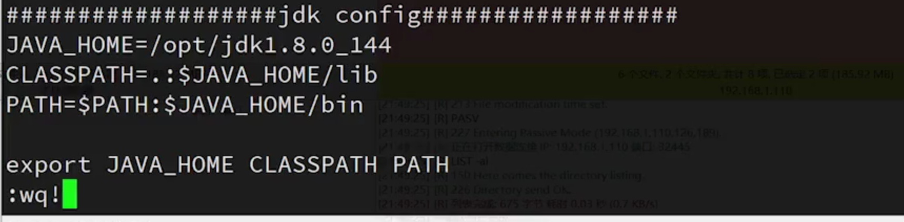
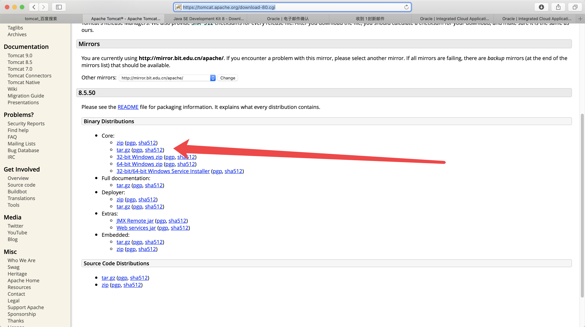
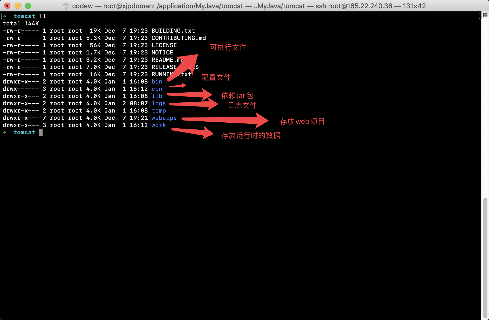

# jdk8 


[  下载 jdk8-downloads](https://www.oracle.com/technetwork/java/javase/downloads/jdk8-downloads-2133151.html)


下载文件如:`jdk-8u231-linux-x64.tar`  
解压: `tar xf jdk-8u231-linux-x64.tar`

## 配置路径


```c

vim /etc/profile

// 最后一行

JAVA_HOME=/application/MyJava/jdk

CLASSPATH=.:$JAVA_HOME/lib.tools.jar

PATH=$JAVA_HOME/bin:$PATH

export JAVA_HOME CLASSPATH PATH


//   使更改的配置立即生效

source /etc/profile


java -version

```

下面这个也可以



# Tomcat

[下载网站](https://tomcat.apache.org/download-80.cgi)



```c

// 解压
tar xf apache-tomcat-8.5.50.tar.gz


// 进入 bin 文件 执行启动脚本 startup.sh
cd bin

./startup.sh


```


# jdk 13下载


[去下载](https://www.oracle.com/technetwork/java/javase/downloads/jdk13-downloads-5672538.html)


# Tomcat的文件目录介绍




# 修改端口


```

cd tomcat/conf

vim server.xml

// 找到8080然后修改

// 停止服务器
// 启动服务器


```


# 部署

```

将html文件压缩成一个war包

然后直接将这个war 放到webapps文件夹下面就行了

```
