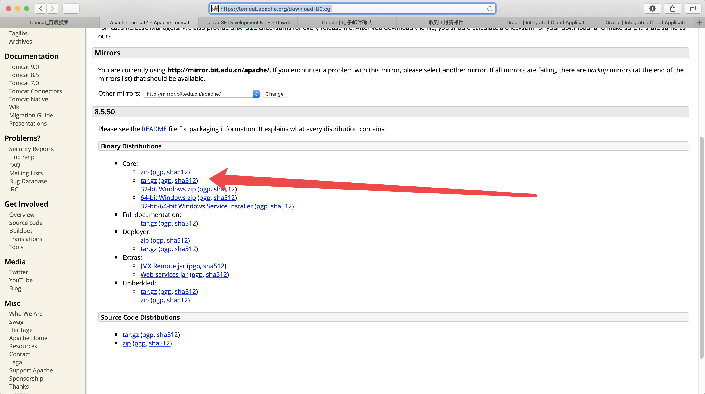
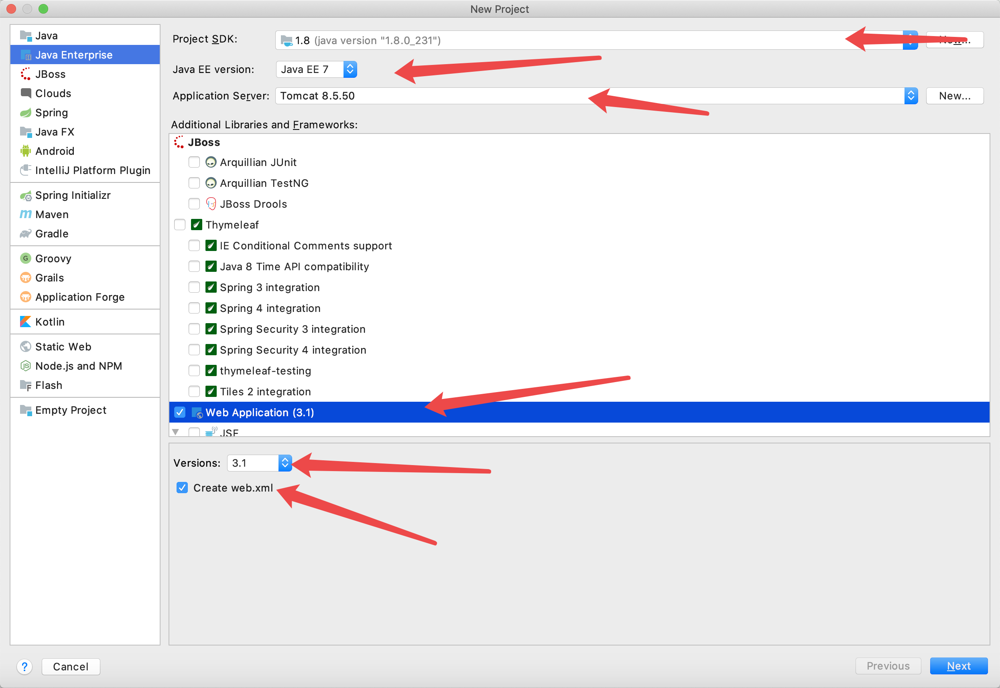
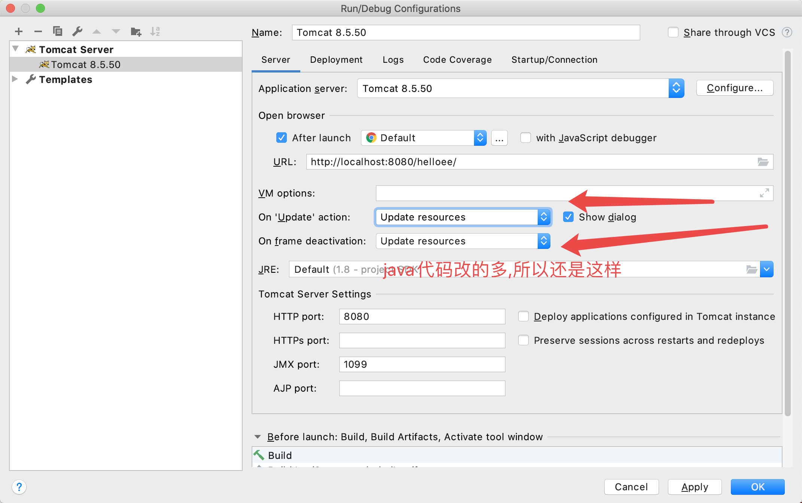

# Tomcat

[下载网站](https://tomcat.apache.org/download-80.cgi)



```c

// 解压
1 .tar xf apache-tomcat-8.5.50.tar.gz


2. 将解压后的文件夹 修改名字为 tomcat

3. 将tomcat 移动到  /Library

4. sudo chmod 755 /Library/Tomcat

5. cd bin

6. 进入 bin 文件 执行启动脚本 startup.sh
./startup.sh


```


# 上面安装启动 就仅仅只是一个展示..如果要用IDEA 集成Tomcat的时候一定要TMD 执行./shutdown.sh 先关掉, 我去他妈的这个是他妈的一个大坑.  你他妈的不关掉他,他妈的一直报他妈的404. 我滚他妈

2020年01月05日14:08:51 气死老子了. 我说一个他妈的hello word都起不来, 还玩他妈那个逼啊, 还玩.....2020年01月05日14:09:39
气死了


#  将Tomcat集成到IDEA


# 创建 JavaEE tomcat 项目




# IDEA 的热部署




