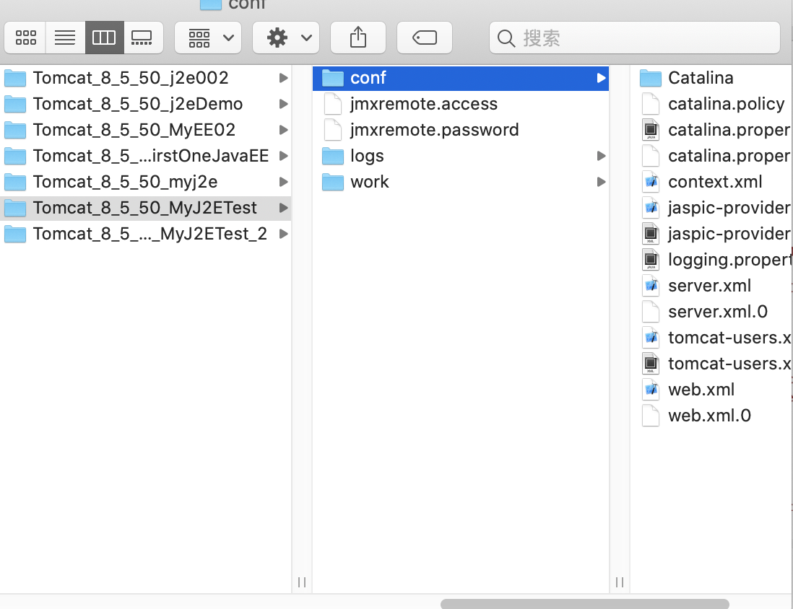

# servlet 快速入门

1. 创建javaEE项目
2. 定义一个类,实现Servlet接口
3. 实现接口中的方法
4. 配置Servlet

```xml

<servlet>
    <servlet-name>demo1</servlet-name>
    <servlet-class>com.domanshow.web.servlet.ServletDemo01</servlet-class>
</servlet>

<servlet-mapping>
    <servlet-name>demo1</servlet-name>
    <url-pattern>/demo1</url-pattern>
</servlet-mapping>

```


# Servlet 初识


```java


package com.domanshow.web.servlet;

import javax.servlet.*;
import java.io.IOException;
import java.util.Date;

public class ServletDemo01 implements Servlet {

    @Override
  public void init(ServletConfig servletConfig) throws ServletException {

    }

    @Override
  public ServletConfig getServletConfig() {
        return null;
    }

    @Override
  public void service(ServletRequest servletRequest, ServletResponse servletResponse) throws ServletException, IOException {
        System.out.println("hello....... +" + new Date());
    }

    @Override
  public String getServletInfo() {
        return null;
    }

    @Override
  public void destroy() {

    }

}


```


# Servlet 的执行原理


1. 当服务器接受到客户端浏览器的请求后，会解析请求URL路径，获取访问的Servlet的资源路径
2. 查找web.xml文件，是否有对应的<url-pattern>标签体内容。
3. 如果有，则在找到对应的<servlet-class>全类名
4. tomcat会将字节码文件加载进内存，并且创建其对象
5. 调用其方法


# Servlet 生命周期 初识

1. 初始化方法`init`: Servlet 被创建的时候执行,  有且仅执行一次. 

```java

@Override public void init(ServletConfig servletConfig) throws ServletException {
    System.out.println("init ......" + new Date());
}


```


可以通过配置`xml`. 让其对象跟随项目启动创建对象,. 然后了就执行`init`方法


2. 提供服务的方法`service` 调用一次就执行一次

```java

/**
 *这个方法是提供服务的方法, 调用一次就执行一次 * * @param servletRequest
  * @param servletResponse
  * @throws ServletException
 * @throws IOException
 */ 
 
 @Override 
 
 public void service(ServletRequest servletRequest, ServletResponse servletResponse) throws ServletException, IOException {
    System.out.println("hello....... +" + new Date());
}

```


3. 销毁方法`destroy`: 服务器正常关闭时执行, 其实和oc `dealloc`还是有所不同, oc针对的是对象销毁, 他也是,但是他`服务器正常关闭`相当于app被杀死, 而`dealloc`不需要杀死也会被执行

```java

/**
 *  死亡方法 *  相当于 dealloc */   
 
 @Override 
 
 public void destroy() {
    System.out.println("destroy .....");
}


```


4. `getServletConfig` 获取Servlet的配置对象, 暂时不实现
```java

@Override public ServletConfig getServletConfig() {
    return null;
}

```


5. `getServletInfo` 获取Servlet的一些信息(`版本`, `作者`.....), 了解一下,一般不会去实现它

```java

@Override public String getServletInfo() {
    return null;
}

```


# Servlet 生命周期 详解

### 初始化方法`init`: 配置它跟随服务器启动调用配置`<load-on-startup>`

1.大于等于0跟随服务器调用
2.小于0,第一次调用启动

```xml

<?xml version="1.0" encoding="UTF-8"?> <web-app xmlns="http://xmlns.jcp.org/xml/ns/javaee"
  xmlns:xsi="http://www.w3.org/2001/XMLSchema-instance"
  xsi:schemaLocation="http://xmlns.jcp.org/xml/ns/javaee http://xmlns.jcp.org/xml/ns/javaee/web-app_3_1.xsd"
  version="3.1">

    <!--    配置Servlet-->
  <servlet>
        <servlet-name>demo1</servlet-name>
        <servlet-class>com.domanshow.web.servlet.ServletDemo01</servlet-class>

<!--        指定, Servlet的创建时机   1.负数第一次访问创建, 默认就是: -1 2.在服务器启动时创建: 0或大于0   -->
  <load-on-startup>9</load-on-startup>
    </servlet>

    <servlet-mapping>
        <servlet-name>demo1</servlet-name>
        <url-pattern>/demo1</url-pattern>
    </servlet-mapping>

</web-app>

```


### Servlet 是单列

1. 多个用户同时访问就会出现线程安全问题

解决: 尽量不要在Servlet中定义成员变量. 即使定义了,也不要对其修改值

### 只有服务器正常关闭才会调用销毁方法`destroy`


# Servlet 注解配置: Servlet3.0

`Servlet3.0` 可以不在`xml`配置


## 步骤
1. 创建JavaEE 项目, 选择Servlet 3.0 以上, 可以不用勾选 web.xml
2. 定义一个类, 实现Servlet接口
3. 复写方法
4. 在类中使用@WebServlet注解, 进行配置


```java


package com.domanshow.web.servlet;

import javax.servlet.*;
import javax.servlet.annotation.WebServlet;
import java.io.IOException;

//@WebServlet(urlPatterns = "/demo") 
@WebServlet("/demo2")
public class ServletDemo implements Servlet {
    @Override
  public void init(ServletConfig servletConfig) throws ServletException {

    }

    @Override
  public ServletConfig getServletConfig() {
        return null;
    }

    @Override
  public void service(ServletRequest servletRequest, ServletResponse servletResponse) throws ServletException, IOException {
        System.out.println("Servlet 3.0 看看效果 ");
    }

    @Override
  public String getServletInfo() {
        return null;
    }

    @Override
  public void destroy() {

    }
}

```


# IDEA 与 Tomcat 的相关配置

## IDEA 把项目部署到哪里去了: 

`IDEA` 会为每一个`Tomcat` 部署的项目单独建立一份配置文件: 位置如下图

log截图


配置文件文件夹
```

CATALINA_BASE:         /Users/codew/Library/Caches/IntelliJIdea2019.3/tomcat/Tomcat_8_5_50_MyJ2ETest_2

```


 目录结构



进入conf文件就可以找到这个项目的部署路径

```xml

<Context path="/MyJ2ETest_war_exploded"  docBase="/Users/codew/Desktop/Net/java/MyJ2ETest/out/artifacts/MyJ2ETest_war_exploded" />

```

docBase就是项目存放的路径

## 工作空间项目 和 Tomcat部署的web项目

1. 工作空间项目    和     tomcat部署的web项目
* tomcat真正访问的是“tomcat部署的web项目”，"tomcat部署的web项目"对应着"工作空间项目" 的web目录下的所有资源
* WEB-INF目录下的资源不能被浏览器直接访问。
	
2. 断点调试：使用"小虫子"启动 dubug 启动


# Servlet 体系结构


Servlet -- 接口
    |
GenericServlet -- 抽象类
	|
HttpServlet  -- 抽象类


##  GenericServlet

- GenericServlet: 将Servlet接口中其他的方法做了默认空实现
- 基础它实现 `service()`方法即可

## HttpServlet

- 继承HttpServlet
- 复写doGet/doPost 方法


## Servlet 路径配置
1. 多地址 `@WebServlet({"/dd", "/tmd"})`
2. 多层路径 `@WebServlet("/demo02/cc2")`
3. 通配符: 
  1. 错误: `@WebServlet("wocao*")`
  2. 正确:`@WebServlet("*.wocao")`访问`http://localhost:8080/w.wocao`
  3. 不是通配:`@WebServlet("/wocao*")@WebServlet("/wocao*")`访问 `http://localhost:8080/wocao*`
  
    


# 遇到 的错误


## Error:java: invalid source release: 13

解决办法


## 中文显示

`-Dfile.encoding=UTF-8`


`-Dfile.encoding=UTF-8`


