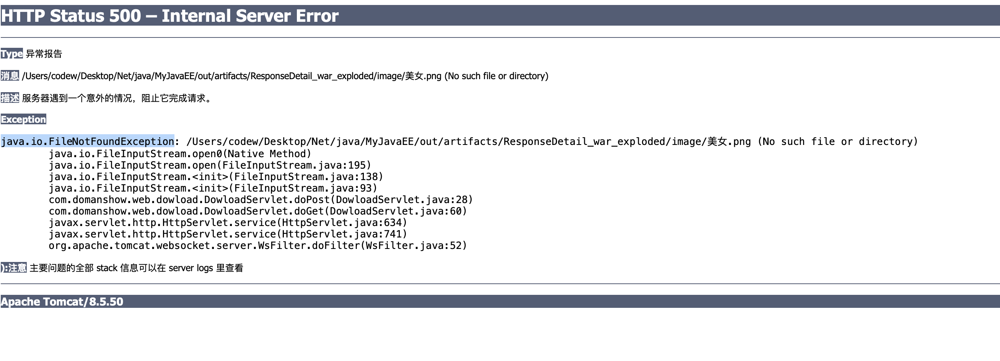

# 目录

# HTTP协议:
# Response对象
# ServletContext对象
# 案例:


# HTTP协议:

### 1. 请求消息
### 2. 响应消息

1. 相应状态码

- 状态码都是3位数字 
- 分类
  - 1xx：服务器就收客户端消息，但没有接受完成，等待一段时间后，发送1xx多状态码
  - 2xx：成功。代表：200
  - 3xx：重定向。代表：302(重定向)，304(访问缓存)
  - 4xx：客户端错误。
  - 5xx：服务器端错误。代表：500(服务器内部出现异常)

2. 响应头:
- 格式：头名称： 值
- 常见的响应头
  - Content-Type：服务器告诉客户端本次响应体数据格式以及编码格式
  - Content-disposition：服务器告诉客户端以什么格式打开响应体数据
    - `in-line`:默认值,在当前页面内打开
    - `attachment;filename=xxx`：以附件形式打开响应体。文件下载
### 3. 响应空行

### 4. 响应体: 传输的数据

```

HTTP/1.1 200 
Content-Type: text/html;charset=utf-8
Content-Length: 42
Date: Tue, 21 Jan 2020 03:11:12 GMT
Keep-Alive: timeout=20
Connection: keep-alive

响应数据

```


# Response对象

功能: 设置响应消息


### 1. 设置响应行

1. 格式：HTTP/1.1 200 ok
2. 设置状态码：setStatus(int sc) 
状态码设置
```java

@Override protected void doPost(HttpServletRequest req, HttpServletResponse resp) throws ServletException, IOException {

    resp.setStatus(200);
}

```


### 2. 设置响应头

```java


@Override protected void doPost(HttpServletRequest req, HttpServletResponse resp) throws ServletException, IOException {

    resp.setHeader("-", "-");
}

```


### 3. 设置响应体

1. 获取输出流
- 字符输出流: `PrintWriter writer = resp.getWriter();`

```java

@Override protected void doPost(HttpServletRequest req, HttpServletResponse resp) throws ServletException, IOException {

    PrintWriter writer = resp.getWriter();
    writer.write("shawanyi?");
}

```


- 字节输出流:


2. 使用输出流, 将数据输出到客户端浏览器


## 重定向

### 重定向

啥玩意?: 资源跳转
代码:

```java

@Override protected void doPost(HttpServletRequest req, HttpServletResponse resp) throws ServletException, IOException {

    resp.setStatus(302);
    resp.sendRedirect("http://www.domanshow.com/app.apk");
}

```


### 重定向和转发


1. 重定向特点: `redirect`
- 地址栏发送变化
- 重定向可以访问其他站点资源
- 两次请求. 不能使用Request对象来共享数据


2. 转发的特点: forward
- 地址栏不变
- 转发只能访问当前服务器资源
- 一次请求. 可以使用Request对象来共享数据


## 相对路径和绝对路径

### 相对路径

`不能确定唯一资源`, 如 `./index.html`

规则: 找到当前资源和目标资源之间的相对位置关系
- ./: 当前目录
- ../: 上级目录


### 绝对路径


`可以确定唯一资源`, 如`http://www.domanshow.com/app.apk`

`以/开头的路径`

规则:  判断定义的路径是给谁用的? 判断请求将来从哪儿出发

- 给客户端浏览器使用: 需要加虚拟目录(项目的访问路径)
  -  建议虚拟目录动态获取: `req.getContextPath()`
  - <a>, <form>重定向

- 给服务器使用: 不需要加虚拟目录
  - 转发路径


## 服务器输出字符数据到浏览器

### 步骤

- 1. 获取字符输出流
- 输出数据

### 乱码问题

```java

@Override protected void doPost(HttpServletRequest req, HttpServletResponse resp) throws ServletException, IOException {

    PrintWriter writer = resp.getWriter();
    writer.write("shawanyi?");
}

```

- 1. `resp.getWriter();` 获取的流默认编码是`ISO-8859-1`
- 2. 设置该流的默认编码
- 3. 告诉浏览器响应体使用的编码

简单的形式, 设置编码, 是在获取流之前设置

```java

@Override protected void doPost(HttpServletRequest req, HttpServletResponse resp) throws ServletException, IOException {

    resp.setContentType("text/html;charset=utf-8");
    PrintWriter printWriter = resp.getWriter();
    printWriter.write("你大爷啊~");

}

```


## 服务器输出字节数据到浏览器

```java

@Override protected void doPost(HttpServletRequest req, HttpServletResponse resp) throws ServletException, IOException {

    resp.setContentType("text/html;charset=utf-8");

    ServletOutputStream outputStream = resp.getOutputStream();
    outputStream.write("你愁啥".getBytes("utf-8"));
}

```

输出一个假图片
```java

@Override protected void doPost(HttpServletRequest req, HttpServletResponse resp) throws ServletException, IOException {

    int width = 100;
    int height = 50;

    // 创建图片对象, 在内存中的图片(验证码图片对象)
  BufferedImage image = new BufferedImage(width,height, BufferedImage.TYPE_INT_RGB);

    // 输出图片
  ImageIO.write(image, "png", resp.getOutputStream());
}

```

完整的代码

```java

/**
 * 图片验证码Demo * */     
@Override protected void doPost(HttpServletRequest req, HttpServletResponse resp) throws ServletException, IOException {

    int width = 100;
    int height = 50;

    // 创建图片对象, 在内存中的图片(验证码图片对象)
    BufferedImage image = new BufferedImage(width,height, BufferedImage.TYPE_INT_RGB);

    /**
 * 加点文字啥的 2020年01月28日12:18:15 * ====================================================== * */ // 填充背景色  
 
   Graphics graphics = image.getGraphics();
    graphics.setColor(Color.red);
    graphics.fillRect(0,0,width,height);

    // 画边框
    graphics.setColor(Color.BLACK);
    graphics.drawRect(0,0,width-1,height-1);

    /**
 * 开始写字了 * 4 个验证码 + 几条线 * */  
 
 String str = "ABCDEFGHIJKLMNOPQRSTUVWXYZabcdefghigklmnopqrstuvwxyz0123456789";

    Random random = new Random();

    for (int i = 1; i <= 4 ; i++) {

        int index = random.nextInt(str.length());

        char ch  =str.charAt(index);

        graphics.drawString(ch+" ", width/5*i, height/2);
    }

    // 画干扰线
    graphics.setColor(Color.yellow);
    for (int i = 0; i < 5; i++) {

        int x1 = random.nextInt(width);
        int x2 = random.nextInt(width);

        int y1 = random.nextInt(height);
        int y2 = random.nextInt(height);

        graphics.drawLine(x1,x2,y1,y2);
    }

    // 输出图片
    ImageIO.write(image, "png", resp.getOutputStream());
}

```


# ServletContext对象

## 1.概念

`ServletContext`代表整个web应用, 可以和程序的容器(服务器)来通信

2020年01月28日13:04:39
是不是用这个家伙就可以调用`FFmpeg`?

## 2.获取

- 1.通过`request`对象获取

- 2.通过`HttpServlet`对象来获取


```java

@Override protected void doPost(HttpServletRequest req, HttpServletResponse resp) throws ServletException, IOException {

    ServletContext context = this.getServletContext();

    ServletContext servletContext = req.getServletContext();
}

```


## 3.功能
- 1. 获取MIME类型

`MIME`类型: 在互联网通信过程中定义的一种文件数据类型
格式: 大类型/小类型 `text/html` , `image/jpeg`,  `application/json`

```java

@Override protected void doPost(HttpServletRequest req, HttpServletResponse resp) throws ServletException, IOException {

    ServletContext context = this.getServletContext();

    ServletContext servletContext = req.getServletContext();

    String fileName = "kk.json";

    System.out.println(context.getMimeType(fileName));
}

```

  
- 2. 域对象

设置公共参数, 谁都能访问


```java

@WebServlet("/servletContextDemo02")
public class ServletContextDemo02 extends HttpServlet {

    @Override
  protected void doPost(HttpServletRequest req, HttpServletResponse resp) throws ServletException, IOException {

        ServletContext context = this.getServletContext();
        context.setAttribute("psw","1234567a");
    }

    @Override
  protected void doGet(HttpServletRequest req, HttpServletResponse resp) throws ServletException, IOException {

        this.doPost(req,resp);
    }
}


@WebServlet("/servletContextDemo03")
public class ServletContextDemo03 extends HttpServlet {

    @Override
  protected void doPost(HttpServletRequest req, HttpServletResponse resp) throws ServletException, IOException {

        ServletContext context = this.getServletContext();
        String psw = (String) context.getAttribute("psw");
        System.out.println(psw);
    }

    @Override
  protected void doGet(HttpServletRequest req, HttpServletResponse resp) throws ServletException, IOException {

        this.doPost(req,resp);
    }
}

```


设置/获取/移除

```java

ServletContext context = this.getServletContext();
context.setAttribute("psw","1234567a");
context.getAttribute("psw");
context.removeAttribute("psw");


```


- 3. 获取文件的真实(服务器)路径

```java

@Override protected void doPost(HttpServletRequest req, HttpServletResponse resp) throws ServletException, IOException {

    ServletContext servletContext = this.getServletContext();

    /**
 * 1. 文件在src下面 * /Users//Desktop/Net/java/MyJavaEE/out/artifacts/ResponseDetail_war_exploded/WEB-INF/classes/e.txt * */     
 
    String eF = servletContext.getRealPath("/WEB-INF/classes/e.txt");
    System.out.println(eF);

    /**
 * 2. 在web目录最外面 * /Users//Desktop/Net/java/MyJavaEE/out/artifacts/ResponseDetail_war_exploded/w.text * */     

    String wPath = servletContext.getRealPath("/w.text");
    System.out.println(wPath);

    /**
 * 3. 在WEB-INF里面 * /Users//Desktop/Net/java/MyJavaEE/out/artifacts/ResponseDetail_war_exploded/WEB-INF/t.text * */    
 
 String tPath = servletContext.getRealPath("/WEB-INF/t.text");
    
 System.out.println(tPath);
}


```


# 文件下载案例


需求:
- 1. 页面显示超链接
- 2. 点击超链接后弹框下载提示框
- 3. 完成图片文件下载


分析:
- 1. 超链接指向的资源,如果浏览器能解析,就会展示不能解析就提示下载. 我们的要求是都tm下载
- 使用响应头设置资源的打开方式
  - `content-disposition:attachment;filename=xxx`


步骤:
1. 定义页面, 超链接指向`Servlet`, 传递资源名称
2. 定义 `Servlet`
    - 1. 获取文件名称
    - 2. 使用字节输入流加载文件进内场
    - 3. 指定`response`的响应头: `content-disposition:attachment;filename=xxx`
    - 4. 将数据写到`response`输出流


中文问题解决:

1. 获取客户端使用的浏览器版本信息
2. 根据不同版本信息, 设置`filename`不同不编码方式


# 500 文件找不到问题, 删除打包文件重新部署



删除`/Users/codew/Desktop/Net/java/MyJavaEE/out/artifacts/ResponseDetail_war_exploded`
