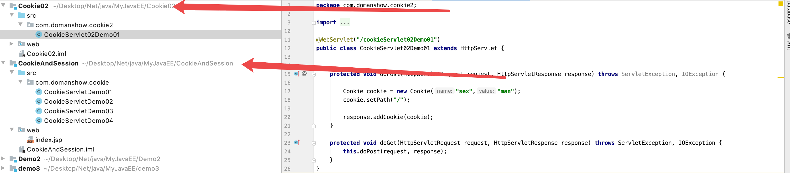
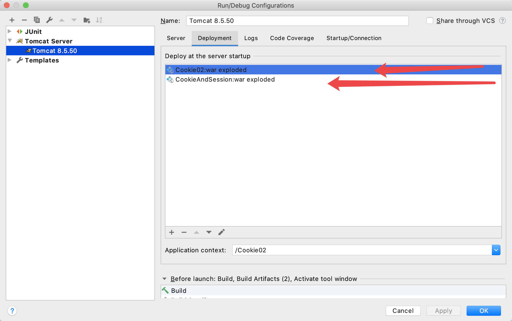

# 会话技术

1. 会话: 一次会话中包含多次请求和响应
    - 一次会话:  浏览器第一次给服务器资源发送请求, 会话建立建立, 直到有一方断开(杀死浏览器)为止
2. 功能: 在一次会话的范围内的多次请求间,共享数据
3. 方式: 
    - 客户端会话技术: `Cookie`
    - 服务端会话技术: `Session`

# Cookie

### 1. 概念: 客户端会话技术, 将数据保存到客户端
### 2. 快速入门

   - 1. 创建`Cookie`对象,绑定数据
   - 2. 发送`Cookie`对象
   - 3. `获取Cookie`, 拿到数据

```java


protected void doPost(HttpServletRequest request, HttpServletResponse response) throws ServletException, IOException {
    System.out.println("来了老弟!");

    // 1. 创建Cookie对象
  Cookie cookie = new Cookie("msg", "hi~");
    // 2. 发送Cookie
  response.addCookie(cookie);
}


protected void doPost(HttpServletRequest request, HttpServletResponse response) throws ServletException, IOException {

    /**
 * 2020年01月29日12:30:48 * */     
 
 // 1. 获取Cookie  
 
 Cookie[] cookies = request.getCookies();
  // 遍历Cookie
  if (cookies != null){

        for (Cookie cookie : cookies) {

            String name = cookie.getName();
            String value = cookie.getValue();

            System.out.println("name: " + name +" value:"+ value);
        }
    }
}


```

### 3. 实现原理

- 基于响应头`set-cookie`和请求`cookie`实现


### 4. Cookie的细节

- 1. 一次可不可以发送多个`Cookie`?

可以,如下
```java

protected void doPost(HttpServletRequest request, HttpServletResponse response) throws ServletException, IOException {

    Cookie cookie = new Cookie("msg", "hehe");
    Cookie cookie1 = new Cookie("pwd", "123a");

    response.addCookie(cookie);
    response.addCookie(cookie1);
}

```


- 2. Cookie存活时间

- 1. 默认关闭浏览器就挂了
- 2. 可以设置时间: `cookie.setMaxAge(秒);`
    - 整数就是多少秒,写文件
    - 负数:默认值
    - 0: 删除


```java


protected void doPost(HttpServletRequest request, HttpServletResponse response) throws ServletException, IOException {

    Cookie[] cookies = request.getCookies();
    if (cookies != null){

        for (Cookie cookie : cookies) {

            String name = cookie.getName();

            if (name.equals("msg")){

                System.out.println("逮到你了 mgs");
                cookie.setMaxAge(0);

                response.addCookie(cookie);
            }
        }
    }
}


```


- 3. Cookie存中文问题

  - Tomcat8之前不能直接存: 需要用URL编码(%编码)
  - Tomcat8之后可以直接存

时间: 2020年01月30日11:35:22
测试了下假的. 存不了, 还得编码

```java

protected void doPost(HttpServletRequest request, HttpServletResponse response) throws ServletException, IOException {
    System.out.println("来了老弟!");

    response.setContentType("text/html;charset=utf-8");

    // 1. 创建Cookie对象
  Cookie cookie = new Cookie("msg", "hi~");

    // 中文测试
  String s = "你瞅啥";
    s = URLEncoder.encode(s,"utf-8");
    Cookie cookie1 = new Cookie("nameValue", s);

    // 2. 发送Cookie
  response.addCookie(cookie);
    response.addCookie(cookie1);
}


```


- 4. Cookie共享问题

> 1. 同一个Tomcat部署多个web项目
> 默认情况Cookie不能共享
> `setPath("/");` 一下就可以了~





```java

protected void doPost(HttpServletRequest request, HttpServletResponse response) throws ServletException, IOException {

    Cookie cookie = new Cookie("sex","man");
    cookie.setPath("/");

    response.addCookie(cookie);
}

```


> 2. 不同Tomcat服务器之间cookie共享问题?

`cookie.setDomain();` 如果设置的一级域名相同, 那么多个服务器之间`cookie`可以共享
`setDomain(".baidu.com")`,那么`tieba.baidu.com`和`news.baidu.com`中cookie可以共享


### 5. Cookie的特点和作用

1. `cookie` 是的数据是存储在客户端浏览器
2. 浏览器对于单个`cookie`的大小有限制(4kb)
3. 同一个域名下的总cookie数量也有限制(20个)

作用:
1. `cookie`一般用于存储少量的不太敏感的数据
2. 在不登陆的情况下, 完成部分认证

### 6. 案例: 记住上一次


# JSP初识

# Session

# 案例


