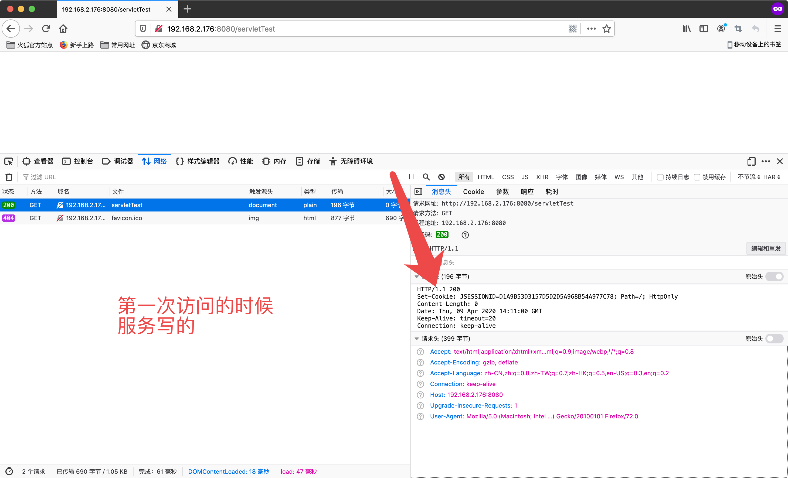
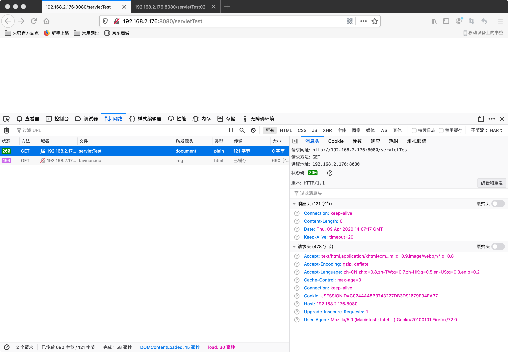
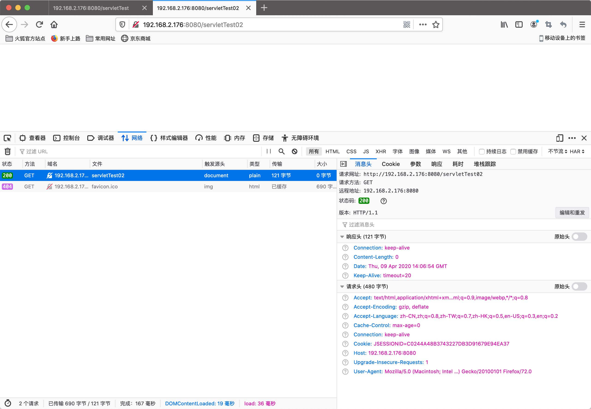

# Session

# 1. 概念
和`cookie`形成对比的是它是存在服务端的一个针对会话存储`共享数据`的技术


# 2. 快速入门

1. 获取 `HttpSession`对象

```java

package com.domanshow.session;

import javax.servlet.ServletException;
import javax.servlet.annotation.WebServlet;
import javax.servlet.http.HttpServlet;
import javax.servlet.http.HttpServletRequest;
import javax.servlet.http.HttpServletResponse;
import javax.servlet.http.HttpSession;
import java.io.IOException;
import java.util.Date;

@WebServlet("/servletTest")
public class ServletTest extends HttpServlet {
    protected void doPost(HttpServletRequest request, HttpServletResponse response) throws ServletException, IOException {

        // 1. 获取Session
  HttpSession session = request.getSession();

        // 2. 存储数据
  session.setAttribute("msg", "hello session 吃了没"+ new Date().toString());
    }

    protected void doGet(HttpServletRequest request, HttpServletResponse response) throws ServletException, IOException {
        this.doPost(request, response);
    }
}

```


2. 使用`HttpSession`对象

```java


package com.domanshow.session;

import javax.servlet.ServletException;
import javax.servlet.annotation.WebServlet;
import javax.servlet.http.HttpServlet;
import javax.servlet.http.HttpServletRequest;
import javax.servlet.http.HttpServletResponse;
import javax.servlet.http.HttpSession;
import java.io.IOException;

@WebServlet("/servletTest02")
public class ServletTest02 extends HttpServlet {
    protected void doPost(HttpServletRequest request, HttpServletResponse response) throws ServletException, IOException {

        // 1. 获取Session
  HttpSession session = request.getSession();

        Object msg = session.getAttribute("msg");

        System.out.println("你猜怎么着Content----->:"+ msg);
    }

    protected void doGet(HttpServletRequest request, HttpServletResponse response) throws ServletException, IOException {
        this.doPost(request, response);
    }
}

```


# 3. 原理

- `Session`的实现是依赖于Cookie




```

Host: 192.168.2.176:8080
User-Agent: Mozilla/5.0 (Macintosh; Intel Mac OS X 10.15; rv:72.0) Gecko/20100101 Firefox/72.0
Accept: text/html,application/xhtml+xml,application/xml;q=0.9,image/webp,*/*;q=0.8
Accept-Language: zh-CN,zh;q=0.8,zh-TW;q=0.7,zh-HK;q=0.5,en-US;q=0.3,en;q=0.2
Accept-Encoding: gzip, deflate
Connection: keep-alive
Cookie: JSESSIONID=C0244A48B3743227DB3D91679E94EA37
Upgrade-Insecure-Requests: 1
Cache-Control: max-age=0


```

# 4. 细节


