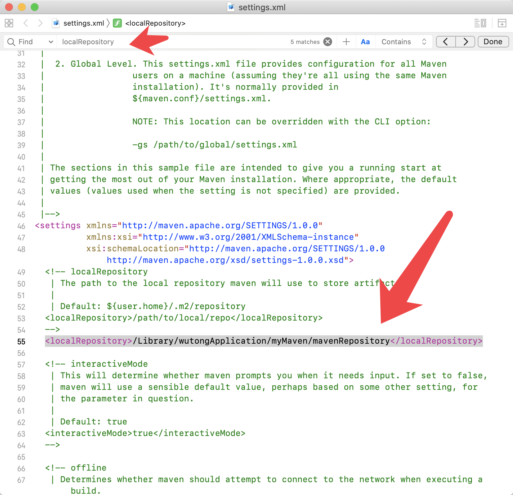
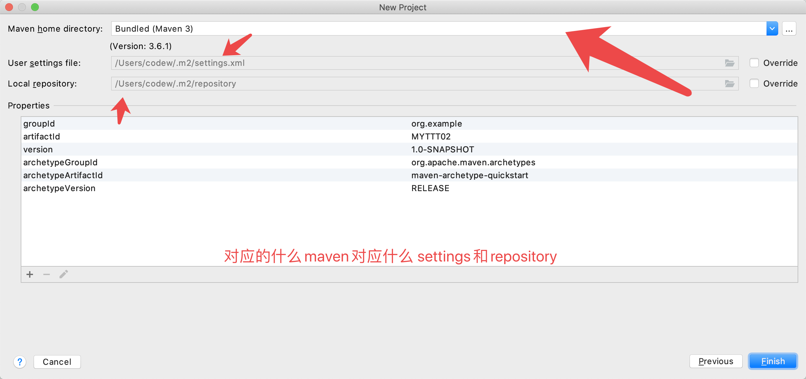
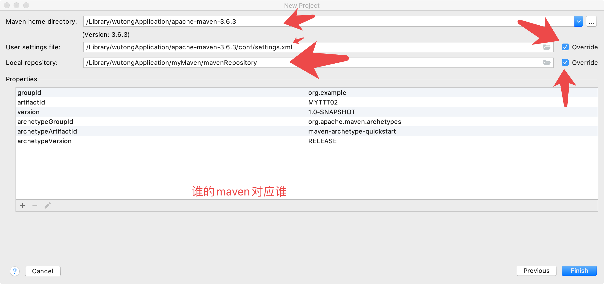
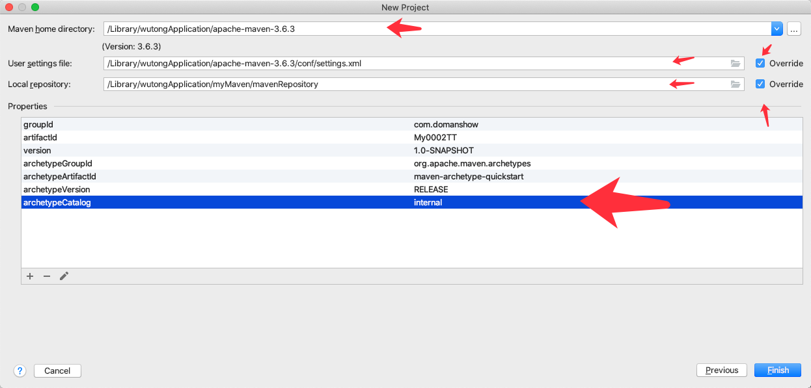
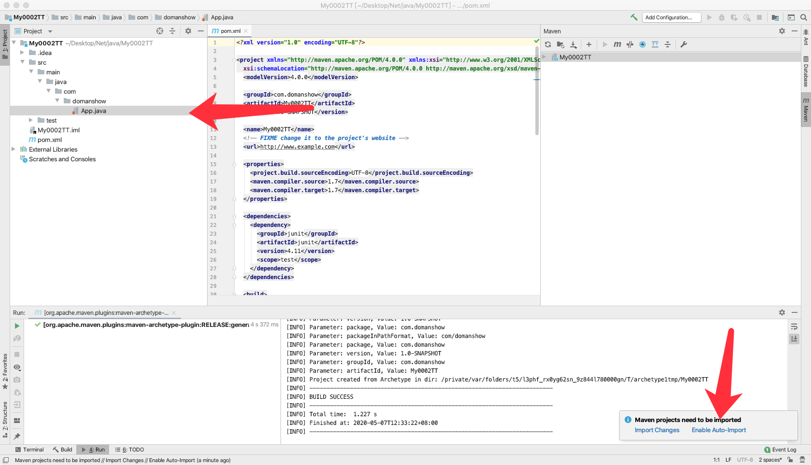
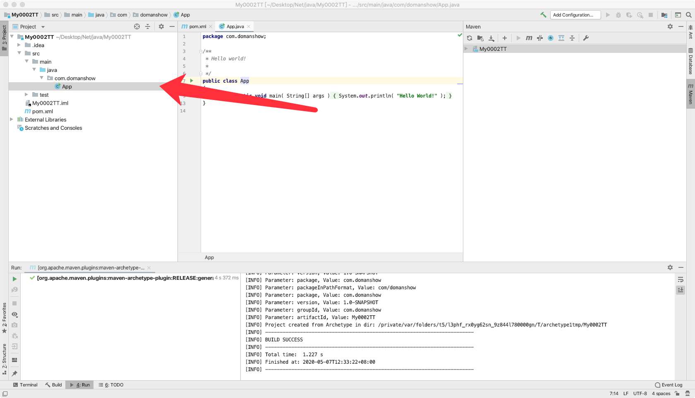
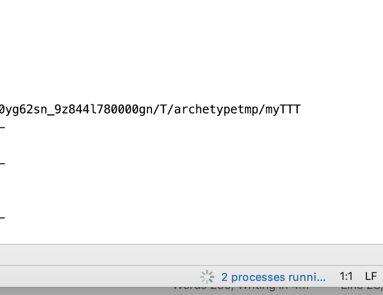
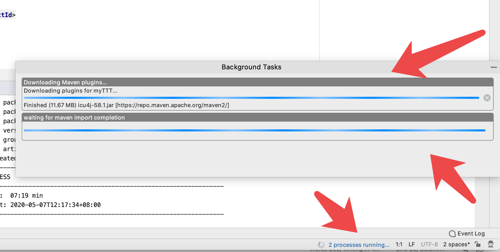

# 问题就是下面这个问题, 就一直卡在那里, 应该是去中央服务器下载文件去了
  [INFO] --- maven-archetype-plugin:3.1.2:generate (default-cli) @ standalone-


```

/Library/Java/JavaVirtualMachines/jdk1.8.0_231.jdk/Contents/Home/bin/java -Dmaven.multiModuleProjectDirectory=/private/var/folders/t5/l3phf_rx0yg62sn_9z844l780000gn/T/archetypetmp "-Dmaven.home=/Applications/IntelliJ IDEA.app/Contents/plugins/maven/lib/maven3" "-Dclassworlds.conf=/Applications/IntelliJ IDEA.app/Contents/plugins/maven/lib/maven3/bin/m2.conf" "-Dmaven.ext.class.path=/Applications/IntelliJ IDEA.app/Contents/plugins/maven/lib/maven-event-listener.jar" "-javaagent:/Applications/IntelliJ IDEA.app/Contents/lib/idea_rt.jar=60079:/Applications/IntelliJ IDEA.app/Contents/bin" -Dfile.encoding=UTF-8 -classpath "/Applications/IntelliJ IDEA.app/Contents/plugins/maven/lib/maven3/boot/plexus-classworlds-2.6.0.jar" org.codehaus.classworlds.Launcher -Didea.version2019.3.1 -DinteractiveMode=false -DgroupId=org.example -DartifactId=myTTT -Dversion=1.0-SNAPSHOT -DarchetypeGroupId=org.apache.maven.archetypes -DarchetypeArtifactId=maven-archetype-quickstart -DarchetypeVersion=RELEASE org.apache.maven.plugins:maven-archetype-plugin:RELEASE:generate
[INFO] Scanning for projects...
[INFO] 
[INFO] ------------------< org.apache.maven:standalone-pom >-------------------
[INFO] Building Maven Stub Project (No POM) 1
[INFO] --------------------------------[ pom ]---------------------------------
[INFO] 
[INFO] >>> maven-archetype-plugin:3.1.2:generate (default-cli) > generate-sources @ standalone-pom >>>
[INFO] 
[INFO] <<< maven-archetype-plugin:3.1.2:generate (default-cli) < generate-sources @ standalone-pom <<<
[INFO] 
[INFO] 
[INFO] --- maven-archetype-plugin:3.1.2:generate (default-cli) @ standalone-pom ---
[INFO] Generating project in Batch mode


```


# 解决办法

## 1. 先配置自己的maven的localRepository

```


`localRepository`
`/Users/codew/Library/wtApplication/apache-maven-3.6.3/conf/settings.xml`

<localRepository>/Library/wutongApplication/myMaven/mavenRepository</localRepository>
```




## 选择maven的时候 settings 和 repository要对应




## 当我们使用自己下载的maven而不是IDEA自己的时候我们添加archetypeCatalog=internal


## 让后进入工程选择 Enable Auto-Import



## 然后我们就看到 java文件由橘色变成了绿色了OK



## 注意IDEA 底部是不是有 processes runni....这是人家在下载文件我们可以点击它看看在下什么, 如果他自己下载太慢我们用服务器帮他下





```

/Library/Java/JavaVirtualMachines/jdk1.8.0_231.jdk/Contents/Home/bin/java -Dmaven.multiModuleProjectDirectory=/private/var/folders/t5/l3phf_rx0yg62sn_9z844l780000gn/T/archetypetmp -Dmaven.home=/Library/wutongApplication/apache-maven-3.6.3 -Dclassworlds.conf=/Library/wutongApplication/apache-maven-3.6.3/bin/m2.conf "-Dmaven.ext.class.path=/Applications/IntelliJ IDEA.app/Contents/plugins/maven/lib/maven-event-listener.jar" "-javaagent:/Applications/IntelliJ IDEA.app/Contents/lib/idea_rt.jar=60183:/Applications/IntelliJ IDEA.app/Contents/bin" -Dfile.encoding=UTF-8 -classpath /Library/wutongApplication/apache-maven-3.6.3/boot/plexus-classworlds.license:/Library/wutongApplication/apache-maven-3.6.3/boot/plexus-classworlds-2.6.0.jar org.codehaus.classworlds.Launcher -Didea.version2019.3.1 -s /Library/wutongApplication/apache-maven-3.6.3/conf/settings.xml -Dmaven.repo.local=/Library/wutongApplication/myMaven/mavenRepository -DinteractiveMode=false -DgroupId=org.example -DartifactId=MYTTT02 -Dversion=1.0-SNAPSHOT -DarchetypeGroupId=org.apache.maven.archetypes -DarchetypeArtifactId=maven-archetype-quickstart -DarchetypeVersion=RELEASE org.apache.maven.plugins:maven-archetype-plugin:RELEASE:generate
[INFO] Scanning for projects...
[INFO] 
[INFO] ------------------< org.apache.maven:standalone-pom >-------------------
[INFO] Building Maven Stub Project (No POM) 1
[INFO] --------------------------------[ pom ]---------------------------------
[INFO] 
[INFO] >>> maven-archetype-plugin:3.1.2:generate (default-cli) > generate-sources @ standalone-pom >>>
[INFO] 
[INFO] <<< maven-archetype-plugin:3.1.2:generate (default-cli) < generate-sources @ standalone-pom <<<
[INFO] 
[INFO] 
[INFO] --- maven-archetype-plugin:3.1.2:generate (default-cli) @ standalone-pom ---
[INFO] Generating project in Batch mode


```


```


archetypeCatalog=internal


-DarchetypeCatalog=internal

-DarchetypeCatalog=local


https://repo.maven.apache.org/maven2/org/apache/maven/

```


[INFO] Generating project in Batch mode

```

https://repo.maven.apache.org/maven2/archetype-catalog.xml

https://repo.maven.apache.org/maven2/org/apache/maven/archetypes/maven-archetype-bundles/2/maven-archetype-bundles-2.pom


/Users/codew/.m2/repository/org/apache/maven/archetype/maven-archetype/3.1.2


```

