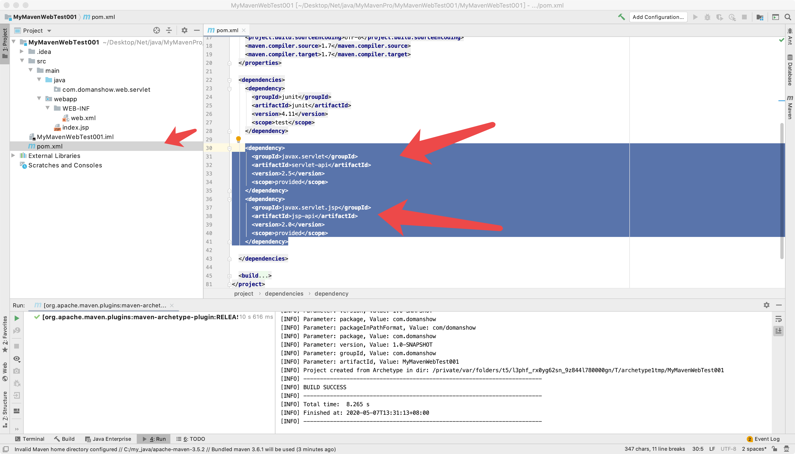
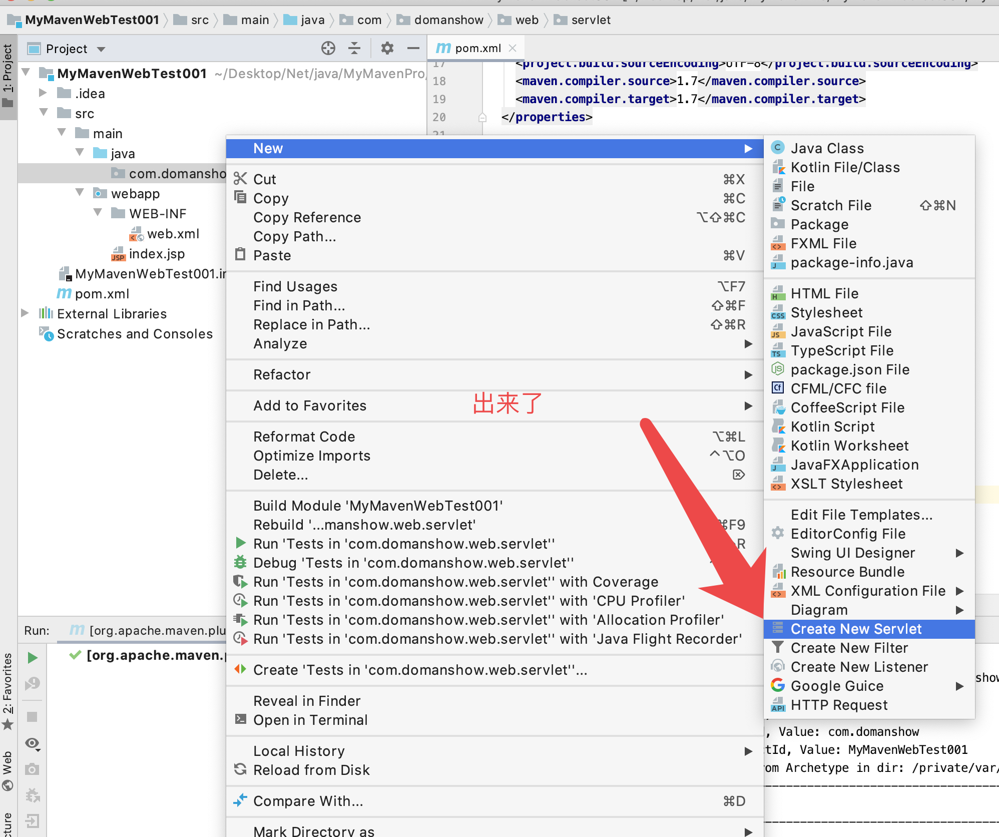

# 在pom.xml 文件加入

```xml

<dependency>
  <groupId>javax.servlet</groupId>
  <artifactId>servlet-api</artifactId>
  <version>2.5</version>
  <scope>provided</scope>
</dependency>
<dependency>
  <groupId>javax.servlet.jsp</groupId>
  <artifactId>jsp-api</artifactId>
  <version>2.0</version>
  <scope>provided</scope>
</dependency>


```






