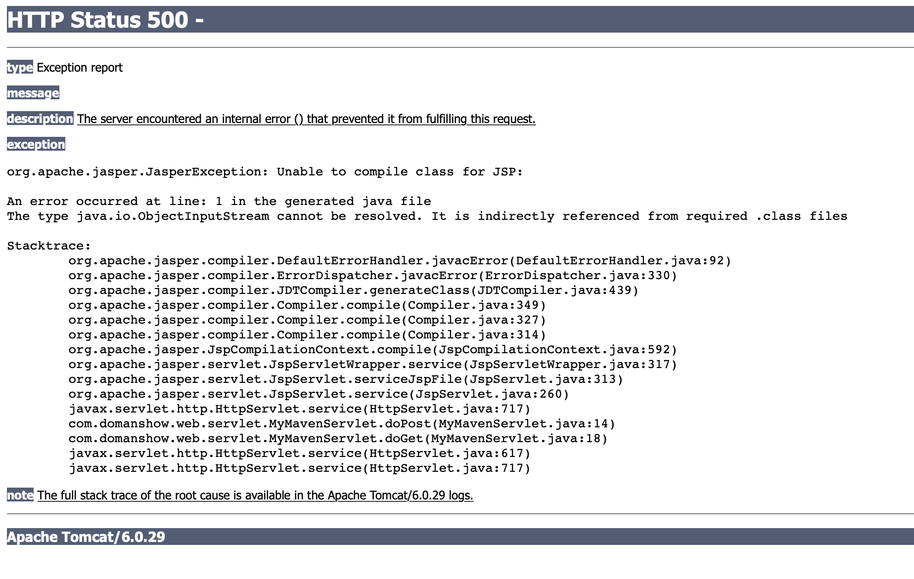

## maven自带tomcat6 问题

页面表现

```

# HTTP Status 500 - 

* * *

**type** Exception report

**message**

**description** The server encountered an internal error () that prevented it from fulfilling this request.

**exception**

org.apache.jasper.JasperException: Unable to compile class for JSP: 

An error occurred at line: 1 in the generated java file
The type java.io.ObjectInputStream cannot be resolved. It is indirectly referenced from required .class files

Stacktrace:
	org.apache.jasper.compiler.DefaultErrorHandler.javacError(DefaultErrorHandler.java:92)
	org.apache.jasper.compiler.ErrorDispatcher.javacError(ErrorDispatcher.java:330)
	org.apache.jasper.compiler.JDTCompiler.generateClass(JDTCompiler.java:439)
	org.apache.jasper.compiler.Compiler.compile(Compiler.java:349)
	org.apache.jasper.compiler.Compiler.compile(Compiler.java:327)
	org.apache.jasper.compiler.Compiler.compile(Compiler.java:314)
	org.apache.jasper.JspCompilationContext.compile(JspCompilationContext.java:592)
	org.apache.jasper.servlet.JspServletWrapper.service(JspServletWrapper.java:317)
	org.apache.jasper.servlet.JspServlet.serviceJspFile(JspServlet.java:313)
	org.apache.jasper.servlet.JspServlet.service(JspServlet.java:260)
	javax.servlet.http.HttpServlet.service(HttpServlet.java:717)
	com.domanshow.web.servlet.MyMavenServlet.doPost(MyMavenServlet.java:14)
	com.domanshow.web.servlet.MyMavenServlet.doGet(MyMavenServlet.java:18)
	javax.servlet.http.HttpServlet.service(HttpServlet.java:617)
	javax.servlet.http.HttpServlet.service(HttpServlet.java:717)

**note** The full stack trace of the root cause is available in the Apache Tomcat/6.0.29 logs.


```



IDEA 日志表现

```

五月 07, 2020 2:42:11 下午 org.apache.jasper.compiler.JDTCompiler$1 findType
严重: Compilation error
org.eclipse.jdt.internal.compiler.classfmt.ClassFormatException

```

```


五月 07, 2020 2:42:11 下午 org.apache.catalina.core.ApplicationDispatcher invoke
严重: Servlet.service() for servlet jsp threw exception
org.apache.jasper.JasperException: Unable to compile class for JSP: 

An error occurred at line: 1 in the generated java file
The type java.io.ObjectInputStream cannot be resolved. It is indirectly referenced from required .class files

Stacktrace:

```

```

五月 07, 2020 2:42:11 下午 org.apache.catalina.core.StandardWrapperValve invoke
严重: Servlet.service() for servlet MyMavenServlet threw exception
org.apache.jasper.JasperException: Unable to compile class for JSP: 

An error occurred at line: 1 in the generated java file
The type java.io.ObjectInputStream cannot be resolved. It is indirectly referenced from required .class files

Stacktrace:


```


## 解决办法

首先在pom.xml中加入, 让IDEA先去下载文件

```xml

<dependency>
  <groupId>org.apache.tomcat.maven</groupId>
  <artifactId>tomcat7-maven-plugin</artifactId>
  <version>2.2</version>
</dependency>


```


然后注释掉上面的, 然后再加下面

```

<plugin>
  <groupId>org.apache.tomcat.maven</groupId>
  <artifactId>tomcat7-maven-plugin</artifactId>
  <version>2.2</version>
</plugin>

```


