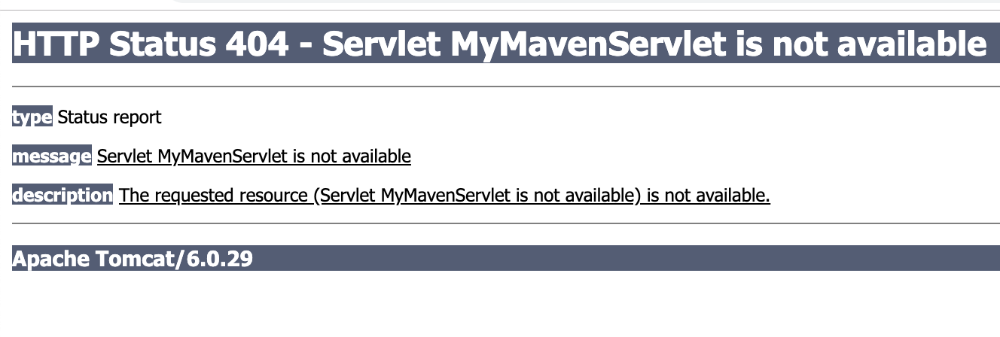
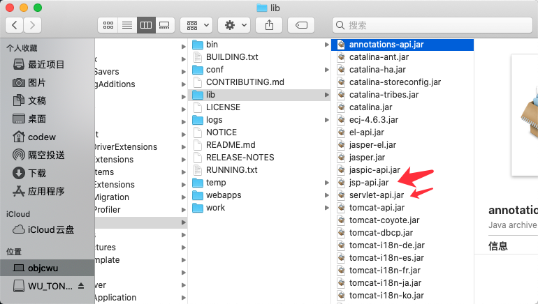
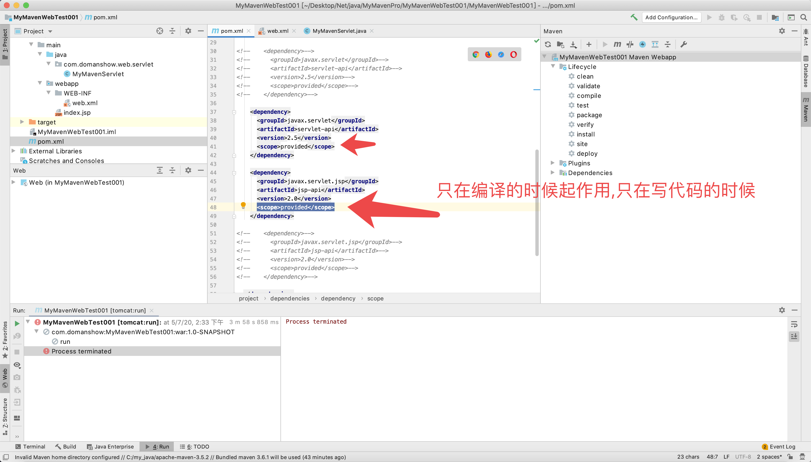

# lib冲突 放问出问题
**Allocate exception for servlet MyMavenServlet java.lang.ClassCastException: com.domanshow.web.servlet.MyMavenServlet cannot be cast to javax.servlet.Servlet**


```

严重: Allocate exception for servlet MyMavenServlet
java.lang.ClassCastException: com.domanshow.web.servlet.MyMavenServlet cannot be cast to javax.servlet.Servlet
	at org.apache.catalina.core.StandardWrapper.loadServlet(StandardWrapper.java:1116)
	at org.apache.catalina.core.StandardWrapper.allocate(StandardWrapper.java:809)
	at org.apache.catalina.core.StandardWrapperValve.invoke(StandardWrapperValve.java:129)
	at org.apache.catalina.core.StandardContextValve.invoke(StandardContextValve.java:191)
	at org.apache.catalina.core.StandardHostValve.invoke(StandardHostValve.java:127)
	at org.apache.catalina.valves.ErrorReportValve.invoke(ErrorReportValve.java:102)
	at org.apache.catalina.core.StandardEngineValve.invoke(StandardEngineValve.java:109)
	at org.apache.catalina.connector.CoyoteAdapter.service(CoyoteAdapter.java:298)
	at org.apache.coyote.http11.Http11Processor.process(Http11Processor.java:857)
	at org.apache.coyote.http11.Http11Protocol$Http11ConnectionHandler.process(Http11Protocol.java:588)
	at org.apache.tomcat.util.net.JIoEndpoint$Worker.run(JIoEndpoint.java:489)
	at java.lang.Thread.run(Thread.java:748)


```


这是因为出现了冲突, 我pom.xml引入的`servlet-api`, `javax.servlet.jsp`他们与Tomcat里lib文件下的jar包冲突了



####  解决办法

设置pom.xml引入的`servlet-api`, `javax.servlet.jsp`作用域, 说它只在写代码编译的时候起作用

`<scope>provided</scope>`



`<scope>test</scope>`只在测试的时候起作用


