# 清空历史

```

history -c 


history -d

```

# linux 命令登录 无密码
```sql

mysql -uroot -p

–mysql –u用户名 –p密码

```

# 退出mysql

```sql

quit;

```

# 改密码

```

mysqladmin -uroot -p123456 password 1234567

mysql -u root -p


```


# 充值root密码

### 方法一:
 在my.ini的[mysqld]字段加入：
skip-grant-tables
重启mysql服务，这时的mysql不需要密码即可登录数据库
 然后进入mysql
mysql>use mysql;
 mysql>更新 update user set password=password('新密码') WHERE User='root';
mysql>flush privileges;
 运行之后最后去掉my.ini中的skip-grant-tables，重启mysqld即可。
 

### 方法二:
 不使用修改my.ini重启服务的方法，通过非服务方式加skip-grant-tables运行mysql来修改mysql密码
 停止mysql服务
 打开命令行窗口，在bin目录下使用mysqld-nt.exe启动，即在命令行窗口执行: mysqld-nt --skip-grant-tables
 然后另外打开一个命令行窗口，登录mysql，此时无需输入mysql密码即可进入。
 按以上方法修改好密码后,关闭命令行运行mysql的那个窗口，此时即关闭了mysql，如果发现mysql仍在运行
 的话可以结束掉对应进程来关闭。
 启动mysql服务


# 数据库服务器, 数据库, 表关系
- 所谓安装数据库服务器，只是在机器上装了一个数据库管理程序;这个管理程序可以管理多个数据库，一般开发人员会针对每一个应用创建一个数据库。
- l为保存应用中实体的数据，一般会在数据库创建多个表，以保存程序中实体的数据。

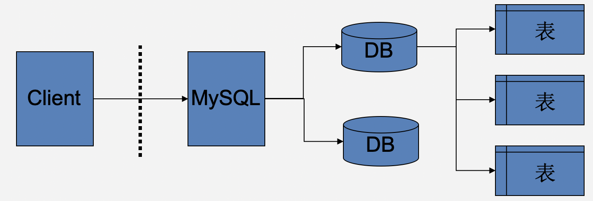


# 行是row  列是column


# SQL分类

- DDL (数据定义语句)
  - 数据定义语言 - Data Definition Language
  - 用来定义数据库的对象，如数据表、视图、索引等
- DML (数据操作语句)
  - 数据处理语言 - Data Manipulation Language
  - –在数据库表中更新，增加和删除记录
  - –如 update， insert， delete --- 增删改
- DCL (数据控制语句)
  - –数据控制语言 – Data Control Language
  - –指用于设置用户权限和控制事务语句
  - –如grant，revoke，if…else，while，begin transaction
- DQL (数据查询语句)
  - 数据查询语言 – Data Query Language
  - select


# 查看,删除数据库


```mysql

显示数据库语句：

SHOW DATABASES

显示数据库创建语句：

SHOW CREATE DATABASE db_name

数据库删除语句：

DROP DATABASE [IF EXISTS] db_name

```


# 修改数据库

```

l切换数据库 use db_name;

查看当前使用的数据库 select database();

```


# 创建表

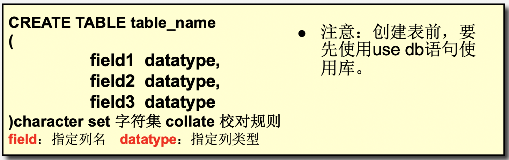


```c

CREATE TABLE `st` (
  `id` int(11) DEFAULT NULL,
  `name` varchar(255) DEFAULT NULL,
  `age` int(11) DEFAULT NULL,
  `class` varchar(255) DEFAULT NULL
) ENGINE=InnoDB DEFAULT CHARSET=utf8


```

# MYSQL常用数据类型

- 字符串型
- 大数据类型
- 数值型
- 逻辑型
- 日期型


# 数据库技术发展历程：

```text

1.层次数据库和网状数据库技术阶段；

 使用指针来表示数据之间的联系。

2.关系数据库技术阶段；

 经典的里程碑阶段。代表DBMS: Oracle、DB2、MySQL、SQL Server等。

3.后关系数据库技术阶段；

 关系型数据库存在数据模型，性能，拓展伸缩性的缺点，出现了：

 ORDBMS：面向对象数据库技术。

   NoSQL ：结构化数据库技术。


```


--------------------------------------------------------------
```text

随着大数据的不断发展，非关系型的数据库现在成了一个极其热门的新领域，非关系数据库产品的发展非常迅速，出色的NoSQL数据库：

常见的NoSQL数据库分为四大类：

1):键值存储数据库：Oracle BDB,Redis,BeansDB

2):列式储数数据库：HBase,Cassandra,Riak

3):文档型数据库：MongoDB,CouchDB

4):图形数据库：Neo4J,InfoGrid,Infinite Graph


```


# 存储引擎
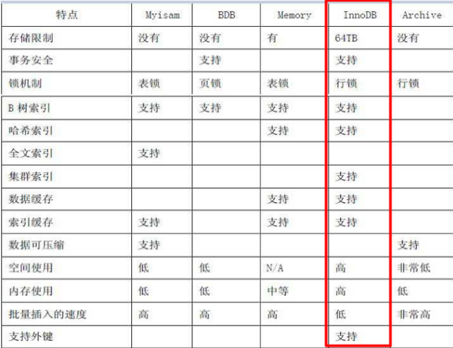

```

MySQL中的数据用各种不同的技术存储在文件（或者内存）中。这些技术中的每一种技术都使用不同的存储机制、索引技巧、锁定水平并且最终提供不同的功能和能力。

通过选择不同的技术，你能够获得额外的速度或者功能，从而改善你的应用的整体功能。

-------------------------------------------------------------------------------------

面试题:MyISAM和InnoDB各自的优缺点

MyISAM：拥有较高的插入，查询速度，但不支持事务，不支持外键。

InnoDB：支持事务，支持外键，支持行级锁定，性能较低。

InnoDB 存储引擎提供了具有提交、回滚和崩溃恢复能力的事务安全。但对比MyISAM，处理效率差，且会占用更多的磁盘空间以保留数据和索引。

没有事务是很恐怖的事情，一般都要选择InnDB

```


# MySQL 常用列类型


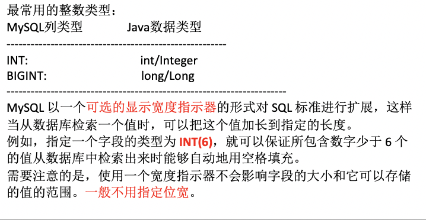
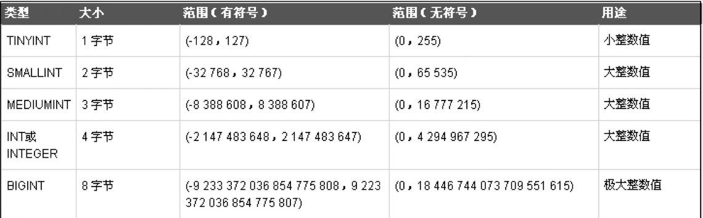
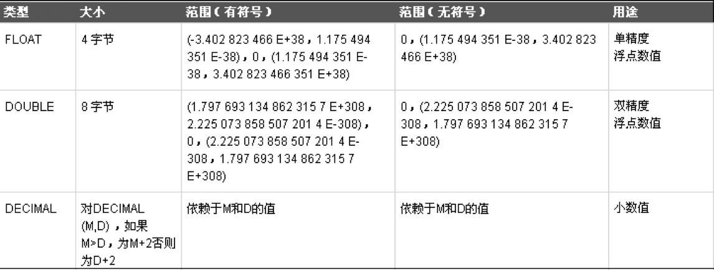
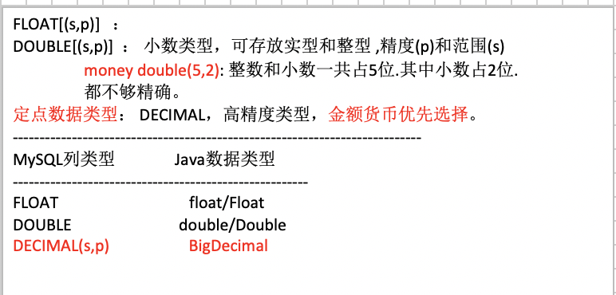
```

FLOAT[(s,p)] ：

DOUBLE[(s,p)] ： 小数类型，可存放实型和整型 ,精度(p)和范围(s)

  money double(5,2): 整数和小数一共占5位.其中小数占2位.

 都不够精确。

定点数据类型： DECIMAL，高精度类型，金额货币优先选择。

----------------------------------------------------------------------------

MySQL列类型 Java数据类型

-------------------------------------------------------

FLOAT float/Float

DOUBLE double/Double

DECIMAL(s,p) BigDecimal


```
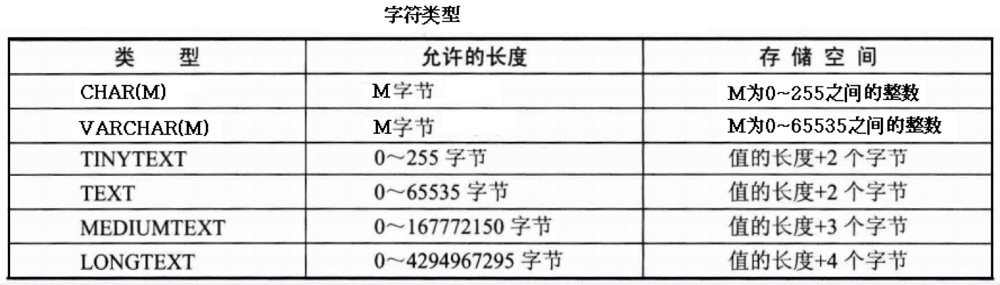


```


char(size)定长字符，0 - 255字节，size指N个字符数，若插入字符数超过设定长度，会被截取并警告。

varchar(size) 变长字符，0 - 255字节，从MySQL5开始支持65535个字节，若插入字符数超过设定长度，会被截取并警告。

一般存储大量的字符串，比如文章的纯文本，可以选用TEXT系列类型，这个系列都是变长的。

注意:在MySQL中，字符类型必须指定长度，值要使用单引号引起来。 相当于Java中字符串(String,StringBuilder/StringBuffer);

对比char(4)和varchar(4)占用空间的问题

```

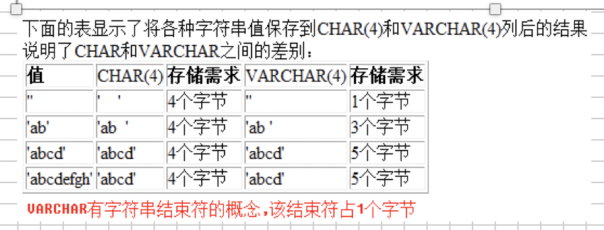

# MySQL的日期与时间类型
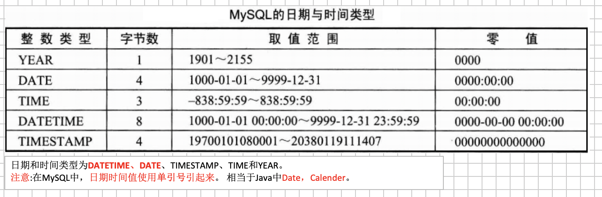


# 列的数据类型好比就是Java中的对象的数据类型

常用类型：

 Java MySQL

-------------------------------------------

 int ====INT

 long ====BIGINT

 BigDecimal ====DECIMAL

 boolean==== BIT

Date/Calender==== DATE/DATETIME/TIMESTAMP

 char/String ====VARCHAR


# 表的操作

```

CREATE TABLE `student`(
`id` int(11) DEFAULT '0',
`name` varchar(20) DEFAULT NULL,
`age` int(11) DEFAULT NULL
);


```


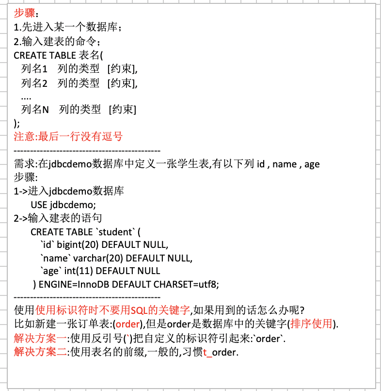

```

步骤：

1.先进入某一个数据库；

2.输入建表的命令；

CREATE TABLE 表名(

 列名1 列的类型 [约束],

 列名2 列的类型 [约束],

 ....

 列名N 列的类型 [约束]

);

注意:最后一行没有逗号

---------------------------------------------

需求:在jdbcdemo数据库中定义一张学生表,有以下列 id , name , age

步骤:

1->进入jdbcdemo数据库

  USE jdbcdemo;

2->输入建表的语句

 CREATE TABLE `student` (

 `id` bigint(20) DEFAULT NULL,

         `name` varchar(20) DEFAULT NULL,

 `age` int(11) DEFAULT NULL

 ) ENGINE=InnoDB DEFAULT CHARSET=utf8;

---------------------------------------------

使用使用标识符时不要用SQL的关键字,如果用到的话怎么办呢?

比如新建一张订单表:(order),但是order是数据库中的关键字(排序使用).

解决方案一:使用反引号(`)把自定义的标识符引起来:`order`.

解决方案二:使用表名的前缀,一般的,习惯t_order.

```


