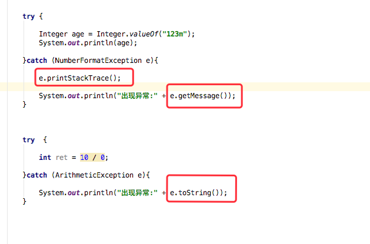
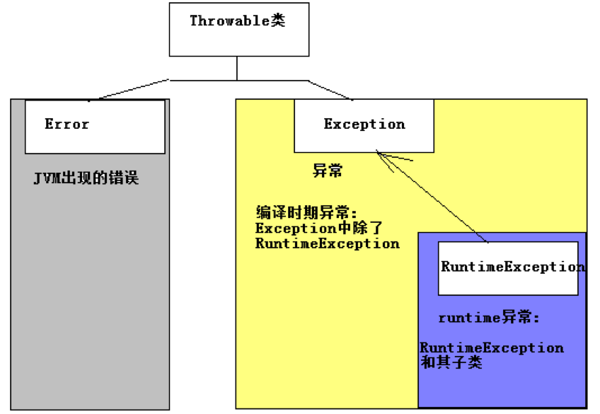

# 异常体系


针对于没有异常机制的缺点,我们提出解决方案:

***解决方案:***

- 1:把不同类型的异常情况描述成不同类(称之为`异常类`).

- 2:`分离异常流程代码和正确流程代码.`

- 3:`灵活处理异常,如果当前方法处理不了,应该交给调用者来处理.`

----------------------------------------------------------------------------------------------------

`非正常情况(出现后程序会中断)(看API).`

 1):Error:表示错误,`一般指JVM相关的不可修复的错误`,如,系统崩溃,内存溢出,JVM错误等,由JVM抛出,我们不需要处理.几乎所有的子类都是以Error作为类名的后缀.

  2):`Exception:表示异常,指程序中出现不正常的情况,该问题可以修复(处理异常).`

  几乎所有的子类都是以Exception作为类名的后缀.

----------------------------------------------------------------------------------------------------

出现异常,不要紧张,把异常的简单类名,拷贝到API中去查.

----------------------------------------------------------------------------------------------------

常见的Error:

- StackOverflowError:当应用程序递归太深而发生内存溢出时，抛出该错误。

常见的Exception:

- NullPointerException:空指针异常,一般指当对象为null的时候,调用了该对象的方法,字段.

- ArrayIndexOutOfBoundsException:数组的索引越界,(小于0或者大于等于数组长度)

- NumberFormatException:数字格式化异常, 一般指,把非0~9的字符串转换为整数.

--------------------------------------------------------------

证明出现异常之后,程序会中断,所以必须处理异常.


## 捕获异常

```

Integer age = Integer.valueOf("123m");
System.out.println(age);


try {

    Integer age = Integer.valueOf("123m");
    System.out.println(age);

}catch (NumberFormatException e){

    System.out.println("出现异常");
}


try  {

    int ret = 10 / 0;

}catch (ArithmeticException e){

    System.out.println("出现异常");
}


```

如果异常出现的话,会立刻终止程序,所以我们得处理异常:

 1):该方法不处理,而是声明抛出,由该方法的调用者来处理(throws).

 2):在方法中使用try-catch的语句块来处理异常.

-----------------------------------------------------------------------

使用try-catch捕获单个异常,语法如下:
```

try{

   编写可能会出现异常的代码

}catch(异常类型 e){

  处理异常的代码

  //记录日志/打印异常信息/继续抛出异常

}

```
注意:try和catch都不能单独使用,必须连用.


#### 如何获取异常信息,Throwable类的方法:

- 1):`String getMessage()`:获取异常的描述信息,原因(提示给用户的时候,就提示错误原因).

- 2):`String toString()`:获取异常的类型和异常描述信息(不用).

- 3):`void printStackTrace()`:打印异常的跟踪栈信息并输出到控制台. 不需要使用System.out.println.

   - 包含了异常的类型,异常的原因,还包括异常出现的位置,在开发和调试阶段,都得使用printStackTrace.

   - 记住:现在在catch语句块中,必须写:e.printStackTrace();目的:查看异常的具体信息,方便调试和修改.



```

try  {

    Integer age = Integer.valueOf("123m");
    System.out.println(age);

}catch (NumberFormatException e){

    e.printStackTrace();

    System.out.println("出现异常:" + e.getMessage());
}

try {

    int ret = 10 / 0;

}catch (ArithmeticException e){

    System.out.println("出现异常:" + e.toString());
}

```

### 使用try-catch捕获多个异常:

```

try{

   编写可能会出现异常的代码

}catch(异常类型A   e){ 当try中出现A类型异常,就用该catch来捕获.

  处理异常的代码

  //记录日志/打印异常信息/继续抛出异常

}catch(异常类型B  e){ 当try中出现B类型异常,就用该catch来捕获.

  处理异常的代码

  //记录日志/打印异常信息/继续抛出异常

}


try  {

    Integer age = Integer.valueOf("123m");
    System.out.println(age);

    int ret = 10 / 0;

}catch (NumberFormatException e){

    e.printStackTrace();

    System.out.println("出现异常:" + e.getMessage());

}catch (ArithmeticException e){

    System.out.println("出现异常:" + e.toString());
}
```
***注意:***

`1:一个catch语句,只能捕获一种类型的异常,如果需要捕获多种异常,就得使用多个catch语句.`
`2):代码在一瞬间只能出现一种类型的异常,只需要一个catch捕获,不可能同时出现多个异常.`


# finally 代码块

***finally语句块表示最终都会执行的代码,无论有没有异常.***

***什么时候的代码必须最终执行:***

> 当我们在try语句块中打开了一些物理资源(磁盘文件/网络连接/数据库连接等),我们都得在使用完之后,最终关闭打开的资源.

***finally的两种语法:***

- 1):try...finally: 此时没有catch来捕获异常,因为此时根据应用场景,我们会抛出异常,自己不处理.
- 2):try...catch....finally:自身需要处理异常,最终还得关闭资源.

***注意:finally不能单独使用.***

```
当只有在try或者catch中调用退出JVM的相关方法,此时finally才不会执行,否则finally永远会执行.

System.exit(0);//退出JVM


try {

    Integer age = Integer.valueOf("123m");
    System.out.println(age);

}catch (NumberFormatException e){

    e.printStackTrace();

    System.out.println("出现异常:" + e.getMessage());
    // System.exit(0); 干掉Java虚拟机才不会执行finally 
}finally {

    System.out.println("都会执行????");
}
```
演示实验finally和不使用finally的区别,必须使用finally才能保证最终必须执行的代码.

如果finally有return语句,永远返回finally中的结果,避免该情况.

finally面试题


## 异常的分类
异常(Exception)的分类:根据在编译时期还是运行时期去检查异常?
- 1):编译时期异常:checked异常.在编译时期,就会检查,如果没有处理异常,则编译失败.
- 2):运行时期异常:runtime异常.在运行时期,检查异常.在编译时期,运行异常不会编译器检测(不报错).
  - 运行异常:在编译时期,可处理,可不处理.

如何确定某一个异常类是编译异常还是运行异常呢?




## 抛出异常

***抛出异常:***

- ***throw***: 运用于方法内部,用于`给调用者返回一个异常对象`,和return一样会结束当前方法.
- ***throws***: 运用于方法声明之上,`用于表示当前方法不处理异常,而是提醒该方法的调用者来处理异常`(抛出异常).

  如:private static int divide(int num1, int num2) throws Exception {}

------------------------------------------------------------------------------------------------------------------

***throw语句:***
运用于方法内部,抛出一个具体的异常对象.
throw  new 异常类("异常信息"); 终止方法.

------------------------------------------------------------

***throw:***

  `一般的,当一个方法出现不正常的情况的时候,我们不知道该方法应该返回什么,此时就返回一个错误,在catch语句块中继续向上抛出异常.`
  `return 是返回一个值,throw 是返回一个错误,返回给该方法的调用者.`
举例: 定义一个方法,用于处理两个整数相除.

```

try  {
    callSomeAPI(1);
} catch (IllegalStateException e) {
    System.out.println(String.format(e.getMessage()));
    callSomeAPI(0);
}


public static void callSomeAPI(int state) throws IllegalStateException {
    if(state > 0) {
        throw new IllegalStateException("state must <= 0");
    }
    // state is valid
 // do some jobs 
}

```


```

如果每一个方法都放弃处理异常都直接通过throws声明抛出,最后异常会抛到main方法,如果此时main方法不处理,继续抛出给JVM,底层的处理机制就是打印异常的跟踪栈信息.

-------------------------------------------

runtime异常,默认就是这种处理方式.

--------------------------------------------


class Obj1
{
    public void callSomeAPI(int state) throws IllegalStateException {
        if(state > 0) {
            throw new IllegalStateException("state must <= 0");
        }
        // state is valid
 // do some jobs  }
}

class Obj2
{

    public Obj1 _obj1;

    Obj2()
    {
        _obj1 = new Obj1();
    }

    public void test(int state)
    {
        _obj1.callSomeAPI(state);
    }
}

class Obj3
{
    public Obj2 _obj2;

    Obj3()
    {
        _obj2 = new Obj2();
    }

    public void test(int state)
    {
        _obj2.test(state);
    }
}
public class demo7ThrowTest {

    public static void main(String[] args)
    {
        try {

            Obj3 _obj3 = new Obj3();
            _obj3.test(4);
        }catch (RuntimeException e){

            e.printStackTrace();
        }

        System.out.println("===============>");
    }
}
```


```
方法的覆盖(Override):

一同:方法的签名必须相同.

两小:

 1):子类方法返回类型和父类方法返回类型相同,或是其子类.

   2):子类方法不能声明抛出新的异常.

一大: 子类方法的访问权限必须大于等于父类方法的访问权限.


```


## 自定义异常

```

package javaStudy.start.com.demo1;

/**
 * Created by codew on 2018/1/22. */   class LogicException extends RuntimeException
{
    private static final long serialVersionUID = 1L;

    public LogicException()
    {
        super();
    }

    public LogicException(String msg)
    {
        super(msg);
    }

    /**
 * * @param message 表示当前异常的原因/信息
 * @param cause 当前异常的根本原因
 * */  
	public LogicException(String message, Throwable cause)
    {
        super(message, cause);
    }

}

public class demo7ExceptionSelf {

    private static String[] names = {"tom", "card", "Exception", "finall"};

    public static void main(String[] args){

        try {

            checkUserName("tom");

            System.out.println("注册成功");

        }catch (LogicException e){

            // 处理异常
  System.out.println("注册失败:"+ e.getMessage());
        }

    }

    public static boolean checkUserName(String userName)
    {
        for (String name: names){

            if (name.equals(userName)){

                throw new LogicException("亲" + name + "已近被注册了!");
            }
        }
        return true;

    }
}


```


## java7 异常新特性

Java7的异常新特性:

 Android用不到Java7,支持的Java5/java6语法.

----------------------------------------------------------------------------------------

1):增强的throw

2):多异常捕获

3):自动资源关闭


## 异常处理原则

处理异常的原则:

- 1:异常只能用于非正常情况,try-catch的存在也会影响性能.

- 2:需要为异常提供说明文档,比如Java doc,如果自定义了异常或某一个方法抛出了异常,我们应该记录在文档注释中..

- 3:尽可能避免异常.

   - 如NullPointerException
```

String str = null;
if (str != null){
	System.out.println(str.length);
}

```

- 4:异常的粒度很重要，应该为一个基本操作定义一个 try-catch 块，不要为了简便，将几百行代码放到一个 try-catch 块中.
- 5:不建议在循环中进行异常处理，应该在循环外对异常进行捕获处理(在循环之外使用try-catch).
- 6:自定义异常尽量使用RuntimeException类型的.


# 异常小结


掌握异常的:

- 1:五个关键字:try,catch,finally,throw,throws.


- 2:异常体系的两个继承结构:


  - 2.1):Throwable类有两个子类(Error和Exception).


  - 2.2):Exception类有一个子类RuntimeException:


    - RuntimeException类及其子类称之为:runtime异常.
    - Exception类和子类中(除了RuntimeException体系):checked异常.

- 3):定义异常类.

---------------------------------------------------------------------------

面试题:

 1):Error和Exception的区别和关系.

 2):checked异常和runtime异常的区别.

 3):如何保证一段代码必须执行到(finally).

 4):finally中的代码一定会执行吗?

 5):finally和return的执行顺序?(关注finally里面的两道题)

 6):throw和throws的区别?

 7):列举5个常见的异常类.

 8):列举5个常见的Runtime异常类.

-------------------------------------------------------------------------------

ArithmeticException:算术异常

NullPointerException:空指针异常

ArrayIndexOutOfBoundsException:数组索引越界

StringIndexOutOfBoundsException:String操作中索引越界

NumberFormatException:数字格式化异常

ClassCastException:类型强制转换异常
