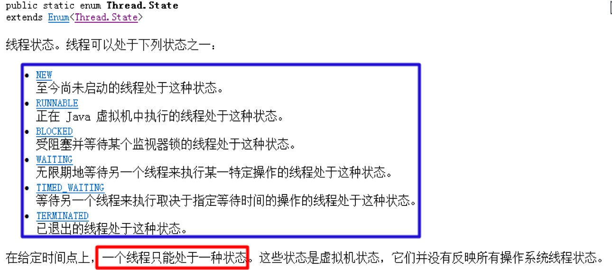
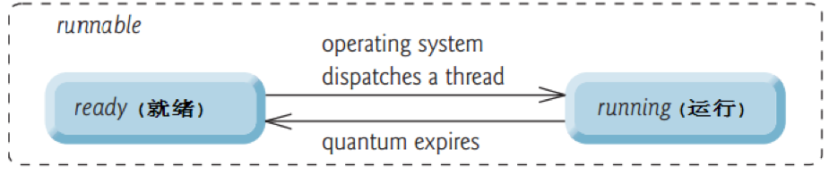

# 线程通信
线程通信:不同的线程执行不同的任务,如果这些任务有某种关系,线程之间必须能够通信,协调完成工作.


## code1

```
package LightweightProcess;

/**
 * Created by codew on 2018/1/23. */   // 共享资源 
public class NVShareResource {

    private String name;
    private String gender;

    public void push(String name, String gender){

        this.name = name;
        this.gender = gender;

    }

    public void popup()
    {
        System.out.println(this.name + "-" + this.gender);
    }
}

//================
package LightweightProcess;

/**
 * Created by codew on 2018/1/23. */   // 消费者 
public class NVProducer implements Runnable{

    private NVShareResource resource = null;

    public NVProducer(NVShareResource resource)
    {
        this.resource = resource;
    }

    @Override
  public void run() {

        for (int i = 0; i < 50; i++) {

            if (i % 2 == 0){

                resource.push("韦小宝", "男");

            }else {
                resource.push("貂蝉", "女");
            }

        }
    }
}
//================

package LightweightProcess;

/**
 * Created by codew on 2018/1/23. */   // 消费者 
public class NVConsumer implements Runnable{

    // 共享的资源对象
  private NVShareResource resource = null;

    public NVConsumer(NVShareResource resource){

        this.resource = resource;
    }

    @Override
  public void run() {

        for (int i = 0; i < 50; i++) {

            resource.popup();
        }
    }
}
//================

package LightweightProcess;

/**
 * Created by codew on 2018/1/23. */ public class NVResourceTest {

    public static void main(String[] args)
    {
        NVShareResource resource = new NVShareResource();

        // 启动生产者
  new Thread(new NVProducer(resource)).start();
        // 启动消费者
  new Thread(new NVConsumer(resource)).start();
    }
}
```

## code2

```

//================
package LightweightProcess;

/**
 * Created by codew on 2018/1/23. */   // 共享资源 public class NVShareResource {

    private String name;
    private String gender;

    public void push(String name, String gender){

        this.name = name;

        try {

            Thread.sleep(10);

        }catch (InterruptedException e){

            e.printStackTrace();
        }

        this.gender = gender;

    }

    public void popup()
    {
        try {

            Thread.sleep(10);

        }catch (InterruptedException e){

            e.printStackTrace();
        }

        System.out.println(this.name + "-" + this.gender);
    }
}
//================
package LightweightProcess;

/**
 * Created by codew on 2018/1/23. */   // 消费者 public class NVConsumer implements Runnable{

    // 共享的资源对象
  private NVShareResource resource = null;

    public NVConsumer(NVShareResource resource){

        this.resource = resource;
    }

    @Override
  public void run() {

        for (int i = 0; i < 50; i++) {

            resource.popup();
        }
    }
}

//================
package LightweightProcess;

/**
 * Created by codew on 2018/1/23. */   // 消费者 public class NVProducer implements Runnable{

    private NVShareResource resource = null;

    public NVProducer(NVShareResource resource)
    {
        this.resource = resource;
    }

    @Override
  public void run() {

        for (int i = 0; i < 50; i++) {

            if (i % 2 == 0){

                resource.push("韦小宝", "男");

            }else {
                resource.push("貂蝉", "女");
            }

        }
    }
}
//================
package LightweightProcess;

/**
 * Created by codew on 2018/1/23. */ public class NVResourceTest {

    public static void main(String[] args)
    {
        NVShareResource resource = new NVShareResource();

        // 启动生产者
  new Thread(new NVProducer(resource)).start();
        // 启动消费者
  new Thread(new NVConsumer(resource)).start();
    }
}
```
分析生产者和消费者案例存在的问题:

  建议在生产姓名和性别之间以及在打印之前使用Thread.sleep(10);使效果更明显.

  此时出现下面的情况:

```

貂蝉-男
韦小宝-女
貂蝉-男
貂蝉-女

```

问题1:出现姓别紊乱的情况.

- 解决方案:只要保证在生产姓名和性别的过程保持同步,中间不能被消费者线程进来取走数据.

- 可以使用同步代码块/同步方法/Lock机制来保持同步性.

问题2:应该出现生产一个数据,消费一个数据.

- 应该交替出现: 韦小宝-男-->貂蝉-女-->韦小宝-男-->貂蝉-女.....

- 解决方案: 得使用 等待和唤醒机制.


# 同步锁池

同步锁池:

- 同步锁`必须`选择多个线程共同的资源对象.

- 当前生产者在生产数据的时候(`先拥有同步锁`),其他线程就在`锁池中等待获取锁.`

- 当线程执行完同步代码块的时候,***就会释放同步锁***,其他线程开始抢锁的使用权.

# code3 -- 其他和上面一样. 这个解决了性别紊乱

```

//================
package LightweightProcess;

/**
 * Created by codew on 2018/1/23. */   // 共享资源 public class NVShareResource {

    private String name;
    private String gender;

   synchronized public void push(String name, String gender){

        this.name = name;

        try {

            Thread.sleep(10);

        }catch (InterruptedException e){

            e.printStackTrace();
        }

        this.gender = gender;

    }

    synchronized public void popup()
    {
        try {

            Thread.sleep(10);

        }catch (InterruptedException e){

            e.printStackTrace();
        }

        System.out.println(this.name + "-" + this.gender);
    }
}
//================

//================

//================ 

```

# code4 等待和唤醒机制

线程通信-wait和notify方法介绍:

`java.lang.Object类提供类两类用于操作线程通信的方法.`

- wait():`执行该方法的线程对象`***释放同步锁***,JVM把该线程存放到`等待池中`,***等待其他的线程唤醒该线程.***

> 哪一个线程执行这个方法,它就释放掉同步锁, 自己就不再执行了,其他线程就有执行的机会了. 进入等待池, 等待其他线程唤醒,自己是不能唤醒自己的.

- notify:执行该方法的`线程唤醒在等待池中等待的任意一个线程`,把线程转到`锁池中`等待.

> 随机任意唤醒等待池里面的某一线程, 并不是说谁先进入等待池就先唤醒, 等待池===>锁池, 等待池中的对象 没有同步监听器不能执行代码, 而在锁池中的代码 有机会去获取锁,能够获取获取锁就能执行代码.
- notifyAll():执行该方法的线程唤醒在等待池中等待的所有的线程,把线程转到锁池中等待.

> 唤醒等待池中的所有线程 

注意:***上述方法只能被同步监听锁对象来调用,否则报错IllegalMonitorStateException..***
> 只能被同步监听锁对象来调用, 不能被线程对象调用.
------------------------------------------


```

多个线程只有使用相同的一个对象的时候,多线程之间才有互斥效果.

我们把这个用来做互斥的对象称之为,同步监听对象/同步锁.

-------------------------------------

同步锁对象可以选择任意类型的对象即可,只需要保证多个线程使用的是相同锁对象即可.

-------------------------------------

因为,只有同步监听锁对象才能调用wait和notify方法,所以,wait和notify方法应该存在于Object类中,而不是Thread类中.


```


假设A线程和B线程共同操作一个X对象(`同步锁`),A,B线程可以通过X对象的wait和notify方法来进行通信,流程如下:

- 1:当A线程执行`X对象的同步方法时`,A线程持有X对象的锁,B线程没有执行机会,`B线程在X对象的锁池中等待.`

- 2:A线程在同步方法中执行`X.wait()方法时,A线程释放X对象的锁`,进入A线程进入`X对象的等待池中.`

- 3:在X对象的`锁池中`等待锁的B线程`获取X对象的锁`,执行X的另一个同步方法.

- 4:B线程在同步方法中执行`X.notify()方法时`,JVM把A线程从X对象的等待池中移动到X对象的锁池中,等待获取锁.

- 5:B线程执行完同步方法,释放锁.A线程获得锁,继续执行同步方法.


```

//================
package LightweightProcess;

/**
 * Created by codew on 2018/1/23. */   // 共享资源 
public class NVShareResource {

    private String name;
    private String gender;
    private boolean isEmpty = true; // 表示共享资源对象是否为空的状态    
synchronized public void push(String name, String gender){

        try {

            while (!isEmpty){// 当前isEmpty为false的时候, 不空等着消费者来获取    this.wait();// 使用同步锁对象来调用, 表示当前线程释放同步锁,进入等待池, 只能被其他线程唤醒
  }

            // -----开始生产------
  this.name = name;
            Thread.sleep(10);
            this.gender = gender;
            // -----生产结束-------
  isEmpty = false; // 设置共享资源中数据不为空
 // 生产结束唤醒消费者  this.notify();
        }catch (InterruptedException e){

            e.printStackTrace();
        }

    }

    synchronized public void popup()
    {
        try {

            while (isEmpty){ // 当前isEmpty为true的时候, 为空, 等待生产者来生产
 // 使用同步锁对象来调用, 表示当前线程释放同步锁, 进入等待池, 只能被其他线程所唤醒  this.wait();
            }
            // -----消费开始------
  Thread.sleep(10);
            System.out.println(this.name + "-" + this.gender);
            // -----消费结束------
  isEmpty = true;
            // 消费完了唤醒一个生产者
  this.notify();
        }catch (InterruptedException e){

            e.printStackTrace();
        }

    }
}
//================
package LightweightProcess;

/**
 * Created by codew on 2018/1/23. */   // 消费者 public class NVConsumer implements Runnable{

    // 共享的资源对象
  private NVShareResource resource = null;

    public NVConsumer(NVShareResource resource){

        this.resource = resource;
    }

    @Override
  public void run() {

        for (int i = 0; i < 50; i++) {

            resource.popup();
        }
    }
}
//================
package LightweightProcess;

/**
 * Created by codew on 2018/1/23. */   // 消费者 public class NVProducer implements Runnable{

    private NVShareResource resource = null;

    public NVProducer(NVShareResource resource)
    {
        this.resource = resource;
    }

    @Override
  public void run() {

        for (int i = 0; i < 50; i++) {

            if (i % 2 == 0){

                resource.push("韦小宝", "男");

            }else {
                resource.push("貂蝉", "女");
            }

        }
    }
}

//================ 
package LightweightProcess;

/**
 * Created by codew on 2018/1/23. */ public class NVResourceTest {

    public static void main(String[] args)
    {
        NVShareResource resource = new NVShareResource();

        // 启动生产者
  new Thread(new NVProducer(resource)).start();
        // 启动消费者
  new Thread(new NVConsumer(resource)).start();
    }
}
```


# code5 线程通信-使用Lock和Condition接口:

线程通信-使用Lock和Condition接口:

***wait和notify方法,只能被同步监听锁对象来调用***,否则报错`IllegalMonitorStateException.`

那么现在问题来了,`Lock`机制根本就没有同步锁了,也就没有自动获取锁和自动释放锁的概念.

因为没有同步锁,所以Lock机制不能调用wait和notify方法.

解决方案:Java5中提供了Lock机制的同时提供了处理Lock机制的通信控制的Condition接口.

--------------------------------------------------------------------

从Java5开始,可以:

- 1):使用Lock机制取代synchronized 代码块和synchronized 方法.

- 2):使用`Condition接口对象的await,signal,signalAll`方法取代`Object类中的wait,notify,notifyAll方法.`

```

//================

package producer_consumer;

/**
 * Created by codew on 2018/1/23. */   // 消费者 public class NVConsumer implements Runnable{

    // 共享的资源对象
  private NVShareResource resource = null;

    public NVConsumer(NVShareResource resource){

        this.resource = resource;
    }

    @Override
  public void run() {

        for (int i = 0; i < 50; i++) {

            resource.popup();
        }
    }
}

//================
package producer_consumer;

/**
 * Created by codew on 2018/1/23. */   // 消费者 public class NVProducer implements Runnable{

    private NVShareResource resource = null;

    public NVProducer(NVShareResource resource)
    {
        this.resource = resource;
    }

    @Override
  public void run() {

        for (int i = 0; i < 50; i++) {

            if (i % 2 == 0){

                resource.push("韦小宝", "男");

            }else {
                resource.push("貂蝉", "女");
            }

        }
    }
}

//================
package producer_consumer;

import java.util.concurrent.locks.Condition;
import java.util.concurrent.locks.Lock;
import java.util.concurrent.locks.ReentrantLock;

/**
 * Created by codew on 2018/1/23. */   // 共享资源 public class NVShareResource {

    private String name;
    private String gender;
    private boolean isEmpty = true; // 表示共享资源对象是否为空的状态
  private final Lock lock = new ReentrantLock();
    private Condition condition = lock.newCondition();

    public void push(String name, String gender){

        // 进入方法立马获取锁
  lock.lock();

        try {

            while (!isEmpty)
            {
                // 不为空等待
  condition.await();

            }
            // -----开始生产------
  this.name = name;
            Thread.sleep(10);
            this.gender = gender;

            condition.signal();
            isEmpty = false;
        }catch (InterruptedException e){

            e.printStackTrace();

        }finally {

            lock.unlock(); // 释放锁
  }

    }

    public void popup()
    {

        lock.lock();
        try {
            while (isEmpty)
            {
                // 不为空等待
  condition.await();

            }

            Thread.sleep(10);
            System.out.println(this.name + "-" + this.gender);

            isEmpty = true;
            condition.signalAll();

        }catch (InterruptedException e){

            e.printStackTrace();
        }finally {
            lock.unlock();
        }

    }
}

//================
 
package producer_consumer;

/**
 * Created by codew on 2018/1/23. */ public class NVResourceTest {

    public static void main(String[] args)
    {
        NVShareResource resource = new NVShareResource();

        // 启动生产者
  new Thread(new NVProducer(resource)).start();
        // 启动消费者
  new Thread(new NVConsumer(resource)).start();
    }
}
```
lock和synchronized的区别?
```

功能上来说是一样的, lock更加面向对象
synchronized,会自动获取同步锁, 自动释放

lock就没有锁对象,需要我手动获取手动释放

```


# 死锁

`多线程通信的时候很容易造成死锁,死锁无法解决,只能避免:`

当A线程等待由B线程持有的锁,而B线程正在等待A线程持有的锁时,发生死锁现象,JVM不检测也不试图避免这种情况,所以程序员必须保证不导致死锁.

***避免死锁法则***: `当多个线程都要访问共享的资源A,B,C时,保证每一个线程都按照相同的顺序去访问他们,比如都先访问A,接着B,最后C.`

--------------------

哲学家吃面条的故事

--------------------

Thread类中过时的方法:

suspend():使正在运行的线程放弃CPU,暂停运行.

resume():是暂停的线程恢复运行.

--------------------

注意:因为容易导致死锁,所以已经被废弃了.

死锁情况:

 A线程获得对象锁,正在执行一个同步方法,如果B线程调用A线程的suspend方法,此时A线程暂停运行,此时A线程放弃CPU,但是不会放弃占用的锁.

```

//================

//================

//================

//================ 

```


# 线程的生命周期 
生命周期:一个事物从出生的那一刻开始到最终死亡中间的整个过程.
在事物的漫长的生命周期过程中,总会经历不同的状态(婴儿状态/青少年状态/中年状态/老年状态...).
线程也是有生命周期的,也是存在不同的状态的,状态相互之间的转换.



```

public enum State {
            
            
            NEW,
            
            RUNNABLE,
            
            BLOCKED,
            
            WAITING,
            
            TIMED_WAITING,

            
            TER MINATED;
}

```

有人又把阻塞状态,等待状态,计时等待状态合称为阻塞状态.如下图.
线程对象的状态存放在Thread类的内部类(State)中:
注意:Thread.State类其实是一个枚举类.
  因为线程对象的状态是固定的,只有6种,此时使用枚举来表示是最恰当的.


1:`新建状态(new)`:使用new创建一个线程对象,仅仅在堆中分配内存空间,在调用start方法之前.

  `新建状态下,线程压根就没有启动`,仅仅只是存在一个线程对象而已.

 Thread t = new Thread();//此时t就属于新建状态

 当新建状态下的线程对象`调用了start方法`,此时从新建状态进入可运行状态.

  `线程对象的start方法只能调用一次,否则报错:IllegalThreadStateException.`

2:`可运行状态(runnable)`:分成两种状态，`ready和running`。分别表示就绪状态和运行状态。

  `就绪状态`:线程对象调用start方法之后,等待JVM的调度(`此时该线程并没有运行`).

  `运行状态`:线程对象获得JVM调度,如果存在多个CPU,那么允许多个线程并行运行.



----

3:`阻塞状态(blocked)`:正在运行的线程因为某些原因放弃CPU,暂时停止运行,就会进入阻塞状态.

  `此时JVM不会给线程分配CPU,直到线程重新进入就绪状态,才有机会转到运行状态.`

  ***阻塞状态只能先进入就绪状态,不能直接进入运行状态.***

 阻塞状态的两种情况:
- 1):当A线程处于运行过程时,试图获取同步锁时,却被B线程获取.此时JVM把当前A线程存到对象的锁池中,A线程进入阻塞状态.
- 2):当线程处于运行过程时,发出了IO请求时,此时进入阻塞状态. 

4:`等待状态(waiting)`(等待状态只能被其他线程唤醒):此时使用的无参数的wait方法,

- 1):当线程处于运行过程时,调用了wait()方法,此时JVM把当前线程存在对象等待池中.

5:`计时等待状态(timed waiting)`(使用了带参数的wait方法或者sleep方法)

- 1):当线程处于运行过程时,调用了wait(`long time`)方法,此时JVM把当前线程存在对象等待池中.

- 2):当前线程执行了sleep(`long time`)方法.

---

6:`终止状态(terminated)`:通常称为死亡状态，表示线程终止.

- 1):正常执行完run方法而退出(正常死亡).

- 2):遇到异常而退出(出现异常之后,程序就会中断)(意外死亡).

-------------------------------------------------------------------

线程一旦终止,就不能再重启启动,否则报错(`IllegalThreadStateException`).

在Thread类中过时的方法(因为存在线程安全问题,所以`弃用`了):

```

 void suspend() :暂停当前线程
 void resume() :恢复当前线程
 void stop() :结束当前线程

```


# 控制线程的一些方法

1. 线程休眠
2. 联合线程
3. 后台线程
4. 线程优先级
5. 线程礼让

### 线程休眠:让执行的线程暂停一段时间，进入计时等待状态。

方法:static void sleep(long millis)
`调用sleep后，当前线程放弃CPU,在指定时间段之内，sleep所在线程不会获得执行的机会。此状态下的线程不会释放同步锁/同步监听器.`
该方法更多的用于***模拟网络延迟***,让多线程并发访问同一个资源的错误效果更明显.
在开发中也会故意使用该方法,如:

```

package thread_Method;
/**
 * Created by codew on 2018/1/24.
 */
public class ThreadSleepDemo {

    public static void main(String[] args) throws InterruptedException{

        for (int i = 10; i > 0; i--) {

            System.out.println("还剩" + i + "秒");
            Thread.sleep(1000);
        }
        System.out.println("暴走");
    }

}

```

### 联合线程
`线程的join方法表示一个线程等待另一个线程完成后才执行`。join方法被调用之后，线程对象处于阻塞状态。
有人也把这种方式称为`联合线程，就是说把当前线程和当前线程所在的线程联合成一个线程。`

```

package thread_Method;

/**
 * Created by codew on 2018/1/24.
 */

class JoinClass extends Thread
{

    @Override
    public void run() {
        super.run();

        for (int i = 0; i < 50; i++) {

            System.out.println("join:" + i);
        }
    }
}


// 联合线程
public class JoinTestDemo {

    public static void main(String[] args) throws InterruptedException{

        System.out.println("begin=======");

        JoinClass joinClass = new JoinClass(); // 创建
        for (int i = 0; i < 50; i++) {


            System.out.println("main:" + i);

            if (i == 10){
                // 启动join线程
                joinClass.start();
            }

            if (i == 20){

                joinClass.join(); // 强制运行该线程
            }
        }

        System.out.println("end =======");

    }
}

```


### 后台线程

后台线程：在后台运行的线程，`其目的是为其他线程提供服务，也称为“守护线程"。JVM的垃圾回收线程就是典型的后台线程。`

*** java程序中至少要有两个线程, 一个主线程, 一个垃圾回收器线程, 垃圾回收器线程就是后台线程 ***

***特点：若所有的前台线程都死亡，后台线程自动死亡,前台线程没有结束,后台线程是不会结束的。***

测试线程对象是否为后台线程：使用thread.isDaemon()。

`前台线程创建的线程默认是前台线程,可以通过setDaenon(true)方法设置为后台线程,并且当且仅当后台线程创建的新线程时，新线程是后台线程。`

`设置后台线程：thread.setDaemon(true),该方法必须在start方法调用前，否则出现IllegalThreadStateException异常。`


```

package thread_Method;

/**
 * Created by codew on 2018/1/24.
 */

class DaemonThread extends Thread
{

    @Override
    public void run() {
        super.run();

        for (int i = 0; i < 50; i++) {

            System.out.println(super.getName() + "-" + super.isDaemon());
        }
    }
}


public class DaemonDemo {

    public static void main(String[] args){

        System.out.println(Thread.currentThread().isDaemon());
//        System.out.println(Thread.currentThread().getName());


        for (int i = 0; i < 50; i++) {


            System.out.println("main:" + i);

            if (i == 10){
                DaemonThread t = new DaemonThread();
                t.setDaemon(true); // 要先设置再启动否则挂@
                t.start();
//                t.setDaemon(true); // 要先设置再启动否则挂@
            }

        }
    }
}

```

***测试看看是不是前台线程挂了后台马上挂***

设置
t.setDaemon(true);
然后看看打印
注释
然后看看

```

package thread_Method;

/**
 * Created by codew on 2018/1/24.
 */

class DaemonThread extends Thread
{

    @Override
    public void run() {
        super.run();

        for (int i = 0; i < 500; i++) {

            System.out.println(super.getName() + "-" + i);
        }
    }
}


public class DaemonDemo {

    public static void main(String[] args){

        System.out.println(Thread.currentThread().isDaemon());
//        System.out.println(Thread.currentThread().getName());


        for (int i = 0; i < 50; i++) {


            System.out.println("main:" + i);

            if (i == 10){
                DaemonThread t = new DaemonThread();
//                t.setDaemon(true); // 要先设置再启动否则挂@
                t.start();
            }

        }
    }
}

```

### 线程优先级

线程优先级:

每个线程都有优先级，`优先级的高低只和线程获得执行机会的次数多少有关,并非线程优先级越高的就一定先执行，哪个线程的先运行取决于CPU的调度。`

```
MAX_PRIORITY=10,最高优先级
MIN_PRIORITY=1,最低优先级
NORM_PRIORITY=5,默认优先级

    /**
     * The minimum priority that a thread can have.
     */
    public final static int MIN_PRIORITY = 1;

   /**
     * The default priority that is assigned to a thread.
     */
    public final static int NORM_PRIORITY = 5;

    /**
     * The maximum priority that a thread can have.
     */
    public final static int MAX_PRIORITY = 10;
```
-----------------------
```

 int getPriority() :返回线程的优先级。
 void setPriority(int newPriority) : 更改线程的优先级。

```
*** 虽然优先级最小1最大10, 代码上是可以1-10都可以, 但是不同的操作系统他们的支持是不一样的. 所以就用那三个就得了 ***

-----------------------

`每个线程都有默认优先级,主线程默认优先级为5`,如果A线程创建了B线程,那么B线程和A线程具有相同优先级.

***注意:不同的操作系统支持的线程优先级不同的,建议使用上述三个优先级,不要自定义.***


### 线程礼让
线程礼让:

yield方法：`表示当前线程对象提示调度器自己愿意让出CPU资源，但是调度器可以自由的忽略该提示。`

调用该方法之后，`线程对象进入就绪状态，` 所以完全有可能：`某个线程调用了yield()之后，线程调度器又把它调度出来重新执行。`

`从Java7提供的文档上可以清楚的看出，开发中很少会使用到该方法，该方法主要用于调试或测试，它可能有助于因多线程竞争条件下的错误重现现象。`

-----------------------------------------

sleep方法和yield方法的区别:
- 1):都能使当前处于运行状态的线程放弃CPU,把运行的机会给其他线程.
- 2):sleep方法会给其他线程运行机会,但是不考虑其他线程的优先级,yield方法只会给相同优先级或者更高优先级的线程运行的机会.
- 3):调用sleep方法后,线程进入计时等待状态,调用yield方法后,线程进入就绪状态.


# 小结


