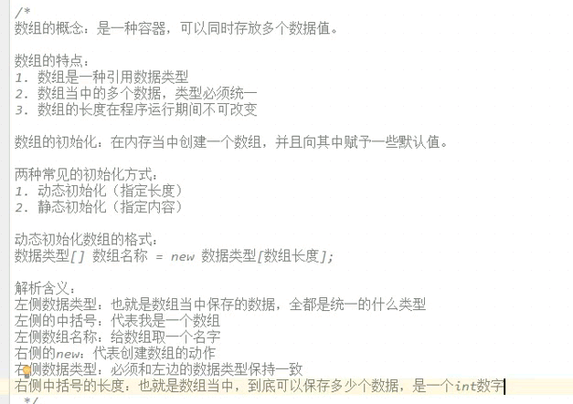
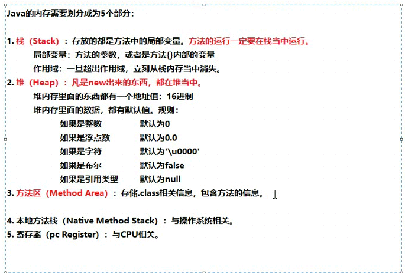
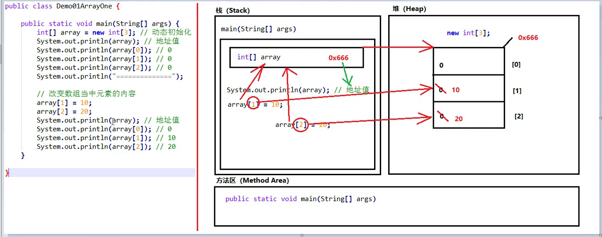
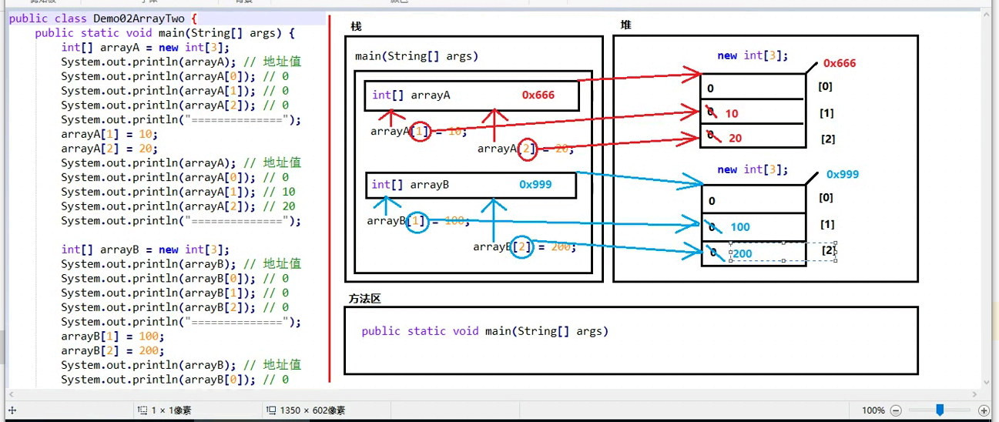

# 数组





## 静态和动态


```java

        //2018年10月23日14:42:00 =====动态初始化
        System.out.println("Hello Array");

        int[] arrI = new int[10];

        double[] arrD = new double[2];

        String[] strArr = new String[2];


        // 2018年10月23日14:43:00 ======静态初始化

        int[] arrI2 = new int[] {1, 13, 33};

        String[] strArr2 = new String[] {"e", "b"};
```


## 省略格式的数组


```java

int[] arrI3 = {12, 33, 44};

```


## 动态数组初始化默认

整数类型，默认为0

浮点默认为0.0

字符类型，默认'\u0000'

布尔是 false

引用 null

```java

//        int[] arr = new int[3];//= {12, 23, 55};

//        double[] arr = new  double[3];

//        char[] arr = new char[3];
        String[] arr = new String[3];
        /**
         * [ 数组
         * I 说里面都是int
         * @代表引用
         * 十六进制
         *
         * */
        System.out.println(arr);
        System.out.println(arr[0]);
        System.out.println(arr[1]);
        System.out.println(arr[2]);


```


# 内存划分










# 数组长度


```java

arr.length


```

