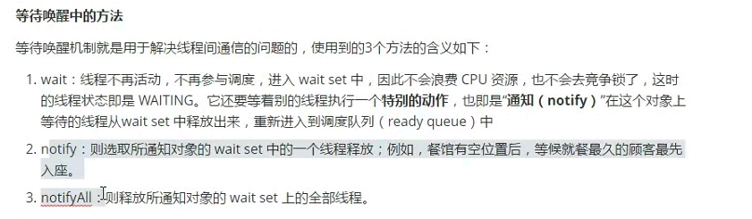
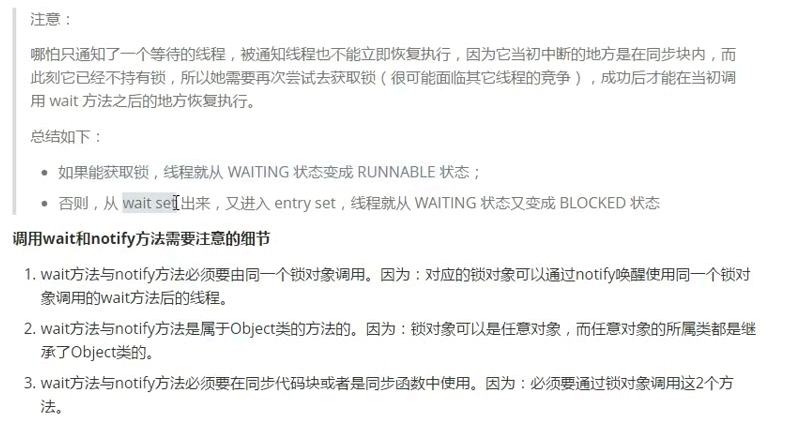
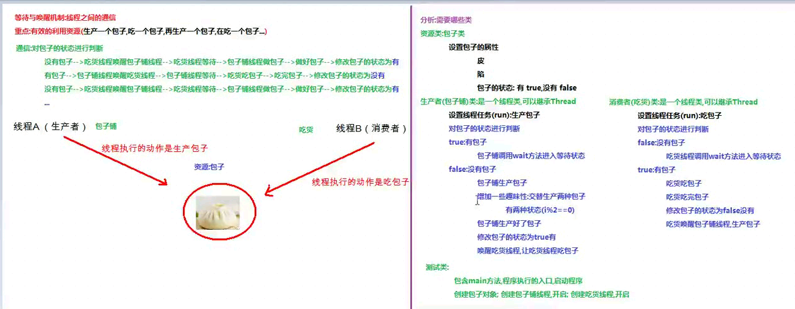
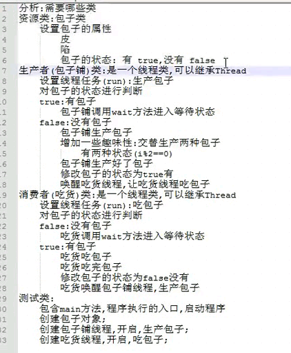

# 同步代码块

```java

package com.codertomwu.MyThreadTest.Ticket;

public class MyTicket implements Runnable {

    private static int ticket = 100;


    @Override
    public void run() {

        while (true){

            synchronized (this){

                if (ticket > 0){

                    try {
                        Thread.sleep(10);
                    } catch (InterruptedException e) {
                        e.printStackTrace();
                    }
                    System.out.println(Thread.currentThread().getName() + "---->正在卖第：" + ticket + "张票");
                    ticket--;
                }else {

                    break;
                }

            }


        }
    }
}


package com.codertomwu.MyThreadTest.Ticket;

public class MyTicketMain {

    public static void main(String[] args) {

        MyTicket ticket = new MyTicket();

        Thread t1 = new Thread(ticket);
        Thread t2 = new Thread(ticket);
        Thread t3 = new Thread(ticket);

        t1.start();
        t2.start();
        t3.start();
    }
}

```


# 同步方法


```java

    public synchronized void synMethod(){
        
        
    }

```


# 使用同步方法解决线程安全问题


```java

package com.codertomwu.MyThreadTest.TicketedSyncMethod;

public class MyTicket implements Runnable {

    private static int ticket = 100;


    public synchronized void synMethod(){

        while (true){

            if (ticket > 0){

                try {
                    Thread.sleep(10);
                } catch (InterruptedException e) {
                    e.printStackTrace();
                }
                System.out.println(Thread.currentThread().getName() + "---->正在卖第：" + ticket + "张票");
                ticket--;
            }else {

                break;
            }
        }
    }


    @Override
    public void run() {

        synMethod();
    }
}


// ========


package com.codertomwu.MyThreadTest.TicketedSyncMethod;

public class MyTicketMain {

    public static void main(String[] args) {

        MyTicket ticket = new MyTicket();

        Thread t1 = new Thread(ticket);
        Thread t2 = new Thread(ticket);
        Thread t3 = new Thread(ticket);

        t1.start();
        t2.start();
        t3.start();
    }
}


```


# 静态的同步方法, 锁对象是谁？？？ 这道有这么回事就行，海~

静态方法的锁对象是本类的class属性， 也叫class文件对象（反射）

```java

package com.codertomwu.MyThreadTest.TicketedSyncMethod;

public class MyTicketMain {

    public static void main(String[] args) {

        MyTicket ticket = new MyTicket();

        Thread t1 = new Thread(ticket);
        Thread t2 = new Thread(ticket);
        Thread t3 = new Thread(ticket);

        t1.start();
        t2.start();
        t3.start();
    }
}


```


# Lock锁 解决买票问题，  JDK1.5


```java
package com.codertomwu.MyThreadTest.MyLock;

import java.util.concurrent.locks.Lock;
import java.util.concurrent.locks.ReentrantLock;

public class MyTicket implements Runnable {

    private static int ticket = 100;


    Lock lock = new ReentrantLock();

    public void synMethod2(){
        lock.lock();
        while (true){

            if (ticket > 0){

                try {
                    Thread.sleep(10);
                } catch (InterruptedException e) {
                    e.printStackTrace();
                }
                System.out.println(Thread.currentThread().getName() + "---->正在卖第：" + ticket + "张票");
                ticket--;
            }else {

                break;
            }
        }
        lock.unlock();
    }


    @Override
    public void run() {

        synMethod2();
    }
}
```


# 唤醒和等待


```java
package com.codertomwu.wait;

public class Demo01WaitAndNNotify {


    public static void main(String[] args) {

        Object object = new Object();
        // 消费者
        new Thread(){

            @Override
            public void run() {
                synchronized (object){

                    System.out.println("告诉老板包子的种类和数量");
                    try {
                        object.wait();
                    } catch (InterruptedException e) {
                        e.printStackTrace();
                    }
                    // 唤醒之后执行的代码
                    System.out.println("包子做好了， 开吃！！");
                }
            }
        }.start();

        // 生产者老板
        new Thread(){

            @Override
            public void run() {

                try {
                    Thread.sleep(5000);
                } catch (InterruptedException e) {
                    e.printStackTrace();
                }
                synchronized (object){

                    System.out.println("老板5秒之后做好包子");
                    // 唤醒。。。
                    object.notify();
                }
            }
        }.start();


    }


}
```


# 线程间通信


为什么要处理线程间通信;
多个线程并发执行时，在默认情况下CPU是随机切换线程的,当我们需要多个线程来共同完成一件任务,并且我们希望他们有规律的执行，那么多线程之间需要一些协调通信,以此来帮我们达到多线程共同操作一份数据。

如何保证线程间通信有效利用资源:
多个线程在处理同一个资源,并且任务不同时,需要线程通信来帮助解决线程之间对同一个变星的使用或操作。就是多个线程在操作同一份数据时，避免对同一共享变量的争夺。也就是我们需要通过一定的手段使各个线程能有效的利用资源。而这种手段即一-等 待唤醒机制。












# 线程通信示例


```java

package com.codertomwu.Baozi;

public class Baozi {

    String pi;
    String xian;
    boolean flag = false;//包子状态， false没有包子， true有包子
}


```


```java
package com.codertomwu.Baozi;

public class Baozipu extends Thread {

    private Baozi bz;

    public Baozipu(Baozi bz) {
        this.bz = bz;
    }

    // 生产包子
    @Override
    public void run() {

        int count = 0;

        while (true){

            synchronized (bz){

                // 判断包子状态
                if (bz.flag == true){

                    try {
                        bz.wait();
                    } catch (InterruptedException e) {
                        e.printStackTrace();
                    }

                }

                // 被唤醒之后执行， 包子铺生产包子
                if (count%2 == 0){

                    bz.pi = "薄皮";
                    bz.xian = "三鲜";
                }else {

                    bz.pi = "冰皮";
                    bz.xian = "豆沙";
                }
                count++;
                System.out.println("包子铺正在生产：" + bz.pi + bz.xian + "包子");


                try {
                    Thread.sleep(3000);
                } catch (InterruptedException e) {
                    e.printStackTrace();
                }
                // 生产好包子
                bz.flag = true;
                bz.notify();

                System.out.println("包子铺生产好了： " + bz.pi + bz.xian + "包子， 可以吃了");
            }
        }

    }
}
```


```java
package com.codertomwu.Baozi;

public class Chihuo extends Thread {

    private Baozi baozi;

    public Chihuo(Baozi baozi){

        this.baozi = baozi;
    }

    @Override
    public void run() {
        System.out.println("");

        while (true){

            synchronized (baozi){

                if (baozi.flag == false){
                    try {
                        baozi.wait();
                    } catch (InterruptedException e) {
                        e.printStackTrace();
                    }
                }

                // 被唤醒之后的代码
                System.out.println("吃货正在吃");
                baozi.flag = false;
                baozi.notify();
                System.out.println("吃货已经把：" + baozi.pi + " " + baozi.xian + "的包子吃完了， 包子铺赶紧补货");
                System.out.println("=======================");

            }
        }
    }


}
```


```java
package com.codertomwu.Baozi;

public class BaoziMain {


    public static void main(String[] args) {

        Baozi bz = new Baozi();
        new Baozipu(bz).start();
        new Chihuo(bz).start();
    }
}
```

