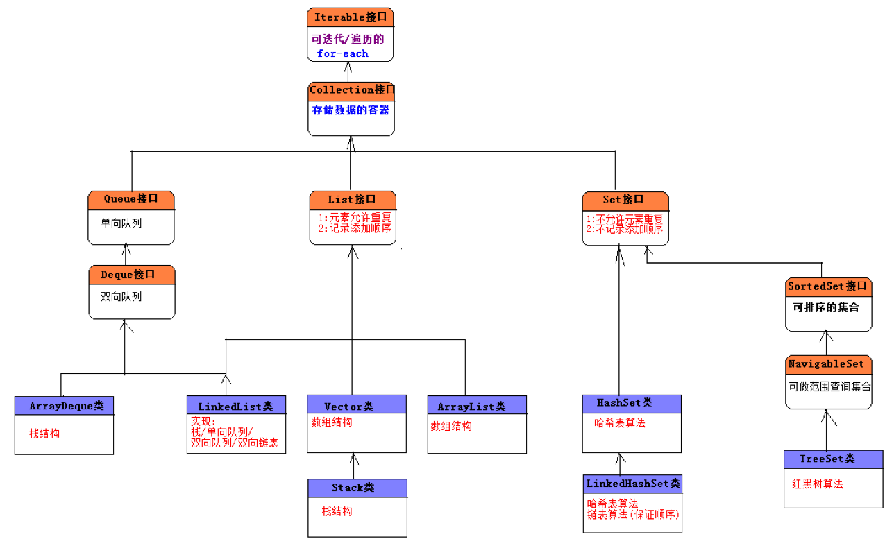
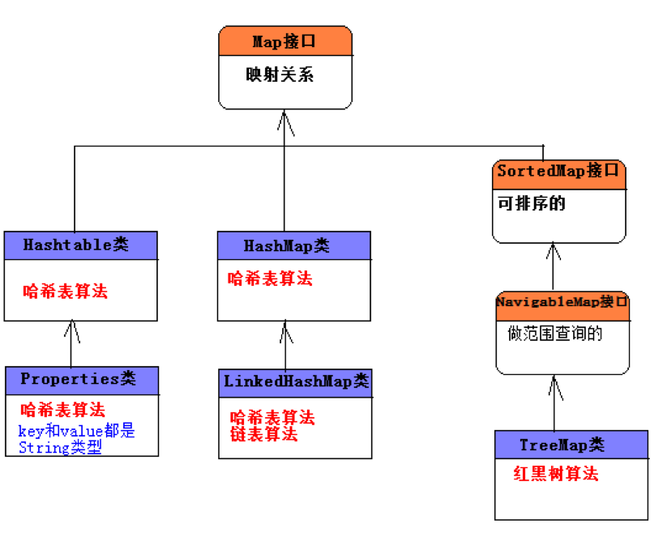

# I 
`Tterable` :   `Collection`

`Collection`: `Queue List Set`

`Queue` : `Deque`

`Set` : `SortedSet `
`SortedSet`: `NavigableSet`

# Class

# **ArrayDeque**
**LinkedList**
**Vector**
**Stack**
**ArrayList**
**HashSet**
**LinkedHashSet**
**TreeSet**

# 

