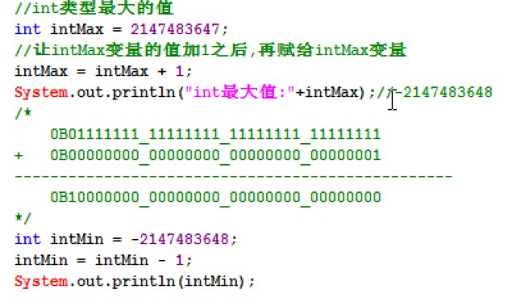
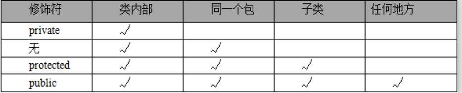

# 01-数据类型

## 字面量和常量
## 变量
## 变量的定义和基本使用
## java表达式
## 数据类型
在Java中数据类型整体上分成两大类: 
1):基本数据类型/原生数据类型,共8个:
- 1>:数值型:
  - 整数类型:byte,short,int,long,
  - 不同的整数类型在内存占用的内存空间大小是不一样的.
  - 小数类型:float,double.

- 2>:字符型:char,什么是字符,字母/符号.
- 3>:布尔型:boolean,表示对与错.true,false.

2):引用数据类型/对象数据类型:
 - 类/接口/数组


### boolean类型
：通常用于逻辑运算和程序流程控制(条件选择/循环)。
`该类型的值只能是true 或 false，表示真或假。`
不可以使用0或非0的整数来代替false和true，区分于C语言。
（其实在JVM中对boolean的处理也是用0表示false，非0表示true的。）
false和true是boolean的常量。


###  整数类型(byte-short-int-long):

`byte`、`short`、`int`、`long`类型：

整型常量的四种表示形式：
①　二进制整数：0B或0b开头（Java7的新特性），如：int a = 0B110;
②　八进制整数：要求以0开头，如 int a = 012;
③　十进制整数：如：int a = 17;
④　十六进制整数：要求0X或0x开头，如int a = 0x12;

`Java语言的整型常量默认是int型，声明long型变量后加上‘l’或‘L，因小写的l容易和数字1相混淆，建议使用大写L。`
`默认情况下,一个整型的字面量默认是int类型.`


### 浮点类型(float-double):

`float`、`double`类型：
`float表示单精度类型，double表示双精度类型，但是二者都不能表示精确的小数。`
Java的浮点类型常量有两种表现形式：
十进制形式： 例如：3.14 ，168.0， .618
科学计数法形式： 例如：3.14e2， 3.14E2， 1000E-2
科学计数法表达式返回的结果是double类型。
默认情况下,一个浮点类型的字面量默认是double类型.若要声明一个常量为float型，则需在常量后加上f 或 F，double常量后面的D或d可省略。

注意：Java里只有浮点型的变量才可以接受科学计算式结果：

因为float和double都不能精确的表示小数，那么在精度要求高的系统比如银行系统里，那怎么表示精确的小数呢？后面我们会讲`BigDecimal`类型，它表示任意精度的数据。


# 字符类型(char):字符,字母和符号.

char类型：表示16位的无符号整数或者Unicode字符，`Java对字符采用Unicode字符编码。`

Unicode收集了世界上所有语言文字中的符号，是一种跨平台的编码方式，`Java的字符占两个字节`，可以表示一个汉字。

什么是编码？

计算机只能表示0和1两个数，于是人们做规定使用一个数字去表示一个特定的字符，比如a使用97表示。

char前256个字符和ASCII（美国信息交互标准编码）码中的字符重复。

-----------------------------------------------------------------------------------------------

char常量有3种表示形式：

①　直接使用单个字符来指定字符常量，格式如'◆'、'A'，'7'；

②　直接作为十进制整数数值使用，但是数据范围在[0，65535]，格式如97，但是打印出来的值依然是ASCII码表对于的符号,如97打印出来是字符a。

③　和2一样，只不过表示的是16进制的数值，格式如` '\uX'，X表示16进制整数`；如：97的16进制是61。那么表示为‘\u0061’打印出来也是a。

所以有人说char本质上也是整型，也是有道理的。

char前256个字符和ASCII（美国信息交互标准编码）码中的字符重复，可查表。
## 数据过大和溢出

当要表示的数据超出数据类型的临界范围时，称为溢出。溢出情况发生时程序并没有做数据范围检查处理，此时会出现数据紊乱情况。
int最大值
int intMax = 2147483647;
分析数据发生紊乱的原因.





## 基本数据类型转换
## 表达式类型的自动提升

## 算术运算


## 位运算


## 赋值运算
## 比较运算符


# 02-  数组

## JVM内存模型


JVM内存划分,人为的根据不同内存空间的存储特点以及存储的数据:

`程序计数器`：当前线程所执行的字节码的行号指示器。

`本地方法栈`：为虚拟机使用的native方法服务。

`Java虚拟机栈`：描述Java方法执行的内存模型，`每个方法被执行的时候都会同时创建一个栈帧用于存储局部变量表、操作栈、动态链接、方法出口等信息。`

 ` 每一个方法,创建一个栈帧,,栈帧存放了当前方法的数据信息(局部变量),当方法调用完毕,该方法的栈帧就被销毁了.`

`Java堆`：`被所有线程共享的一块内存区域，`在虚拟机启动时创建。所有的对象实例以及数组都要在堆上分配(使用new关键字,就表示在堆中开辟一块新的存储空间)。

`方法区`：线程共享的内存区域，存储已被虚拟机加载的类信息、常量、静态变量即时编译器编译后的代码数据等(这个区域的内存回收目标主要是针对常量池的回收和对类型的卸载)。


GC(Garbage Collection):垃圾回收器。

Java的自动垃圾回收机制:简单理解为,

程序员就不需要再手动的去控制内存的释放。`当JVM发觉内存资源紧张的时候，就会自动地去清理无用对象（没有被引用到的对象）所占用的内存空间。`


## 数组

基本数据类型:byte,short,int,long,float,double,char,boolean

引用数据类型:类,接口,数组.

-------------------------------------------------

变量的定义:

  - 数据类型 变量名; 如: int age;

数组的定义:

 -  方式1: 数组元素的类型[]  数组名; int[] ages;推荐的. 可以吧int[]看成是一种数据类型,int类型的数组类型.

  - 方式2:数组元素的类型  数组名[]; int ages[];

------------------------------------------------------

`数组必须先初始化,才能使用,因为初始化表示在内存中分配空间.`

## 数组初始化
***Java中数组必先初始化后才能使用***，`所谓初始化就是给数组元素分配内存，并为每个元素赋初始值。`

初始化数组的两种方式：

- 静态初始化；

- 动态初始化；

无论，以哪种方式初始化数组，`一旦初始化完成，数组的长度就固定了，不能改变，除非重新初始化。也就是说数组是定长的。`

 数组是定长的: 数组一旦初始化成功,数组中的元素个数就已经固定了,不能更改,如果需要更改,只能重新做初始化.


### 数组的静态初始化操作:

  特点:有我们自己来为每一个数组元素设置初始化值,而数组的长度由系统(JVM)决定.

语法:

  数组元素类型[] 数组名 = new  数组元素类型[]{元素1,元素2,元素3,.......};

  举例:

`  int[] nums = new  int[]{1,3,5,7,9};`

  简单写法,必须声明之后,立刻初始化,不能先声明后初始化:

`   int[] nums = {1,3,5,7,9};`


### 数组的动态初始化操作:

 由我们来设置数组的`元素个数(数组长度),`而每一个数组元素的初始值有系统决定.

语法:

  数组元素类型[] 数组名 = new  数组元素类型[ length ];

  比如:

` int[] ages = new int[100];`

-------------------------------------------------------------

`  int[] nums = new int[5]{1,3,5,7,9};//写法是错误的,不能同时使用静态初始化和动态初始化.`

-------------------------------------------------------------

什么时候使用静态初始化,什么时候使用动态初始化.

当我们事先知道,需要存储哪一些数据的时候,选用静态初始化.

当我们事先不知道,需要存储哪些数据的时候,只能使用动态初始化.


### 数组基本操作

数组的基本操作:

- 1:数组基本操作:

   - 获取元素: 元素类型 变量 = 数组名[`index`];
   - 设置元素: 数组名[`index`] = 值;

   - 遍历数组元素: 建议使用for循环,事先知道循环的次数.

   - 数组长度: `int len = 数组名.length;` length是属性,不是方法.

   - `索引范围`: 从0开始,逐一递增. [`0,数组名.length-1`]

- 2:操作数组常见异常:

   - NullPointerException:空指针异常(空引用).当数组还未初始化,就直接操作数组.

   - String[] bs = null;

   - System.out.println(bs.length)

   - `ArrayIndexOutOfBoundsException`:数组的索引越界异常.

- 3:获取数组最大最小元素(getMax,getMin).

- 4:打印数组元素:

   - 直接打印数组的时候,打印出来是hashCode值,如[I@7439aca7.

   - 我们不喜欢,我们想打印数组的时候,把该数组的元素打印出来.

   - String[] arr = {"A","B","C","D","E"};

   - 定义方法打印:

   - 字符串表示形式由数组的元素列表组成，括在方括号（"[]"）中。相邻元素用字符 ", "（逗号加空格）分隔。

打印格式:[A, B, C, D, E]

- 5:逆序排列数组元素:

   - 原数组:[A, B, C, D, E]

   - 逆序操作

   - 新数组:[E, D, C, B, A]

- 6:元素出现索引(第一次/最后一次),`线性搜索`.

   - int[] arr = {10,20,30,10,50,-30,10};
   - 获取元素10在arr数组中第一次出现的索引(`indexOf`): 0
   - 获取元素10在arr数组中最后一次出现的索引(`lastIndexOf`):6

## 多维数组


# 04-类&对象


- 1):根据类来创建对象的语法:

  - 类名 变量 = new 类名();

- 2):给字段设置值:

  - 对象变量.字段名 = 该类型的值;

- 3):获取字段的值:

  - 该字段类型 变量 = 对象变量.字段值;

- 4):通过对象调用方法.

  - 对象变量.方法(实参);

  


## 构造器
创建一个学生对象的时候,代码如下:

- Student s1 = new Student();

- 这个代码特别像:在调用一个方法名称为Student的无参数方法.


```
我们把这种特殊的方法,称之为构造方法,构造器(构造函数/构造子:Constructor).

但是我们发现在Student类中,却找不到该构造方法,找不到,却又没有报错.

编译器在编译源文件的时候,会创建一个缺省的构造器.
```

构造器的作用:

- 1):创建对象,凡是必须和 new 一起使用.

- 2):完成对象的初始化操作.

构造器的特点:

- 1):构造器的名称和当前所在类的名称相同.

  - 如果构造器名称叫XXX,  new XXX();你看出来创建的是什么类型的对象吗?

- 2):禁止定义返回类型,千万不要使用void作为返回类型. void Student(){}这是普通方法.

  - 假设需要写返回类型,也应该这样写:Student Student(); 既然所有的返回类型都和所在类名相同,何必再写.

- 3):在构造器中,不需要使用return语句.

  - 其实构造器是有返回值的,返回的是当前创建对象的引用.


编译器创建的默认构造器的特点:

- 1):符合构造器特点.

- 2):无参数的.

- 3):无方法体.
- 4):如果类A没有使用public修饰,则编译器创建的构造器也没有public修饰.

  - 使用了public修饰,则编译器创建的构造器也使用public修饰.

  


## static 修饰符


static修饰符表示静态的，可修饰`字段`、`方法`、`内部类`，其修饰的成员属于类,也就是说`static修饰的资源属于类级别,而不是对象级别。`

static的真正作用：用来区别字段，方法，内部类，初始化代码块是属于对象还是属于类本身。


static修饰符的特点:

- 1):static修饰的成员(字段/方法),随着所在类的加载而加载.

  - 当JVM把字节码加载进JVM的时候,static修饰的成员已经在内存中存在了.

- 2):优先于对象的存在.

  - 对象是我们手动通过new关键字创建出来的.

- 3:satic修饰的成员被该类型的所有`对象所共享`.

  - `根据该类创建出来的任何对象,都可以访问static成员`.(狗天生就吃屎.)

  - 剧透:`表面上通过对象去访问static成员,其本质依然使用类名访问,和对象没有任何关系(通过反编译看到的).`

- 4):`直接使用类名访问static成员`

  - 因为static修饰的成员直接属于类,不属于对象,所以可以直接使用类名访问static成员.


#### static成员在JVM中的存储:

  

#### 类成员和实例成员的访问 :

```

类中的成员:字段,方法,内部类.
类成员: 使用static修饰的成员.
实例成员: 没有使用static修饰的成员.

```

```
类成员只能访问类成员,实例成员只能访问实例成员.
```

```
类成员,直接属于类, 可以通过类来访问static字段和static方法.

实例成员,只属于对象, 通过对象来访问非static字段和非static方法.

 (对象其实可以访问类成员,但是底层依然使用类名访问的.)

```

```

在static方法中,只能调用static成员.

非static方法,可以访问静态成员,也可以访问实例成员.

```


###  深入变量

***定义变量的语法:***
- 数据类型 变量名 = 值;


***变量根据在类中定义位置的不同,分成两大类:***

- 成员变量: 全局变量/字段(Field),不要称之为属性(错误). 直接定义在类中,方法外面.

  - 1):类成员变量. 使用static修饰的字段.

  - 2):实例成员变量. 没有使用static修饰的字段.

- 局部变量: 变量除了成员变量,其他都是局部变量.

  - 1): 方法内部的变量.
  - 2):方法的形参.
  - 3):代码块中的变量,一对{}.


***变量的初始值:初始化才会在内存中开辟空间.***

- 成员变量: 默认是有初始值的(看图)
- 局部变量: 没有初始值,所以必须先初始化才能使用.
  
***变量的作用域***:

  变量根据定义的位置不同,也决定了各自的作用域是不同的. `看变量所在的那对{}.`
- 成员变量: 在整个类中都有效.
- 局部变量: 在开始定义的位置开始,到紧跟着结束的花括号为止.


`成员变量,可以先使用后定义`,局部变量必须先定义而后才能使用.


***变量的生命周期:***

`变量的作用域指的是变量的存在范围，只有在这个范围内，程序代码才能访问它。`当一个变量被定义时,它的作用域就确定了:
`变量的作用域决定了变量的生命周期，说明作用域不同，生命周期就不一样。`
变量的生命周期指的是一个变量被创建并分配内存空间开始，到该变量被销毁并清除其所占内存空间的过程。

  


## package 语句

 在开发中,我们存在几百上千个Java文件,如果所有的Java文件都在一个目录中,管理起来也很痛苦.

 此时,我们可以使用生活中的解决方案,不过呢,此时在Java中,我们把这个特殊文件夹称之为包(`package`).

 关键字:`package `,专门用来给当前Java文件设置包名.

语法格式: `package` 包名.子包名.子子包; 必须把该语句作为Java文件中,并且是第一行代码(所有代码之前).

此时编译命令: javac -d . Hello.java

 javac -d . Hello.java:

如果此时Hello.java文件中没有使用`package`语句,表示在当前目录中生成字节码文件.

如果此时Hello.java文件中使用了`package`语句,此时表示在当前目录中先生成包名,再在包中生成字节码文件.

运行命令: java 包名.类名;

***package最佳实践 :***

1):包名如何定义. 自定义的包名,不能以java.打头,因为Java的安全机制会检查.


- 1>:包名必须遵循标识符规范/全部小写.

- 2>:企业开发中,包名才有公司域名倒写.

  - hao123域名: hao123.com ----->com.hao123--->如果hao123不符合标识符规范,我们可以使用下划线.(com._123hao)

  - 在Android中,如果package中使用了_,则不能部署到模拟器上.此时,我们也可以使用一个字母来代替_.

  - 比如:package com.hao123; package com.hao123;

 ----------->

  格式: package 域名倒写.模块名.组件名;

  package com.hao123.pss.util;----------------->进销存模块中专门存储工具类的包.

2):类的名称:

- 类的简单名称: 定义类的名称. PackageDemo.

- 类的全限定名称: 包名.类名; com.hao123.hello.PackageDemo.

3):在开发中,都是先有package而后在package中再定义类.

  


***Java(JDK)中的包名:***
  
  


## import语句
当A类和B类`不在同一个包中`,若A类需要使用到B类,此时就得让A类中去引入B类.

注意:在这里演示import的时候,因为没有学习public的原因以及Editplus工具的原因,我不会演示去引入自定义带package的类.

 我们演示,咱们之前学习过的 数组的工具类:`Arrays`类,该类在`java.util`包中.

 `Arrays`类的全限定名:`java.util.Arrays`

没有使用import之前,操作不在同一个包中的类,`得使用全限定名来操作`.


解决方案: 使用import语句,直接把某个包下的类导入到当前类中.

  语法格式: import 需要导入类的全限定名;

  `此后,在本Java文件中,只需要使用类的简单名称即可.`

  
编译会自动去java.lang包中去寻找使用到的类,比如String,System.所以他们不需要导入.
`推论:非java.lang包的类,都需要导入.`


  

上述代码,表示分别引入了java.util包下的Arrays类,Set类,List类.

问题:如果我们还需要继续引入java.util包中其他的类,我们还得提供N个import语句,要写很多次,不爽.

解决方案:使用通配符(`*`).

import 类的全限定名; 只能导入某一个类.

import 包名.子包名.*; 表示会引入该包下的所有的在当前文件中使用到的类.

import java.util.`*`; 此时的`*`表示类名.

  在Eclipse工具中,即使我们使用了通配符*,在格式化代码的时候,也会转换为N条import语句.

  注意: 编译器会默认找java.lang包下的类. 但是却不会去找java.lang的子包下的类.

  比如:`java.lang.reflect.Method`类.
  此时我们也得使用import java.lang.reflect.Method.


***静态导入(static import):***
  
在上述代码中,每次使用Arrays类中的静态方法,即使我们使用了import语句,但是每次都需要使用Arrays类名去调用静态方法.
我就觉得不爽, 我期望:我能把Arrays类中的静态成员作为自己的静态成员一样调用.
`sort(arr)`

解决方案:
- 语法格式:  
- import static  类的全限定名.该类中的static成员名;
  

```

通过反编译工具,其实所谓的静态导入也是一个语法糖/编译器级别的新特性.

在实际开发中,我们不使用静态导入,因为如此,分不清某一个静态方法或字段来源于哪一个类.

Eclipse工具,当格式化代码的时候,就自动取消了所有的静态导入,变成使用类名调用.

```


### 访问权限修饰符
访问权限控制： 

- private: 表示私有的, 表示类访问权限. 只能在本类中访问,离开本类之后,就不能直接访问. `//类内部专属`
- 不写(缺省): 表示包私有,表示包访问权限. 访问者的包必须和当前定义类的包相同才能访问.`//包专属`
- protected: 表示子类访问权限,同包中的可以访问,即使不同包,但是有继承关系,也可以访问.`//子类专属`
- public: 表示全局的,可以公共访问权限,如某个字段/方法,使用了public修饰,则可以在当前项目中`任何地方访问.`

  
```

一般的:字段都使用private修饰,表达隐藏,为了安全性.

 拥有实现细节的方法,一般使用private修饰,不希望外界(调用者)看到该方法的实现细节.

 一般的,方法我们使用public修饰,供外界直接调用.

```


```

一般的:字段都使用private修饰,表达隐藏,为了安全性.

 拥有实现细节的方法,一般使用private修饰,不希望外界(调用者)看到该方法的实现细节.

 一般的,方法我们使用public修饰,供外界直接调用.

--------------------------------------------------------------------------------------

//直接暴露给外界,供调用者直接调用即可

public void doWork()

{

 methodA();

 methodB();

 methodC();

}

//仅仅只是完成了部分操作,不需要调用者调用

private methodA(){}

private methodB(){}

private methodC(){}

--------------------------------------

一般的,我们不用缺省,即使要使用,也仅仅是暴露给同包中的其他类.

protected:一般,在继承关系中,父类需要把一个方法只暴露给子类.

```


## JavaBean 规范
JavaBean规范:

 JavaBean 是一种JAVA语言写成的可重用组件(类).

- 必须遵循一定的规范:

  - 1):类必须使用public修饰.

  - 2):必须保证有公共无参数构造器,即使手动提供了带参数的构造器,也得提供无参数构造器..

  - 3):包含了属性的操作手段(给属性赋值,获取属性值).

- 分类:

  - 1):复杂:UI,比如Button,Panel,Window类.

  - 2):简单:domain,dao,service组件,封装数据,操作数据库,逻辑运算等.(封装有字段,并提供getter/setter)

- 成员:

  - 1):方法:Method

  - 2):事件:event

  - 3):属性:property


***属性:***

- 1):attribute:表示状态,Java中没有该概念,很多人把字段(Field)称之为属性(attribute).不要把成员变量叫做属性.

- 2):property: 表示状态,但是不是字段,是属性的操作方法(getter/setter)决定的,框架中使用的大多是是属性.

```
我们讲完封装之后,说应该把对象中信息隐藏起来(把类中的字段全部使用private修饰起来,其他类不能直接访问).

为了能让外界(其他类)访问到本类中的私有字段成员,我们专门提供getter以及setter方法.

```
`字段: private String name;`

***getter方法: 仅仅用于获取某一个字段存储的值.***

//去掉get,把首字母小写,得到name1.此时name1才是属性.
```

public String  getName1()
{

 return name;//返回name字段存储的值

}

```
`如果操作的字段是boolean类型的,此时不应该叫做getter方法,而是is方法,把  getName 变成 isName.`

***setter方法: 仅仅用于给某一个字段设置需要存储的值.***
```

public void setName1(String n)
{

 name = n;//把传过来的n参数的值,存储到name字段中

}

```
每一个字段都得提供一对getter/setter.以后使用Eclipse工具之后getter/setter都是自动生成.

***在JavaBean中有属性这个概念,只有标准情况下字段名和属性名才相同.***


## this

```

什么是this:

 表示当前对象,什么优势当前对象.

 this主要存在于两个位置:

  构造器中: 就表示当前创建的对象.

  方法中: 哪一个对象调用this所在的方法,那么此时this就表示哪一个对象.

当一个对象创建之后,JVM会分配一个引用自身的引用:this.

```

  


***使用this:***

- ①　解决成员变量和参数(局部变量)之间的二义性,必须使用;
- ②　同类中实例方法间互调(此时可以省略this,但是不建议省略)。
- ③　将this作为参数传递给另一个方法;
- ④　将this作为方法的返回值(链式方法编程);
- ⑤　构造器重载的互调，this([参数])必须写在构造方法第一行;
- ⑥　static不能和this一起使用;
  - `当字节码被加载进JVM,static成员以及存在了. 但是此时对象还没有创建,没有对象,就没有this.`


## 构造器和setter方法选用

***创建对象并给对象设置初始值有两种方式:***

- 方式1:先通过无参数构造器创建出一个对象,再通过对象调用相应的setter方法.

- 方式2: 直接调用带参数的构造器,创建出来的对象,就有了初始值.

```

方式1:

User u1 = new User();

u1.setName("Lucy");

u1.setAge(18);

方式2:

User u1 = new User("张三",17);

```

--------------------------------------------------------------

***通过构造器和通过setter方法都可以完成相同的功能.***

***给对象设置数据:***
- 1):setter注入(属性注入).
- 2):构造注入.

--------------------------------------------------------------

***如何选择:***

- 1:如果存在带参数的构造器,方式2是比较简洁的.

- 2:如果在构建对象的时候需要初始化多个数据,如果使用方式2,那么构造器得提供N个参数,参数过大,不直观,此时方式1,简单明了.

- 3:圆对象,如何画圆. 圆对象,必须根据半径来确定对象.

  - 就应该在构建圆对象的时候,就要确定半径值.

  - 有时候,需要根据数据来构建对象,此时优先选用构造器方式.

------------------------------------------------------------------------------------------------

其他时候,任选.
