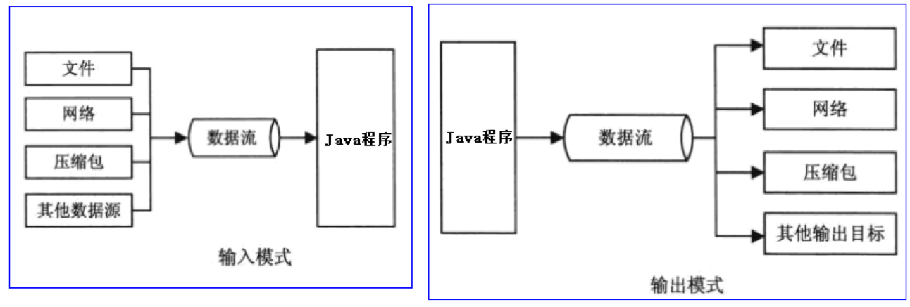
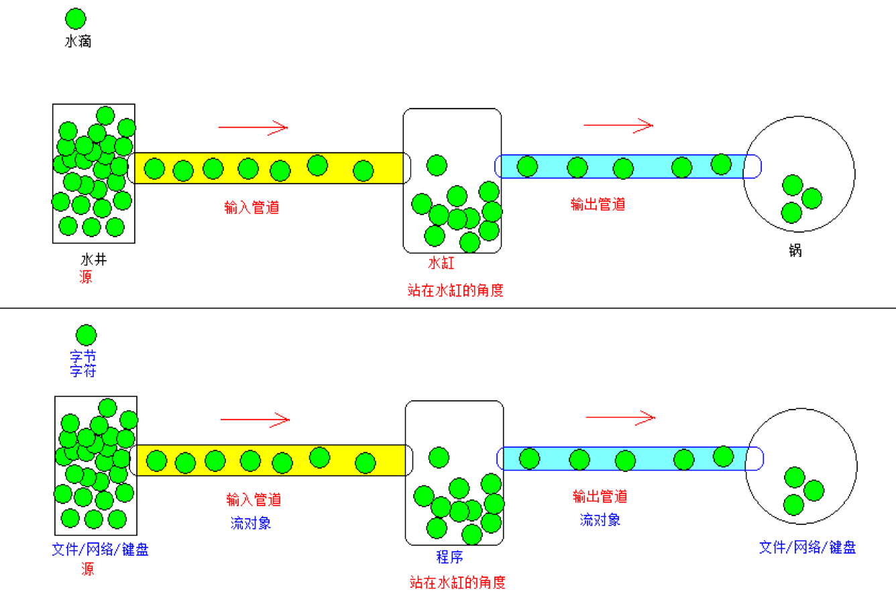
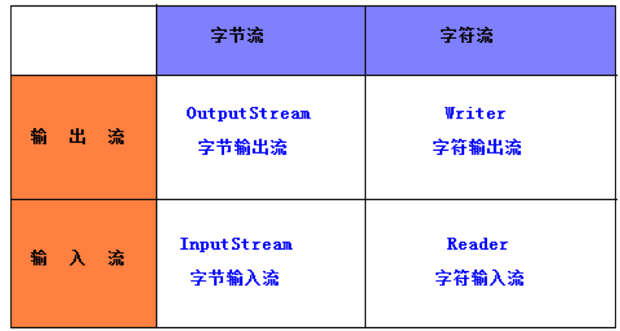
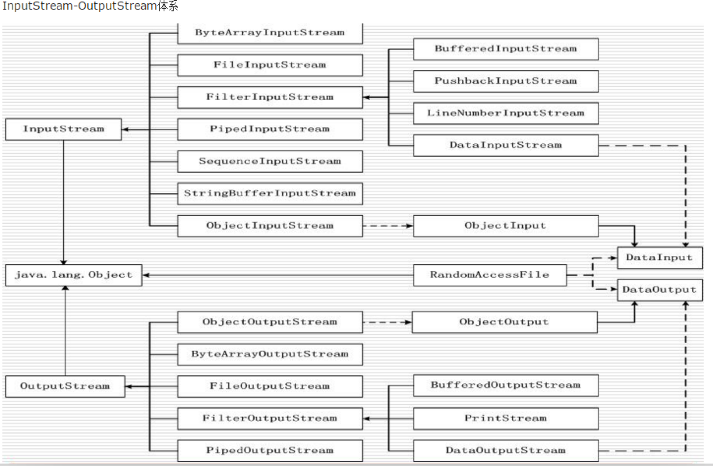
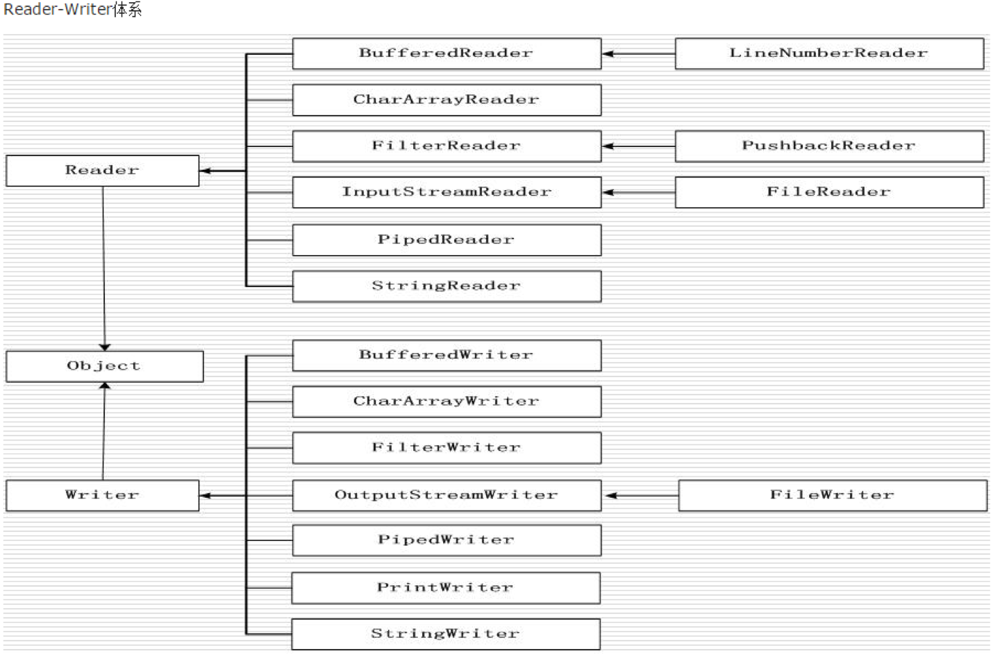

# IO概述

什么是IO:(Input/Output):输入和输出.

案例3:上传和下载操作.

 IO操作是一个相对的过程,一般的,我们在程序角度来思考(程序的内存).
- 程序需要数据: 把数据流入到程序中,输入.
- 程序需要保存数据,把数据传递给别人: 输出.



***IO操作的示意图:***
  讲解IO知识点的时候,习惯和生活中的水流联系起来.



IO流的分类和操作模板:

--------------------------------------------------------------

***IO流的分类,站在不同的角度,分类方式是不一样滴:***
- 1):根据流向划分: 输入流和输出流.
- 2):根据数据的单位划分: 字节流和字符流.
- 3):根据功能的划分:节点流和包装流.

--------------------------------------------------------------

***四大基流***:(`字节输出流`,`字节输入流`,`字符输出流`,`字符输入流`)

四大基流都是抽象类:  其他流都是继承于这四大基流的.

 我们不能创建四大基流的对象,只能创建其子类对象.

 无论是什么流,都有close方法,用来关闭资源.

  如果操作文件,就得开通一个流对象关联我们得磁盘文件,如果不关闭资源,那么磁盘的文件一直被程序所引用着,不能删除,也不能更改.


字节流

字符流


***操作IO流的模板:***

- 1):创建源或者目标对象(挖井).

  - 拿文件流举例:

  - 输入操作: 把文件中的数据流向到程序中,此时文件是源,程序是目标.

  - 输出操作: 把程序中的数据流向到文件中,此时文件是目标,程序是源.

- 2):创建IO流对象(水管).

  - 输入操作: 创建输入流对象.

  - 输出操作: 创建输出流对象.

- 3):具体的IO操作.

  - 输入操作: 输入流对象的read方法.

  - 输出操作: 输出流对象的write方法.

- 4):关闭资源(勿忘). 一旦资源关闭之后,就不能使用流对象了,否则报错.

  - 输入操作: 输入流对象.close();

  - 输出操作: 输出流对象.close().

--------------------------------------------------------------

***操作IO流的六字箴言:***

- 读进来,写出去.
- 读进来: 进来强调了是输入, 读说明是read方法.
- 写出去: 出去强调了是输出,写说明是write方法.


## 文件流


文件流: 顾名思义,程序和文件打交道.

此时我们谈及的文件,值得是纯文本文件(txt的,不要使用Word,Excel),

-----------------------------------------------------------------

在字节流中,暂时不要使用中文.

`FileInputStream: 文件的字节输入流`
`FileOutputStream: 文件的字节输出流`

FileReader:文件的字符输入流
FileWriter:文件的字符输出流

### 字节输出流

```

package IODemo;

import java.io.File;
import java.io.FileOutputStream;
import java.io.OutputStream;

/**
 * Created by codew on 2018/1/25.
 */

// 文件字节输出流Demo
public class FileOutputStreamDemo {

    public static void main(String[] args) throws Exception
    {

        // 1. 创建源和目标
        File target = new File("file/stream.txt");
        //2. 创建文件字节输出流对象 (水管)
        OutputStream out = new FileOutputStream(target, true); // 表示追加
        // 3.具体的输出操作
        /*
        out.write(65); // 把一个字节写入到文件中
        void write(byte b[]); // 把数组写入文件
        void write(byte b[], int off, int len) // 把数组中从off索引开始写len个字节
        */
        out.write("OpenGL shader hello".getBytes(), 0, 15);
        // 4.关闭资源对象,关闭水管
        out.close();

    }
}

```

### 文件字节输入流
```
package IODemo;

import java.io.File;
import java.io.FileInputStream;
import java.io.InputStream;
import java.util.Arrays;

/**
 * Created by codew on 2018/1/25.
 */
public class FileInputStreamDemo {

    public static void main(String[] args) throws Exception
    {

        // 1. 创建源
        File f = new File("file/stream.txt");

        // 2. 创建文件字节输入流对象, 并接在源上

        InputStream in = new FileInputStream(f);

        // 3. 具体的读取操作
        /*
         int read(); // 一个字节一个字节的读取
         int read(byte[] b); // 读取多个字节,并存储到数组b中,从数组b的索引为o的位置开始存,返回读取了几个字节
         int read(byte[] b, int off, int len);
        */
        //3.1
//        int value = in.read();
//
//        while (value != -1){
//
//            System.out.println(value);
//            value = in.read();
//        }

        // 3.2

        byte[] buffer = new byte[10];

        int ret = in.read(buffer);
//        System.out.println(Arrays.toString(buffer));
        while (ret != -1)
        {
            System.out.println(Arrays.toString(buffer));
            buffer = new byte[10];
            ret = in.read(buffer);

        }

        // 4. 关闭资源
        in.close();
    }
}

```


## 使用字节流完成文件的拷贝操作

```

package IODemo;

import java.io.*;

/**
 * Created by codew on 2018/1/25.
 */
public class StreamCopyDemo {

    public static void main(String[] args) throws Exception
    {
        // 1. 创建源和目标
        File srcFile = new  File("file/stream.txt");
        File destFile = new  File("file/stream_copy.txt");

        // 2. 创建输入管道(输入/输出流对象)
        InputStream in = new FileInputStream(srcFile);
        OutputStream out = new FileOutputStream(destFile);

        // 3.读取/写出操作
        byte[] buffer = new byte[10];

        int len = -1;

        while ( (len = in.read(buffer)) != -1 )
        {
            out.write(buffer, 0, len);
        }
        // 4.关闭管道
        in.close();
        out.close();


    }
}

```


自动关闭资源

```

// Java7 提供的自动资源关闭 
private static void test3()
{
    File srcFile = new File("file/stream.txt");
    File destFile = new File("file/stream_copy5.txt");

    try (   InputStream in = new FileInputStream(srcFile);
            OutputStream out = new FileOutputStream(destFile);
            ){

        byte[] buffer = new byte[10];
        int len = -1;

        while ( (len = in.read(buffer)) != -1 ){

            out.write(buffer, 0, len);
        }

    }catch (Exception e){

        e.printStackTrace();
    }
}

```