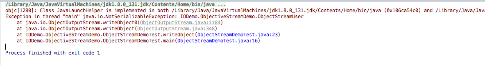
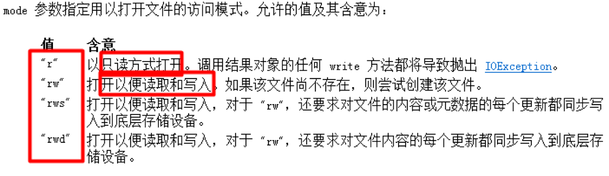

对象流(序列化和反序列化)
打印流
标准IO
Properties类加载文件
数据流
随机访问文件(RandomAccessFile)
管道流
NIO


#  对象流(序列化和反序列化)
序列化和反序列化:

- 序 列 化: 指把堆内存中的Java对象数据,通过某种方式把对象存储到磁盘文件中或者传递给其他网络的节点(在网络上传输).我们把这个过程称之为序列化.

- 反序列化:把磁盘文件中的对象数据或者把网络节点上的对象数据,恢复成Java对象的过程.

- 为什么要做序列化:
  - 1):在分布式系统中,需要共享的数据的JavaBean对象,都得做序列化,此时需要把对象再网络上传输,此时就得把对象数据转换为二进制形式.
`以后存储在HttpSession中的对象,都应该实现序列化接口(只有实现序列化接口的类,才能做序列化操作).`
  - 2):服务钝化:如果服务发现某些对象好久都没有活动了,此时服务器就会把这些内存中的对象,持久化在本地磁盘文件中(Java对象-->二进制文件).
  `如果某些对象需要活动的时候,现在内存中去寻找,找到就使用,找不到再去磁盘文件中,反序列化我们得对象数据,恢复成Java对象.`

需要做序列化的对象的类,必须实现序列化接口:***java.io.Serializable接口(标志接口[没有抽象方法]).***
底层会判断,如果当前对象是Serializable的实例,才允许做序列化. boolean ret = Java对象 instanceof Serializable;
***在Java中大多数类都已经实现Serializable接口.***

## 使用对象流来完成序列化和反序列化操作:

- ***ObjectOutputStream***: 通过writeObject方法做序列化操作的.
- ***ObjectInputStream***: 通过readObject方法做反序列化操作的.
  此时报错:User类没有实现序列化接口`,java.io.Serializable.`
  ***做反序列化操作必须存在对象的字节码对象.***

没有实现序列化接口的对象,做序列化会报错



```

package IODemo.ObjectiveStreamDemo;

import java.io.*;

/**
 * Created by codew on 2018/1/27.
 */
public class ObjectStreamDemoTest {

    public static void main(String[] args) throws Exception{

        File f = new File("file/obj.txt");

//        writeObject(f);
        readObject(f);
    }

    // 序列化
    private static void writeObject(File f) throws Exception
    {
        ObjectOutputStream out = new ObjectOutputStream(new FileOutputStream(f));
        out.writeObject( new ObjectStreamUser("tom", "1234", 17));
        out.close();
    }

    // 反序列化
    private static void readObject(File f) throws Exception
    {
        ObjectInputStream in = new ObjectInputStream(new FileInputStream(f));
        ObjectStreamUser user = (ObjectStreamUser)in.readObject();

        System.out.println(user);
        in.close();
    }
}

```

### 序列化的版本和细节问题

序列化的细节序列化的版本:

- 1):如果某些数据不需要做序列化,比如密码,此时怎么办?
  - 理论上说,静态的字段和瞬态的字段是不能做序列化操作的.
`transient private String password;`
- 2):序列化的版本问题:
  - 反序列化Java对象时必须提供该对象的class文件,现在问题是,随着项目的升级,系统的class文件也会升级(增加一个字段/删除一个字段),如何保证两个class文件的兼容性? Java通过serialVersionUID(序列化版本号)来判断字节码是否发生改变.

如果不显示定义serialVersionUID类变量,该类变量的值由JVM根据类相关信息计算,而修改后的类的计算方式和之前往往不同.

从而造成了对象反序列化因为版本不兼容而失败的问题.

解决方案:在类中提供一个固定的`serialVersionUID.`

```

package IODemo.ObjectiveStreamDemo;

/**
 * Created by codew on 2018/1/27.
 */
public class ObjectStreamUser  implements java.io.Serializable  {
    private static final long serialVersionUID = 1L;

    private String name;
    transient private String password;
    private int age;
    private String adrr;
    private String adrr2;

    public ObjectStreamUser(String name, String password, int age){

        this.name = name;
        this.password = password;
        this.age = age;
    }

    public String toString()
    {
        return " User [name=" + name + " password =" + password + " age = " + age + "]";
    }
}

```

#  打印流

打印流,打印数据的,打印流只能是输出流:
- PrintStream: 字节打印流
- PrintWriter: 字符打印流

-对于PrintWriter来说,当启用字段刷新之后,

 调用println或者printf或者format方法,便会立马刷新操作.

 如果没有开启自动刷新,则需要手动刷新或者当缓冲区满的时候,再自动刷新.

 使用打印流作为输出流,此时的输出操作会特别简单,因为在打印流中:

- 提供了print方法:打印不换行
- 提供了println方法:打印再换行
- print和println方法可以支持打印/输出各种数据类型的数据,记住void println(Object x) 即可.

```

package IODemo.PrintDemo;

import java.io.File;
import java.io.PrintStream;

/**
 * Created by codew on 2018/1/28.
 */
public class PrintStreamDemo {

    public static void main(String[] args) throws Exception{

        PrintStream ps = new PrintStream(new File("file/out"));
        ps.write("ABCD".getBytes());
        ps.print(true);
        ps.print(17);
        ps.print("will");

        ps.close();
    }
} 

```


```

package IODemo.PrintDemo;

import java.io.File;
import java.io.FileOutputStream;
import java.io.PrintStream;
import java.io.PrintWriter;

/**
 * Created by codew on 2018/1/28.
 */
public class PrintWriterDemo {

    public static void main(String[] args) throws Exception{

//        PrintWriter ps = new PrintWriter(new File("file/out"));
        PrintWriter ps = new PrintWriter( new FileOutputStream(new File("file/out")), true);
        ps.write("ABCDCCCC");
        ps.print(true);
        ps.print(17);
        ps.print("will---00000090909");

//        ps.println();// 要配合着 autoFlush:true, 才有用
//        ps.format("");// 要配合着 autoFlush:true, 才有用
//        ps.flush(); // 这个就不用说了...
//        ps.close();
    }
}

```
### 格式化输出

```

package IODemo.PrintDemo;

/**
 * Created by codew on 2018/1/28.
 */
public class PrintfDemoTest {

    public static void main(String[] args) throws Exception{

        // 其实就一句话, 看着

        System.out.printf("姓名:%s, 年龄:%d", "tom", 17);

    }
}

```

# 标准IO

标准的IO:

- 标准的输入: 通过键盘录入数据给程序.
- 标准的输出: 在屏幕上显示程序数据.

-----------------------------------------------------------

在System类中有两个常量:
- InputStream in = System.in; //标准输入流
- PrintStream out = System.out; //标准输出流

-----------------------------------------------------------

标准流的重定向操作:

 标准的输入: 通过键盘录入数据给程序.

  重新指定输入的源不再是键盘,而是一个文件.

 static void setIn(InputStream in) 重新分配“标准”输入流。

  此后,System.in数据的来源就是通过setIn制定的源.

  标准的输出: 在屏幕上显示程序数据.

  重新指定输出的目标不再是屏幕,而是一个文件.

 static void setOut(PrintStream out) 重新分配“标准”输出流。

# 扫描器类(Scanner)
java.util.Scanner类:扫描器类,表示输入操作.

  存在的方法: xxx表示数据类型,如byte,int ,boolean等.

 boolean hasNextXxx():判断是否有下一种类型的数据

  Xxx nextXxx():获取下一个该类型的数据.

```

package IODemo.ScannnerDemoTest;

import java.io.File;
import java.util.Scanner;

/**
 * Created by codew on 2018/1/28.
 */

// 扫描器类
public class ScannerDemo {

    public static void main(String[] args) throws Exception{

        Scanner sc = new Scanner(new File("file/stream.txt"), "UTF-8");
        while (sc.hasNextLine()){

            String line = sc.nextLine();
            System.out.println(line);
        }

        sc.close();

    }
}

```


# Properties类加载文件
配置文件:资源文件(以.properties作为拓展名的文件)/属性文件:

做项目开发,为何使用配置文件?

  把所有的数据存储在代码中,写死了,”硬编码”.

  比如:在Java中需要连接数据库,必须拥有数据的账号和密码.

  此时我们就得在Java代码中编写,类似的代码:

 String username=”root”;

 String password=”admin”

  代码程序运行OK.

  但是,以后我们把项目部署在别人电脑/服务器中,别人电脑中的数据库的账号和密码可以不再是root和admin,此时我们就得去项目中到处去找使用了账号和密码的地方.

  部署项目的是实施人员,为了安全操作,不能让其直接修改代码.

  此时,我们专门为数据库提供一个配置文件,里面专门存储数据库连接相关的信息.

--------------------------------------------------------------------

db.properties

-----------------------------------

#key=value

username=root

password=admin

.......

--------------------------------------------------------------------

现在数据库的连接信息在db.properties文件中,而Java代码需要获取该文件中的信息.

重心转移: Java代码如何加载properties文件,如何获取该文件中的数据.

必须使用Properties类(Hashtable的子类,Map接口的实现类).

```

package IODemo.PropertiesDemoTest;

import java.io.FileInputStream;
import java.io.InputStream;
import java.util.Properties;

/**
 * Created by codew on 2018/1/28.
 */
public class LoadResourceDemo {

    public static void main(String[] args) throws Exception{

        // 创建Properties对象
        Properties p = new Properties();
        InputStream inputStream = new FileInputStream("/Users/codew/Desktop/code/Net/github/myCodeNote/java/code/newStudy/file/db.properties");
        // 加载输入流中的数据, 加载之后, 数据都在Properties对象中
        p.load(inputStream);


        System.out.println(p);
        System.out.println(p.getProperty("username"));
        System.out.println(p.getProperty("password"));
        inputStream.close();
    }
}

```

# 数据流

数据流,提供了可以读/写任意数据类型的方法:

DataOutputStream: 提供了 writeXxx(xxx value)方法.

DataInputStream: 提供了 readXxx()方法.

  注意: writeXxx和readXxx必须要对应起来, writeByte写出的数据,此时只能使用readByte读取回来.

```

package IODemo.DataDemoTest;

import java.io.*;

/**
 * Created by codew on 2018/1/28.
 */


public class DataStreamDemo {


    public static void main(String[] args) throws Exception{

        File f = new File("file/outData.txt");
        write(f);
        read(f);
    }

    private static void read(File f) throws Exception
    {
        DataInputStream in = new DataInputStream(new FileInputStream(f));

//        System.out.println(in.readByte());
//        System.out.println(in.readChar());
        System.out.println(in.readUTF());

        in.close();
    }

    private static void write(File f) throws Exception
    {
        DataOutputStream out = new DataOutputStream(new FileOutputStream(f));

//        out.writeByte(65);
//        out.writeChar('哈');
        out.writeUTF("今天怎么样..");

        out.close();
    }
}

```

# 随机访问文件(RandomAccessFile)
随机访问文件(RandomAccessFile):表示可以在该文件的`任何位置`写出和读取数据.




RandomAccessFile经常用来做多线程断点下载:
- 1):多线程
- 2):断点下载


```

package IODemo.RandomAccessFileDemo;

import java.io.File;
import java.io.RandomAccessFile;

/**
 * Created by codew on 2018/1/28.
 */

// 读写文件的任意位置
public class RandomAccessFileDemo {

    public static void main(String[] args) throws Exception{

        File f = new File("file/raf.txt");

//        write(f);
        read(f);
    }

    private static void read(File f) throws Exception
    {
        RandomAccessFile raf = new RandomAccessFile(f, "r");

        System.out.println("文件指针位置:" + raf.getFilePointer());
        byte b = raf.readByte();
        System.out.println(b);


        System.out.println("文件指针位置:" + raf.getFilePointer());
        String str = raf.readUTF();
        System.out.println(str);

        System.out.println("文件指针位置:" + raf.getFilePointer());
        // 设置文件指针为0个字节
        raf.seek(0);
        System.out.println("文件指针位置:" + raf.getFilePointer());

        // 设置文件指针跳过12个字节
        raf.skipBytes(12);
        System.out.println("文件指针位置:" + raf.getFilePointer());

        int i = raf.readInt();
        System.out.println(i);

        System.out.println("文件指针位置:" + raf.getFilePointer());
        raf.close();
    }

    private static void write(File f) throws Exception
    {
        RandomAccessFile raf = new RandomAccessFile(f, "rw");

        raf.writeByte(65);
        raf.writeUTF("天和荣"); // 使用的是修改之后的UTF-8, 多两个字节
        raf.writeInt(17);

        raf.close();
    }
}

```

# 管道流

管道流:实现两个线程之间的数据交互.
- PipedInputStream
- PipedOutputStream
- PipedReder
- PipedWriter


# NIO

```

package IODemo.NIODemo;

import java.io.File;
import java.io.FileInputStream;
import java.io.FileOutputStream;
import java.nio.file.Files;
import java.nio.file.Paths;

/**
 * Created by codew on 2018/1/28.
 */
public class FileCopyNIODemo {

    public static void main(String[] args) throws Exception{

        Files.copy(Paths.get("file/stream.txt"), new FileOutputStream("file/NIOTest1.txt"));

        Files.copy(new FileInputStream("file/stream.txt"), Paths.get("file/cccNIO.txt"));
    }
}

```

# IO总结

***文件流是重点***
IO流的总结和梳理:

文件流:
- FileInputStream
- FileOutputStream

- FileReader
- FileWriter

***缓冲流:是重点***
- BufferedInputStream
- BufferedOutputStream

- BufferedReader
- BufferedWriter

转换流(把字节转换为字符):

- InputStreamReader
- OutputStreamWriter

内存流(临时存储数据):

- ByteArrayInputStream
- ByteArrayOutputStream

- CharArrayReader
- CharArrayWriter

- StringReader
- StringWriter

## 顺序流(合并流):
顺序流(合并流):
- SequenceInputStream

对象流(序列化和反序列化):
- ObjectInputStream
- ObjectOutputStream

打印流:
- PrintStream
- PrintWriter

数据流:
- DataInputStream
- DataOutputStream

管道流:
- PipedInputStream
- PipedOutputStream
- PipedReader
- PipedWriter

------------------

File

- FIlenameFilter
- RandomAccessFile
- Files

四大基流:
- InputStream---- OutputStream
- Reader ---- Writer
