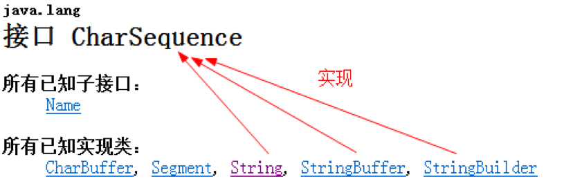
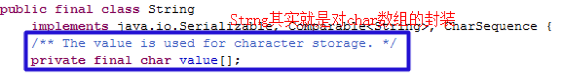

# 字符串操作





```
字符序列:把多个字符按照一定得顺序排列起来.字符串:把多个字符串串联起来(好比羊肉串).

字符串的分类:

  不可变的字符串:String:当前对象创建完毕之后,该对象的内容(字符序列)是不能改变的,一旦内容改变就是一个新的对象.

  可变的 字符串:StringBuilder/StringBuffer:当对象创建完毕之后,该对象的内容可以发生改变,当内容发生改变的时候,对象保持不变.

字符串的本质(底层是什么其实就是char[]),char表示一个字符,数组表示同一种类型的多个数据如何理解char[]:

 String str = “ABCDEFG”; //定义一个字符串对象,等价于

  char[] cs = new char[]{'A','B','C','D','E','F','G'};-

```


***常量池***:  专门存储常量的地方, `都指的方法区中.`
- 编译常量池: 把字节码加载进JVM的时候,存储的是字节码的相关信息.(不研究)
- 运行常量池: 存储常量数据(研究).

面试题1:
:::下列代码分别创建了几个String对象.

 String str1 = “ABCD”; 最多创建一个String对象,最少不创建String对象.

  如果常量池中,以及存在”ABCD”,那么str1直接引用,此时不创建String对象.

  否则,先在常量池先创建”ABCD”内存空间,再引用.

 String str2 = new String(“ABCD”);

  最多创建两个String对象,至少创建一个String对象.

 new关键字:绝对会在堆空间,创建内存区域. 所以至少创建一个String个对象.
