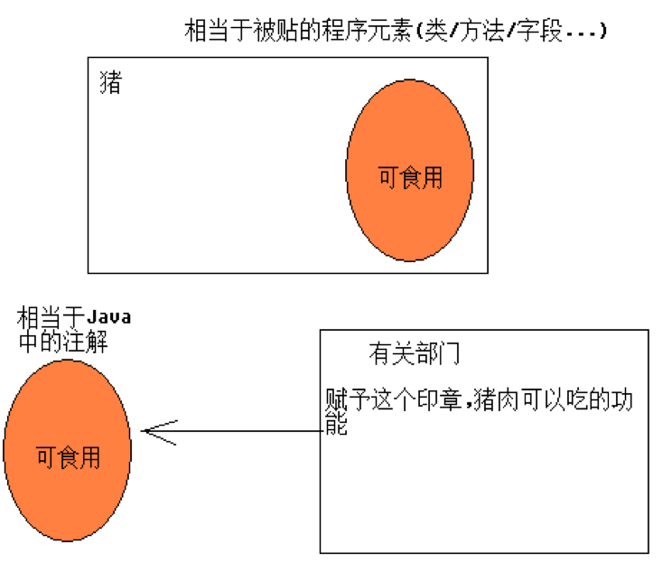
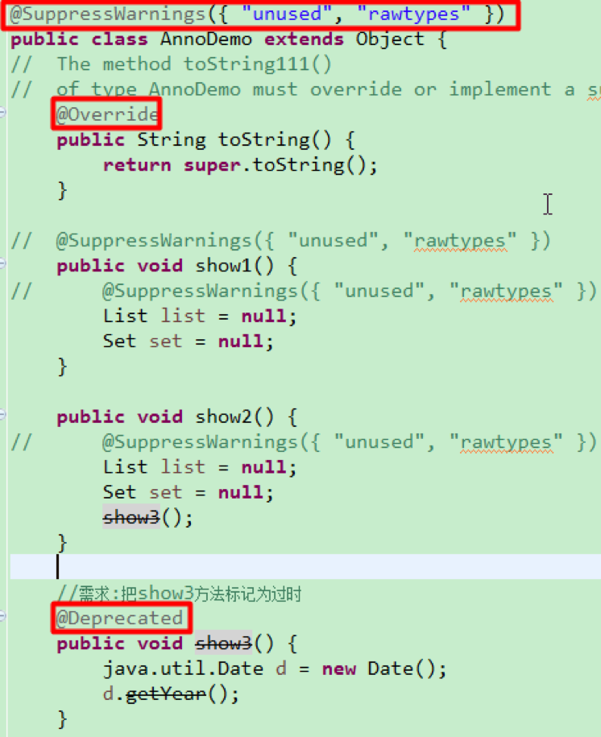
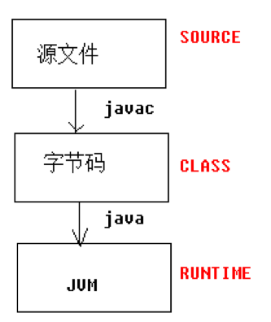

# 注重的编码规范(简单):

---------------------------------------------------------------------------

起名:

   1):都得遵循标识符的规范.

  2):不能使用拼音,拼音首字母,使用英文单词,或者使用英文组合单词.

  3):采用驼峰表示法,使用组合单词的使用,以后的每一个单词首字母都大写.

  EmployeeSetting.

---------------------------------------------------------------------------

- 1:包名:

 package 域名倒写.模块名.组件;

 package com.codertomwu.pss.util;

 package com.codertomwu.pss.util;

  全部使用小写字母,作为Java文件得第一行代码.

- 2:类名:

 使用名词,表示一类事物,首字母大写.

 如果我们在项目中尽量不要使用JDK内置的类名,比如String ,System类.

  讲解知识点: XxxDemo,XxxTest,(Xxx表示知识点的意思),比如:StringDemo.java.

- 03:接口名:

 使用形容词/副词/名词,首字母大写.

 在有的企业,习惯以I作为接口的前缀名. IEmployeeDAO/IEmployeeService.

- 4:方法名:

 使用动词,首字母小写,save/deleteEmployee.

- 5:变量:

 使用名词,首字母小写,如name/age,.

- 6:常量:

 使用final修饰的变量.

  全部使用大写字母组成,如果使用多个单词组合使用下划线分割,如:Integer类:MAX_VALUE:

 在方法中定义的final变量,一般不使用大写.


# 注解

```

描述数据的数据就是元数据

```


`Java5`开始，java开始对`元数据`的支持，也就是`Annotation`(注解)。

元数据：metadata:描述数据的数据.

注解,标签,Annotation.====>`一个东西`

----------------------------------------------------------------

所有的Annotation都是java.lang.annotation.Annotation 接口的子接口，所以Annotation是一种特殊的接口(枚举也是特殊的类）；

@interface Override {} ---> interface Override extends java.lang.annotation.Annotation{}

所有的枚举类,都是java.lang.Enum类的子类.

enum Gender{}------> class Gender extends java.lang.Enum{}


注解被用来为程序元素(类，方法，成员变量等)设置元数据。

注解,标签,Annotation都是一体.

------------------------------------------------------------------

使用注解需要注意,必须有三方参与才有意义:

 1):得有注解标签本身;

 2):被贴的程序元素(类,字段,构造器,方法,参数上,包上等);

 3):由第三方的程序使用反射的手段来赋予注解特殊的功能(也是Java代码).





# 常见注解, 有抽象方法就可以写参数,没有就不不行

在JDK5中提供了3个注解

@Override 标记重写父类的方法

@Deprecated                   标记过时/不推荐使用的方法和类

@SuppressWarings         抑制编译器发出的警告,仅仅是看不到警告（问题依然存在）

@SuppressWarings("all")  抑制所有的警告
在JDK7中新增了1个注解

@SafeVarargs 抑制堆污染发出的警告（问题依然存在）

 一个方法中同时出现可变参数和泛型

存在的疑问:

  1):为什么有的注解允许接受参数,有的却不可以.

 比如: @SuppressWarings("all"),而@Override就没有.

 通过阅读各自的源代码发现,@SuppressWarings有一个value的抽象方法,其他没有.

  2):为什么有的注解可以贴在类/方法/变量上,而有的只能贴在方法上.

  请期待元注解:


# 贴在注解上的注解 ===元注解

注解：用来贴在	`类/方法/变量`等之上的一个标记，第三方程序可以通过这个标记赋予一定功能

元注解：在定义注解的时候用来`贴在注解上的注解`，用来限定注解的用法

元注解有4个：

 @Retention、@Target、@Documented、@Inherited

其中@Documented、@Inherited只需要了解

@Documented  表示注解会被javadoc指令编辑到API中

@Inherited 表示注解会遗传给子类


# @Retention：决定注解可以保存到哪个时期

注解的有效期有3个都封装在枚举：RetentionPolicy中

RetentionPolicy.SOURCE： 表示注解只存在于源文件中，不会被编译到字节码中

RetentionPolicy.CLASS： 表示注解会被编译到字节码中，但是JVM不加载注解

RetentionPolicy.RUNTIME： 表示注解会被编译到字节中，会随着字节码的加载而进入JVM,因此可以反射性地读取

我们开发中的自定义的注解的有效期都要使用RUNTIME，这样才能在程序运行时使用反射赋予注解功能

反编译演示有些注解不会被编译到字节码中





# @Target：决定了该注解可以贴在什么地方

可以贴注解的地方有很多，都封装在枚举：ElementType中

ElementType.ANNOTATION_TYPE 贴在注解上

ElementType.CONSTRUCTOR 贴在构造方法上 

ElementType.FIELD 贴在字段上（包括枚举常量）

ElementType.LOCAL_VARIABLE 贴在局部变量上         

ElementType.METHOD 贴在方法上

ElementType.PACKAGE 贴在包上（极少使用）

ElementType.PARAMETER 贴在参数上

ElementType.TYPE 贴在类、接口或枚举上

其中贴在类/字段/方法上要重点知道，以后要用到


# 注解的定义和使用

定义注解的语法：使用@interface 注解名称

例如：public @interface VIP {

 //抽象方法 属性

 }

注解的抽象方法称为属性，如果要给这个属性赋予默认值可以在抽象方法后使用default 值

-------------------------------------------

使用注解语法：@注解名[(属性名=属性值，属性名=属性值)]

 例如：@VIP

注意：给属性赋值时如果只有1个属性要赋值且名称叫value时,可以省略value不写 如:@VIP("xxx")

-------------------------------------------

注意：属性的返回值类型只能是基本类型/枚举/Class/注解/String/枚举以及他们各自的数组

 

```


```