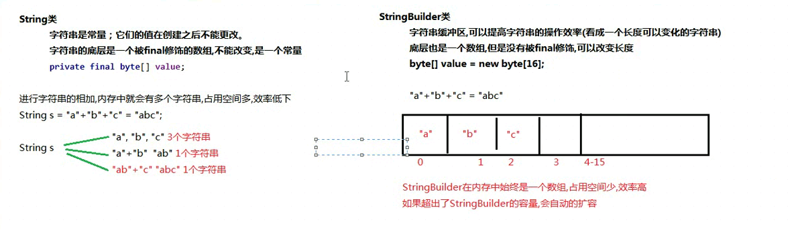

#  StringBuilder字符串缓冲区


字符串是常量；它们的值在创建之后不能更改。字符串缓冲区支持可变的字符串。因为 String 对象是不可变的，所以可以共享。例如：  

 

> ```java
>      String str = "abc";
>  
> ```

等效于：  

 

> ```java
>      char data[] = {'a', 'b', 'c'};
>      String str = new String(data);
> ```


相当于OC的Mutable啥啥啥。。。。。所以这个


String类底层是个被final修饰的数组， 不能改变， 是一个常量 ，效率底下。。。。。。


StringBuilder效率高。。。。初始啊长度16， 是官方文档写的。。。





```java

package com.codertomwu.my1031.MYStringBuild;

public class MYStringBuildMain {

    public static void main(String[] args) {

        StringBuilder builder = new StringBuilder();
        StringBuilder builder2 = new StringBuilder("222");

        System.out.println(builder);

        System.out.println(builder2);


        // 成员方法

        builder.append("mm");
        builder.append(2);
        builder.append(10.4);
        System.out.println(builder);

        String str = builder.toString();
        System.out.println(str);
    }

}


```


