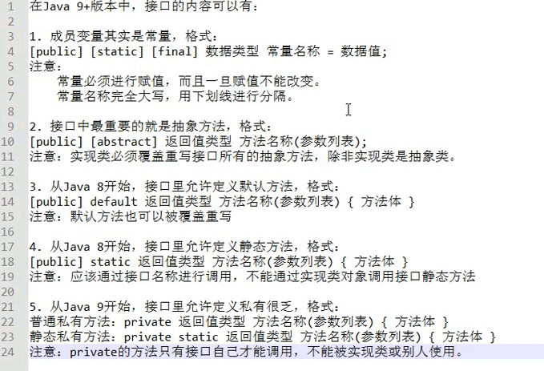
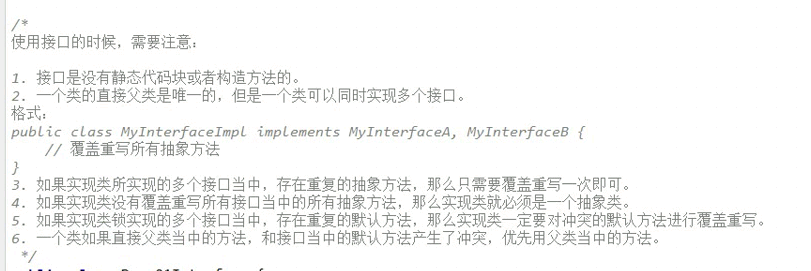
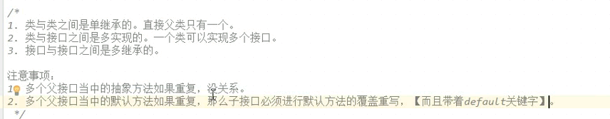

# 接口


接口就是多个类的公共规范

接口是一种引用数据类型， 最重要的内容就是其中的抽象方法。


如何定义一个接口， 格式：

```java
public interface 接口名称 {
    // 接口内容
}

```


虽然是接口但是任然是： java---->.class


.如果是java7， 那么接口中可以包含的内容有：

1.常量

2.抽象方法


java8， 额外

3.默认方法

4.静态方法


java9， 额外

5.私有方法


都是

```java

package com.codertomwu.my1029.MYInterface;

public interface MyInterfaceOne {
    
    public abstract void method1();
    
    public void method2();
    
    abstract void method3();
    
    void method4();
}

```


# 接口 的使用


1. 接口必须要有一个实现类

   ```java
   
   public class 实现类名称 implements 接口名称 {
   
       //.....
   }
   
   ```

2. 实现类不必须实现接口的所有抽象方法

3. 创建实现类的对象， 进行使用


# 默认方法 java8


```java

package com.codertomwu.my1029.MYInterface;

public interface MyInterfaceOne {

    public abstract void method1();

    public void method2();

    abstract void method3();

    void method4();

    public default void method5(){

        System.out.println("接口升级， metho5");
    }
}


```


# 静态方法 java8


从java开始， 接口中允许定义静态方法

不能通过接口实现类的对象来调用接口当中的静态方法。。

通过接口名称， 直接调用其中的静态方法

```java

public static 返回值类型 方法名（）{


    
}

```


# 私有方法、java9


1.普通私有方法

2.静态私有方法


```java
    // 私有方法
    // 普通私有
    private void methodCommod(){

    }
    private static void methodPStatic(){

        
    }
```


# 常量


```java
public static final int TEST_MUN = 10;
```


# 小结




# 多实现

多个接口方法重名了， 实现一个就行

如果实现类没有全部接口里的抽象方法， 那这个类可以做成一个抽象类

多个接口都有相同的默认方法， 就必须覆盖重写。。。。

继承优先实现








