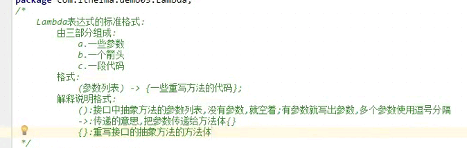
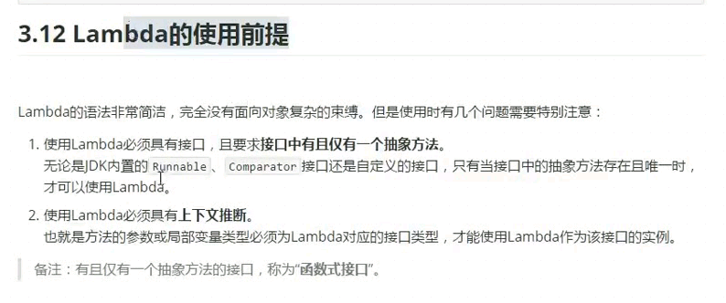

# Lambda


# 函数式编程思想


在数学中,函数就是有输入量、输出量的一套计算方案 ,也就是“拿什么东西做什么事情”。相对而言,面向对象过分强调”必须通过对象的形式来做事情”,而函数式思想则尽量忽略面向对象的复杂语法一-强调做什么 ,而不是以什么形式做。  


# Lambda的最大标志


```java

()->{};

```


# Lambda 是为简写匿名内部类而产生的？


# Lambda的格式


- 一些参数
- 一个箭头
- 一段代码

```java

(参数列表)->{一些重写的代码}

```





# Lambda 有参数有返回值


```java

package com.codertomwu.lambd2.Demo1;

import java.util.Arrays;
import java.util.Comparator;

public class DemoMain {

    public static void main(String[] args) {

       //

        Person[] pArr = {

                new Person("yaojun", 26),
                new Person("lilingfeng", 30),
                new Person("huangpanqing", 27),
                new Person("xixi", 20)
        };

        Arrays.sort(pArr, (Person o1, Person o2)->{

            return o1.getAge()-o2.getAge();
        });


//        Arrays.sort(pArr, new Comparator<Person>() {
//            @Override
//            public int compare(Person o1, Person o2) {
//                return o1.getAge()-o2.getAge();
//            }
//        });

        // 遍历

        for (Person p: pArr) {

            System.out.println(p);
        }
    }
}


```


```java

package com.codertomwu.lambd2.Demo2;

public class Demo2Main {

    public static void main(String[] args) {


//        int result =

        mysum(20,30, (int a, int b)->{
            return a + b;
        });
    }


    public static void  mysum(int a, int b, DemoCalulator calulator){

        int sum = calulator.calc(a, b);
        System.out.println(sum);
    }
}


//=======

package com.codertomwu.lambd2.Demo2;

public interface DemoCalulator {

    int calc(int a, int b);
}


```


#  Lambda省略格式


- 1.(参数列表)：括号中参数列表的数据类型， 可以省略不写
- 2.(参数列表)：括号中的参数如果只有一个， 那么类型和（）都可以省略
- {一些代码}： 如果{}中的代码只有一行， 无论是否有返回值， 都可以省略{}， return， 分号。
  - 要省略{}， return， 分号必须一起省略


```java

Arrays.sort(pArr, (Person o1, Person o2)->{

            return o1.getAge()-o2.getAge();
        });

        // 省略写法， 类型省略， 大括号， ；
        Arrays.sort(pArr, (o1,o2)-> o1.getAge()-o2.getAge());

```


```java

 // 省略前
//        new Thread(()->{
//            System.out.println("Lambda Say Hello"+ Thread.currentThread().getName());
//        }).start();

        new Thread(()-> System.out.println("嗨， 省略的lambd， 创建新线程")).start();

```


```java

 mysum(20,30, (int a, int b)->{
            return a + b;
        });

        mysum(20,230,(a,b)->a+b);

```


# Lambda使用前提


有接口， 接口只有一个抽象方法. 

ps:但是我测试的时候写了两个， 编译提示红线，但是那啥又能通过。。。





# 有且只有一个方法的接口称为函数式接口

