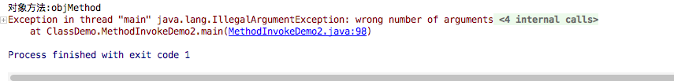

# Exception in thread "main" java.io.InvalidClassException:
序列化是字节码版本号问题


```
private static final long serialVersionUID = 1L;

```

# 端口地址,地址被占用


```

Exception in thread "main" java.net.BindException: Address already in use (Bind failed)
	at java.net.PlainDatagramSocketImpl.bind0(Native Method)
	at java.net.AbstractPlainDatagramSocketImpl.bind(AbstractPlainDatagramSocketImpl.java:93)
	at java.net.DatagramSocket.bind(DatagramSocket.java:392)
	at java.net.DatagramSocket.<init>(DatagramSocket.java:242)
	at java.net.DatagramSocket.<init>(DatagramSocket.java:299)
	at java.net.DatagramSocket.<init>(DatagramSocket.java:271)
	at NetDemo.NetDemo_Ip.UDPDemoSend.main(UDPDemoSend.java:15)


```

# NoSuchMethodException, 


```

con = clz.getConstructor(String.class, int.class);
System.out.println(con);

```
解决
```

con = clz.getDeclaredConstructor(String.class, int.class);
System.out.println(con);

```


# IllegalAccessException

调用私有方法?
当应用程序试图反射性地创建一个实例（而不是数组）、设置或获取一个字段，或者调用一个方法，但当前正在执行的方法无法访问指定类、字段、方法或构造方法的定义时，抛出 IllegalAccessException。


# Exception in thread "main" java.lang.IllegalArgumentException: wrong number of arguments

反射获取对象方法, 获取到的是无参数, 调用的时候传参数进去, 就会报错

对象方法参数很多, 你传的实参数不够也会报错





# ConcurrentModificationException
边遍历边删除


