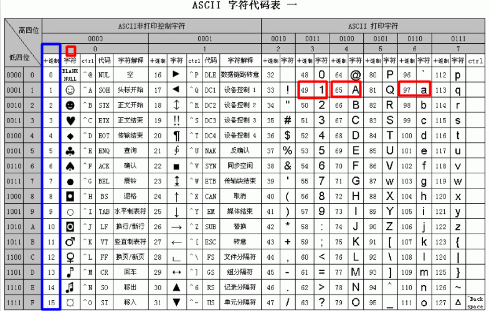
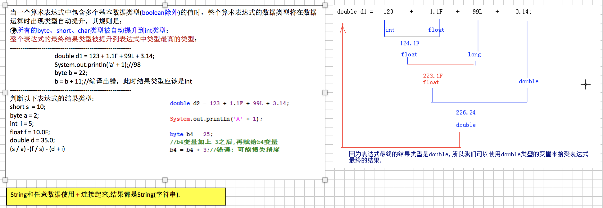

# 01-数据类型

## 字面量和常量
## 变量
## 变量的定义和基本使用
## java表达式
## 数据类型
在Java中数据类型整体上分成两大类: 
1):基本数据类型/原生数据类型,共8个:
- 1>:数值型:
  - 整数类型:byte,short,int,long,
  - 不同的整数类型在内存占用的内存空间大小是不一样的.
  - 小数类型:float,double.

- 2>:字符型:char,什么是字符,字母/符号.
- 3>:布尔型:boolean,表示对与错.true,false.

2):引用数据类型/对象数据类型:
 - 类/接口/数组

### boolean类型
：通常用于逻辑运算和程序流程控制(条件选择/循环)。
`该类型的值只能是true 或 false，表示真或假。`
不可以使用0或非0的整数来代替false和true，区分于C语言。
（其实在JVM中对boolean的处理也是用0表示false，非0表示true的。）
false和true是boolean的常量。

###  整数类型(byte-short-int-long):

`byte`、`short`、`int`、`long`类型：

整型常量的四种表示形式：
①　二进制整数：0B或0b开头（Java7的新特性），如：int a = 0B110;
②　八进制整数：要求以0开头，如 int a = 012;
③　十进制整数：如：int a = 17;
④　十六进制整数：要求0X或0x开头，如int a = 0x12;

`Java语言的整型常量默认是int型，声明long型变量后加上‘l’或‘L，因小写的l容易和数字1相混淆，建议使用大写L。`
`默认情况下,一个整型的字面量默认是int类型.`

### 浮点类型(float-double):

`float`、`double`类型：
`float表示单精度类型，double表示双精度类型，但是二者都不能表示精确的小数。`
Java的浮点类型常量有两种表现形式：
十进制形式： 例如：3.14 ，168.0， .618
科学计数法形式： 例如：3.14e2， 3.14E2， 1000E-2
科学计数法表达式返回的结果是double类型。
默认情况下,一个浮点类型的字面量默认是double类型.若要声明一个常量为float型，则需在常量后加上f 或 F，double常量后面的D或d可省略。

注意：Java里只有浮点型的变量才可以接受科学计算式结果：

因为float和double都不能精确的表示小数，那么在精度要求高的系统比如银行系统里，那怎么表示精确的小数呢？后面我们会讲`BigDecimal`类型，它表示任意精度的数据。

# 字符类型(char):字符,字母和符号.

char类型：表示16位的无符号整数或者Unicode字符，`Java对字符采用Unicode字符编码。`

Unicode收集了世界上所有语言文字中的符号，是一种跨平台的编码方式，`Java的字符占两个字节`，可以表示一个汉字。

什么是编码？

计算机只能表示0和1两个数，于是人们做规定使用一个数字去表示一个特定的字符，比如a使用97表示。

char前256个字符和ASCII（美国信息交互标准编码）码中的字符重复。

-----------------------------------------------------------------------------------------------

char常量有3种表示形式：

①　直接使用单个字符来指定字符常量，格式如'◆'、'A'，'7'；

②　直接作为十进制整数数值使用，但是数据范围在[0，65535]，格式如97，但是打印出来的值依然是ASCII码表对于的符号,如97打印出来是字符a。

③　和2一样，只不过表示的是16进制的数值，格式如` '\uX'，X表示16进制整数`；如：97的16进制是61。那么表示为‘\u0061’打印出来也是a。

所以有人说char本质上也是整型，也是有道理的。

char前256个字符和ASCII（美国信息交互标准编码）码中的字符重复，可查表。
## 数据过大和溢出

当要表示的数据超出数据类型的临界范围时，称为溢出。溢出情况发生时程序并没有做数据范围检查处理，此时会出现数据紊乱情况。
int最大值
int intMax = 2147483647;
分析数据发生紊乱的原因.

## 基本数据类型转换
## 表达式类型的自动提升

## 算术运算

## 位运算

## 赋值运算
## 比较运算符

# 02-  数组

## JVM内存模型

JVM内存划分,人为的根据不同内存空间的存储特点以及存储的数据:

`程序计数器`：当前线程所执行的字节码的行号指示器。

`本地方法栈`：为虚拟机使用的native方法服务。

`Java虚拟机栈`：描述Java方法执行的内存模型，`每个方法被执行的时候都会同时创建一个栈帧用于存储局部变量表、操作栈、动态链接、方法出口等信息。`

 ` 每一个方法,创建一个栈帧,,栈帧存放了当前方法的数据信息(局部变量),当方法调用完毕,该方法的栈帧就被销毁了.`

`Java堆`：`被所有线程共享的一块内存区域，`在虚拟机启动时创建。所有的对象实例以及数组都要在堆上分配(使用new关键字,就表示在堆中开辟一块新的存储空间)。

`方法区`：线程共享的内存区域，存储已被虚拟机加载的类信息、常量、静态变量即时编译器编译后的代码数据等(这个区域的内存回收目标主要是针对常量池的回收和对类型的卸载)。

GC(Garbage Collection):垃圾回收器。

Java的自动垃圾回收机制:简单理解为,

程序员就不需要再手动的去控制内存的释放。`当JVM发觉内存资源紧张的时候，就会自动地去清理无用对象（没有被引用到的对象）所占用的内存空间。`

## 数组

基本数据类型:byte,short,int,long,float,double,char,boolean

引用数据类型:类,接口,数组.

-------------------------------------------------

变量的定义:

  - 数据类型 变量名; 如: int age;

数组的定义:

 -  方式1: 数组元素的类型[]  数组名; int[] ages;推荐的. 可以吧int[]看成是一种数据类型,int类型的数组类型.

  - 方式2:数组元素的类型  数组名[]; int ages[];

------------------------------------------------------

`数组必须先初始化,才能使用,因为初始化表示在内存中分配空间.`

## 数组初始化
***Java中数组必先初始化后才能使用***，`所谓初始化就是给数组元素分配内存，并为每个元素赋初始值。`

初始化数组的两种方式：

- 静态初始化；

- 动态初始化；

无论，以哪种方式初始化数组，`一旦初始化完成，数组的长度就固定了，不能改变，除非重新初始化。也就是说数组是定长的。`

 数组是定长的: 数组一旦初始化成功,数组中的元素个数就已经固定了,不能更改,如果需要更改,只能重新做初始化.

### 数组的静态初始化操作:

  特点:有我们自己来为每一个数组元素设置初始化值,而数组的长度由系统(JVM)决定.

语法:

  数组元素类型[] 数组名 = new  数组元素类型[]{元素1,元素2,元素3,.......};

  举例:

`  int[] nums = new  int[]{1,3,5,7,9};`

  简单写法,必须声明之后,立刻初始化,不能先声明后初始化:

`   int[] nums = {1,3,5,7,9};`

### 数组的动态初始化操作:

 由我们来设置数组的`元素个数(数组长度),`而每一个数组元素的初始值有系统决定.

语法:

  数组元素类型[] 数组名 = new  数组元素类型[ length ];

  比如:

` int[] ages = new int[100];`

-------------------------------------------------------------

`  int[] nums = new int[5]{1,3,5,7,9};//写法是错误的,不能同时使用静态初始化和动态初始化.`

-------------------------------------------------------------

什么时候使用静态初始化,什么时候使用动态初始化.

当我们事先知道,需要存储哪一些数据的时候,选用静态初始化.

当我们事先不知道,需要存储哪些数据的时候,只能使用动态初始化.

### 数组基本操作

数组的基本操作:

- 1:数组基本操作:

 获取元素: 元素类型 变量 = 数组名[index];

 设置元素: 数组名[index] = 值;

 遍历数组元素: 建议使用for循环,事先知道循环的次数.

 数组长度: int len = 数组名.length; length是属性,不是方法.

  索引范围: 从0开始,逐一递增. [0,数组名.length-1]

- 2:操作数组常见异常:

   NullPointerException:空指针异常(空引用).

  当数组还未初始化,就直接操作数组.

 String[] bs = null;

 System.out.println(bs.length)

  ArrayIndexOutOfBoundsException:数组的索引越界异常.

- 3:获取数组最大最小元素(getMax,getMin).

- 4:打印数组元素:

  直接打印数组的时候,打印出来是hashCode值,如[I@7439aca7.

  我们不喜欢,我们想打印数组的时候,把该数组的元素打印出来.

 String[] arr = {"A","B","C","D","E"};

定义方法打印:

字符串表示形式由数组的元素列表组成，括在方括号（"[]"）中。相邻元素用字符 ", "（逗号加空格）分隔。

打印格式:[A, B, C, D, E]

- 5:逆序排列数组元素:

  原数组:[A, B, C, D, E]

  逆序操作

 新数组:[E, D, C, B, A]

- 6:元素出现索引(第一次/最后一次),线性搜索.

 int[] arr = {10,20,30,10,50,-30,10};

获取元素10在arr数组中第一次出现的索引(indexOf): 0

  获取元素10在arr数组中最后一次出现的索引(lastIndexOf):6
