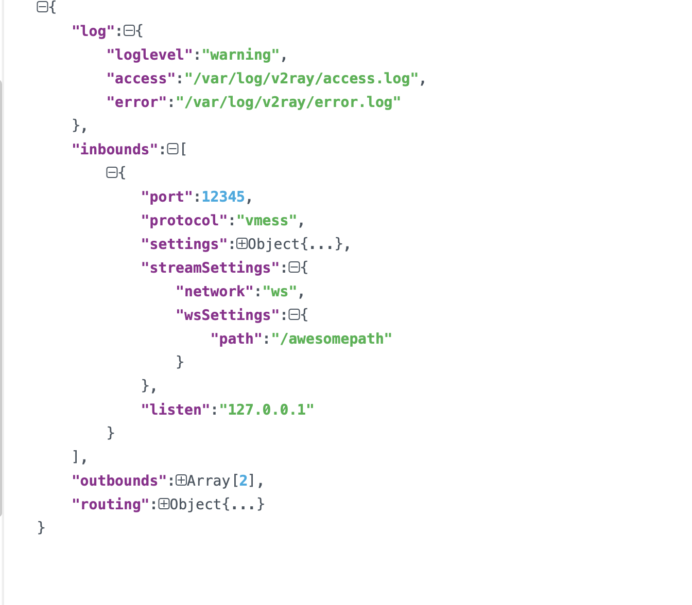
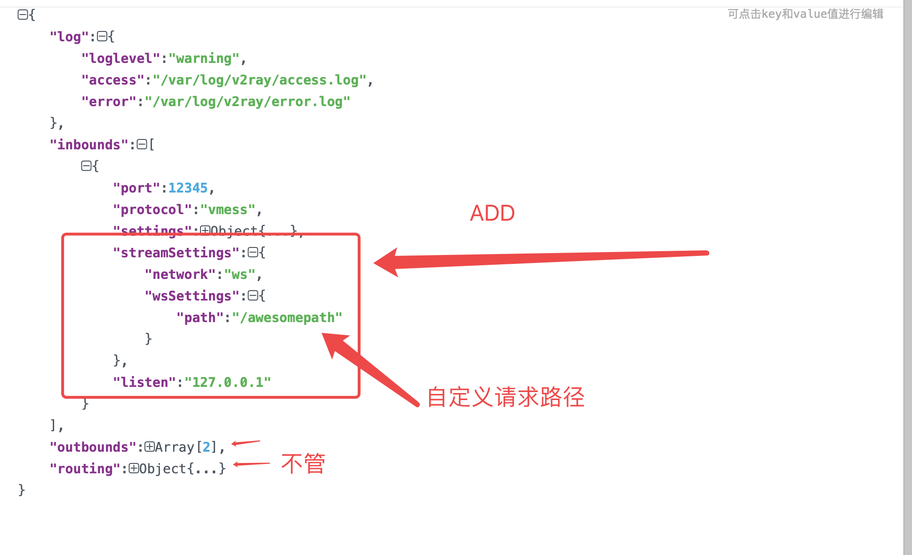

# 啥也不管先装nginx, 要1.13以上, 我直接20

```

yum install vim wget pcre pcre-devel -y && wget -q http://nginx.org/download/nginx-1.20.0.tar.gz && useradd www -s /sbin/nologin -M && tar xf nginx-1.20.0.tar.gz && cd nginx-1.20.0 && yum install openssl openssl-devel gcc -y && ./configure --user=www --group=www --with-http_ssl_module --with-ngx_http_v2_module --with-http_stub_status_module --prefix=/application/nginx-1.20.0/ && make && make install && ln -s /application/nginx-1.20.0/ /application/nginx


```


## 启动,重启,关闭

```
// 看看conf语法
/application/nginx/sbin/nginx -t


// 启动
/application/nginx/sbin/nginx


// 停止
/application/nginx/sbin/nginx -s stop


// 顺滑重启
/application/nginx/sbin/nginx -s reload


```


## 做个软连接

```

ln -s /application/nginx/sbin/nginx /usr/bin/nginx

```


# 配置https

```shell

sudo yum install epel-release -y
sudo yum update -y

sudo yum install certbot python2-certbot-nginx -y


启动nginx
netstat -lntup|grep 80


如果是二级域名(不知道顶级域名会不会更改) 先修改nginx配置文件server_name bbs.xxx.com;


然后
certbot --nginx --nginx-server-root=/application/nginx/conf -d www.ccc.com

certbot --nginx --nginx-server-root=/application/nginx/conf -d www.cccc.com

http://www.cccc.com/

www.cccc.com
/application/nginx/sbin/nginx -t
/application/nginx/sbin/nginx -s  reload


```


# 装个V2ray


## 安装

```


bash <(curl -sL https://raw.githubusercontent.com/hijkpw/scripts/master/goV2.sh)


```


## 安装完了, 配置一下 文件


```

// 看一眼
cat /etc/v2ray/config.json

// 怕改坏先留存一份原来的
 cp config.json config20210702092157.json


```


## 不走那啥https伪装流量, 就到目前为止了, 然后运行一下

我用的`DO`, 如果你的服务器开启了防火墙, 先关一下先..

```


// 运行/启动
systemctl start v2ray


// 停止运行
systemctl stop v2ray


// 看看启动没
ss -ntlp | grep v2ray

```


## 如果走https


### 1. 修改v2Ray的配置文件




```

    "streamSettings": {
        "network": "ws",
        "wsSettings": {
          "path": "/bb/cc"
        }
      },
    "listen": "127.0.0.1"


```


```

// 下手改
vim  /etc/v2ray/config.json


```


```


// 运行/启动
systemctl start v2ray


// 看看启动没
ss -ntlp | grep v2ray

```


### 2. 改nginx的config


```


#user  nobody;
worker_processes  1;

#error_log  logs/error.log;
#error_log  logs/error.log  notice;
#error_log  logs/error.log  info;

#pid        logs/nginx.pid;


events {
    worker_connections  1024;
}


http {
    include       mime.types;
    default_type  application/octet-stream;
    sendfile        on;
    keepalive_timeout  65;


    server {
        server_name  www.cccop.com;
        charset utf-8;
        
        #charset koi8-r;

        #access_log  logs/host.access.log  main;

        location / {
            root   html;
            index  index.html index.htm;
        }

        #error_page  404              /404.html;

        # redirect server error pages to the static page /50x.html
        #
        error_page   500 502 503 504  /50x.html;
        location = /50x.html {
            root   html;
        }

        location /cc/cc {
              proxy_redirect off;
              proxy_pass http://127.0.0.1:12345;
              proxy_http_version 1.1;
              proxy_set_header Upgrade $http_upgrade;
              proxy_set_header Connection "upgrade";
              proxy_set_header Host $host;
              proxy_set_header X-Real-IP $remote_addr;
              proxy_set_header X-Forwarded-For $proxy_add_x_forwarded_for;
        }

        
    
    listen 443 ssl;
    # ssl_protocols TLSv1.2 TLSv1.3;
    # ssl_ciphers ECDHE-ECDSA-AES128-GCM-SHA256:ECDHE-RSA-AES128-GCM-SHA256:ECDHE-ECDSA-AES256-GCM-SHA384:ECDHE-RSA-AES256-GCM-SHA384:ECDHE-ECDSA-CHACHA20-POLY1305:ECDHE-RSA-CHACHA20-POLY1305:DHE-RSA-AES128-GCM-SHA256:DHE-RSA-AES256-GCM-SHA384;
    
        
    # ssl_prefer_server_ciphers off;
    ssl_session_cache shared:SSL:10m;
    # ssl_session_timeout 1d;
    ssl_session_tickets off;
        
    ssl_certificate /etc/letsencrypt/live/www.cccop.com/fullchain.pem; # managed by Certbot
    ssl_certificate_key /etc/letsencrypt/live/www.cccop.com/privkey.pem; # managed by Certbot
    include /etc/letsencrypt/options-ssl-nginx.conf; # managed by Certbot
    ssl_dhparam /etc/letsencrypt/ssl-dhparams.pem; # managed by Certbot

}

    server {
        listen 80;
        server_name www.cccop.com;
        rewrite ^(.*) https://$server_name$1 permanent;
    }

    
}


```


# 重启nginx + 重启v2ray


