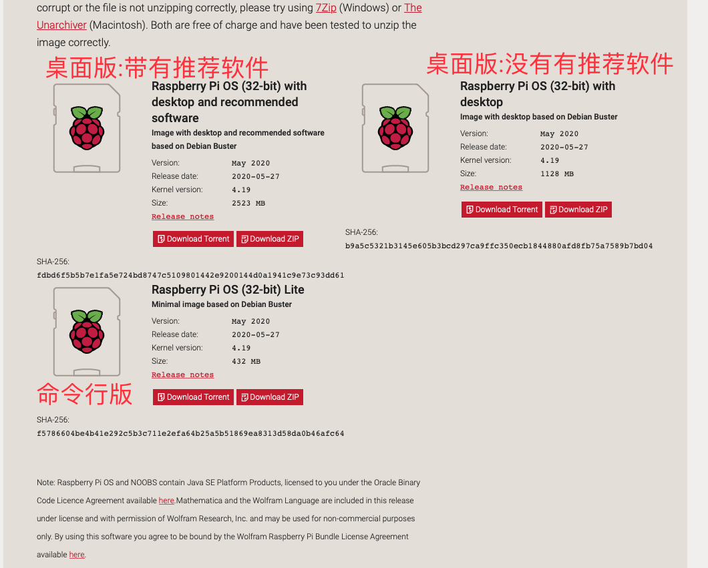
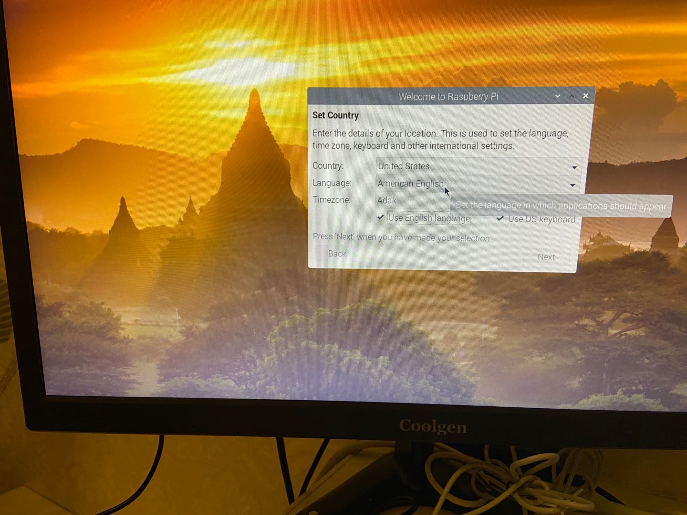

# 目录


1. [](#)
2. [](#)


ps: 教程使用虚拟机(Ubuntu)做采集, 我使用的是一个树莓派4b做采集

# 1. 硬件


- 树莓派4b
- usb摄像头
- 麦克风
- 键盘
- 鼠标
- 显示器
- sd卡
- 读卡器


# 2. 烧录树莓派系统

1. 下载balenaEtcher

https://www.balena.io/etcher/

我下的


2. 下载树莓派系统

https://www.raspberrypi.org/downloads/raspberry-pi-os/




3. 格式化sd卡


我的sd卡不知道怎么回事, 被分区了, 然后我就将卡插入小米5x, 用手机格式化一下, 然后就只剩下一个分区了, 然后再用电脑格式化


4. 烧录系统


# 3. 树莓派系统配置

1. 选择美国区域
2. 连接WiFi
3. 不要更新那啥选择sikep
4. 开放相关选项





## 3.2 运行环境配置
```c

lsusb
sudo apt-get install libasound2
sudo apt-get install libasound2-dev

sudo apt-get install libv4l-dev
sudo apt-get install libx264-dev

sudo apt-get install fawebcam
sudo apt-get install fswebcam

sudo apt-get install vim

sudo apt-get install build-essential


```
